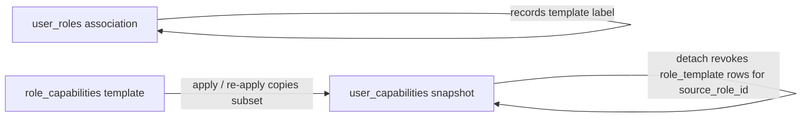

# ADR-0031: User Management role-template snapshot semantics (PR #56)

- **Status:** Accepted
- **Date:** 2026-05-17
- **Deciders:** User Management module owners, platform architecture
- **Related:** PR #56, issue #60 (PEP snapshot-only follow-up)

## Context and problem statement

User Management must answer two distinct questions at runtime:

1. **What capabilities does this user effectively have right now?** (Cerbos PDP input)
2. **How did an administrator compose that access?** (admin UX, audit, entitlement checks)

Early designs conflated **role template definition** (`role_capabilities`) with **per-user runtime grants**. Reviewers on PR #56 identified orphaned authorization state when role templates were detached but copied grants remained active, and inconsistent behavior when role templates were re-applied with a smaller capability subset.

This ADR records the **snapshot-at-write** model adopted in PR #56 and the temporary hybrid read path pending issue #60.

## Decision drivers

- **Predictable revocation:** Removing a role template from a user must not leave stale `role_template` rows that still authorize.
- **Snapshot stability:** Editing a role template definition must not retroactively change users who already received a copy (hospital change-control).
- **Entitlement boundaries:** Master Data owns catalog truth; Configurator owns tenant module enablement; User Management owns persisted runtime grants; Cerbos evaluates policies only against UM-resolved principal attributes.
- **Auditability:** Grant lifecycle uses soft revoke (`revoked_at`, `revoked_by_user_id`), not hard delete.
- **Phase 0 pragmatism:** Avoid distributed cache and cross-module runtime catalog lookups on the authorization hot path.

## Historical evolution

| Era | Model | Characteristics |
|-----|--------|-----------------|
| **1. Join-table** | `user_roles` (or `role_assignments`) + live `role_capabilities` join | Runtime authorization recomputed from current role composition on every request. Detach removed association; effective access changed immediately when role definition changed. |
| **2. Slug-direct** | Capability keys stored or resolved without stable capability UUID FKs | Worked for early prototypes; broke catalog versioning, entitlement filtering, and cross-tenant seed consistency. |
| **3. UUID FK + live join** | `capabilities.id` FKs; PEP unions `user_roles ⨝ role_capabilities` | Correct catalog alignment; detach/re-apply semantics ambiguous; role edits propagated implicitly to all assigned users. |
| **4. Snapshot materialization (PR #56)** | `user_capabilities` rows copied on apply; `role_capabilities` is template-only | Explicit `grant_source` + `source_role_id`; apply/re-apply sync; detach revokes scoped snapshots. |

## Decision outcome

Chosen model: **snapshot materialization in `user_capabilities`**, with **`role_capabilities` as template source only**.

### Current tables (Phase 1A)

| Table | Role |
|-------|------|
| `roles` | Tenant-scoped role template container |
| `role_capabilities` | Template composition (what the role *could* grant) |
| `user_roles` | Association: which templates are applied to a user (admin/reporting) |
| `user_capabilities` | **Authoritative runtime snapshot** per user (what the user *does* grant) |
| `capabilities` | UM capability catalog (UUID FK target) |

Legacy/target tables such as `role_assignments` (scoped assignments) remain in LLD for future phases but are **not** exposed via Phase 1A admin HTTP (`POST /role-assignments` removed).

### `grant_source` semantics

| Value | Meaning | `source_role_id` |
|-------|---------|------------------|
| `manual` | Direct administrator grant via `PUT /users/{id}/capabilities` | `NULL` |
| `role_template` | Copied from a role template apply/re-apply | Role template id |
| `delegated` | Time-bounded delegation overlay | Usually `NULL` (delegation row is separate) |
| `system` | Platform seed / break-glass | `NULL` or system context |

**Rules:**

- Only one active row per `(iq_tenant_id, user_id, capability_id)` (unique constraint).
- `role_template` upserts must not clobber active `manual` rows (conditional upsert / skip).
- Detach and re-apply scope mutations by `source_role_id`, never by grant id alone.

### Snapshot write semantics



| Operation | `user_roles` | `user_capabilities` (`role_template`) |
|-----------|--------------|----------------------------------------|
| **Apply** template | Insert association (idempotent) | Upsert/reactivate grants for selected capability ids; set `grant_source=role_template`, `source_role_id=role_id` |
| **Re-apply** same template | Association unchanged | **Synchronize** snapshot to new subset: revoke extras scoped to `source_role_id`, upsert missing |
| **Detach** template | Delete association | **Soft-revoke** all active `role_template` rows where `source_role_id` matches |
| **Edit role definition** (`role_capabilities`) | Unchanged | **No auto-propagation** to existing users |

Optional `role_template_capability_ids` on apply limits the copied set; omitting the field copies the role's full current composition.

### Entitlement boundaries

```text
Master Data     → capability catalog authority (module slugs, catalog rows)
Configurator    → tenant module enablement (which modules a tenant may use)
User Management → runtime authorization authority (persisted grants + assignable filtering)
Cerbos          → policy evaluation only; sees UM-resolved principal attributes
```

All grant writes (`createUser`, `applyRoleTemplate`, `replaceUserCapabilities`, `replaceRoleCapabilities`) call `assertRuntimeCapabilitiesEntitledForTenant` — fail closed if Configurator or Master Data is unavailable.

Cerbos **never** calls Master Data or Configurator at evaluation time.

User-access mutations (apply/detach role template, replace manual grants) use Cerbos resource kind `user_role_template` with actions `role.assign` / `role.revoke` (capability `um:role:assign`).

### Temporary architecture notes (pre-#60)

**Principal enrichment is hybrid in some read paths:**

`DrizzlePrincipalAuthorizationRepository.listEffectiveCapabilityKeys` currently unions:

1. Active rows in `user_capabilities` (`revoked_at IS NULL`), and
2. Live `user_roles ⨝ role_capabilities` for active role associations.

This is **transitional**. The write path is snapshot-authoritative; the live join can mask detach/re-apply edge cases until #60 moves PEP to **snapshot-only** reads (plus explicit override/delegation tables).

**Issue #60 target direction:**

- PEP reads `user_capabilities` snapshot only (no live role join).
- Optional override table for explicit exceptions.
- Delegation and clearance overlays unchanged in concept.

### Consequences

**Positive:**

- Detach and re-apply behave consistently with administrator expectations.
- Role template edits are decoupled from existing user access (controlled re-apply).
- Entitlement and catalog boundaries stay module-isolated.
- Audit trail preserved via soft revoke.

**Negative / accepted trade-offs:**

- Storage duplication: capabilities exist in both `role_capabilities` and `user_capabilities`.
- Re-apply required to pick up template definition changes for existing users.
- Hybrid PEP until #60 must be documented to avoid false confidence in OpenAPI-only descriptions.

**Follow-up actions:**

- [ ] #60 — Remove live `user_roles ⨝ role_capabilities` union from PEP; snapshot-only effective capabilities.
- [ ] Wire `permission_change_audit` on grant mutations (separate scope).
- [ ] ADR cross-link from HLD-04 principal enrichment section.

## Explicit non-goals

- **No Master Data runtime lookups** on the authorization hot path (catalog sync is async/admin-time).
- **No distributed cache** for capability resolution in Phase 1A (request-scoped / in-process only).
- **No live propagation** of `role_capabilities` edits to `user_capabilities` without an explicit apply/re-apply.
- **No redesign** of Cerbos policy structure or module boundaries in this ADR.

## Pros and cons of the options

### Snapshot materialization (chosen)

- *Good:* Stable runtime; explicit revoke on detach; aligns with copy-on-apply product language.
- *Good:* Entitlement assert once at write time.
- *Bad:* Extra rows; requires sync logic on re-apply.

### Live join only (rejected for PR #56)

- *Good:* No duplicate rows; template edits flow immediately.
- *Bad:* Detach semantics ambiguous; violates hospital change-control; reviewer blockers on PR #56.

### Copy-forward on detach (rejected)

- *Good:* Simple detach implementation.
- *Bad:* Orphaned `role_template` grants; UI shows role removed but access unchanged.

## Links

- LLD: [01-schema-design.md](../lld/user-management/01-schema-design.md), [02-scenarios.md](../lld/user-management/02-scenarios.md)
- Gap audit: [pr56-review-gap-audit.md](../lld/user-management/pr56-review-gap-audit.md)
- OpenAPI: [user-management.v1.yaml](../../../specs/openapi/user-management.v1.yaml)
- Related ADRs: [ADR-0004](./0004-authz-cerbos-sidecar.md), [ADR-0005](./0005-policy-as-code-permission-data-as-config.md), [ADR-0012](./0012-multi-tenancy-isolation-strategy.md)
- Implementation: `modules/user-management/src/data-access/role-template-grant-writes.ts`, `apply-role-template.ts`, `detach-role-template.ts`
