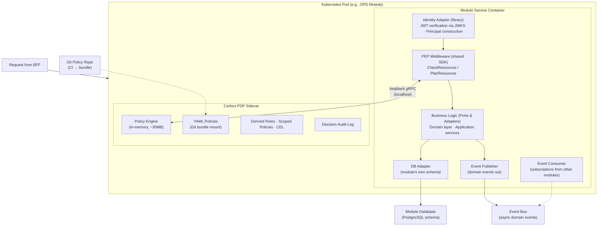
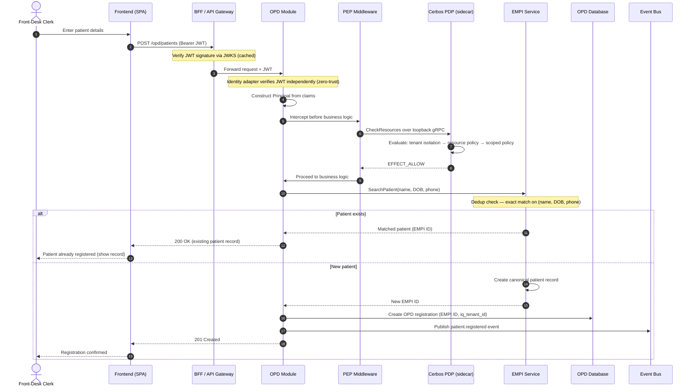

# Module Shape Template

> **Status:** Draft v0.1 — alignment meeting baseline
>
> **Purpose:** This document defines the contract every module in the HIMS platform must follow. A team lead reading this document should know exactly what their module must contain, expose, and conform to in order to be architecturally compliant. The four core platform modules (User Management, EMPI, Configurator, Master & Tenant Data) and all feature modules conform to this template.
>
> **Important:** A "module" (deployment unit) may implement one or more EOI functional areas. The ~38 items in the AIIMS EOI Annexure V are functional groupings, not necessarily individual services. Grouping is a design decision justified by operational affinity, shared data model, or deployment characteristics. For example, OPD + Appointment Scheduling + Queue Management may deploy as a single "OPD Service"; Birth Registration + Death Registration + Issue of Certificates may deploy as a single "Civil Registration Service." The template applies per deployment unit, not per EOI line item. Each deployment unit must justify its boundaries — if two functional areas share a data model, have tight workflow coupling, and would always scale together, they belong in one deployment unit rather than incurring the overhead of separate services.
>
> **Cross-references:** [System Overview](01-system-overview.md) | [Core Modules](02-core-modules.md) | [AuthN/AuthZ Flow](04-authn-authz-flow.md) | [Integration and Interop](05-integration-and-interop.md)

---

## 1. Module anatomy overview

### 1.1 Library-first design

A module is implemented as a **library** — business logic, data-access layer, and API handlers organized as a self-contained package. The library is the unit of code ownership; a team owns the library. The library does not hard-code its deployment mode. Instead, cross-cutting concerns (event bus, identity verification, authorization, database access) are injected through adapters. This is the Ports & Adapters (Hexagonal Architecture) pattern applied at the module level.

This design enables multiple deployment modes from the same codebase:

| Mode | How modules run | Event bus | Cerbos | Target |
|------|----------------|-----------|--------|--------|
| **Service mode** | Each module as a Kubernetes pod with its own HTTP server | External bus (Kafka/NATS/etc.) | PDP sidecar per pod | Full platform, fragmented deployments |
| **Embedded mode** | Multiple module libraries in a single process | In-process event dispatcher | Single shared PDP | Lite deployments (single pharmacy, small clinic) |

The module shape template describes the **service mode** deployment as the primary model. Embedded mode is an alternative packaging of the same module code, not a different module design.

### 1.2 Service mode anatomy

In service mode, every module ships as a Kubernetes pod containing three containers:

1. **Module service container.** The module library wrapped in an HTTP server. API handlers, business logic, database access, event publishers and consumers. This is what the module's owning team builds and maintains.

2. **Cerbos PDP sidecar container.** A Cerbos Policy Decision Point instance that evaluates authorization policies locally. It communicates with the module service over loopback gRPC (localhost, no network hop). The sidecar loads policies from a Git-versioned bundle distributed via CI. See [Section 4](#4-cerbos-sidecar-integration) for details.

3. **Identity adapter.** A library (not a separate container) embedded in the module service that handles JWT verification and principal construction. See [Section 3](#3-identity-adapter) for details.

The pod is the deployment atom. Scaling the module means scaling the pod; each replica carries its own Cerbos PDP sidecar. There is no shared PDP cluster — this is deliberate. A module's authorization decisions depend only on its own sidecar, not on network availability to a central PDP. This is the physical view of the zero-trust model described in [AuthN/AuthZ Flow](04-authn-authz-flow.md).

**Module anatomy diagram** — open [`diagrams/excalidraw/module-anatomy.excalidraw`](../diagrams/excalidraw/module-anatomy.excalidraw) in [excalidraw.com](https://excalidraw.com) for the full interactive view. A simplified Mermaid rendition follows:



Source file: [`diagrams/excalidraw/module-anatomy.excalidraw`](../diagrams/excalidraw/module-anatomy.excalidraw)

---

## 2. PEP middleware

Every module ships a Policy Enforcement Point (PEP) middleware layer. The PEP is the single point through which all authorization decisions flow within the module. It is not optional; a module without PEP middleware is not deployable.

### Request interception

The PEP middleware intercepts every incoming HTTP request before it reaches any business logic handler. For each request, it:

1. Extracts the authenticated principal from the request context (constructed by the identity adapter; see [Section 3](#3-identity-adapter)).
2. Determines the **action** being performed (derived from the HTTP method and route, or from an explicit action annotation on the handler).
3. Determines the **resource** being acted upon (derived from the route parameters, request body, or handler annotation).
4. Packages these three elements — principal, action, resource — into a Cerbos `CheckResources` request.
5. Calls the co-located Cerbos PDP over loopback gRPC (localhost:3593, the default Cerbos gRPC port).
6. Receives an ALLOW or DENY decision.
7. On DENY, returns HTTP 403 to the caller. On ALLOW, passes the request through to the handler.

The PEP middleware will be provided as a shared library (part of the platform SDK) so that every module team uses the same implementation. Module teams configure it, not re-implement it. Configuration includes: route-to-action mappings, resource type declarations, and any resource-attribute extraction logic specific to the module.

### N+1 mitigation

Naive per-row authorization on list endpoints creates an N+1 problem: fetching 100 patient records means 100 Cerbos calls. The PEP middleware addresses this with three strategies, applied depending on the endpoint pattern:

1. **Bulk `CheckResources`.** For list views where the full result set is already loaded, the PEP batches all resources into a single `CheckResources` call. Cerbos evaluates them in-memory in one pass and returns per-resource decisions. The PEP filters the response to include only ALLOW'd resources. ([Cerbos docs: CheckResources](https://docs.cerbos.dev/cerbos/latest/api/index.html))

2. **`PlanResources`.** For large datasets where loading all rows before filtering is impractical, the PEP calls Cerbos `PlanResources` before the database query. Cerbos returns an abstract syntax tree (AST) of conditions the principal satisfies. The module's data-access layer translates this AST into SQL `WHERE` clauses, so only authorized rows are fetched. This is the preferred strategy for any endpoint that paginates over large tables. ([Cerbos docs: PlanResources](https://docs.cerbos.dev/cerbos/latest/api/index.html))

3. **Request-scoped PEP cache.** Within a single HTTP request, the PEP caches Cerbos decisions keyed by (principal, action, resource-type, resource-id). Repeated checks for the same resource within the same request (e.g., checking view permission and then checking field-level visibility) reuse the cached decision. The cache is discarded when the request completes. It is never shared across requests.

Module teams will choose the appropriate strategy per endpoint. The platform SDK provides helpers for all three. `PlanResources` is the default recommendation for list endpoints; `CheckResources` bulk is the fallback when `PlanResources` cannot express the module's resource attributes.

---

## 3. Identity adapter

Each module independently verifies the identity of every incoming request. The BFF (Backend For Frontend) performs JWT signature verification as an optimization — to reject obviously invalid tokens before they reach modules — but the BFF is not a security boundary. Modules do not trust the BFF's verification; they verify again. This is the zero-trust posture described in [AuthN/AuthZ Flow](04-authn-authz-flow.md) and recorded in [ADR-0015](../adr/0015-bff-role-zero-trust.md).

### Token verification

The identity adapter verifies the JWT on every request:

1. Extracts the `Authorization: Bearer <token>` header.
2. Retrieves the signing key from the JWKS endpoint (cached with TTL; the JWKS URL is module configuration).
3. Validates the token signature, expiration (`exp`), issuer (`iss`), and audience (`aud`).
4. Rejects the request (HTTP 401) if any validation fails.

The identity adapter does not call a central identity service to verify tokens. It verifies locally using the published JWKS. This means a module can verify tokens even if the identity service (User Management) is temporarily unavailable, as long as the JWKS cache has not expired. [Assumption: JWKS cache TTL will be set long enough to survive transient User Management outages — exact value TBD in LLD.]

### Principal construction

After successful token verification, the identity adapter constructs a **principal object** from the JWT claims and makes it available to the PEP middleware and to application code. The principal contains:

| Field | Source | Purpose |
|-------|--------|---------|
| `id` | JWT `sub` claim | Unique user identifier |
| `iq_tenant_id` | JWT `iq_tenant_id` claim | Tenant isolation — every request is scoped to a tenant |
| `roles` | JWT `roles` claim (array) | Role-based attributes for Cerbos policy evaluation |
| `department` | JWT `department` claim | Department-scoped access (e.g., a nurse sees only their ward's patients) |
| `kind` | JWT `kind` claim | Distinguishes `user`, `service-account`, `organization`, `agent` — Cerbos policies branch on this |
| `idp_source` | JWT `idp` claim | Which identity provider issued the token (better-auth native, Entra/AD, Okta, etc.) |

The principal object is the Cerbos principal. The PEP middleware passes it directly to Cerbos `CheckResources` and `PlanResources` calls. Service accounts, organizations, partner systems, and automated agents are all represented as principals with `kind` set accordingly — they flow through the same Cerbos policy substrate as human users.

### Multiple IdP support

The identity adapter wraps `better-auth` behind a thin `IdentityProvider` interface:

```
interface IdentityProvider {
  verifyToken(token: string): Promise<VerifiedClaims>
  getJWKS(): Promise<JSONWebKeySet>
  refreshToken(refreshToken: string): Promise<TokenPair>
}
```

The default implementation uses better-auth's native JWKS endpoint. Alternative implementations wrap Entra/AD, Okta, or hospital-specific SSO systems. The module does not know or care which IdP issued the token — it calls `verifyToken()` and gets back verified claims in a uniform shape.

This decoupling means:

- A hospital running better-auth natively works out of the box.
- A hospital federating to their existing Entra/AD directory configures the Entra adapter; modules are unchanged.
- A hospital with an Okta deployment configures the Okta adapter; modules are unchanged.
- Mixed configurations (some users on better-auth, some federated) are supported by routing based on the `iss` claim.

The identity adapter configuration (which IdP, JWKS URL, issuer whitelist) is pulled from the Configurator (see [Section 8](#8-configurator-integration)) and cached locally. [ADR-0003](../adr/0003-authn-better-auth-identity-adapter.md)

---

## 4. Cerbos sidecar integration

### Logical view vs. physical view

**Logical view.** There is one policy authority across the entire HIMS platform. Policies are defined once, versioned in a single Git repository, tested in CI via `cerbos test`, and distributed as compiled bundles. A policy that says "only a doctor with an active appointment can view a patient's EMR" is written once and evaluated consistently whether the request enters via OPD, IPD, or the Emergency module. [ADR-0004](../adr/0004-authz-cerbos-sidecar.md)

**Physical view.** Each module pod runs its own Cerbos PDP sidecar. The sidecar loads the compiled policy bundle at startup (or on bundle update via a sidecar watcher). Policy evaluation happens in-memory on the same machine as the module — no network call to a central PDP. Cerbos evaluates policies in-memory with sub-millisecond latency for typical policy sets. ([Cerbos docs: Architecture](https://docs.cerbos.dev/cerbos/latest/))

This split is deliberate. The logical view gives consistency: one policy repository, one CI pipeline, one set of tests. The physical view gives resilience and performance: a module's authorization decisions survive network partitions, and there is no central PDP bottleneck.

### Policies as code

Cerbos policies are YAML files stored in a Git repository. They are authored by the platform security team using the Cerbos policy language. Every policy change goes through pull-request review and CI testing before it reaches any PDP.

The CI pipeline:

1. Runs `cerbos test` against the full policy suite with fixture data covering tenant isolation, role boundaries, department scopes, and cross-module scenarios.
2. Compiles the policy bundle.
3. Distributes the bundle to all PDP sidecars (mechanism: Cerbos's bundle distribution, or a ConfigMap/volume mount updated by the CI pipeline — exact mechanism deferred to deployment LLD).

Policies are not editable at runtime through the Cerbos Admin API. The Admin API is disabled by default. If evidence later demands runtime policy changes (e.g., emergency override policies that must be activated faster than a CI pipeline can deploy), this will be revisited via a dedicated ADR. [OPEN: Cerbos policy storage — see System Overview open questions]

### Permission data as UI-configurable

Policies define the *rules* ("a user with role `pharmacist` in department `pharmacy-central` can dispense medications for their tenant"). Permission *data* defines the *facts* those rules evaluate against:

- **Roles** (e.g., `doctor`, `nurse`, `pharmacist`, `lab-technician`, `admin`)
- **Role assignments** (user X has role Y in tenant Z)
- **Department and ward hierarchies** (department `cardiology` is under division `medicine`)
- **Tenant-specific scope overrides** (tenant A allows nurses to order labs; tenant B does not)

This data is managed through the platform's admin UI and stored in the User Management module's database (for roles and assignments) and the Master & Tenant Data module (for hierarchies and overrides). It is UI-configurable because it changes frequently — new staff join, roles change, departments restructure — and requiring a Git commit for each change is not viable. [ADR-0005](../adr/0005-policy-as-code-permission-data-as-config.md)

### Principal diversity

Cerbos principals are not limited to human users. The `kind` field on the principal distinguishes:

| Principal kind | Example | How it enters the system |
|----------------|---------|--------------------------|
| `user` | Dr. Sharma, Nurse Patel | Login via better-auth or federated IdP |
| `service-account` | OPD module calling Lab module | Issued a service-account JWT by User Management |
| `organization` | Partner hospital sending a referral | Authenticated via Integration Hub, mapped to an org principal |
| `agent` | Automated lab-result distribution job | Issued a service-account JWT with `kind: agent` |

All principal kinds flow through the same Cerbos policy substrate. A policy can match on `kind` to differentiate rules — for example, a service-account from the OPD module can create a lab order, but cannot view a patient's billing records.

### Tenant isolation as base policy

Every resource policy in the platform inherits from a base `tenant-isolation` policy. This policy enforces that a principal with `iq_tenant_id: A` can never access resources belonging to `iq_tenant_id: B`, regardless of roles or any other attributes. This is not opt-in; it is structural. A module team cannot accidentally omit tenant isolation because the base policy is inherited, not copied. [ADR-0012](../adr/0012-multi-tenancy-isolation-strategy.md)

---

## 5. Data ownership

### Schema-per-module

Each module owns its own database schema (or, where warranted, its own database instance). [Assumption: Azure Database for PostgreSQL Flexible Server is the default database; modules use separate schemas within a shared Postgres cluster unless scale or isolation requirements dictate separate instances.]

No module reads from or writes to another module's schema. There are no cross-module foreign keys. This is not a guideline; it is an enforced constraint. Database credentials for module A's schema are not available to module B.

This constraint exists because independently deployable modules cannot depend on the internal schema of another module. If module A changes a column name, module B must not break. The inter-module contract is events and APIs, not database tables.

### Shared entities are projections

Some entities are referenced across many modules. Patients are the most prominent example: the OPD module, IPD module, Pharmacy, Lab, Radiology, Billing, and nearly every other clinical module need patient information. The canonical patient record lives in the EMPI module (see [Core Modules](02-core-modules.md)).

Other modules do not query the EMPI database. Instead, each module maintains a **local read projection** of the patient data it needs:

1. The EMPI module publishes a `patient.created`, `patient.updated`, or `patient.merged` event whenever a patient record changes.
2. Each consuming module subscribes to these events.
3. On receiving an event, the module updates its local projection table — a subset of the patient record containing only the fields that module needs (e.g., Pharmacy needs patient ID, name, allergies, and insurance; it does not need the full demographic record).
4. The module queries its local projection for all read operations. It never calls the EMPI synchronously for routine reads.

This projection pattern applies to all shared entities:

| Shared entity | Source-of-truth module | Consuming modules (examples) |
|---------------|----------------------|------------------------------|
| Patient identity | EMPI | OPD, IPD, Pharmacy, Lab, Radiology, Billing, Nursing |
| User / staff identity | User Management | Every module (for display names, department labels in audit logs) |
| Reference data (ICD codes, drug catalog) | Master & Tenant Data | OPD, IPD, Pharmacy, Lab |
| Tenant configuration | Configurator | Every module |

Projections are eventually consistent. A patient record updated in EMPI will be reflected in the Pharmacy module's projection after the event is delivered and processed — typically sub-second in steady state, but not guaranteed to be instantaneous. Modules must tolerate this. For the rare case where a module needs the absolute latest patient record (e.g., during patient registration when an EMPI dedup check is in progress), a synchronous call to EMPI is justified (see [Section 7](#7-inter-module-communication-hierarchy)).

---

## 6. Event publication

### Events as the default communication mechanism

Inter-module communication in the HIMS platform defaults to asynchronous events. Synchronous HTTP calls between modules are the exception, not the rule. See [Section 7](#7-inter-module-communication-hierarchy) for the full hierarchy.

### Event contract

Each module declares, as part of its architectural contract:

1. **Events it publishes.** Each event has a name, a schema (JSON Schema), and a description of when it is emitted. Example: the Pharmacy module publishes `medication.dispensed` when a prescription is fulfilled.

2. **Events it consumes.** Each consumed event names the publishing module and the event, and describes what the consuming module does with it. Example: the Pharmacy module consumes `prescription.created` from OPD and creates a pending dispensation record.

This declaration is part of the module's design document (LLD). It is reviewed in the module's design review. Changes to a module's published event schema are breaking changes and require coordination with all consumers — this is the cost of decoupling, and it is managed through schema versioning and the event bus's schema registry (if the chosen bus supports one).

### Event envelope

Every event carries a standard envelope:

```json
{
  "event_id": "uuid-v7",
  "event_type": "pharmacy.medication.dispensed",
  "source_module": "pharmacy",
  "iq_tenant_id": "tenant-aiims-delhi",
  "timestamp": "2026-04-27T10:30:00Z",
  "correlation_id": "uuid-of-originating-request",
  "actor_id": "user-id-who-triggered-the-action",
  "schema_version": "1.0.0",
  "payload": { ... }
}
```

The `iq_tenant_id` in the event envelope ensures that events are tenant-scoped end to end. A consuming module will reject events whose `iq_tenant_id` does not match the consumer's expected tenant scope. The `correlation_id` allows tracing a clinical workflow across multiple modules — from OPD consultation through lab order through result delivery.

### Event bus technology

The event bus technology is an open decision. Kafka, NATS, RabbitMQ, and cloud-managed equivalents (Azure Service Bus, Azure Event Hubs) are all under consideration. The module shape template does not depend on which bus is chosen; modules publish and consume events through a thin event-bus adapter (analogous to the identity adapter). [OPEN: Event bus technology — see System Overview open questions] [ADR-0009](../adr/0009-event-driven-inter-module-communication.md)

---

## 7. Inter-module communication hierarchy

When a module needs data or capabilities from another module, it will use the following mechanisms, in order of preference:

### 1. Asynchronous events (default)

Most inter-module communication is event-driven. The source module publishes an event; the consuming module reacts. This is the default because it:

- Eliminates runtime coupling (module A does not need module B to be running).
- Supports independent deployment (module A can be upgraded without coordinating with module B).
- Enables natural audit trails (events are immutable records of what happened).

Example: OPD publishes `prescription.created`; Pharmacy consumes it and creates a pending dispensation.

### 2. FHIR R4 at clinical boundaries

When a module exposes clinical data to other modules or to external systems, it will use FHIR R4 resources as the interchange format where applicable. FHIR is the healthcare interoperability standard; using it at module boundaries means the same interface that serves internal consumers also serves external ones (other hospitals, ABDM, health information exchanges). ([HL7 FHIR R4](https://hl7.org/fhir/R4/))

Example: The Lab module exposes lab results as FHIR `DiagnosticReport` and `Observation` resources. The OPD module, the patient portal, and an external hospital all consume the same FHIR endpoint.

FHIR is the interop contract, not the internal data model. A module's internal database schema does not need to mirror FHIR resource structures. The module maps between its internal model and FHIR at its boundary. See [Section 9](#9-fhirhl7-boundaries) and [Integration and Interop](05-integration-and-interop.md).

### 3. HL7v2 for legacy integrations

HL7v2 (pipe-delimited messages) remains the dominant standard for lab analyzers, radiology systems (via DICOM/HL7v2 bridges), and many legacy HIS installations. When integrating with systems that speak HL7v2, the module will use HL7v2. This is handled through the Integration Hub, not directly by the module — the Integration Hub translates between HL7v2 and the module's internal API. ([HL7v2 standard](https://www.hl7.org/implement/standards/product_brief.cfm?product_id=185))

Example: A lab analyzer sends HL7v2 ORU^R01 result messages. The Integration Hub's Inbound Gateway receives them, translates to the Lab module's internal API format, and calls the Lab module.

### 4. Generic JSON (last resort)

For non-clinical data exchanges where no healthcare standard applies (e.g., internal configuration sync, admin workflows), modules use plain JSON over HTTP. This is the fallback when neither FHIR nor HL7v2 is appropriate.

### 5. Synchronous inter-module HTTP calls (exception, documented)

Synchronous calls between modules create runtime coupling: if module B is down, module A's request fails. They are acceptable only when:

- The data is needed in real-time and cannot be pre-projected (e.g., EMPI deduplication during patient registration — the OPD module must know *now* whether the patient already exists).
- The operation has transactional semantics that events cannot satisfy (e.g., a billing module checking a patient's insurance eligibility *during* order placement, where the order cannot proceed without a synchronous answer).

When a module makes a synchronous call to another module, this must be:

- **Documented** in the module's LLD with justification for why events are insufficient.
- **Protected by a circuit breaker** — if the target module is unavailable, the calling module degrades gracefully (e.g., allows the registration to proceed with a "pending EMPI check" flag) rather than failing the entire request.
- **Authenticated** — the calling module uses a service-account JWT (see [Section 4, Principal diversity](#principal-diversity)). The target module's PEP evaluates the service-account principal against Cerbos policies.

[ADR-0008 — Module shape and boundaries](../adr/0008-module-shape-and-boundaries.md)

---

## 8. Configurator integration

The Configurator is one of the four core platform modules (see [Core Modules](02-core-modules.md)). Every feature module integrates with it.

### Configuration schema registration

Each module declares a configuration schema to the Configurator during deployment registration. This schema defines what is configurable for the module:

- **Tenant-level enablement.** Is this module active for tenant X? A hospital that has only purchased OPD + Pharmacy does not see Lab module routes.
- **Feature flags.** Fine-grained toggles within a module (e.g., "enable AI-assisted prescription suggestions" for the Pharmacy module).
- **Module-specific configuration.** Operational parameters (e.g., Pharmacy's default dispensation window, Lab's result auto-release threshold, OPD's appointment slot duration).
- **Integration profiles.** Which external systems this module connects to for this tenant (e.g., which lab analyzers, which insurance clearinghouses).

The Configurator stores this configuration per-tenant and exposes it through a configuration API and an admin UI. The admin UI renders configuration forms dynamically from the module's declared schema — module teams do not build their own config UIs.

### Configuration consumption

Modules pull configuration from the Configurator at startup and cache it locally with a TTL. The cache is refreshed:

- Periodically (based on TTL — 5 minutes for feature flags, up to 1 hour for module configuration that changes infrequently; exact values TBD in LLD).
- On explicit invalidation (the Configurator publishes a `config.changed` event when a tenant's configuration changes; the module refreshes on receipt).

### Graceful degradation on Configurator failure

If the Configurator is unavailable when a module attempts to refresh its configuration, the module continues operating with its cached configuration. This is a hard requirement. The Configurator is not in the request hot path; it is a control-plane service. A Configurator outage must not degrade clinical operations.

If a module starts for the first time and cannot reach the Configurator at all (cold start with no cache), the module will use hardcoded defaults and log a critical alert. This scenario indicates a deployment issue, not a runtime one. [ADR-0006](../adr/0006-four-core-platform-modules.md)

---

## 9. FHIR/HL7 boundaries

### FHIR R4 as the interop contract

Clinical modules will expose FHIR R4 resources at their boundaries where applicable. "Where applicable" means: when the module deals with clinical data that has a well-defined FHIR resource mapping. This covers most clinical modules: OPD (Patient, Encounter, MedicationRequest), Lab (DiagnosticReport, Observation, ServiceRequest), Pharmacy (MedicationDispense, MedicationRequest), Radiology (ImagingStudy, DiagnosticReport), IPD (Encounter, Condition, Procedure). ([HL7 FHIR R4 Resource Index](https://hl7.org/fhir/R4/resourcelist.html))

FHIR is the boundary contract, not the internal data model. Internally, a module can use whatever data model suits its domain — normalized relational tables, document stores, whatever the module team decides. The FHIR mapping happens at the API boundary layer. This avoids the impedance mismatch of forcing FHIR's resource model onto internal storage while still providing standards-based interoperability.

### HL7v2 for legacy integration

Many systems in the Indian healthcare ecosystem — lab analyzers, existing HIS installations at partner hospitals, PACS servers — communicate via HL7v2 messages (ADT, ORM, ORU, etc.). Modules do not speak HL7v2 directly. Instead, the Integration Hub (see [Integration and Interop](05-integration-and-interop.md)) acts as the translation layer:

- **Inbound:** The Integration Hub's Inbound Gateway receives HL7v2 messages, translates them to the target module's internal API format (or FHIR), and calls the module.
- **Outbound:** The Integration Hub's Outbound Connector receives events or API calls from modules and translates them to HL7v2 for the external system.

This means a module team never writes HL7v2 parsing code. The Integration Hub owns that complexity. [ADR-0010](../adr/0010-fhir-hl7-interop-standards.md) [ADR-0011](../adr/0011-integration-hub-split.md)

### DICOM

Radiology and imaging modules have a DICOM integration requirement (PACS integration, modality worklists). DICOM is handled analogously to HL7v2 — through the Integration Hub or a dedicated DICOM gateway — not directly within the module's application code. The Radiology module consumes and produces FHIR ImagingStudy resources; the DICOM translation is an integration concern.

---

## 10. Multi-tenancy contract

Every module enforces multi-tenancy. This is not optional and is not something module teams "add later." It is structural, baked into the PEP middleware, the identity adapter, the data layer, and the event envelope.

### Tenant identification

Every request carries an `iq_tenant_id`. The identity adapter extracts it from the JWT `iq_tenant_id` claim. The PEP middleware includes it in every Cerbos check. The data-access layer scopes every query to the tenant.

A request without a valid `iq_tenant_id` is rejected. There is no "default tenant" escape hatch for production code. [Assumption: Super-admin / platform-operator access for cross-tenant operations (e.g., platform analytics, tenant provisioning) will use a dedicated principal kind with explicit Cerbos policies; this does not bypass tenant scoping — it is a policy that allows cross-tenant access for specific actions.]

### Data isolation

The default data isolation strategy is **shared database, tenant differentiator column**. Every table that stores tenant-scoped data includes an `iq_tenant_id` column. Every query includes a `WHERE iq_tenant_id = :iq_tenant_id` clause. The PEP middleware's `PlanResources` integration (see [Section 2](#2-pep-middleware)) injects this automatically for authorization-filtered queries.

For tenants with strict hardware-isolation requirements (e.g., a government hospital requiring physical data separation), the same logical model is preserved — shared schema, `iq_tenant_id` column — but the data layer uses **Citus sharding on `iq_tenant_id`** to place that tenant's data on dedicated hardware. Module code does not change; `WHERE iq_tenant_id = X` works identically whether the tenant is co-located or on a dedicated shard. [Assumption: Azure Database for PostgreSQL Flexible Server with Citus; conceptually equivalent sharding is available on other database choices.] [ADR-0012](../adr/0012-multi-tenancy-isolation-strategy.md)

### Tenant-specific authorization

Tenant-specific authorization rules are expressed as **Cerbos scopes**, not as policy forks. A scope is a set of overrides layered on top of the base policy. Example: the base policy says "nurses cannot order lab tests." Tenant A's scope overrides this to "nurses in tenant A can order a predefined list of routine lab tests." The base policy file is unchanged; the scope is a separate, tenant-specific configuration managed as permission data (UI-configurable).

This prevents policy sprawl. There is one base policy set for the platform. Tenant customizations are scoped overlays, not copies.

### Tenant-specific configuration

Operational differences between tenants (appointment slot durations, default pharmacy dispensation rules, enabled modules, feature flags) are managed via the Configurator (see [Section 8](#8-configurator-integration)). The module reads its configuration for the current tenant from the Configurator and behaves accordingly.

### Tenant-specific reference data

Reference data (ICD codes, drug catalogs, procedure codes) is managed by the Master & Tenant Data module (see [Core Modules](02-core-modules.md)). There is a platform-level master dataset. Each tenant can override or extend specific entries (e.g., add local formulary items to the drug catalog, customize procedure prices). Modules query reference data through the Master & Tenant Data module's API, which returns the effective (resolved) data for the requesting tenant. The internal strategy for relating global and tenant data — inheritance model vs. separate types — is an open decision (see [02-core-modules.md](02-core-modules.md#4-master--tenant-data)). Either way, consuming modules see a single resolved API and do not need to know about the internal representation.

---

## 11. Worked example: the Pharmacy module

This section walks through the Pharmacy module to show how every element of the template fits together. The Pharmacy module manages medication dispensation for inpatient, outpatient, and emergency services. It supports central and decentralized pharmacy operations.

### PEP middleware in Pharmacy

When a pharmacist logs into the Pharmacy module and requests a list of pending prescriptions, the PEP middleware:

1. Receives the request (e.g., `GET /api/prescriptions?status=pending`).
2. Extracts the principal from the request context: `{ id: "user-pharmacist-42", iq_tenant_id: "tenant-aiims-delhi", roles: ["pharmacist"], department: "pharmacy-central", kind: "user" }`.
3. Calls Cerbos `PlanResources` with principal, action `view`, resource type `prescription`.
4. Cerbos returns a filter condition: `iq_tenant_id = "tenant-aiims-delhi" AND department IN ("pharmacy-central", "pharmacy-emergency")` (because this pharmacist's role grants access to central and emergency prescriptions in their tenant).
5. The data-access layer appends these conditions to the SQL query. Only authorized prescriptions are fetched.
6. The response is returned to the pharmacist.

When the pharmacist dispenses a medication (`POST /api/dispensations`), the PEP calls `CheckResources` for the specific prescription being dispensed. Cerbos evaluates the pharmacist's roles and department against the prescription's department and tenant. ALLOW or DENY.

### Identity in Pharmacy

The Pharmacy module at AIIMS Delhi is configured (via the Configurator) to use the better-auth native IdP. The identity adapter verifies the JWT using the better-auth JWKS endpoint. A pharmacist at a partner hospital that federates to Entra/AD would have the identity adapter configured with the Entra JWKS endpoint instead. The Pharmacy module's code is identical in both cases.

### Data ownership in Pharmacy

The Pharmacy module owns:

- `dispensations` — records of medications dispensed.
- `pharmacy_inventory` — current stock levels per pharmacy location.
- `dispensation_queue` — pending prescriptions awaiting fulfillment.

It does **not** own:

- Patient records — it maintains a local projection (patient ID, name, allergies, insurance status) synced from EMPI events.
- Drug catalog — it reads from the Master & Tenant Data module's API (cached locally).
- Prescription records — the source of truth for a prescription is the OPD/IPD module that created it. Pharmacy receives a `prescription.created` event and creates a local copy in its `dispensation_queue`.

### Events in Pharmacy

**Publishes:**

| Event | When | Consumers |
|-------|------|-----------|
| `medication.dispensed` | After a pharmacist fulfills a prescription | Billing (to generate charge), IPD (to update medication administration record), EMR (to update patient timeline) |
| `inventory.low-stock` | When stock falls below threshold | Inventory/Material Management (to trigger reorder) |

**Consumes:**

| Event | From | Action |
|-------|------|--------|
| `prescription.created` | OPD, IPD, Emergency | Creates a pending entry in `dispensation_queue` |
| `prescription.cancelled` | OPD, IPD | Removes the pending entry (or flags it if already partially dispensed) |
| `patient.updated` | EMPI | Updates local patient projection (allergies are critical for drug interaction checks) |
| `drug-catalog.updated` | Master & Tenant Data | Refreshes cached drug catalog |

### Configurator in Pharmacy

The Pharmacy module's configuration schema includes:

- `dispensation_window_minutes` — how long a pharmacist has to fulfill a prescription before escalation (default: 30, tenant-configurable).
- `require_double_verification_for_controlled_substances` — boolean (default: true).
- `enabled_pharmacy_locations` — list of pharmacy locations active for this tenant.
- `integration_profile` — which external systems (e.g., automated dispensing cabinets) are connected.

These are managed in the Configurator's admin UI. A tenant administrator can change the dispensation window from 30 to 45 minutes without a code deployment.

### FHIR boundary in Pharmacy

The Pharmacy module exposes:

- `MedicationDispense` — FHIR R4 resource representing a completed dispensation.
- `MedicationRequest` — FHIR R4 resource representing a prescription (read-only; the source of truth is the prescribing module).

These FHIR endpoints serve both internal consumers (the patient portal's "my medications" view) and external consumers (ABDM health information exchange, partner hospitals requesting medication history).

Internally, the Pharmacy module stores dispensation data in a relational schema optimized for its operational queries. The FHIR mapping happens at the API boundary.



Source file: [`diagrams/mermaid/opd-patient-registration.mmd`](../diagrams/mermaid/opd-patient-registration.mmd)

This sequence exercises the full module shape template: identity adapter (JWT verification), PEP middleware (Cerbos check), a justified synchronous EMPI call (dedup), event publication, and audit capture.

---

## Summary of module compliance checklist

A module is architecturally compliant when it satisfies all of the following:

| # | Requirement | Verified by |
|---|-------------|-------------|
| 1 | Deploys as a pod with Cerbos PDP sidecar | Deployment manifest review |
| 2 | Ships PEP middleware on all endpoints | Code review, integration tests |
| 3 | Verifies JWT independently via identity adapter | Code review, integration tests |
| 4 | Constructs principal with `iq_tenant_id`, `roles`, `department`, `kind` | Integration tests |
| 5 | Owns its own database schema; no cross-module foreign keys | Schema review, CI check |
| 6 | Publishes and consumes events per declared contract | LLD review, integration tests |
| 7 | Exposes FHIR R4 at clinical boundaries (if clinical module) | API review |
| 8 | Registers configuration schema with Configurator | Deployment checklist |
| 9 | Caches Configurator and Master Data with TTLs; degrades gracefully on failure | Integration tests |
| 10 | Scopes all data access to `iq_tenant_id` | Code review, automated query analysis |
| 11 | Documents any synchronous inter-module calls with justification | LLD review |
| 12 | Uses `PlanResources` or bulk `CheckResources` for list endpoints (no N+1) | Code review |

---

*This document will be revised after the alignment meeting based on feedback. Open questions referenced here are tracked in the [System Overview](01-system-overview.md) open questions section.*
