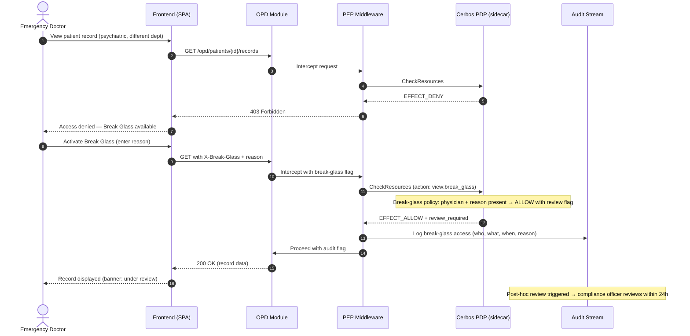

# 04 — Authentication and Authorization Flow

This document describes the canonical identity and authorization flow used across the platform.

## Core rules
- JWTs are for identity and coarse context only.
- Capabilities are the only canonical grant primitive.
- Roles are flat containers of capabilities.
- Cerbos policies are policy-as-code.
- Role composition, assignments, delegations, and clearances are authorization data.
- Frontend authorization is UX-only; backend Cerbos enforcement is authoritative.

## Trust boundaries
The request path is:

1. **Identity adapter** verifies the JWT and extracts `sub`, `iq_tenant_id`, `roles`, `department`, `org_id`.
2. **PEP middleware** maps the request to a Cerbos resource kind and action.
3. **Principal enrichment** resolves runtime authorization data from User Management:
   - role-derived capabilities
   - delegated capabilities
   - clearances
4. **Cerbos PDP** evaluates the enriched principal against the requested action and resource attributes.
5. **Handler/use-case** runs only if Cerbos returns allow.

## JWT shape
JWTs stay lightweight and include:

- `sub`
- `iq_tenant_id`
- `roles`
- `department`
- `org_id`
- `jti`
- `iss`
- `iat`
- `exp`

JWTs do **not** include:

- capabilities
- delegated capabilities
- clearances

That data is intentionally resolved at request time so authorization remains current even when role composition changes.

## Principal enrichment
Runtime enrichment is the bridge between identity and authorization.

The effective entitlement set is resolved as:

1. `roles -> role_capabilities -> capabilities`
2. `delegated_capability_grants`
3. `user_clearances`

The resulting Cerbos principal shape is:

```json
{
  "id": "user-id",
  "roles": ["tenant-role-code"],
  "attr": {
    "iq_tenant_id": "tenant-id",
    "department": "cardiology",
    "org_id": "org-id",
    "capabilities": ["um:user:create", "um:user:read"],
    "delegated_capabilities": ["um:role:assign"],
    "clearances": { "psychiatric": "view" },
    "um_clearance_effective_tier": 1
  }
}
```

## Cerbos model
Cerbos evaluates:

- principal attributes
- resource attributes
- action

Cerbos does **not** own capability composition data. It consumes already-enriched principal data and applies policy-as-code rules.

Policies should:

- enforce tenant isolation explicitly
- check capabilities and ABAC attributes
- avoid direct role-name authorization

## Policy/data split
The platform uses a deliberate split:

- **Policy-as-code**: Cerbos YAML in Git, reviewed and deployed through CI
- **Authorization-data-as-config**: roles, capabilities, assignments, delegations, and clearances managed by User Management

This prevents daily operational changes from requiring policy edits, while still keeping access-control logic reviewable and testable.

## Request authorization flow
For a protected request:

1. verify JWT
2. enrich the principal from User Management data
3. map request to `resource kind + action + resource attrs`
4. call Cerbos `CheckResources` or `PlanResources`
5. allow or deny before handler logic

`PlanResources` is preferred for filtered list endpoints so authorization can be pushed down into query planning instead of running row-by-row checks.

## Service-to-service calls
Service principals follow the same overall model:

- authenticate as a service principal
- enrich any required principal attributes
- authorize through Cerbos

The same policy substrate is used for both human and service principals so authorization logic does not split across multiple systems.
    participant Bus as Event Bus

    Note over OPD,Bus: Doctor orders lab test — OPD calls Lab via service account

    OPD->>OPD: Doctor's request authorized at OPD boundary
    OPD->>Lab: POST /lab/orders (OPD service-account JWT)
    Note over OPD,Lab: JWT: {sub: opd-svc, kind: service, iq_tenant_id: hospital_a}

    Lab->>LPEP: Intercept request
    LPEP->>LCer: CheckResources (loopback gRPC)
    Note over LPEP,LCer: Principal: {opd-svc, kind: service}<br/>Action: lab:order:create
    LCer-->>LPEP: EFFECT_ALLOW
    LPEP->>Lab: Proceed

    Lab->>LDB: Create lab order (originating_user_id for audit)
    Lab->>Bus: Publish lab.order.created event
    Lab-->>OPD: 201 Created
```

Source file: [`diagrams/mermaid/service-to-service-authz.mmd`](../diagrams/mermaid/service-to-service-authz.mmd)

---

## 7. BFF role in authentication and authorization

### 7.1 What the BFF does

The BFF (Backend For Frontend) / API Gateway sits between the frontend and the module services. For AuthN/AuthZ purposes, it performs exactly one function: **JWT signature verification**. It checks that the token is well-formed, the signature is valid against the JWKS endpoint, and the token is not expired. Invalid or expired tokens are rejected with `401 Unauthorized` before reaching any module.

The BFF also performs routing (directing requests to the correct module) and may perform response aggregation (combining responses from multiple modules into one frontend response). These are optimization functions.

### 7.2 What the BFF does not do

The BFF does **not** perform fine-grained authorization. It does not check roles, department access, resource-level permissions, or any Cerbos policy. It does not run a Cerbos sidecar.

### 7.3 Why the BFF is not a security boundary

The BFF is an optimization layer, not a security boundary. If the BFF is compromised or misconfigured, fine-grained authorization is not lost — every module verifies tokens and checks Cerbos independently. This is the zero-trust principle applied to internal architecture: no module trusts that a previous hop has already authorized the request.

This design means modules can be deployed behind the BFF or accessed directly (e.g., by other modules making service-to-service calls) with the same security guarantees.

[ADR-0015 — BFF role and zero-trust between modules](../adr/0015-bff-role-zero-trust.md)

### 7.4 Token Handler session management

The BFF's role expands beyond signature verification to include **session lifecycle management** via the Token Handler pattern:

- The BFF stores refresh tokens in HttpOnly, SameSite=Strict, Secure cookies
- The BFF issues 1-2 minute JWTs to the SPA
- When a JWT expires, the SPA calls the BFF's refresh endpoint, which uses the cookie-stored refresh token to obtain a new JWT from better-auth
- If the session has been revoked (e.g., admin suspended the user), the refresh fails and the user is redirected to login

This expansion does not weaken the zero-trust model. Modules still verify JWTs independently against JWKS — they do not know or care about the Token Handler. They see a standard JWT with a short lifetime, which is strictly better for security than the previous 15-minute default.

The BFF becomes stateful (it stores cookies), introducing a new consequence: if the BFF is down, new JWT issuance stops. However, existing JWTs remain valid until expiry, and modules continue processing in-flight requests. See [User Management LLD §16](../lld/user-management/01-schema-design.md).

---

## 8. Tenant isolation via authorization

### 8.1 iq_tenant_id as a JWT claim

Every JWT contains an `iq_tenant_id` claim identifying the hospital (tenant) context for the session. This claim is set at authentication time and cannot be modified by the client.

### 8.2 Base policy for tenant isolation

Cerbos enforces tenant isolation through a **base policy** that all resource policies inherit. The base policy contains one fundamental rule: a principal can only access resources whose `iq_tenant_id` matches the principal's `iq_tenant_id`. This rule is evaluated before any resource-specific policy. If the tenant IDs do not match, the request is denied regardless of the principal's roles or permissions.

This means tenant isolation is not dependent on every module developer remembering to add a tenant check. It is enforced at the policy layer, below module business logic.

### 8.3 Cerbos scopes for tenant-specific rules

Different tenants (hospitals) may have different authorization rules. Hospital A may allow nurses to order labs; Hospital B may restrict this to doctors. These tenant-specific variations are expressed as [Cerbos scopes](https://docs.cerbos.dev/cerbos/latest/policies/scoped_policies), not as forked policy files.

Scoped policies override specific rules within a base policy for a given scope (tenant). The base policy defines the default behavior; a scoped policy for `tenant:hospital-a` overrides selected rules. This avoids policy proliferation: we do not maintain N copies of every policy for N tenants.

---

## 9. Cerbos principal types

The platform's authorization model recognizes five types of principals, all evaluated by the same Cerbos policy substrate.

### 9.1 Human users

Staff, doctors, nurses, lab technicians, hospital administrators, front-desk clerks. These are the primary principals. Their roles and department assignments determine their access. Principal `kind: "user"`.

### 9.2 Service accounts

Inter-module communication principals, as described in section 6. Principal `kind: "service"`. Each module that makes outbound calls has a dedicated service account.

### 9.3 Organizations

Hospitals themselves can be principals in certain contexts — for example, when querying platform-level reports or when the Configurator evaluates what modules a hospital is entitled to. Principal `kind: "organization"`.

### 9.4 Partner systems

External systems that integrate with the platform through the Integration Hub (see [Integration and Interop](05-integration-and-interop.md)). These include legacy HIS systems, insurance providers, and state reporting systems. Principal `kind: "partner"`. Their access is scoped to the specific integration endpoints they are authorized to use.

### 9.5 Automated agents

Scheduled jobs (e.g., nightly report generation), background workers (e.g., ABDM health record push), and AI assistants (e.g., clinical decision support queries). Principal `kind: "agent"`. Automated agents have explicit, minimally-scoped permissions and their actions are fully auditable.

---

## 10. Audit trail

### 10.1 Decision logging

Every Cerbos authorization decision — both `ALLOW` and `DENY` — is logged. The audit log entry includes: timestamp, principal (with type and ID), action, resource (with type and ID), decision, the policy that matched, and the request context (tenant, department, originating IP). This provides a complete record of who accessed what, when, and whether access was granted or denied.

### 10.2 Shadow records for audit chain-of-custody

User Management retains a shadow record of every user who has ever acted on the system, including federated users, **indefinitely**. Shadow records are never hard-deleted. Even if a user is deprovisioned in the external IdP, their shadow record remains so that historical audit entries can be attributed to a named individual. This is a regulatory requirement in healthcare — audit trails must be traceable to specific people, not to opaque external identifiers that may be recycled ([ISO 27789 — Audit trails for electronic health records](https://www.iso.org/standard/44315.html)).

### 10.3 Break-glass / emergency override

Clinical emergencies sometimes require access outside normal authorization scope. A doctor in an emergency department may need to view a patient's psychiatric records to identify drug interactions, even if the doctor's role does not normally grant access to psychiatric records.

The platform supports a **break-glass** mechanism:

1. The doctor triggers an emergency access request through the UI, providing a reason.
2. The Cerbos policy for emergency access evaluates the request. The policy requires: (a) the principal has the `emergency_access` capability (assigned to relevant clinical roles), (b) a non-empty reason is provided, and (c) the resource is within the principal's tenant.
3. If the policy allows, access is granted.
4. The audit log captures the full context: who, what, when, why (the stated reason), and the fact that this was a break-glass access.
5. A post-hoc review workflow is triggered: a designated reviewer (e.g., department head, compliance officer) is notified and must review and acknowledge the emergency access within a configurable timeframe.

Break-glass access is policy-controlled, not a backdoor. The rules governing when it is available, who can invoke it, and what review is required are all expressed as Cerbos policies — code-reviewed, tested, and auditable like any other policy.



Source file: [`diagrams/mermaid/break-glass-override.mmd`](../diagrams/mermaid/break-glass-override.mmd)

---

## 11. Resolved questions

### 11.1 Cerbos policy storage and distribution

**Decision:** Git + bundle distribution. Policies are committed to a Git repository, compiled and tested in CI (`cerbos compile` + `cerbos test`), and distributed to Cerbos sidecars as bundles. The Admin API with database-backed storage is not enabled unless concrete evidence shows the deployment cycle is too slow for a specific class of policy changes. If enabled, Admin API changes must still be synced back to Git as the source of record.

### 11.2 Token lifetime and refresh strategy

**Decision:** BFF Token Handler pattern. Token lifetime is 1-2 minutes (not 15 minutes). The BFF stores refresh tokens in HttpOnly cookies and seamlessly reissues JWTs on expiry. This solves the JWT revocation gap (maximum exposure = token lifetime) and supports long clinical sessions (12+ hours) without interruption. See §7.4 and [User Management LLD §16](../lld/user-management/01-schema-design.md).

---

## 12. Frontend authorization

Authorization decisions on the frontend are a **UX optimization**, not a security boundary. The backend always re-checks via Cerbos. Frontend permission data can be stale; the backend PDP is authoritative.

### 12.1 Permission map on login

On login or context switch, the frontend calls a dedicated permissions endpoint. This endpoint uses Cerbos's `PlanResources` API to compute what the active user can access — which modules, which features within each module, and which actions (read, write, delete) per feature. The result is a structured permission map:

```json
{
  "opd": { "registration": { "read": true, "write": true }, "prescription": { "read": true, "write": false } },
  "lab": { "orders": { "read": true, "write": true }, "results": { "read": true, "write": false } },
  "pharmacy": { "dispensing": { "read": false, "write": false } }
}
```

This map is cached client-side for the session duration and refreshed on context switch.

### 12.2 Cerbos client SDKs

Cerbos provides official client libraries for frontend integration:

- **`@cerbos/react`** — React hooks for per-component authorization checks. A `<CerbosProvider>` wraps the app; individual components use `useIsAllowed()` or `useCheckResource()` hooks to conditionally render based on the user's permissions.
- **`@cerbos/http`** — Browser-compatible HTTP client for direct PDP communication.
- **`@cerbos/embedded`** — Runs a WebAssembly PDP on-device, evaluating policies locally without network calls. Relevant for offline or low-connectivity scenarios (rural health centers).

### 12.3 UI rendering pattern

UI components conditionally render based on the permission map:

- **Navigation:** Module tabs and menu items are shown/hidden based on top-level module access.
- **Features within a module:** Feature sections, buttons, and form fields are shown/hidden or disabled based on feature-level permissions.
- **Actions:** Write/delete buttons are disabled for read-only users. The UI never shows a button that the backend will reject.

This is enforced at the component level via the React SDK hooks or a permission-checking utility, not by manual `if` checks scattered throughout the UI code.

[ADR-0004 — AuthZ with Cerbos sidecar](../adr/0004-authz-cerbos-sidecar.md) | [ADR-0015 — BFF role and zero-trust](../adr/0015-bff-role-zero-trust.md)

---

## 13. OAuth 2.1 Provider

> **Phase 3 — Federation**

When the platform acts as an identity source for third-party systems (e.g., clinical systems that need SSO into the platform, Integration Hub partners, future mobile apps), it uses better-auth's **OAuth 2.1 Provider plugin** (the older OIDC Provider plugin is deprecated).

The plugin provides:
- `/.well-known/openid-configuration` discovery document
- JWKS endpoint (integrated with the JWT plugin key management from §1.6)
- Authorization endpoint with PKCE (mandatory per OAuth 2.1)
- Token endpoint with `authorization_code`, `refresh_token`, and `client_credentials` grant types
- Token revocation ([RFC 7009](https://datatracker.ietf.org/doc/html/rfc7009))
- Token introspection ([RFC 7662](https://datatracker.ietf.org/doc/html/rfc7662))

Custom claims injection ensures third-party tokens include `iq_tenant_id`, `roles`, `department`, and `org_id` — the same claim contract used internally.

---

## 14. Recovery tier model

> **Phase 1 (MVP):** `standard` and `admin_only` tiers. **Phase 2:** `delegated`, `phone_recovery` tiers. **Phase 3:** `federated` tier.

Recovery (how a user regains access when locked out) is a first-class platform workflow, not a generic password-reset email. Users are classified into five recovery tiers (`standard`, `delegated`, `phone_recovery`, `admin_only`, `federated`), each with different allowed recovery paths.

The recovery tier is stored on the platform `users` table and drives routing in better-auth's `sendResetPassword` callback:

- **Standard:** Self-serve email reset via `users.email`
- **Delegated:** Reset routed to admin mailbox via `delegated_recovery_routes` table
- **Phone recovery:** Phone OTP reset
- **Admin only:** Admin sets password directly via `auth.api.setUserPassword()`
- **Federated:** IdP-managed recovery

Three admin recovery workflows (direct password set, admin-generated magic link, delegated email route) are all gated by Cerbos authorization, admin step-up authentication, and full audit trail.

See [User Management LLD §15](../lld/user-management/01-schema-design.md) and [design spec §3](../../superpowers/specs/2026-05-03-authn-authz-revision-design.md#3-recovery-tier-model) for full details.

---

## References

- [better-auth documentation](https://www.better-auth.com/docs) — AuthN provider
- [Cerbos documentation](https://docs.cerbos.dev/) — AuthZ engine
- [NIST SP 800-63C — Federation and Assertions](https://pages.nist.gov/800-63-4/sp800-63c.html) — federation assurance levels
- [NIST SP 800-162 — Guide to ABAC](https://csrc.nist.gov/pubs/sp/800/162/final) — attribute-based access control concepts
- [RFC 7517 — JSON Web Key](https://datatracker.ietf.org/doc/html/rfc7517) — JWKS standard
- [RFC 7644 — SCIM Protocol](https://datatracker.ietf.org/doc/html/rfc7644) — identity provisioning standard
- [ISO 27789 — Audit trails for electronic health records](https://www.iso.org/standard/44315.html) — healthcare audit requirements
- [OAuth 2.1 draft](https://datatracker.ietf.org/doc/draft-ietf-oauth-v2-1/) — PKCE mandatory, implicit grant removed
- [RFC 7009 — OAuth 2.0 Token Revocation](https://datatracker.ietf.org/doc/html/rfc7009)
- [RFC 7662 — OAuth 2.0 Token Introspection](https://datatracker.ietf.org/doc/html/rfc7662)
