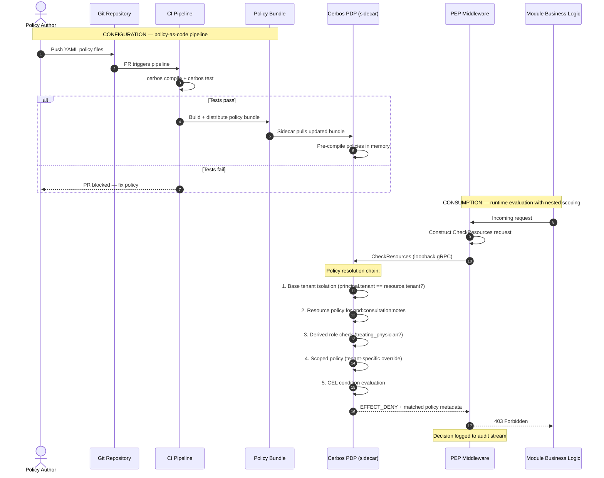
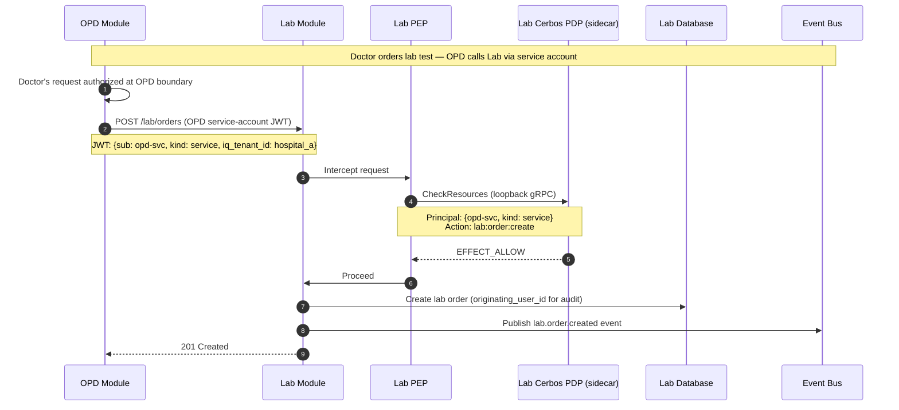
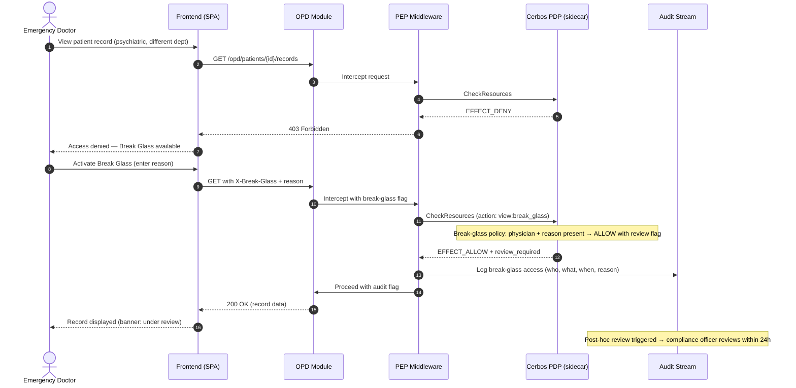

# 04 — Authentication and Authorization Flow

This document describes the end-to-end identity and access architecture for the HIMS platform. It covers how a request flows from login to authorized action, for both human users and service principals.

Cross-references: [System Overview](01-system-overview.md) for the identity plane overview, [Core Modules](02-core-modules.md) for User Management details, [Module Shape Template](03-module-shape-template.md) for the PEP middleware contract every module implements.

---

## 1. Authentication architecture

### 1.1 Primary AuthN provider

The platform uses [better-auth](https://www.better-auth.com/docs) as the primary Authentication (AuthN) provider. better-auth is not exposed directly to modules. It is wrapped behind a thin `IdentityProvider` interface owned by the User Management core module. This interface defines the contract — issue token, verify token, refresh token, revoke session — and allows the underlying provider to be replaced without module-level changes ([ADR-0003](../adr/0003-authn-better-auth-identity-adapter.md)).

### 1.2 Federation

The platform supports a **two-tier federation strategy** for external Identity Providers:

**Tier 1 — Direct federation (modern IdPs):** For hospitals running modern IdPs (Microsoft Entra ID, Okta, PingIdentity, Auth0), better-auth's SSO plugin (OIDC) and SAML plugin connect directly. Configuration is per-tenant via the Configurator module.

**Tier 2 — Shared Keycloak broker (legacy IdPs):** For hospitals with legacy/non-standard identity systems that cannot speak OIDC or modern SAML, the platform operates a shared Keycloak cluster. Each legacy hospital gets its own realm (full logical isolation). Each realm bridges to the hospital's legacy IdP and exposes an OIDC endpoint that better-auth consumes as a standard federated IdP.

**Account linking:** When a hospital that already has local users deploys an IdP, existing users must be explicitly linked to their IdP identity by an admin using employee_id or HR-id matching — never by email alone. This is managed through an `auth_identity_links` table. See [User Management LLD §15](../lld/user-management/01-schema-design.md) and [design spec §9](../../superpowers/specs/2026-05-03-authn-authz-revision-design.md#9-federation-account-linking) for the full linking workflow.

A hospital that already runs Entra ID for staff accounts does not need to maintain a separate set of credentials in the HIMS — their existing directory is the source of truth for identity.

### 1.3 JIT provisioning

On the first successful federated login, User Management creates a **shadow record** for the external user. This shadow record contains the minimum attributes needed for platform operation: a platform-internal `user_id`, the external IdP subject identifier, tenant association, and initial role/department assignments (which may be derived from IdP claims or set by a tenant administrator). JIT (Just-In-Time) provisioning means no pre-registration step is required for federated users ([NIST SP 800-63C, §6 — Federation Assurance](https://pages.nist.gov/800-63-4/sp800-63c.html)).

### 1.4 SCIM synchronization

Where the external IdP supports SCIM (System for Cross-domain Identity Management), User Management will consume SCIM events to keep shadow records current — handling name changes, department reassignments, and deprovisioning. SCIM support is optional; not all hospital IdPs will offer it. Where SCIM is unavailable, shadow records are updated on each login from the IdP's token claims ([RFC 7644 — SCIM Protocol](https://datatracker.ietf.org/doc/html/rfc7644)).

### 1.5 Token format

Authentication produces a signed JWT (JSON Web Token). The JWT payload includes the following claims:

| Claim | Description |
|-------|-------------|
| `sub` | Platform-internal `user_id` (from the shadow record for federated users) |
| `iq_tenant_id` | The tenant (hospital) context for this session |
| `roles` | Array of role identifiers assigned to this user within this tenant |
| `department` | Department or ward context, if applicable |
| `org_id` | Organization ID for multi-hospital users (null for single-tenant users) |
| `jti` | Unique token ID for audit correlation and replay detection |
| `iss` | Issuer — the platform's AuthN service |
| `exp` | Expiration timestamp (1-2 minutes — Token Handler pattern) |
| `iat` | Issued-at timestamp |

Tokens are short-lived (1-2 minutes, managed by the BFF Token Handler). The BFF stores refresh tokens in HttpOnly cookies and seamlessly reissues JWTs on expiry — doctors can work for 12-hour shifts without re-authentication. See [ADR-0015](../adr/0015-bff-role-zero-trust.md) for the Token Handler pattern.

**What is NOT in the JWT:** Email (the synthetic `ba_users.email` has no business meaning), capabilities, delegations, clearances. These are resolved by the PEP at request time. See [User Management LLD §7](../lld/user-management/01-schema-design.md#7-pep-enrichment-pattern).

### 1.6 JWKS-based verification

The AuthN service publishes a JWKS (JSON Web Key Set) endpoint at `/.well-known/jwks.json`. Any service holding the public keys can verify a JWT signature locally without calling back to the AuthN service. This is the foundation for the zero-trust verification model described in sections 2 and 7 ([RFC 7517 — JSON Web Key](https://datatracker.ietf.org/doc/html/rfc7517)).

**Key management:** JWKS keys are managed by better-auth's JWT plugin and persisted in a database `jwks` table — surviving pod restarts and horizontal scaling. Private keys are encrypted at rest with AES-256-GCM by default. Key rotation is configured with an explicit `rotationInterval` (e.g., 7 days) and `gracePeriod` (e.g., 14 days) during which both old and new keys are served. See [User Management LLD §17](../lld/user-management/01-schema-design.md).

---

## 2. User-facing authentication flow

The following walk-through traces a request from user login to authorized action.

**Step 1 — User login.** The user navigates to the HIMS web application and enters their **username** and password. If the tenant is configured for direct authentication, better-auth validates the credentials via the username plugin. If the tenant is configured for federation, the user clicks "Sign in with [Hospital IdP]" and is redirected to the external IdP for authentication.

**Step 2 — Token issuance.** On successful authentication, the `IdentityProvider` interface issues a JWT containing the claims listed in section 1.5. For federated users, JIT provisioning (section 1.3) runs if no shadow record exists, ensuring the `sub` claim always maps to a platform-internal `user_id`.

**Step 3 — Token Handler issues JWT.** The BFF receives the authentication response from better-auth, stores the **refresh token** in an HttpOnly, SameSite=Strict, Secure cookie, and issues a **short-lived JWT** (1-2 minutes) to the SPA. The SPA stores the JWT and attaches it to every subsequent API request as a `Bearer` token. When the JWT expires, the SPA silently refreshes via the BFF's refresh endpoint — no re-authentication needed.

**Step 4 — BFF receives request.** The BFF (Backend For Frontend) / API Gateway receives the request. It verifies the JWT signature against the JWKS endpoint. This is signature verification only — the BFF does not evaluate authorization policies. If the signature is invalid or the token is expired, the BFF rejects the request with a `401 Unauthorized` before it reaches any module. See section 7 for the BFF's limited role.

**Step 5 — Request forwarded to module.** The BFF routes the request to the target module (e.g., OPD Registration).

**Step 6 — Module verifies token independently.** The receiving module's identity adapter verifies the JWT signature against the same JWKS endpoint. This is the zero-trust principle: the module does not trust the BFF's verification. It verifies independently. The identity adapter extracts the claims and constructs a `Principal` object containing `user_id`, `iq_tenant_id`, `roles`, and `department`.

**Step 7 — Authorization check.** The module's PEP (Policy Enforcement Point) middleware packages the `Principal`, the requested `action` (e.g., `patient:register`), and the `resource` (e.g., the patient record) and calls the Cerbos PDP (Policy Decision Point) sidecar. See sections 3 and 4 for authorization architecture and the detailed request flow.

**Step 8 — Proceed or reject.** If Cerbos returns `ALLOW`, the request proceeds to the module's business logic. If `DENY`, the module returns `403 Forbidden`. Every decision is logged for audit (section 10).

---

## 3. Authorization architecture

### 3.1 Cerbos as the AuthZ engine

The platform uses [Cerbos](https://docs.cerbos.dev/) as the authorization engine. Cerbos is an open-source, policy-based access control system that evaluates policies at runtime against principal attributes, resource attributes, and the requested action ([Cerbos documentation — How It Works](https://docs.cerbos.dev/cerbos/latest/concepts)).

### 3.2 Deployment model — sidecar per module pod

Each module pod deploys a Cerbos PDP as a sidecar container. The module communicates with its Cerbos sidecar over loopback gRPC (localhost, no network hop). This deployment model provides:

- **Latency.** Authorization decisions are sub-millisecond because the PDP is co-located with the module. No network round-trip to a centralized authorization service.
- **Availability.** Each module's authorization is independent. A problem with one module's sidecar does not affect other modules.
- **Scalability.** Authorization scales with the module — more module replicas means more PDP capacity, with no central bottleneck.

Logically, there is one policy authority (one set of policies). Physically, every module pod runs its own PDP evaluating those same policies. [ADR-0004](../adr/0004-authz-cerbos-sidecar.md)

### 3.3 Policies as code

Cerbos policies are written in YAML and stored in a Git repository. They are tested in CI using `cerbos compile` and `cerbos test` before deployment. Policy changes follow the same review process as application code: pull request, code review, automated test, merge, deploy ([Cerbos documentation — Testing](https://docs.cerbos.dev/cerbos/latest/policies/compile)).

This matters because authorization policies encode clinical and regulatory rules — who can prescribe controlled substances, who can view psychiatric records, who can override an allergy alert. These rules must be reviewable, auditable, and rollback-able. Git provides all three.

### 3.4 Permission data as configuration

While policies are code, the **data** that policies evaluate against is UI-configurable. This includes:

- Role definitions (what roles exist in a given tenant)
- Role assignments (which users hold which roles)
- **Capabilities** (what actions each role is allowed to perform — the bridge between policies-as-code and data-as-config)
- Department and ward hierarchies
- Tenant-specific scope overrides (e.g., "in this hospital, nurses can order labs; in that hospital, they cannot")

This data is managed through the User Management module's administrative interface and the Configurator.

### 3.5 Why the policy/data split matters

The split between policy-as-code and data-as-config is deliberate and load-bearing.

**Policies change with software releases.** A new policy rule — "radiologists can now view pathology reports for their patients" — is a clinical access decision that should be reviewed by a domain expert, tested against scenarios, and deployed with the same rigor as application code. It ships with a software release.

**Permission data changes with organizational structure.** "Dr. Sharma moved from Cardiology to Pulmonology" or "Nurse Priya was assigned the Charge Nurse role" are operational changes. They happen daily. They must be configurable by hospital administrators without a software deployment.

If policies and data are mixed, either operational changes require code deployments (too slow) or policy changes bypass code review (too risky). The split gives each type of change the governance model it needs ([NIST SP 800-162, §3.2 — ABAC Concepts](https://csrc.nist.gov/pubs/sp/800/162/final)).

### 3.6 AuthZ configuration pipeline and runtime evaluation

The following diagram traces both the deploy-time policy lifecycle (how policies get from Git to the sidecar) and the request-time evaluation chain (how a single authorization check resolves through nested scoping — base tenant isolation, resource policy, derived roles, scoped policy overrides, and CEL conditions).



Source file: [`diagrams/mermaid/authz-config-and-consumption.mmd`](../diagrams/mermaid/authz-config-and-consumption.mmd)

---

## 4. Request authorization flow

This section traces the authorization path for a single request after the JWT has been verified (picking up from section 2, step 7).

**Step 1 — PEP middleware intercepts.** Every module implements PEP middleware as specified in the [Module Shape Template](03-module-shape-template.md). The middleware fires before business logic on every request that touches a protected resource.

**Step 2 — Principal extraction and enrichment.** The PEP extracts the `Principal` from the verified JWT claims: `user_id`, `iq_tenant_id`, `roles[]`, `department`, `org_id`. It then enriches the principal with **capabilities** (by resolving `roles[]` → `role_capabilities` → `capabilities`), **active delegations**, and **clearances** — all from the module's local cache of User Management data. See [User Management LLD §7 — PEP enrichment pattern](../lld/user-management/01-schema-design.md#7-pep-enrichment-pattern).

**Step 3 — Request packaging.** The PEP constructs a Cerbos `CheckResources` request containing:
- **Principal:** `{ id: user_id, roles: [...], attr: { iq_tenant_id, department, ... } }`
- **Resource:** `{ kind: "patient_record", id: record_id, attr: { iq_tenant_id: record_tenant, department: record_dept, sensitivity: "normal" } }`
- **Action:** `"view"` or `"edit"` or `"delete"` etc.

**Step 4 — Cerbos evaluation.** The sidecar PDP evaluates the request against the loaded policies. Evaluation is in-memory; Cerbos pre-compiles policies on startup and evaluates them without I/O ([Cerbos documentation — Performance](https://docs.cerbos.dev/cerbos/latest/concepts)).

**Step 5 — Decision.** Cerbos returns `EFFECT_ALLOW` or `EFFECT_DENY`, along with metadata indicating which policy matched.

**Step 6 — Enforcement.** If allowed, the request proceeds. If denied, the PEP returns `403 Forbidden` with an opaque error (no policy details leaked to the client). The decision, including the policy that matched, is logged to the audit stream.

---

## 5. N+1 mitigation

A naive implementation of per-resource authorization checks creates a performance problem at scale. Consider a nurse viewing a ward patient list: 50 patients means 50 individual Cerbos calls. At sub-millisecond per call this might seem acceptable, but with network overhead, middleware overhead, and database queries to fetch resource attributes, it compounds. At 200 patients or 500 line items in a report, it becomes unacceptable.

The platform uses three complementary strategies to mitigate this.

### 5.1 Bulk CheckResources

Cerbos's `CheckResources` API accepts multiple resource checks in a single call. Instead of 50 calls for 50 patients, the PEP batches them into one call containing all 50 principal/resource/action tuples. The sidecar evaluates them all and returns a batch response ([Cerbos documentation — CheckResources](https://docs.cerbos.dev/cerbos/latest/api/)).

### 5.2 PlanResources — pushing filters into SQL

For list views where the set of accessible resources is large, Cerbos's `PlanResources` API returns a query plan: a set of conditions that describe which resources the principal is allowed to access. The PEP translates these conditions into SQL `WHERE` clauses, and the database returns only authorized records. This eliminates the N+1 entirely — one Cerbos call, one database query ([Cerbos documentation — PlanResources](https://docs.cerbos.dev/cerbos/latest/api/)).

Example: a doctor requests "my patients." Instead of fetching all patients and filtering, the PEP calls `PlanResources`, receives conditions like `resource.attr.department == principal.attr.department AND resource.attr.iq_tenant_id == principal.attr.iq_tenant_id`, appends these to the SQL query, and the database returns only the authorized subset.

### 5.3 Request-scoped PEP caching

Within a single HTTP request, the same authorization check may be needed multiple times (e.g., rendering a list where each row has conditional action buttons). The PEP caches decisions for the duration of the request. The cache key is the tuple `(principal_hash, resource_kind, resource_id, action)`. The cache is discarded when the request completes — there is no cross-request caching, which would introduce stale-decision risk.

---

## 6. Service-to-service authorization

Not all principals are humans. When the OPD module places a lab order, it calls the Lab module. When the Pharmacy module checks drug interactions, it calls the Master Data module. These inter-module calls must also be authorized.

### 6.1 Service accounts

Each module that makes outbound calls to other modules has a service account. Service accounts are Cerbos principals with `kind: "service"`. They are registered in User Management and have their own roles and permissions.

### 6.2 Service-account tokens

Inter-module calls use service-account tokens, not the originating user's token. When the OPD module calls the Lab module to place an order, it authenticates with the Lab module using its own service-account JWT. The originating user's identity is passed as a claim within the request payload (for audit purposes) but is not used for authorization at the Lab module boundary. The Lab module authorizes the OPD service account, not the individual user.

This separation exists because: (a) the OPD module has already authorized the user's action at its own boundary, and (b) the Lab module should not need to understand OPD-specific role hierarchies. The Lab module only needs to know "is this a trusted service account with the `lab:order:create` permission?"

### 6.3 Same policy substrate

Service-to-service authorization uses the same Cerbos policy infrastructure as user authorization. There is no separate service mesh authorization layer. Cerbos policies for service accounts define which service can call which endpoints on which other service. This keeps authorization logic in one place rather than splitting it between application-level Cerbos and infrastructure-level service mesh policies.



Source file: [`diagrams/mermaid/service-to-service-authz.mmd`](../diagrams/mermaid/service-to-service-authz.mmd)

---

## 7. BFF role in authentication and authorization

### 7.1 What the BFF does

The BFF (Backend For Frontend) / API Gateway sits between the frontend and the module services. For AuthN/AuthZ purposes, it performs exactly one function: **JWT signature verification**. It checks that the token is well-formed, the signature is valid against the JWKS endpoint, and the token is not expired. Invalid or expired tokens are rejected with `401 Unauthorized` before reaching any module.

The BFF also performs routing (directing requests to the correct module) and may perform response aggregation (combining responses from multiple modules into one frontend response). These are optimization functions.

### 7.2 What the BFF does not do

The BFF does **not** perform fine-grained authorization. It does not check roles, department access, resource-level permissions, or any Cerbos policy. It does not run a Cerbos sidecar.

### 7.3 Why the BFF is not a security boundary

The BFF is an optimization layer, not a security boundary. If the BFF is compromised or misconfigured, fine-grained authorization is not lost — every module verifies tokens and checks Cerbos independently. This is the zero-trust principle applied to internal architecture: no module trusts that a previous hop has already authorized the request.

This design means modules can be deployed behind the BFF or accessed directly (e.g., by other modules making service-to-service calls) with the same security guarantees.

[ADR-0015 — BFF role and zero-trust between modules](../adr/0015-bff-role-zero-trust.md)

### 7.4 Token Handler session management

The BFF's role expands beyond signature verification to include **session lifecycle management** via the Token Handler pattern:

- The BFF stores refresh tokens in HttpOnly, SameSite=Strict, Secure cookies
- The BFF issues 1-2 minute JWTs to the SPA
- When a JWT expires, the SPA calls the BFF's refresh endpoint, which uses the cookie-stored refresh token to obtain a new JWT from better-auth
- If the session has been revoked (e.g., admin suspended the user), the refresh fails and the user is redirected to login

This expansion does not weaken the zero-trust model. Modules still verify JWTs independently against JWKS — they do not know or care about the Token Handler. They see a standard JWT with a short lifetime, which is strictly better for security than the previous 15-minute default.

The BFF becomes stateful (it stores cookies), introducing a new consequence: if the BFF is down, new JWT issuance stops. However, existing JWTs remain valid until expiry, and modules continue processing in-flight requests. See [User Management LLD §16](../lld/user-management/01-schema-design.md).

---

## 8. Tenant isolation via authorization

### 8.1 iq_tenant_id as a JWT claim

Every JWT contains an `iq_tenant_id` claim identifying the hospital (tenant) context for the session. This claim is set at authentication time and cannot be modified by the client.

### 8.2 Base policy for tenant isolation

Cerbos enforces tenant isolation through a **base policy** that all resource policies inherit. The base policy contains one fundamental rule: a principal can only access resources whose `iq_tenant_id` matches the principal's `iq_tenant_id`. This rule is evaluated before any resource-specific policy. If the tenant IDs do not match, the request is denied regardless of the principal's roles or permissions.

This means tenant isolation is not dependent on every module developer remembering to add a tenant check. It is enforced at the policy layer, below module business logic.

### 8.3 Cerbos scopes for tenant-specific rules

Different tenants (hospitals) may have different authorization rules. Hospital A may allow nurses to order labs; Hospital B may restrict this to doctors. These tenant-specific variations are expressed as [Cerbos scopes](https://docs.cerbos.dev/cerbos/latest/policies/scoped_policies), not as forked policy files.

Scoped policies override specific rules within a base policy for a given scope (tenant). The base policy defines the default behavior; a scoped policy for `tenant:hospital-a` overrides selected rules. This avoids policy proliferation: we do not maintain N copies of every policy for N tenants.

---

## 9. Cerbos principal types

The platform's authorization model recognizes five types of principals, all evaluated by the same Cerbos policy substrate.

### 9.1 Human users

Staff, doctors, nurses, lab technicians, hospital administrators, front-desk clerks. These are the primary principals. Their roles and department assignments determine their access. Principal `kind: "user"`.

### 9.2 Service accounts

Inter-module communication principals, as described in section 6. Principal `kind: "service"`. Each module that makes outbound calls has a dedicated service account.

### 9.3 Organizations

Hospitals themselves can be principals in certain contexts — for example, when querying platform-level reports or when the Configurator evaluates what modules a hospital is entitled to. Principal `kind: "organization"`.

### 9.4 Partner systems

External systems that integrate with the platform through the Integration Hub (see [Integration and Interop](05-integration-and-interop.md)). These include legacy HIS systems, insurance providers, and state reporting systems. Principal `kind: "partner"`. Their access is scoped to the specific integration endpoints they are authorized to use.

### 9.5 Automated agents

Scheduled jobs (e.g., nightly report generation), background workers (e.g., ABDM health record push), and AI assistants (e.g., clinical decision support queries). Principal `kind: "agent"`. Automated agents have explicit, minimally-scoped permissions and their actions are fully auditable.

---

## 10. Audit trail

### 10.1 Decision logging

Every Cerbos authorization decision — both `ALLOW` and `DENY` — is logged. The audit log entry includes: timestamp, principal (with type and ID), action, resource (with type and ID), decision, the policy that matched, and the request context (tenant, department, originating IP). This provides a complete record of who accessed what, when, and whether access was granted or denied.

### 10.2 Shadow records for audit chain-of-custody

User Management retains a shadow record of every user who has ever acted on the system, including federated users, **indefinitely**. Shadow records are never hard-deleted. Even if a user is deprovisioned in the external IdP, their shadow record remains so that historical audit entries can be attributed to a named individual. This is a regulatory requirement in healthcare — audit trails must be traceable to specific people, not to opaque external identifiers that may be recycled ([ISO 27789 — Audit trails for electronic health records](https://www.iso.org/standard/44315.html)).

### 10.3 Break-glass / emergency override

Clinical emergencies sometimes require access outside normal authorization scope. A doctor in an emergency department may need to view a patient's psychiatric records to identify drug interactions, even if the doctor's role does not normally grant access to psychiatric records.

The platform supports a **break-glass** mechanism:

1. The doctor triggers an emergency access request through the UI, providing a reason.
2. The Cerbos policy for emergency access evaluates the request. The policy requires: (a) the principal has the `emergency_access` capability (assigned to relevant clinical roles), (b) a non-empty reason is provided, and (c) the resource is within the principal's tenant.
3. If the policy allows, access is granted.
4. The audit log captures the full context: who, what, when, why (the stated reason), and the fact that this was a break-glass access.
5. A post-hoc review workflow is triggered: a designated reviewer (e.g., department head, compliance officer) is notified and must review and acknowledge the emergency access within a configurable timeframe.

Break-glass access is policy-controlled, not a backdoor. The rules governing when it is available, who can invoke it, and what review is required are all expressed as Cerbos policies — code-reviewed, tested, and auditable like any other policy.



Source file: [`diagrams/mermaid/break-glass-override.mmd`](../diagrams/mermaid/break-glass-override.mmd)

---

## 11. Open questions

### 11.1 Cerbos policy storage and distribution

The default approach is Git-based: policies are committed to a Git repository, compiled and tested in CI, and distributed to Cerbos sidecars as bundles. This gives full version control and auditability.

Cerbos also supports an [Admin API with database-backed storage](https://docs.cerbos.dev/cerbos/latest/configuration/storage), which allows runtime policy changes without a Git commit and deployment cycle. This is an escape hatch for scenarios where policies must change faster than a deployment cycle allows (e.g., emergency regulatory changes).

**The decision:** default to Git + bundle distribution. Do not enable the Admin API until there is concrete evidence that the deployment cycle is too slow for a specific class of policy changes. If enabled, Admin API changes must still be synced back to Git as the source of record.

`[OPEN: needs decision — confirm Cerbos policy storage strategy with EM]`

### 11.2 Token lifetime and refresh strategy

The default token lifetime is 15 minutes with refresh tokens. For clinical workflows where a doctor may be actively working for hours, the refresh mechanism must be seamless. The exact refresh strategy (silent refresh via BFF, rotating refresh tokens) is not yet decided.

`[OPEN: needs decision — token refresh UX for long clinical sessions]`

---

## 12. Frontend authorization

Authorization decisions on the frontend are a **UX optimization**, not a security boundary. The backend always re-checks via Cerbos. Frontend permission data can be stale; the backend PDP is authoritative.

### 12.1 Permission map on login

On login or context switch, the frontend calls a dedicated permissions endpoint. This endpoint uses Cerbos's `PlanResources` API to compute what the active user can access — which modules, which features within each module, and which actions (read, write, delete) per feature. The result is a structured permission map:

```json
{
  "opd": { "registration": { "read": true, "write": true }, "prescription": { "read": true, "write": false } },
  "lab": { "orders": { "read": true, "write": true }, "results": { "read": true, "write": false } },
  "pharmacy": { "dispensing": { "read": false, "write": false } }
}
```

This map is cached client-side for the session duration and refreshed on context switch.

### 12.2 Cerbos client SDKs

Cerbos provides official client libraries for frontend integration:

- **`@cerbos/react`** — React hooks for per-component authorization checks. A `<CerbosProvider>` wraps the app; individual components use `useIsAllowed()` or `useCheckResource()` hooks to conditionally render based on the user's permissions.
- **`@cerbos/http`** — Browser-compatible HTTP client for direct PDP communication.
- **`@cerbos/embedded`** — Runs a WebAssembly PDP on-device, evaluating policies locally without network calls. Relevant for offline or low-connectivity scenarios (rural health centers).

### 12.3 UI rendering pattern

UI components conditionally render based on the permission map:

- **Navigation:** Module tabs and menu items are shown/hidden based on top-level module access.
- **Features within a module:** Feature sections, buttons, and form fields are shown/hidden or disabled based on feature-level permissions.
- **Actions:** Write/delete buttons are disabled for read-only users. The UI never shows a button that the backend will reject.

This is enforced at the component level via the React SDK hooks or a permission-checking utility, not by manual `if` checks scattered throughout the UI code.

[ADR-0004 — AuthZ with Cerbos sidecar](../adr/0004-authz-cerbos-sidecar.md) | [ADR-0015 — BFF role and zero-trust](../adr/0015-bff-role-zero-trust.md)

---

## References

- [better-auth documentation](https://www.better-auth.com/docs) — AuthN provider
- [Cerbos documentation](https://docs.cerbos.dev/) — AuthZ engine
- [NIST SP 800-63C — Federation and Assertions](https://pages.nist.gov/800-63-4/sp800-63c.html) — federation assurance levels
- [NIST SP 800-162 — Guide to ABAC](https://csrc.nist.gov/pubs/sp/800/162/final) — attribute-based access control concepts
- [RFC 7517 — JSON Web Key](https://datatracker.ietf.org/doc/html/rfc7517) — JWKS standard
- [RFC 7644 — SCIM Protocol](https://datatracker.ietf.org/doc/html/rfc7644) — identity provisioning standard
- [ISO 27789 — Audit trails for electronic health records](https://www.iso.org/standard/44315.html) — healthcare audit requirements
