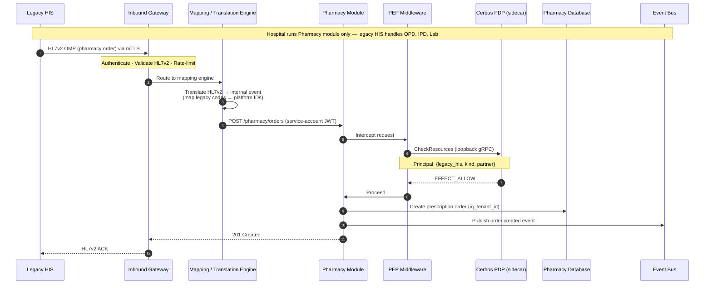

# 05 — Integration and Interoperability

This document describes how the HIMS platform connects to external systems: legacy hospital information systems, national health infrastructure (ABDM/ABHA), insurance providers, lab analyzers, radiology systems, and state reporting endpoints. It also defines the interoperability standards (FHIR R4, HL7v2) that govern data exchange at module boundaries.

Cross-references: [System Overview](01-system-overview.md) for the deployment and fragmented adoption context, [Core Modules](02-core-modules.md) for the Configurator and Master Data modules that support integration configuration, [Module Shape Template](03-module-shape-template.md) for the per-module FHIR/HL7 boundary contract, [AuthN/AuthZ Flow](04-authn-authz-flow.md) for how external callers are authenticated and authorized (principal `kind: "partner"`).

---

## 1. Integration Hub overview

The platform exposes one logical **Integration Hub** that handles all external connectivity. At runtime, this hub is two distinct services sharing a common control plane.

| Service | Direction | Purpose |
|---------|-----------|---------|
| **Inbound Gateway** | External → Platform | External systems (legacy HIS, partner systems) calling into the platform |
| **Outbound Connector** | Platform → External | Platform calling external systems (ABDM registries, insurance providers, state reporting) |

The Integration Hub is platform infrastructure — always deployed alongside the core modules and the BFF, not an optional feature module. Architecturally, the Inbound Gateway plays a role analogous to the BFF: the BFF is the entry point for the platform's own frontend (JWT auth, routing, response aggregation), while the Inbound Gateway is the entry point for external systems (API key/mTLS/OAuth auth, protocol translation, routing). Both are reverse-proxy-like services that authenticate callers and route to modules, differing in their trust model and protocol support.

This split exists because inbound and outbound traffic have different operational characteristics. Inbound traffic is unpredictable in volume and must be rate-limited and validated. Outbound traffic is platform-initiated, follows retry/circuit-breaking patterns, and must manage external credentials. Separating them allows independent scaling, monitoring, and failure isolation.

Both services share a **control plane** described in section 7.

### 1.1 The blurred boundary — ABDM flows

The inbound/outbound distinction is clean for most integrations but blurs with ABDM. Many ABDM flows are initiated externally by ABDM/NHA or by other Health Information Users (HIUs), even though conceptually they involve "outbound" data sharing from the platform's perspective. For example: an external HIU requests a patient's health records via ABDM — the request arrives at the platform (inbound), but the data flows out (outbound).

The architecture handles this explicitly: ABDM callback endpoints are registered on the Inbound Gateway. When ABDM or an external HIU initiates a flow, the Inbound Gateway receives the request, authenticates it, and routes it internally. If the flow requires data to be pushed back (e.g., health record response), the Inbound Gateway invokes the Outbound Connector to deliver the response. The two services collaborate on these bidirectional flows, coordinated through the shared control plane.

This is not an edge case. A significant fraction of ABDM interactions follow this pattern. The architecture must treat it as a first-class concern, not an afterthought.

---

## 2. Inbound Gateway

### 2.1 Purpose

The Inbound Gateway is the single entry point for external systems calling into the platform. It handles protocol translation, authentication, validation, and routing.

### 2.2 Protocol translation

External systems speak different protocols. The Inbound Gateway translates them into normalized internal events or API calls.

| External Protocol | Translation |
|-------------------|-------------|
| **HL7v2** (pipe-delimited messages) | Parsed and mapped to internal event format. Common for lab analyzers, radiology systems, and legacy HIS |
| **FHIR R4** (RESTful JSON/XML) | Validated against FHIR profiles and routed to the appropriate module |
| **SOAP/XML** (WSDL-defined web services) | Envelope deserialized, payload extracted and mapped through the mapping/translation engine. Encountered in legacy government systems and older middleware bridges |
| **Proprietary APIs** (vendor-specific REST, flat files, etc.) | Mapped through configurable adapters in the mapping/translation engine |

The mapping/translation engine (section 7) handles the field-level transformations. The Inbound Gateway handles the transport-level concerns: receiving the message, authenticating the caller, and dispatching it.

### 2.3 Authentication of external callers

External systems authenticate to the Inbound Gateway using one of three mechanisms, configured per integration in the Configurator:

- **API keys** — simplest option, suitable for low-risk integrations within a hospital's network perimeter.
- **mTLS** (mutual TLS) — certificate-based authentication for high-trust integrations. Both sides present certificates. Suitable for hospital-to-platform connections where the hospital has PKI infrastructure.
- **OAuth 2.0 client credentials** — for integrations that support OAuth. The external system obtains a token from the platform's AuthN service and presents it with each request.

Authenticated external callers are represented as Cerbos principals with `kind: "partner"` and are authorized through the same policy substrate as all other principals (see [AuthN/AuthZ Flow, section 9.4](04-authn-authz-flow.md#94-partner-systems)).

### 2.4 Rate limiting and request validation

The Inbound Gateway enforces per-integration rate limits to protect platform services from misbehaving or overloaded external systems. Rate limits are configurable per integration in the Configurator.

All inbound requests are validated against the expected schema before being routed internally. Malformed HL7v2 messages, invalid FHIR resources, or unexpected payloads are rejected at the gateway with structured error responses. This prevents bad data from propagating into module business logic.

### 2.5 The fragmented adoption story

A hospital running only the Pharmacy module of the HIMS platform still needs patient and prescription data from its existing legacy HIS. The Inbound Gateway is the mechanism that makes this possible. The legacy HIS sends HL7v2 messages (or calls a FHIR endpoint, depending on its capabilities) to the Inbound Gateway. The gateway translates these into internal events that the Pharmacy module consumes.

This is the architectural enabler for fragmented adoption — a hospital does not need to replace everything at once. It can adopt one module and connect the rest through the Integration Hub.

Source file: [`diagrams/mermaid/fragmented-adoption.mmd`](../diagrams/mermaid/fragmented-adoption.mmd)

---

## 3. Outbound Connector

### 3.1 Purpose

The Outbound Connector handles all platform-initiated calls to external systems. This includes regulatory reporting, insurance claim submission, ABDM health record sharing, and data synchronization with external registries.

### 3.2 Protocol adaptation

The Outbound Connector translates internal events into the format required by the target external system.

| Target System | Protocol/Format |
|---------------|----------------|
| **ABDM/NHA registries** | FHIR R4 bundles per ABDM specifications |
| **Insurance providers / TPAs** | SOAP/XML for legacy TPA gateways (cashless claims, pre-authorization); REST/JSON for newer platforms |
| **State reporting** | Varies — often flat files, CSV, XML uploads, or proprietary endpoints |
| **Legacy HIS** (bidirectional sync) | HL7v2 or FHIR R4, matching the HIS's capability |

### 3.3 Reliability patterns

External systems are unreliable. The Outbound Connector implements standard reliability patterns:

- **Retry with exponential backoff.** Failed calls are retried with increasing delays. The retry policy (max retries, backoff multiplier, jitter) is configurable per integration.
- **Circuit breaking.** If an external system fails repeatedly, the circuit breaker opens and stops sending requests, preventing cascade failures. The circuit breaker state is monitored and alerts are raised. When the external system recovers, the circuit closes and traffic resumes ([Michael Nygard, *Release It!*, Chapter 5 — Stability Patterns](https://pragprog.com/titles/mnee2/release-it-second-edition/)).
- **Credential rotation.** External API keys, certificates, and OAuth secrets are stored in Azure Key Vault (see section 7). The Outbound Connector supports automated credential rotation without service restarts.

### 3.4 Idempotency

External calls are idempotent where the target system supports it. The Outbound Connector tracks message IDs to avoid duplicate submissions (e.g., submitting the same insurance claim twice). Where the target system does not support idempotency natively, the connector maintains a local deduplication log.

---

## 4. ABDM/ABHA integration

> **Updated 2026-05-08** -- module ownership clarified per [ADR-0021](../adr/0021-record-foundation-fifth-core-module.md), [ADR-0022](../adr/0022-immutable-fhir-document-storage.md), [ADR-0023](../adr/0023-distributed-fhir-assembly.md). Detailed flow specifications in [Integration Platform LLD](../lld/integration-platform/01-schema-design.md) and [Record Foundation LLD](../lld/record-foundation/01-schema-design.md).

### 4.1 ABHA health ID

ABHA (Ayushman Bharat Health Account) is India's national health identifier. The platform integrates ABHA into the **EMPI** as one of several patient identifiers. EMPI's `patients.abha_number` column holds the 14-digit ABHA number (denormalised for fast lookup); EMPI's polymorphic `patient_identifiers` table holds ABHA addresses (e.g., `ayush@sbx`) alongside MRNs, insurance IDs, and any other identifiers ([ABDM -- ABHA specification](https://abdm.gov.in/abha-number)).

ABHA linking happens at patient registration and can be triggered during any clinical encounter. The EMPI handles identity resolution -- a patient may present with an ABHA at one visit and an MRN at another, and EMPI must recognize them as the same person. See [Core Modules § 2 EMPI](02-core-modules.md#2-empi--patient-identity).

The protocol mechanics of ABHA enrollment (ABDM Milestone 1 -- create ABHA via Aadhaar OTP, mobile OTP, biometric, etc.) live in the **Integration Hub's ABDM adapter** as FSM-driven workflows. Per [ADR-0020](../adr/0020-fsm-orchestration-for-integration-hub.md), each enrollment flow is an FSM definition (`abdm.m1.aadhaar-otp.v1`, `abdm.m1.find-by-mobile.v1`, etc.). On successful completion the adapter writes ABHA identifiers to EMPI via EMPI's `POST /patients/:id/identifiers` API. See [Integration Platform LLD -- FSM specifications](../lld/integration-platform/02-fsm-specifications.md#3-abdmm1aadhaar-otpv1--abha-creation-via-aadhaar-otp).

### 4.2 Care contexts and Record Foundation

ABDM's HIP/HIU exchanges happen at the granularity of **care contexts** -- discoverable health-record units like an OPD visit, lab report, prescription, or discharge summary. Care contexts are owned by the **Record Foundation** module per [ADR-0021](../adr/0021-record-foundation-fifth-core-module.md), the fifth core platform module added by this revision.

Record Foundation owns:
- The care-context registry (cross-module index of records linkable to ABDM).
- The immutable FHIR Document Bundle vault (per [ADR-0022](../adr/0022-immutable-fhir-document-storage.md), bundles are stored byte-exactly at finalisation; never regenerated; never updated).
- The external HIU bundle inbox (records received from external HIPs).
- The timeline read-model that powers both doctor UIs and ABDM HIP discovery responses.
- The consent-driven erasure scheduler that honours `dataEraseAt` per DPDP Act section 11.

Record Foundation does NOT own ABDM transport, gateway sessions, or consent artifacts -- those belong to the Integration Hub. See [Record Foundation LLD § 1](../lld/record-foundation/01-schema-design.md#1-purpose-and-scope) for the boundary table.

### 4.3 Consent management

ABDM mandates consent-based health information exchange. Before any health data can be shared with an external HIU, the patient must grant explicit consent through the ABDM consent framework. Module ownership of the consent flow:

| Concern | Owner |
|---|---|
| Inbound consent notification (gateway -> platform) | **Integration Hub** Inbound Gateway |
| Consent artifact persistence (signed JSON, lifecycle status, `dataEraseAt`) | **Integration Hub** (`integration_hub.abdm_consent_artifacts`) |
| Consent FSM (`requested -> granted -> revoked / expired / exhausted`) | **Integration Hub** (`abdm.consent.lifecycle.v1` long-lived FSM) |
| Disclosure decision ("can this care context be sent under this consent?") | **Record Foundation** consults Integration Hub's consent state |
| Erasure of consent-expired received bundles | **Record Foundation** scheduler |
| Audit substrate for every disclosure under a consent | **Integration Hub** `integration_workflow_transitions` + `integration_outbound_messages` (both carry `consent_id`); projected to the centralized audit consumer per [ADR-0024](../adr/0024-audit-deferred-to-pre-prod.md) |

The architectural rule: consent **state** lives in Integration Hub; consent **enforcement on stored data** is performed by Record Foundation reading that state. A patient's consent revocation flows: gateway -> Integration Hub (state update + event) -> Record Foundation (timeline projection update + erasure scheduling).

### 4.4 Health Information Exchange (HIP and HIU)

The platform acts as both Health Information Provider (HIP) and Health Information User (HIU). The two roles are handled by FSM definitions inside the Integration Hub's ABDM adapter, with Record Foundation called for bundle fetch (HIP) or bundle ingest (HIU).

**As HIP** ([Integration Platform Scenario 4](../lld/integration-platform/03-scenarios.md#scenario-4----m3-hip-external-hiu-requests-records-under-granted-consent)):

1. Inbound Gateway receives a consent notification from ABDM. Integration Hub persists the consent artifact and emits `abdm.consent.granted`. Record Foundation flips `consent_disclosable=true` on the affected care contexts.
2. Hours-to-days later, the Inbound Gateway receives the data request. Integration Hub's M3-HIP FSM advances. It calls **Record Foundation** for the disclosable care contexts and bundles, encrypts each via Fidelius, and pushes them to the HIU's `dataPushUrl`.

**As HIU** ([Integration Platform Scenario 5](../lld/integration-platform/03-scenarios.md#scenario-5----m3-hiu-doctor-pulls-external-records-for-a-patient)):

1. A doctor initiates a record request. Integration Hub's M3-HIU FSM sends the consent-init to ABDM and waits for patient approval.
2. On approval, the FSM submits the data request and waits for the HIP push.
3. The Inbound Gateway receives the encrypted bundles, Integration Hub decrypts, and emits `abdm.health-record.received`. **Record Foundation** ingests into `external_health_records` + `bundle_storage` + `care_contexts`(source_origin='external_abdm') + `timeline_index`.

### 4.5 Distributed FHIR Document Bundle assembly

Per [ADR-0023](../adr/0023-distributed-fhir-assembly.md), FHIR Document Bundles are assembled in two layers:

- **Source clinical modules (OPD, Lab, Pharmacy, IPD, Radiology, ...) own resource serialisation for their own domain.** OPD knows what an `Encounter` looks like for an OPD visit; Lab knows `DiagnosticReport`; Pharmacy knows `MedicationDispense`. Each module ships its own serialiser, depending on the shared `@hims/ts-sdk-fhir` package for resource builders, the NRCeS profile registry, and validators.
- **Record Foundation orchestrates Composition assembly + validation + storage.** It consumes a `*.finalized` event with the FHIR resources attached, wraps them in a `Composition` per the relevant NRCeS R4 profile (OpConsultRecord, Prescription, DischargeSummary, DiagnosticReport, etc.), validates against the profile, and stores byte-exactly.

This design preserves module autonomy ([CLAUDE.md project rule](../../../CLAUDE.md): no cross-module imports), supports the polyglot future ([ADR-0016](../adr/0016-polyglot-nx-monorepo-spec-first-contracts.md): a Python module's serialiser uses `@hims/py-sdk-fhir`), and makes new clinical modules easy to add (each contributes its own serialiser without touching a central mapper).

The shared FHIR SDK is the seam -- it pins the NRCeS profile versions, enforces canonical JSON ordering ([RFC 8785 / JCS](https://www.rfc-editor.org/rfc/rfc8785)) so re-producing a logically identical bundle yields identical bytes (a prerequisite for the immutable-bundle discipline of [ADR-0022](../adr/0022-immutable-fhir-document-storage.md)), and provides validators that run NRCeS profile conformance tests.

### 4.6 Facilitation Testing (FT) certification

ABDM requires systems to pass Facilitation Testing certification before connecting to the production ABDM sandbox. The production HIMS deployment already holds FT certification through the existing `hims-production` project. The company has permission to rewrite the application provided it continues to meet NHA's specifications.

The new platform's ABDM compliance posture is structurally stronger than the existing implementation:

- **Immutable bundles** ([ADR-0022](../adr/0022-immutable-fhir-document-storage.md)) survive temporal master-data drift and support digital signatures, both Facilitation Testing concerns the existing implementation handles by accident more than design.
- **Distributed FHIR assembly** ([ADR-0023](../adr/0023-distributed-fhir-assembly.md)) localises NRCeS profile knowledge to the modules that author the underlying data, reducing the risk of FHIR-mapping bugs in central code that touches every clinical surface.
- **Explicit FSM choreography** ([ADR-0020](../adr/0020-fsm-orchestration-for-integration-hub.md)) makes the gateway-callback ordering provable rather than emergent, addressing the "stuck session" debugging burden of the existing implementation.

Detailed flow specifications, FHIR profile pinning, and the FSM definitions are in the [Integration Platform LLD](../lld/integration-platform/01-schema-design.md) and the [Record Foundation LLD](../lld/record-foundation/01-schema-design.md).

---

## 5. FHIR/HL7 boundary contracts

### 5.1 FHIR R4 as the preferred interop standard

FHIR R4 (Fast Healthcare Interoperability Resources, Release 4) is the preferred standard for data exchange at clinical module boundaries and for external interoperability. FHIR R4 is the current normative release of the HL7 FHIR standard ([HL7 FHIR R4 — Index](https://hl7.org/fhir/R4/)).

### 5.2 HL7v2 for legacy integrations

HL7v2 remains the dominant protocol for lab analyzer interfaces, radiology system (RIS/PACS) integrations, and many legacy HIS connections. The platform supports HL7v2 at the Integration Hub boundary — the Inbound Gateway parses HL7v2 messages, and the Outbound Connector can produce them ([HL7 Version 2 Standard](https://www.hl7.org/implement/standards/product_brief.cfm?product_id=185)).

### 5.3 FHIR resources are the interop contract, not the internal data model

This is a critical architectural boundary. FHIR resources define the **contract** between modules and between the platform and external systems. They do **not** dictate the internal data model of any module.

A module may store data in relational tables, document stores, or any representation that suits its needs. When it communicates with other modules or external systems, it translates to/from FHIR resources. This decoupling ensures that:

- Modules can optimize their internal storage for their specific access patterns.
- Changes to a module's internal schema do not break interoperability contracts.
- The interop contract is governed by a well-defined, widely-understood standard rather than an internal schema.

### 5.4 Key FHIR resources

The following FHIR R4 resources form the primary interop vocabulary for the platform's clinical modules:

| FHIR Resource | Used By | Purpose |
|---------------|---------|---------|
| `Patient` | EMPI, all clinical modules | Patient demographics and identifiers |
| `Encounter` | OPD, IPD, Emergency | Clinical encounters (visits, admissions) |
| `Observation` | Lab, Vitals, Nursing | Lab results, vital signs, clinical observations |
| `MedicationRequest` | OPD (prescriptions), Pharmacy | Medication orders |
| `MedicationDispense` | Pharmacy | Dispensing records |
| `DiagnosticReport` | Lab, Radiology | Lab and imaging reports |
| `ServiceRequest` | OPD, Lab, Radiology | Orders for services (lab tests, imaging) |
| `Condition` | OPD, IPD | Diagnoses (linked to ICD codes) |
| `AllergyIntolerance` | OPD, IPD, Pharmacy | Patient allergies |
| `Procedure` | OT, IPD | Surgical and clinical procedures |
| `Composition` | Discharge, EHR | Discharge summaries, clinical documents |

This is not exhaustive. Additional resources will be defined as feature modules are designed.

### 5.5 FHIR-HL7v2 translation

The Integration Hub's mapping/translation engine handles bidirectional translation between FHIR R4 and HL7v2 where needed. Common mappings:

- HL7v2 ADT (Admit/Discharge/Transfer) messages ↔ FHIR `Encounter` + `Patient` resources
- HL7v2 ORM (Order) messages ↔ FHIR `ServiceRequest` resources
- HL7v2 ORU (Observation Result) messages ↔ FHIR `DiagnosticReport` + `Observation` resources

These mappings are maintained in the mapping/translation engine's configuration, not hard-coded. New mappings can be added for vendor-specific HL7v2 variants without code changes.

### 5.6 SOAP/XML for legacy TPA and government interfaces

Some external systems — particularly legacy insurance/TPA gateways and older government health IT platforms — expose only SOAP/XML (WSDL-defined) web services. In the Indian healthcare ecosystem, this surfaces primarily in two areas:

- **Insurance/TPA claim gateways.** Legacy Third Party Administrators (Medi Assist, FHPL, Raksha TPA, etc.) historically expose SOAP/XML endpoints for cashless claim submission, pre-authorization requests, and eligibility verification. Newer TPA platforms are migrating to REST/JSON, but legacy SOAP endpoints remain in production at many TPAs.
- **State and government reporting.** Some state-level health IT systems and inter-departmental data exchange interfaces use SOAP or XML-based submission formats. These are opaque, poorly documented, and vary by state.

SOAP is a transport/envelope concern, not a healthcare-domain interoperability standard — unlike HL7v2 or FHIR, it does not define clinical message semantics. The actual data inside the SOAP envelope is typically a vendor-specific or regulator-defined XML schema.

**Architectural approach:** The Integration Hub handles SOAP through the same configurable adapter mechanism used for other proprietary protocols. A SOAP adapter in the Outbound Connector deserializes/serializes the XML envelope, extracts or wraps the domain payload, and feeds it into the mapping/translation pipeline. No SOAP dependency leaks past the Integration Hub boundary — internal modules never interact with SOAP directly.

**The platform does not expose a SOAP server.** No external system will call the platform over SOAP. ABDM, the primary national health infrastructure, is fully REST/FHIR. New government platforms (CoWIN, PM-JAY transaction management) are REST-based. The SOAP adapter is outbound-only, for reaching legacy systems that have not yet migrated.

**Trajectory.** SOAP is declining in Indian healthcare IT but not yet dead. New systems universally adopt REST/JSON or FHIR. The platform's SOAP adapter is a pragmatic bridge for existing TPA integrations, not a strategic investment. It will be deprecated when the last connected TPA migrates off SOAP.

---

## 6. Integration patterns

The platform uses three integration patterns, chosen based on the nature of the interaction.

### 6.1 Event-driven (default)

The default integration pattern is event-driven. A clinical module publishes an event (e.g., `prescription.created`), and the Integration Hub routes it to the appropriate external system(s) through the Outbound Connector.

This pattern is appropriate when: (a) the external system does not need to respond synchronously, (b) eventual consistency is acceptable, and (c) decoupling between the module and the external system is desirable.

Examples:
- A lab result is finalized → event published → Integration Hub pushes the result to the referring hospital's legacy HIS.
- A patient is discharged → event published → Integration Hub submits the discharge summary to ABDM as a FHIR bundle.
- A medication is dispensed → event published → Integration Hub updates the insurance claim system.

### 6.2 Synchronous (exception)

Some integrations require an immediate response. The synchronous pattern is used sparingly, only when the calling module cannot proceed without the external system's response.

Examples:
- ABDM consent verification: before sharing health records, the platform must verify that a valid consent exists. This requires a synchronous call to ABDM's consent manager.
- Real-time insurance eligibility check: before admitting a patient, the front desk may need to verify insurance coverage in real time.
- Drug interaction check against an external knowledge base: the prescribing module may call an external drug interaction API before allowing a prescription to be saved.

Synchronous integrations are wrapped in timeout and fallback logic. If the external system is unavailable, the module must degrade gracefully (e.g., allow the prescription but flag it for manual drug interaction review).

### 6.3 Batch (scheduled)

Some integrations operate on a schedule rather than in real time. Batch jobs are managed by the Configurator and executed by the Outbound Connector.

Examples:
- Nightly regulatory reporting to state health authorities.
- Periodic bulk data synchronization with insurance providers.
- Scheduled ABDM health record aggregation and push.

Batch jobs produce audit logs and status reports. Failed batches are retried according to the integration's retry policy.

---

## 7. Shared control plane

The Inbound Gateway and Outbound Connector share a control plane that provides common infrastructure for all integrations.

### 7.1 Integration registry

A catalog of all configured integrations. Each entry records:

- Integration name and description
- External system identifier
- Protocol (HL7v2, FHIR R4, SOAP/XML, proprietary REST, flat file)
- Direction (inbound, outbound, bidirectional)
- Authentication method (API key, mTLS, OAuth)
- Status (active, paused, erroring)
- Rate limits
- Associated tenant(s)

The registry is managed through the Configurator's admin UI.

### 7.2 Mapping/translation engine

Handles field-level mapping and code translation between internal and external representations. Examples:

- Internal drug codes ↔ ABDM drug codes
- Internal procedure codes ↔ ICD/ICHI procedure codes
- Internal department identifiers ↔ external system department codes
- Date/time format normalization
- Patient identifier cross-referencing (via EMPI)

Mappings are configuration, not code. New mappings can be added for new integrations without modifying the Integration Hub's application code. The Master & Tenant Data module provides the reference data (drug catalogs, code systems) that the mapping engine draws from.

### 7.3 Credentials store and the `@hims/ts-sdk-secrets` resolver

External credentials — API keys, TLS certificates, OAuth client secrets — are referenced (not embedded) by `integration_credentials.vault_ref`. The platform's `@hims/ts-sdk-secrets` package dispatches the reference by URI scheme to the appropriate resolver:

| Scheme | Resolved by | When used |
|---|---|---|
| `env:VAR_NAME` | `process.env.VAR_NAME` | **Phase 0/1 default.** Local dev, sandbox, first-pilot tenants using platform-owned sandbox credentials. Unblocks ABDM M1 development without an external vault dependency. |
| `azure-keyvault://<vault>/<secret>` | Azure SDK ([Azure Key Vault documentation](https://learn.microsoft.com/en-us/azure/key-vault/general/overview)) | Production-tenant default once an Azure deployment is provisioned. |
| `aws-sm://...`, `vault://...`, `file://...` | Provider-specific SDKs | Alternate clouds, self-hosted, or per-tenant choice. |

The resolver supports rotation (the SDK re-fetches on a configurable cadence or on a rotation event), never logs resolved values, and is the same code path regardless of scheme — migrating a credential reference from `env:` to `azure-keyvault://` is a configuration edit, not a code change.

**Phase 0/1 environment-variable carve-out.** The default rule is *no credentials in environment variables for production tenants*. Phase 0/1 is exempted to unblock local development and first-pilot deployments using platform-owned sandbox credentials. **Pre-production gate:** before any customer-tenant production deployment, every `env:` credential reference for that tenant must migrate to a real secret store, and the platform must verify resolution end-to-end. This gate is tracked on the prod-cutover checklist alongside [ADR-0024](../adr/0024-audit-deferred-to-pre-prod.md)'s audit gate. Owners: Architect (spec), DevOps (vault provisioning), Tech Lead (verification).

### 7.4 Observability

Each integration has dedicated monitoring:

- **Health checks.** Periodic probes to verify external system availability.
- **Latency tracking.** Per-integration P50/P95/P99 latency metrics.
- **Error rates.** Per-integration error rate tracking with alerting thresholds.
- **Circuit breaker state.** Dashboard showing which integrations are open, half-open, or closed.
- **Message throughput.** Volume of messages processed per integration over time.

### 7.5 Audit substrate (no per-module audit table)

Per [ADR-0024](../adr/0024-audit-deferred-to-pre-prod.md), the Integration Hub does **not** maintain a per-module `integration_audit_log` table. The substrate that the future centralized audit consumer projects from on the Integration Hub side comprises four streams already required for operational reasons:

| Stream | What it captures | Where it lives |
|---|---|---|
| Transport message logs | Every inbound and outbound gateway message — headers, payload reference (PHI bytes are not inline; they sit at `payload_storage_ref`), outcome, retry state | `integration_inbound_messages`, `integration_outbound_messages` |
| Workflow transition log | Every state change of every FSM workflow — append-only by repository discipline ([ADR-0020](../adr/0020-fsm-orchestration-for-integration-hub.md)) | `integration_workflow_transitions` |
| Rich domain events | `abdm.consent.requested`, `abdm.consent.granted`, `abdm.health-record.disclosed`, etc., each carrying before/after state and actor | The event bus / outbox per [ADR-0009](../adr/0009-event-driven-inter-module-communication.md) |
| Structured request logs | `request_id`, `actor`, `iq_tenant_id`, `action`, `resource_type`, `resource_id` on every mutating HTTP request | HTTP middleware (Fastify hooks) |

Cross-references (`consent_id` on workflow rows and message rows, `request_id` correlating logs and events) let the audit consumer answer regulatory questions ("what data left the platform under consent X", "who triggered the disclosure", "when was it acknowledged") by joining these streams. **Pre-production gate:** the centralized audit consumer must be live and verified end-to-end in staging before any customer-tenant production deployment.

---

## 8. The external-hospital-with-legacy story

This section walks through a concrete end-to-end scenario that demonstrates how fragmented adoption works in practice.

### 8.1 Setup

A 200-bed district hospital currently runs a legacy HIS for all clinical functions. The hospital wants to modernize its pharmacy workflow by adopting the HIMS Pharmacy module, but it is not ready to replace its legacy HIS for OPD, IPD, or other departments. The legacy HIS supports HL7v2 messaging.

### 8.2 Architecture for this deployment

The deployment includes:

- **Core platform modules:** User Management, Configurator, Master & Tenant Data, EMPI. These are always deployed.
- **Pharmacy module:** The single feature module the hospital has adopted.
- **Integration Hub:** Inbound Gateway and Outbound Connector, configured to communicate with the legacy HIS.
- **BFF:** Serving the Pharmacy UI to hospital staff.

The legacy HIS is registered in the Integration Hub's integration registry as an inbound source and outbound target. Authentication is configured (e.g., mTLS within the hospital's network). HL7v2 message mappings are configured for the specific legacy HIS vendor.

### 8.3 Prescription flow — legacy OPD to HIMS Pharmacy

**Step 1 — Doctor writes prescription in legacy OPD.** The doctor uses the legacy HIS's OPD module to write a prescription during a patient consultation. The legacy HIS generates an HL7v2 ORM (order) message.

**Step 2 — Legacy HIS sends HL7v2 message to Inbound Gateway.** The legacy HIS is configured to send ORM messages to the HIMS platform's Inbound Gateway endpoint. The Inbound Gateway authenticates the message (mTLS), validates the HL7v2 format, and passes it to the mapping/translation engine.

**Step 3 — Protocol translation.** The mapping engine translates the HL7v2 ORM message into a FHIR `MedicationRequest` resource. Patient identifiers in the HL7v2 message are resolved through the EMPI — the legacy HIS's MRN is mapped to the platform's canonical patient ID (and ABHA if linked).

**Step 4 — Event publication.** The translated `MedicationRequest` is published as a `prescription.received` event. The Pharmacy module subscribes to this event.

**Step 5 — Pharmacy module processes prescription.** The Pharmacy module receives the event, displays the prescription in the pharmacist's work queue, and the pharmacist proceeds with dispensing using the HIMS Pharmacy UI. Standard authorization applies — the pharmacist is authenticated via the platform's AuthN, and the Pharmacy module's PEP middleware checks Cerbos for the `medication:dispense` action.

**Step 6 — Dispensing event flows back.** When the pharmacist completes dispensing, the Pharmacy module publishes a `medication.dispensed` event. The Integration Hub's Outbound Connector picks up this event, translates it back to an HL7v2 RDS (pharmacy/treatment dispense) message, and sends it to the legacy HIS.

**Step 7 — Legacy HIS receives update.** The legacy HIS receives the HL7v2 message and updates the patient's medication record in its own system. The doctor can see in the legacy HIS that the prescription has been dispensed.

### 8.4 What this demonstrates

This scenario exercises the following architectural elements:

- **Fragmented adoption.** The hospital uses one HIMS module while keeping its legacy HIS for everything else. No big-bang migration required.
- **Integration Hub bidirectional flow.** Data flows in (prescription from legacy) and out (dispensing event to legacy) through the Integration Hub.
- **Protocol translation.** HL7v2 ↔ FHIR translation is handled by the mapping engine, transparent to both the Pharmacy module and the legacy HIS.
- **EMPI cross-referencing.** Patient identity is resolved across systems — the legacy HIS's MRN is linked to the platform's canonical patient record.
- **Standard AuthN/AuthZ.** Even though the prescription originated externally, the pharmacist's actions within the Pharmacy module are governed by the same authentication and Cerbos-based authorization as any other module interaction.
- **Audit trail continuity.** The full chain — from external prescription receipt to internal dispensing to external notification — is logged in the audit stream.

---

## References

- [HL7 FHIR R4](https://hl7.org/fhir/R4/) — FHIR standard, Release 4
- [HL7 Version 2](https://www.hl7.org/implement/standards/product_brief.cfm?product_id=185) — HL7v2 standard
- [ABDM specifications](https://abdm.gov.in/) — Ayushman Bharat Digital Mission
- [ABDM — ABHA specification](https://abdm.gov.in/abha-number) — Health Account / Health ID
- [Azure Key Vault documentation](https://learn.microsoft.com/en-us/azure/key-vault/general/overview) — credentials management
- Michael Nygard, *Release It!*, 2nd edition (Pragmatic Bookshelf) — stability patterns (circuit breaker, bulkheads)
- [W3C SOAP 1.2 Specification](https://www.w3.org/TR/soap12/) — SOAP messaging framework (reference for legacy adapter implementation)
- Sam Newman, *Building Microservices*, 2nd edition (O'Reilly), Chapter 4 — integration patterns
