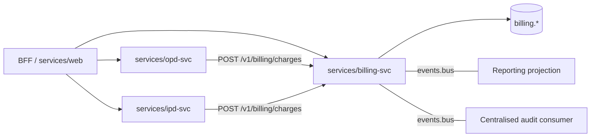

# HLD 06 — Billing

**Status:** First draft for alignment meeting
**Last updated:** 2026-05-13
**Related:** [02-core-modules.md](./02-core-modules.md) | [03-module-shape-template.md](./03-module-shape-template.md) | [05-integration-and-interop.md](./05-integration-and-interop.md) | [ADR-0025 — Billing module shape and phasing](../adr/0025-billing-module-shape-and-phasing.md) | [Billing LLD](../lld/billing/01-schema-design.md)

---

## Overview

Billing is the **horizontal supporting module** that owns patient-facing revenue cycle: capturing charges as services are rendered, generating invoices, accepting payments, tracking outstandings, and (in later phases) running insurance claims, refunds, payment plans, and doctor commission accruals. It is *not* a core platform module ([ADR-0006](../adr/0006-four-core-platform-modules.md), [ADR-0021](../adr/0021-record-foundation-fifth-core-module.md) — Record Foundation is the fifth core); it is a peer of feature modules, present in most adoptions but optional for tenants integrating an external billing system.

The module is structured to ship in four additive phases. Phase 1 reaches feature parity with the production HIMS OPD counter-billing flow. Each subsequent phase extends the surface without breaking earlier deployments. The full per-table phasing and the embedded-then-extracted packaging strategy are recorded in [ADR-0025](../adr/0025-billing-module-shape-and-phasing.md).

| Phase | Scope | Goal |
|---|---|---|
| **Phase 1** | Service catalog, price agreements (basic), bills, bill items, payments, advances, discounts | OPD counter parity with production HIMS |
| **Phase 2** | Insurance providers, policies, claims; corporate clients; service packages | Cashless TPA flow, corporate billing, package products |
| **Phase 3** | Refunds, payment plans, installments, IPD discharge bills | Discharge billing, EMI, refund workflow |
| **Phase 4** | Doctor commission rules, accruals, payouts | Provider economics |

## 1. Purpose

Billing answers three questions: *what was charged*, *what was paid*, and *what is outstanding*, for each patient encounter and each tenant. It does not answer *what was done clinically* (that is the clinical module's concern), *who is the patient* (EMPI), or *what is the catalog price* once a bill has been issued (snapshotted at charge time).

The module's primary integration surface is the **charge-ingest API**: any clinical module — OPD, IPD, Lab, Pharmacy, Radiology, Daycare, Emergency — calls it with `(patient_id, visit_id, source_module, source_ref, item_code, quantity, performed_by, performed_date)` when a chargeable service is rendered. Billing resolves the catalog price, snapshots it into a `bill_item`, attaches the row to the current open bill for the patient–visit, and returns the resulting bill item. The clinical module need know nothing else about billing.

Beyond ingest, billing exposes administrative APIs for invoice generation, payment recording, advance management, discount approval, and (later) claims and refunds. UX is delivered through the `services/web` BFF; printed receipts and invoices are generated by a templated PDF service that reads from billing's schema.

This module is the financial system of record for patient transactions. It is not a general ledger — that is an ERP concern integrated via exports — but it is the source of truth for what was billed and what was collected, at the tenant level.

[ADR-0025 — Billing module shape and phasing](../adr/0025-billing-module-shape-and-phasing.md)

## 2. Owns

Billing is the source of truth for:

- **Bills and bill items** — the immutable financial record of charges issued. Once a bill is finalised, its items are not edited; corrections are bill-replacement chains via `bills.replaced_bill_id` (the bill-amendment pattern carried over from the lead's reference ERD, formalised by snapshot pricing).

- **Snapshotted item pricing** — every `bill_item` row carries `unit_price`, `tax_percentage`, `tax_category`, `description`, and `item_code` as they were at the moment of charge capture. The service catalog can change; historical bills do not. The financial-truth invariant lives on the bill_item row, not on a join.

- **Service master and price agreements (Phase 1)** — the tenant-scoped catalog of chargeable services with default prices and tax rules, plus tenant-specific overrides for corporate clients and insurance providers (Phase 2). Lives in `billing.service_master` and `billing.price_agreements`. Possible migration to a Master Data service-catalog domain post-launch; snapshot pricing makes that migration non-breaking for historical bills.

- **Payments and receipts** — every cash, card, UPI, cheque, gateway, advance-utilisation, and (Phase 2) insurance-claim-disbursement transaction. Payment method-specific fields (`card_last4`, `upi_transaction_id`, `cheque_number`, `gateway_response`) are stored alongside the canonical amount and a generated `receipt_number`.

- **Patient advances** — pre-payments collected against future services. Each advance has `advance_amount`, `utilized_amount`, `refunded_amount`, `available_balance` (the latter derived but materialised for performance). Utilisations link advances to bills via `advance_utilizations`.

- **Discount approvals** — every discount above a configurable threshold (defined in Configurator) requires an approval row with `requested_by`, `approved_by`, `approval_level`, `supporting_document_url`. The bill carries the discount totals; the approval rows are the audit trail.

- **Insurance providers, policies, claims (Phase 2)** — TPA and insurer master data, per-patient policy linkages with coverage and copay terms, and per-bill claim records with submission, approval, deduction, and settlement tracking.

- **Corporate clients (Phase 2)** — company-billed accounts with credit-day terms, employee-verification rules, agreement dates.

- **Refunds (Phase 3)** — refund records with approval and processing workflow; refund methods (bank transfer, cheque, gateway reversal).

- **Payment plans and installments (Phase 3)** — high-value bill financing with down-payment, installment schedule, interest, late-fee terms; per-installment status with reminder tracking.

- **IPD discharge summaries (Phase 3)** — final-bill aggregates for inpatient stays, rolling up room charges, procedures, medicines, investigations, consultations, advances adjusted, balance due. (The clinical IPD discharge summary lives in the IPD module; this is its financial counterpart.)

- **Doctor commissions (Phase 4)** — rule definitions, per-charge accrual rows, periodic payout aggregates.

## 3. Exposes

### APIs

- **Charge-ingest** (`POST /v1/billing/charges`) — the primary clinical-to-billing integration. Idempotent on `Idempotency-Key`. See [ADR-0025 §charge-ingest contract](../adr/0025-billing-module-shape-and-phasing.md#charge-ingest-contract) for the schema. Returns the `bill_item_id`, the parent `bill_id`, and the snapshotted price and tax.

- **Bill operations** — list bills for a patient/visit/tenant, get bill detail (header + items + payments + advances applied), finalise a bill (transition from `DRAFT` to `FINALIZED`), cancel a bill (transition to `CANCELLED` with a reason), amend a bill (creates a replacement bill in `DRAFT` linking back via `replaced_bill_id`).

- **Payment operations** — record a payment against a bill (cash, card, UPI, cheque, gateway), receive a webhook callback from a payment gateway (Phase 1 supports manual recording; gateway callbacks are Phase 1.5 if a tenant is integrated).

- **Advance operations** — record a patient advance receipt (creates a `patient_advances` row + a `payments` row of method `ADVANCE_RECEIPT`), utilise an advance against a bill (creates an `advance_utilizations` row, decrements `available_balance`).

- **Discount approval workflow** — request a discount above threshold (creates `discount_approvals` row in `PENDING`), approve or reject (updates row, recomputes bill totals on approval).

- **Service catalog read** (Phase 1) — list services, get service detail with current price and tax. Write access is restricted to the Configurator-driven admin flow.

- **Insurance claim operations** (Phase 2) — pre-authorisation request, claim submission, status polling, settlement recording.

- **Refund operations** (Phase 3) — request a refund, approve, process, mark settled.

- **Payment-plan operations** (Phase 3) — create a plan against a bill, record installment payments, send reminders (delegated to a notification service).

### Events published

(Per [ADR-0009](../adr/0009-event-driven-inter-module-communication.md), events carry rich payloads — all fields a consumer might project.)

- **`bill.created`** — a new bill row was inserted (typically the first charge against a fresh patient–visit). Payload: bill header + initial bill_item.
- **`bill.item-added`** — a charge was captured. Payload: full bill_item row including snapshotted price and tax.
- **`bill.finalized`** — a bill transitioned from `DRAFT` to `FINALIZED`. Payload: complete bill + all items.
- **`bill.cancelled`** — a bill transitioned to `CANCELLED`. Payload: bill + cancellation reason + canceller.
- **`bill.amended`** — a replacement bill was created. Payload: old bill_id, new bill_id, reason.
- **`payment.received`** — a payment row was inserted. Payload: payment row + parent bill summary.
- **`advance.received`** — a patient advance was recorded. Payload: advance row + payment row.
- **`advance.utilized`** — an advance was applied against a bill. Payload: utilisation row + advance updated balance.
- **`discount.requested`**, **`discount.approved`**, **`discount.rejected`** (Phase 1).
- **`insurance-claim.submitted`**, **`insurance-claim.approved`**, **`insurance-claim.rejected`**, **`insurance-claim.settled`** (Phase 2).
- **`refund.processed`** (Phase 3).
- **`doctor-commission.accrued`** (Phase 4).

Record Foundation does not consume billing events for the FHIR document substrate (clinical events do that). Billing events are consumed by reporting/analytics projections, the centralized audit consumer ([ADR-0024](../adr/0024-audit-deferred-to-pre-prod.md)), and any ERP-export integration.

## 4. Depends on

- **EMPI** — for patient identity. Billing carries `patient_id` as a soft reference; for invoice rendering, it calls EMPI `GET /v1/patients/{patient_id}` and caches the result with a TTL ([feedback_projection_vs_http_cache](../../README.md) principle: HTTP + TTL cache + event-bust over projection unless four criteria hold; for billing's needs, the cache is sufficient).

- **User Management** — for `created_by`, `approved_by`, `cancelled_by`, `performed_by`, `received_by` actor resolution. JWT-derived `sub` claim populates these columns at write time; display-name resolution at read is via User Management's principal-attributes API.

- **Configurator** — for tenant-level billing configuration: discount approval thresholds (`max_discount_without_approval_percent`, `levels`), tax rules (CGST/SGST splits, exempt categories), receipt template, default payment-method whitelist, currency. Billing reads this via the Configurator's config API at startup and on `config.changed` event.

- **Master & Tenant Data** — for HSN/SAC tax codes (Phase 1), insurance provider master (Phase 2 may migrate `insurance_providers` to Master Data if it becomes shared across tenants), corporate client master (similar). Phase 1 keeps these in billing's schema; the migration is a Phase 2 decision recorded in [ADR-0025](../adr/0025-billing-module-shape-and-phasing.md#deliberate-departures-from-the-leads-erd).

- **Source clinical modules (one or more of OPD/IPD/Lab/Pharmacy/Radiology/Daycare)** — emit charges via the charge-ingest API. Billing does not know which clinical modules exist; it accepts any module that calls its API with a valid service-account JWT. New clinical modules slot in without billing schema changes.

- **Payment gateway providers** (Phase 1.5+) — Razorpay, PayU, or a tenant's preferred gateway, via Integration Hub's outbound adapter. Phase 1 supports manual recording (operator enters the gateway transaction ID after settling); gateway-direct callback is a phase-1.5 enhancement.

- **Notification service** (Phase 3) — for installment reminders, refund-issued SMS/email. Out of scope for this HLD.

## 5. Failure modes

| Dependency | Behavior if dependency fails |
|---|---|
| **EMPI unavailable** | Charge-ingest continues to accept charges (it does not validate `patient_id` against EMPI in the hot path). Invoice rendering degrades: PDFs print "Patient ID: <uuid>" with a follow-up call to resolve display fields when EMPI returns. UI falls back to cached display fields. |
| **User Management unavailable** | New writes block on JWT validation (the BFF rejects requests without a valid token). Reads continue; display-name resolution serves `<unknown>` if the User Management principal-attributes API is unreachable. |
| **Configurator unavailable** | Billing operates on cached config (discount thresholds, tax rules, receipt template). Tenant-scope config changes do not propagate until Configurator returns. |
| **Master Data unavailable (Phase 2+)** | Reads of tax codes / insurance master fall back to billing-schema copies (kept as local projections per [feedback_projection_vs_http_cache](../../README.md) once the data crosses the four-criteria threshold). |
| **Source clinical module unavailable** | Billing is read-only for that module (no new charges from that source). Already-captured charges and bills are unaffected. |
| **Payment gateway unavailable** | Manual payment recording still works. Gateway-flow payments queue in `payments` with status `PENDING_GATEWAY` until the operator reconciles or the gateway callback arrives. |
| **Billing itself unavailable (Phase 1, embedded in OPD)** | OPD service is down anyway — the failure surface is identical. Phase 2+ extraction introduces a true separation, at which point clinical modules must buffer charges in an outbox if billing is unreachable. |

## 6. Packaging and deployment

### Phase 1: embedded in OPD service

For Phase 1, billing's code is mounted as a library inside `services/opd-svc`. The Fastify wrapper exposes both OPD's routes (`/opd/...`) and billing's routes (`/billing/...`) under the same listener. Billing's tables (`billing.*`) live in the same Postgres database as OPD's tables (`opd.*`); the two schemas are owned by the same database role. The in-process `EventBus` ([ADR-0017](../adr/0017-in-process-event-bus-phase-0.md)) carries `bill.*`, `payment.*`, and `advance.*` events to any registered consumer in the same process.

Why embed in OPD? Because OPD is the only Phase 1 source of charges. A separate service would mean an HTTP round-trip from OPD to billing for every charge, and a deployment to operate, with no upside — billing has no other Phase 1 client. The embedded shape is faster, cheaper, and easier to debug.

```mermaid
flowchart LR
  Browser -->|HTTPS| BFF[BFF / services/web]
  BFF -->|HTTP| OPDsvc[services/opd-svc]
  subgraph OPDsvc_process[" "]
    OPDsvc --> OPDmod[modules/opd]
    OPDsvc --> BillingMod[modules/billing]
    OPDmod -- "in-process call" --> BillingMod
    BillingMod -->|"snapshots price"| ServiceMaster[(billing.service_master)]
    OPDmod -->|writes| OPDschema[(opd.*)]
    BillingMod -->|writes| BillingSchema[(billing.*)]
  end
  EMPIsvc[services/empi-svc] <-- "patient lookup" --- OPDmod
  EMPIsvc <-- "patient display" --- BillingMod
```

### Phase 2+: extraction to services/billing-svc

When a second clinical module needs to emit charges (typically IPD, in the Phase 2 wave), billing extracts to its own service. The trigger conditions are recorded in [ADR-0025 §packaging](../adr/0025-billing-module-shape-and-phasing.md#packaging--phase-1-vs-extraction).

The extraction is a one-sprint operation:
- New Fastify entrypoint at `services/billing-svc/src/main.ts` that mounts `modules/billing`'s router.
- Same `billing.*` schema, same Postgres cluster, same database role. No data migration.
- Clinical modules update their `BILLING_API_BASE_URL` Configurator integration profile entry to point at the new service URL.
- The in-process event bus is replaced for inter-service events by the durable bus ([ADR-0009](../adr/0009-event-driven-inter-module-communication.md)); within-billing events stay in-process.



## 7. Snapshot-pricing invariant

The financial-truth invariant of this module is captured in one rule, restated here because it is the principle that governs every design decision in the LLD:

> Once a `bill_item` row is written, its financial fields — `item_code`, `description`, `unit_price`, `tax_percentage`, `tax_category`, `is_insurance_covered`, `quantity` — are immutable. Updates to the source catalog (`service_master`, `service_packages`, `price_agreements`) do not propagate. Corrections to a bill_item are made by amending the bill (replacement chain), not by editing the row.

This invariant is enforced by application-layer guards (every `bill_item` write checks the parent bill is in `DRAFT` status) and by review discipline. A future enforcement could be a database trigger that raises on UPDATE of a bill_item whose parent is not `DRAFT`, but Phase 1 relies on application-layer enforcement to keep the developer surface small.

The rationale for snapshot pricing lives in [ADR-0025](../adr/0025-billing-module-shape-and-phasing.md#considered-options) (rejected Option B: real-time price resolution). It is the database expression of the accounting convention (Ind AS 115 / IFRS 15) that recognised revenue is the price agreed at the point of transfer-of-control.

## 8. Boundary with other modules

| What | Owned by | Billing's relationship |
|---|---|---|
| Patient identity, demographics, ABHA | EMPI | Soft reference via `patient_id`; calls EMPI for display fields |
| Doctor identity, department affiliation | User Management | Soft reference via `performed_by`, `created_by`; calls UM for display |
| Clinical visit / encounter row | OPD, IPD, ER, Daycare (clinical module) | Soft reference via `visit_id`, `visit_type`. Billing does not own the visit lifecycle. |
| What was clinically done | Clinical module | Source-of-truth for clinical events. Billing receives a chargeable signal via the charge-ingest API; what the clinical event was is the clinical module's concern. |
| FHIR document bundles | Record Foundation | Billing data is not part of NRCeS clinical documents. The FHIR `Invoice` resource is a possible future addition for cross-system invoice exchange but not Phase 1. |
| Tax filing, statutory reports | External ERP (out of scope) | Billing exports CSV / structured exports; the ERP integration is a Configurator integration profile. |
| Pharmacy stock & dispense | Pharmacy module | Pharmacy emits charges to billing; pharmacy stock movement is not billing's concern. |
| Lab test results | Lab module | Lab emits charges to billing when a test is finalised; results are clinical content owned by Lab and propagated to Record Foundation. |

## 9. Phasing rationale

Phasing is chosen to maximise *parity with the production HIMS counter-billing flow* in Phase 1, while keeping every subsequent phase additive. The rationale per phase:

- **Phase 1 is the minimum that runs an OPD counter end-to-end** in a way that matches the production HIMS UX: capture, bill, pay, receipt, with advances and discounts. Anything beyond this is post-parity.
- **Phase 2 (insurance + corporate + packages)** is the smallest extension that gives insurance-cashless tenants and corporate-billed tenants a workable flow. Packages (`service_packages`, `package_items`) join here because they are sold as marketing/preventive products and need an authoring flow that Phase 1 does not need.
- **Phase 3 (refunds + plans + IPD final bill)** opens the IPD inpatient flow. Refunds and payment plans land together because they are operational tools for the same set of tenants (mid-large hospitals running inpatient services).
- **Phase 4 (doctor commissions)** is last because it is the most contested feature politically (consulting-doctor revenue share is a per-tenant negotiation) and depends on no other phase's data — it can in fact run in parallel with Phase 2 or Phase 3 if a tenant demands it.

Each phase ships its tables with the *eventual* full column set for fields knowable at the phase boundary, and adds nullable columns in later phases for fields that emerge later. No data migration risk in advancing phases. See [LLD §0 phasing](../lld/billing/01-schema-design.md#0-phasing-and-scope) for per-table-per-phase detail.

## 10. Open questions and follow-ups

- **Where does the service catalog ultimately live?** Phase 1 keeps `service_master` in `billing.*`. If a future Master Data service-catalog domain emerges (across pharmacy item master, lab test master, OT procedure master), `service_master` may migrate. Snapshot pricing means historical bills are not affected by the migration. Decision deferred to post-launch.
- **Money type — `numeric(18,4)` or paise-as-bigint?** Both are common in Indian healthcare billing. `numeric` is more legible in SQL and supports four-decimal-place tax math without rounding loss; paise-as-bigint is more performant but adds a display-format step on every read. Recommended choice and rationale in [billing dev-doubts](../lld/billing/dev-doubts/01.md).
- **Receipt PDF generation** — server-side (Puppeteer, Playwright, a templated PDF service) vs client-side (browser print-to-PDF with a styled HTML template). Recommended choice and rationale in dev-doubts.
- **Payment gateway integration depth** — Phase 1 supports manual recording. Phase 1.5 vs Phase 2 timing for direct gateway callback handling is a per-tenant decision recorded in their Configurator integration profile.

## References

- [ADR-0025 — Billing module shape and phasing](../adr/0025-billing-module-shape-and-phasing.md)
- [Billing LLD — schema design](../lld/billing/01-schema-design.md)
- [Billing LLD — scenarios](../lld/billing/02-scenarios.md)
- [Billing LLD — dev-doubts](../lld/billing/dev-doubts/01.md)
- Lead's reference ERD: `hospital_billing_.erd.json` (23 tables, shared 2026-05-13). Table and column intent preserved unless noted in ADR-0025.
