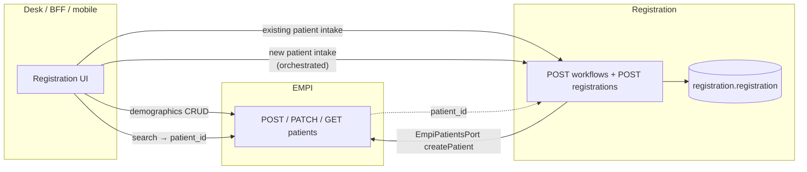

# HLD 07 — Registration (encounter intake)

**Status:** First draft (Phase 0)  
**Last updated:** 2026-05-14  
**Related:** [02 — Core Modules (EMPI)](./02-core-modules.md) | [03 — Module shape template](./03-module-shape-template.md) | [Registration LLD](../lld/registration/01-module-overview.md) | OpenAPI: `specs/openapi/registration.v1.yaml`, `specs/openapi/empi.v1.yaml`

---

## Overview

**Registration** (deployment: `registration-svc`, library `modules/registration`) is the **encounter-intake / front-desk registration** slice of the platform: it records **who arrived for care** in the context of a tenant, by persisting a **registration row** per intake episode (OPD, IPD, emergency, shared counter). It is **not** the master of patient demographics or UHID — that is **EMPI**. Registration **references** EMPI by `patient_id` under contract, without cross-schema foreign keys ([database principles](../analysis/03-database-principles.md)).

This document summarises **requirements coverage**, **ownership boundaries**, and **how Registration links to EMPI** for new patient, existing patient, and demographic-management scenarios.

---

## 1. Purpose

Registration answers: *for this tenant, who checked in, with what visit context, and what is the intake status?* It gives downstream modules (queue, OPD worksheet, billing projections, reporting) a **stable `registration_id`** and optional hooks to `visit_id`, `appointment_id`, `department_id`, `provider_id`, and `facility_id` as those domains come online.

---

## 2. Requirements mapping

| Requirement | Where it is implemented | How it links to EMPI |
|---------------|-------------------------|----------------------|
| **New patient registration** (demographics + first visit intake in one desk action) | `POST /api/registration/v1/workflows/new-patient/registrations` | Registration calls EMPI **synchronously** through an injected **`EmpiPatientsPort`** (HTTP client to `POST /api/empi/v1/patients` or equivalent). EMPI returns `patient_id`; Registration then inserts `registration.registration` with that id. If the port is not configured, the API returns **503** (`empi_gateway_not_configured`) so deployments either wire the adapter or use the two-step flow below. |
| **Existing patient registration** (known patient, new visit / intake) | `POST /api/registration/v1/workflows/existing-patient/registrations` or `POST /api/registration/v1/registrations` | Caller obtains **`patient_id`** from EMPI (search, scan, ABHA resolution, etc.) first. Registration **only** persists the intake row; **no EMPI write** on this path. |
| **Patient demographic management** (create/update name, DOB, phone, addresses, identifiers) | **EMPI only** — `POST /api/empi/v1/patients`, `PATCH /api/empi/v1/patients/{id}` | Registration **does not** store demographic columns. The new-patient workflow **delegates** create demographics to EMPI once; ongoing edits stay on EMPI. |

---

## 3. Owns / does not own

### 3.1 Owns

- Schema **`registration`** and table **`registration.registration`** (composite PK `(iq_tenant_id, registration_id)`, Citus distribution on `iq_tenant_id`).
- **Encounter-intake state** for the tenant: `registration_status`, optional links to visit, appointment, department, provider, facility, `visit_type` (code or label per master-data alignment later).
- **HTTP API** under `/api/registration/v1` per `registration.v1.yaml`.

### 3.2 Does not own

- **Patient identity and demographics** — EMPI (`empi` schema, `empi-svc`).
- **Master reference data** (department names, facility master, visit-type catalogue) — Master & Tenant Data / Configurator; Registration stores **ids** only.
- **Clinical encounter clinical content** — future visit/encounter module; Registration may hold `visit_id` as a logical pointer when that module exists.

---

## 4. EMPI linking model

**Rules:**

1. **`patient_id` on every registration row** is the same identifier as EMPI’s patient primary key for that tenant (UUID, tenant-scoped in EMPI).
2. **No PostgreSQL foreign key** from `registration.registration.patient_id` to `empi.patients` — modules keep separate schemas; integrity is enforced by **orchestration**, **BFF sequencing**, and (later) **events** if projections need repair.
3. **New-patient orchestration** is the only Registration code path that **calls** EMPI; it is optional at deploy time via **`EmpiPatientsPort`**. Two-step flows (EMPI create, then Registration create) work without that port.

---

## 5. Exposes (summary)

| Surface | Role |
|---------|------|
| `POST /registrations` | Minimal create when `patient_id` already known. |
| `GET /registrations/{registrationId}` | Read intake row. |
| `POST /workflows/existing-patient/registrations` | Same as above; intent-specific URL for desk flows. |
| `POST /workflows/new-patient/registrations` | EMPI patient create (via port) + registration insert. |

Full schemas and tags: `specs/openapi/registration.v1.yaml`.

---

## 6. Depends on

| Dependency | Required? | Notes |
|------------|-----------|--------|
| **PostgreSQL** | Yes | Registration schema migrated before service start. |
| **Tenant context** (`iq_tenant_id`) | Yes | Same pattern as other modules; every row carries tenant id. |
| **EMPI HTTP API** | **Optional** for raw `POST /registrations`; **required** for orchestrated `POST /workflows/new-patient/registrations` to succeed (otherwise 503). |
| **Cerbos / auth** | When wired | Same PEP pattern as other modules (policies to be defined with front-desk roles). |

Registration does **not** import EMPI module code — only a **port** (`EmpiPatientsPort`) implemented in the service host (e.g. generated OpenAPI client to `empi-svc`).

---

## 7. Failure and consistency notes

- If **EMPI is down** during new-patient orchestration, Registration should surface the failure from the client call (caller retries or falls back to two-step: create patient in EMPI when available, then create registration).
- **Duplicate or wrong `patient_id`** is an operational/data issue: Registration does not re-validate patient existence against EMPI on every insert in Phase 0; a later enhancement could add a read-through check or consume EMPI events for projections.
- **`visit_id` null at create** is expected; visit module or events fill the link when the encounter exists.

---

## 8. Further reading

- [Registration LLD — ERD, behaviour, APIs](../lld/registration/01-module-overview.md)  
- [EMPI section in HLD 02](./02-core-modules.md) (patient identity authority)
