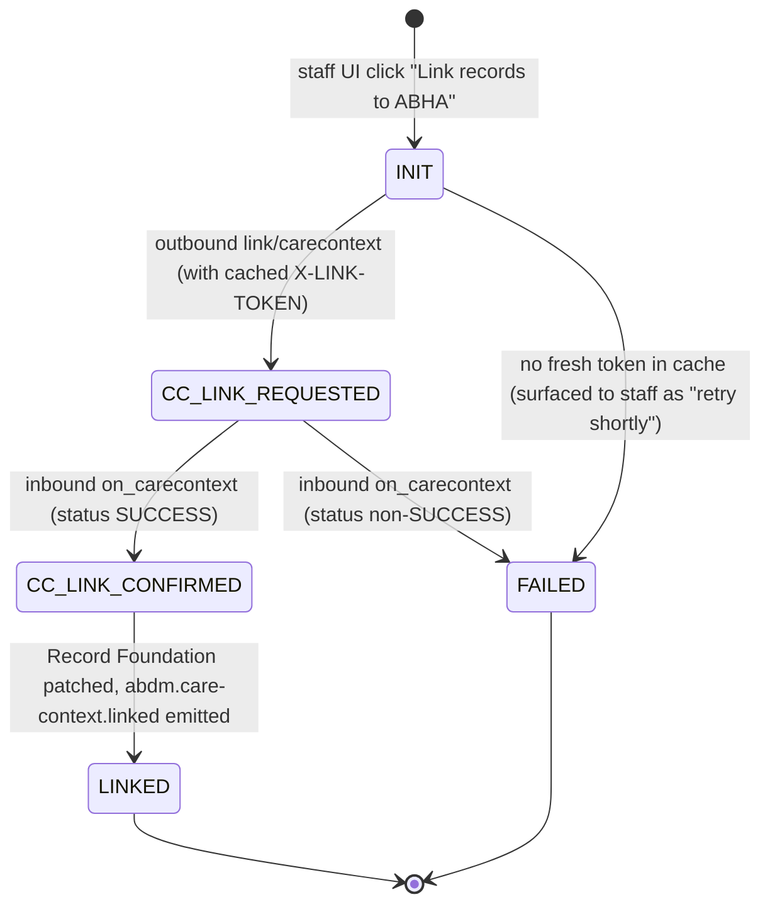
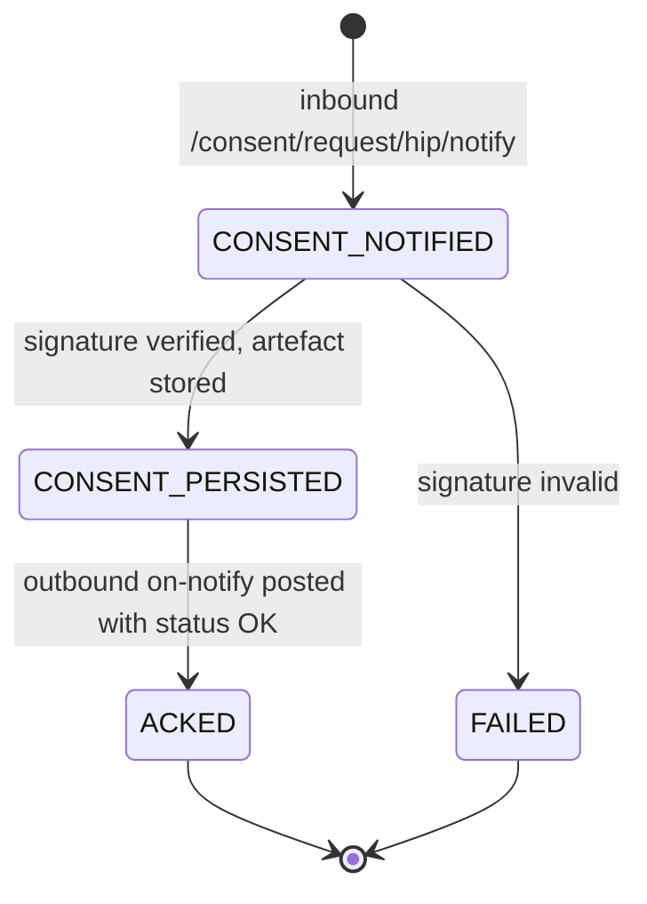
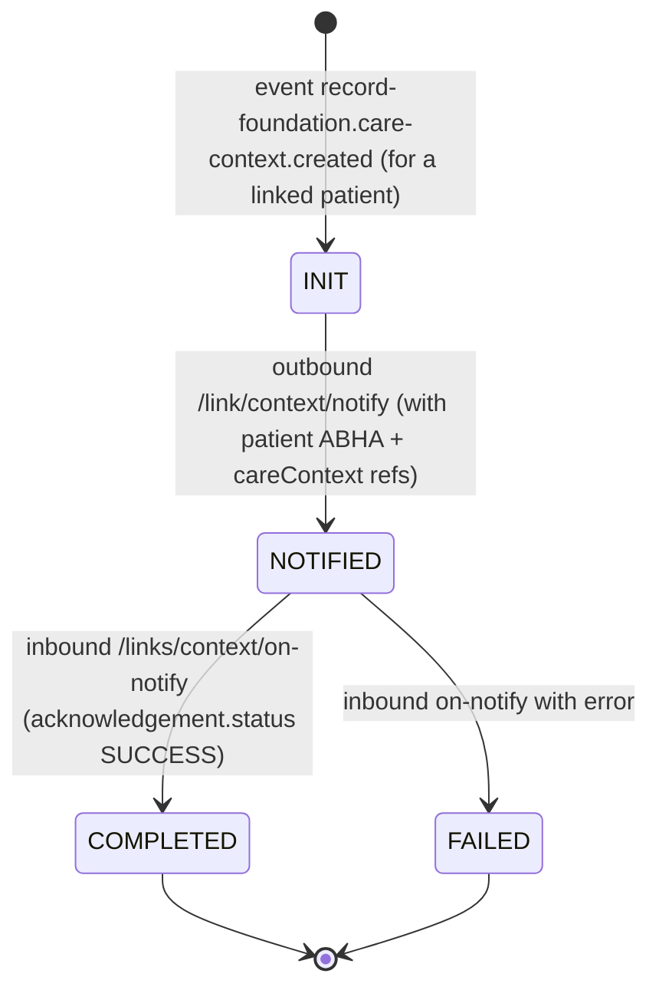
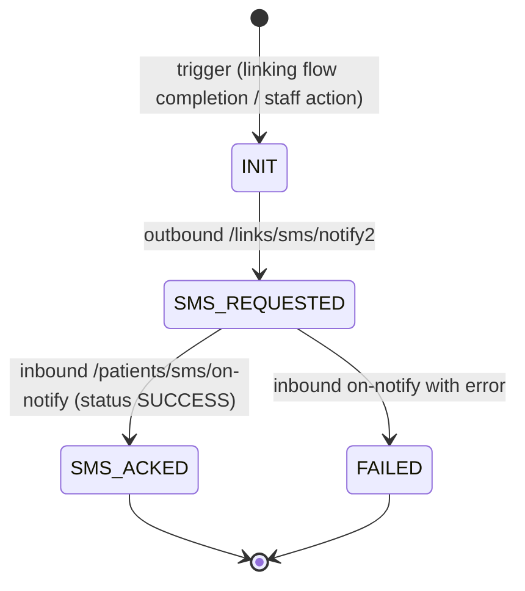

```mermaid
stateDiagram-v2
  [*] --> DISCOVERY_RECEIVED: inbound on /care-context/discover
  DISCOVERY_RECEIVED --> PATIENT_MATCHED: EMPI match by ABHA address / demographics
  DISCOVERY_RECEIVED --> NO_MATCH: no EMPI match
  PATIENT_MATCHED --> CONTEXTS_LISTED: Record Foundation lists unlinked care contexts
  CONTEXTS_LISTED --> ON_DISCOVER_RESPONDED: outbound on-discover posted
  ON_DISCOVER_RESPONDED --> LINK_INIT_RECEIVED: inbound on /link/care-context/init
  LINK_INIT_RECEIVED --> OTP_DISPATCHED: outbound on-init posted; HIP sends OTP via SMS
  OTP_DISPATCHED --> LINK_CONFIRMED: inbound on /link/care-context/confirm with valid OTP
  LINK_CONFIRMED --> CONTEXTS_PUBLISHED: outbound on-confirm posted; care contexts marked linked
  CONTEXTS_PUBLISHED --> LINKED: Record Foundation patched, abdm.care-context.linked emitted
  NO_MATCH --> [*]
  LINKED --> [*]
  ON_DISCOVER_RESPONDED --> FAILED: gateway timeout (24h no link/init)
  OTP_DISPATCHED --> FAILED: invalid OTP / OTP expired
```

# ABDM Adapter — LLD §05 M2 Flows

The second sprint covers **M2** — care-context linking and consent reception. M2 is the milestone where the platform stops being purely outbound and becomes a **webhook target** for the ABDM gateway.

This doc is the flow catalogue. The companion [`06-m2-dev-guide.md`](./06-m2-dev-guide.md) is the developer checklist (read it after this one).

---

## What's new in M2 vs. M1

M1 was 100% outbound from the platform's side. M2 introduces three new structural concepts:

1. **Inbound gateway webhooks.** The ABDM gateway POSTs to *us* (the HIP). We must accept the call, respond `202 Accepted` quickly, and then run work asynchronously.
2. **Outbound `on-*` callbacks paired with inbound requests.** A typical M2 flow alternates direction: inbound `discover` from gateway → outbound `on-discover` from HIP → inbound `link/init` from gateway → outbound `on-init` from HIP. Each step is correlated by `REQUEST-ID`/`transactionId`.
3. **Idle waiting states.** A flow may sit in a state for minutes (waiting for the patient to type an OTP in their PHR app) with no platform-side activity. The session row is the durable record; there is no in-memory continuation.

This is the dividing line between M1 and M2.

**Source spec (extracted to repo):** [`docs/external/abdm/v3-m2-health-records-hip-link-discovery-consent-transfer.md`](../../../external/abdm/v3-m2-health-records-hip-link-discovery-consent-transfer.md) — 12k lines. **Read it.** Every endpoint, header, and field below is grounded in a specific section (§X.Y.Z) of this doc; cite the section in your PR when the body shape isn't obvious.

**State diagrams in [`02-fsm-specifications.md §5`](../integration-platform/02-fsm-specifications.md#5-abdmm2user-initiated-linkv1----patient-links-from-phr-app)** are authoritative for `abdm.m2.user-initiated-link.v1`. Hip-initiated linking, consent-notify, add-contexts, and SMS-notify are documented in §1–§5 of *this* file; the FSM spec doc will be updated to include them as a follow-up.

**Reference impl:** `hims/abdi-lims-backed/src/services/milestone2*Service.ts` in the production HIMS. The exact files (verify locally — names may have drifted): `milestone2HipInitiatedService.ts`, `milestone2UserInitiatedService.ts`, `milestone2ConsentService.ts`. Useful for *which exact on-\* response shape works in the sandbox* and *which gateway error codes you'll see in practice*. **Do not copy code structure** — the production HIMS uses Mongo + ad-hoc handlers; M2 here keeps the M1 typed-port layering.

---

## M2 flow taxonomy

| Flow ID | Triggered by | Span | Terminal | Has OTP? |
|---|---|---|---|---|
| `abdm.m2.user-initiated-link.v1` | Patient picks our facility in their PHR app | minutes | `LINKED` / `NO_MATCH` / `FAILED` | Yes — OTP from HIP to patient mobile |
| `abdm.m2.hip-initiated-link.v1` | Hospital staff links records for a known patient | seconds-to-minutes | `LINKED` / `FAILED` | **No** — link token authorizes |
| `abdm.m2.consent-notify.v1` | Gateway notifies HIP of a granted consent | seconds | `ACKED` / `FAILED` | No |
| `abdm.m2.add-contexts.v1` | Internal event: new visit recorded for a linked patient | seconds | `COMPLETED` / `FAILED` | No |
| `abdm.m2.sms-notify.v1` | Internal event: notify patient by SMS about linking | seconds | `ACKED` / `FAILED` | No |

The first two are the linking flows. The third is the consent-receipt half of the larger M3 picture (full M3 record-serving is a later sprint). The fourth keeps already-linked patients' care contexts fresh. The fifth lets the HIP push SMS to patients via the gateway (used to nudge them to authorize a link).

---

## 1. `abdm.m2.user-initiated-link.v1`

### Patient experience

The patient opens their **PHR app** (e.g., NDHM, Eka.Care, Paytm Health) and types in or searches for "our facility" by name. The PHR app, acting as an **HIU**, asks the ABDM gateway: "Does this HIP have records for me?" The gateway forwards the question to us. We look up the patient in EMPI by their ABHA address (and demographic fallbacks) and Record Foundation for matching unlinked care contexts. We respond with a list of contexts that *could* be linked. The patient selects which ones; the gateway asks us to authenticate the patient (we send an OTP to the registered mobile); the patient enters the OTP in the PHR app; we confirm and link.

### Sequence

```
PHR App (HIU) → Gateway → HIP (us)        and reverse for on-* callbacks

  HIU  ──discover──▶  CM (gateway)  ──forward──▶  HIP
   ◀──── on-discover (HIP responds with careContexts)
  HIU  ──link/init──▶  CM           ──forward──▶  HIP
   ◀──── on-init (HIP responds with linkRefNumber + OTP delivery hint; OTP sent SMS-side)
  HIU  ──link/confirm──▶ CM         ──forward──▶  HIP (with OTP token)
   ◀──── on-confirm (HIP validates OTP, replies with linked careContexts)
```

### State diagram



### Endpoint table

| # | Direction | Endpoint URL | Section | State transition |
|---|---|---|---|---|
| 1 | IN (gateway → HIP) | `POST {callback}/api/v3/hip/patient/care-context/discover` | §5.3.2 | `→ DISCOVERY_RECEIVED` |
| 1b | platform | EMPI `GET /api/v1/patients/find?abha_address=…` | — | `→ PATIENT_MATCHED` / `NO_MATCH` |
| 1c | platform | Record Foundation `GET /api/v1/timeline-index?patient_id=…&linked=false` | — | `→ CONTEXTS_LISTED` |
| 1d | OUT (HIP → gateway) | `POST /api/hiecm/user-initiated-linking/v3/patient/care-context/on-discover` | §5.3.3 | `→ ON_DISCOVER_RESPONDED` |
| 2 | IN (gateway → HIP) | `POST {callback}/api/v3/hip/link/care-context/init` | §5.3.6 | `→ LINK_INIT_RECEIVED` |
| 2b | OUT (HIP → gateway) | `POST /api/hiecm/user-initiated-linking/v3/link/care-context/on-init` | §5.3.7 | `→ OTP_DISPATCHED` |
| 3 | IN (gateway → HIP) | `POST {callback}/api/v3/hip/link/care-context/confirm` | §5.3.10 | `→ LINK_CONFIRMED` |
| 3b | OUT (HIP → gateway) | (HIP responds inline in §5.3.10's HTTP response) | §5.3.10/§5.3.11 | `→ CONTEXTS_PUBLISHED` |
| 4 | platform | Record Foundation `PATCH /care-context/:id { abha_linkage_status: 'linked' }` | — | `→ LINKED` |

**Important:** The inbound paths (gateway → us) start with `/api/v3/hip/…` — these are the routes you mount on **your** Fastify app at the `callbackURL` you registered with ABDM. The outbound paths (us → gateway) start with `/api/hiecm/…` and are POSTed to `ABDM_GATEWAY_BASE_URL` (sandbox: `https://dev.abdm.gov.in`).

States used: [`M2_USER_LINK_STATES`](../../../../packages/ts-sdk-abha/src/constants/fsm-states.ts) — already declared, no additions needed.

### Correlation

- **External correlation:** `REQUEST-ID` header on each inbound; `transactionId` field in the request body (issued by gateway at discover, echoed through init and confirm). Both identify the same session.
- **Internal correlation:** `sessionId` (platform-issued UUID at `DISCOVERY_RECEIVED`). Every outbound `on-*` must echo `requestId` and `transactionId`.
- **Idempotency:** `INSERT INTO abdm_inbound_messages (iq_tenant_id, request_id) ON CONFLICT DO NOTHING`. If 0 rows inserted, return `202` immediately — the gateway is retrying.

### Failure modes

- **No matching patient.** Reply `on-discover` with `patient: []` and `error: { code: "ABDM-1010", message: "Patient not found" }`. Transition `→ NO_MATCH`. Terminal — do not error.
- **EMPI / Record Foundation unavailable.** Persist `DISCOVERY_RECEIVED`, schedule a retry timer, do not post `on-discover` until both resolve. If retries exhaust, transition `→ FAILED`.
- **Patient abandons after `on-discover`.** Gateway never sends `link/init`. Sweep via janitor after 24h, transition `→ FAILED`.
- **Wrong OTP at `link/confirm`.** Reply with HTTP error inline (per §5.3.10/§5.3.11), state stays at `OTP_DISPATCHED`. Patient can retry from PHR app (gateway will resend `confirm`).

---

## 2. `abdm.m2.hip-initiated-link.v1`

### Staff experience

Hospital staff at the registration desk (or after a visit) **already knows the patient's ABHA address** — typically from the patient's printed ABHA card, or because the staff did an M1 verify-existing earlier. Staff clicks "Link records to ABHA" in the platform UI. The platform sends the list of care contexts to link to the gateway; the gateway validates and acknowledges. **There is no OTP step** in this flow.

### Decoupling note — link token is NOT a state in the flow

Spec §4.3.1/§4.3.2 documents a short-lived JWT **link token** that authorises `link/carecontext`. **Production HIMS keeps token generation inline as a state of every linking flow; we explicitly do not.** The token is a **per-patient ephemeral credential** with no relationship to tenants or workflows — it belongs to a small cache that the linking use-case consults transparently. The linking flow's state machine has no `TOKEN_*` state.

Rationale:

- **The token is a credential, not a workflow.** Per spec §4.3.2 the JWT's `sub` claim is the patient's ABHA address; the token is scoped to (HIP, patient). It does not represent a user-facing or business outcome. Credentials belong in caches, not state machines.
- **Nothing about it is tenant-shaped.** Tenant is a deployment dimension; the token's natural identity is the patient. Coupling the token to tenant adds noise to the data model.
- **Linking should feel synchronous to staff.** A `TOKEN_REQUESTED → TOKEN_RECEIVED` waiting state would expose plumbing as a user-visible flow milestone.
- **Token-gen still happens.** It's just hidden behind a `linkTokenCache.getOrAcquire(abha, demographics)` helper that returns a string. Cache hit → instant. Cache miss → triggers generate-token, awaits the callback, returns. Helper has its own short timeout.

The token's lifecycle is documented separately in §2.1 below — but importantly, §2.1 documents a *helper*, not a flow.

### Sequence

```
HIP (us) → Gateway,  Gateway → HIP (us) for callbacks

  HIP  ──link/carecontext──▶  Gateway   (HIP sends careContexts + X-LINK-TOKEN header pulled from cache)
   ◀──── on_carecontext     (Gateway returns success/error)
```

### State diagram



### Endpoint table

| # | Direction | Endpoint URL | Section | State transition |
|---|---|---|---|---|
| 0 | platform | `POST /api/abdm/v1/m2/hip/initiated-link/start` (staff UI) | — | `→ INIT` |
| 1 | OUT (HIP → gateway) | `POST /api/hiecm/hip/v3/link/carecontext` (with `X-LINK-TOKEN` header pulled from token cache) | §4.3.3 | `→ CC_LINK_REQUESTED` |
| 1b | IN (gateway → HIP) | `POST {callback}/api/v3/link/on_carecontext` | §4.3.4 | `→ CC_LINK_CONFIRMED` / `→ FAILED` |
| 2 | platform | Record Foundation `PATCH /care-context/:id { abha_linkage_status: 'linked' }` | — | `→ LINKED` |

### Request body shape (cheat sheet)

**§4.3.3 link/carecontext** — HIP outbound body (with `X-LINK-TOKEN: <cached linkToken>` header):
```jsonc
{
  "abhaAddress": "ayush@abdm",
  "abhaNumber": "91-1234-5678-9012",
  "patient": [{
    "referenceNumber": "MRN-2024-001",
    "display": "Patient: Ayush Wardhan",
    "careContexts": [
      { "referenceNumber": "VISIT-2024-1101", "display": "OP consultation 2024-11-01" }
    ],
    "hiType": "OPCONSULTATION",
    "count": 1                              // must equal careContexts.length
  }]
}
```

**§4.3.4 on_carecontext** — gateway → HIP body:
```jsonc
{
  "abhaAddress": "ayush@abdm",
  "status": "Successfully Linked care context",   // or one of several error strings
  "error": { "code": "ABDM-1056", "message": "..." },   // present on non-success
  "response": { "requestId": "<echo of REQUEST-ID from §4.3.3>" }
}
```

States used: **new**, add to [`packages/ts-sdk-abha/src/constants/fsm-states.ts`](../../../../packages/ts-sdk-abha/src/constants/fsm-states.ts):

```ts
export const M2_HIP_INITIATED_LINK_STATES = [
  'INIT',
  'CC_LINK_REQUESTED',
  'CC_LINK_CONFIRMED',
  'LINKED',
  'FAILED',
] as const;
```

### Differences from user-initiated-link

- **No discovery step.** ABHA already known; no EMPI demographic match required.
- **No OTP step.** The link token (managed out-of-band) is the authorization — gateway accepts the link request as long as the `X-LINK-TOKEN` header carries a valid, unexpired token issued to this HIP.
- **Single outbound + single inbound, in sequence.** Compared to user-initiated's three-pair pattern.
- **Linking flow itself does not generate the token.** It pulls a fresh one from the link-token cache.

### Failure modes

- **Token acquisition timeout.** `linkTokenCache.getOrAcquire` exhausts its budget (default 8s) waiting for the `on-generate-token` callback. Transition `→ FAILED`. Surface to staff: "ABDM gateway slow — please retry." Most retries succeed because the token has by now arrived in the cache.
- **`on_carecontext` returns "Counter and Care context count mismatch"** — `count` field doesn't equal `careContexts.length`. Build-time bug; assert in DTO.
- **`on_carecontext` returns "These care contexts have been already linked"** — soft success. Treat as `LINKED` (idempotent re-link). Log warning.
- **`on_carecontext` returns "ABHA address and Link token mismatch"** (ABDM-1056) — cached token is stale. The cache invalidates the row for that patient; transition `→ FAILED`. Staff retry triggers a fresh token-gen.

---

## 2.1 Link Token Cache (per-patient, ephemeral) — a helper, not a flow

The link token is a **per-patient credential** with a <15-minute lifetime. It is cached in a small ephemeral table keyed by the patient's ABHA address. **The cache has no relationship to tenants** (the JWT's `sub` claim is the patient's ABHA; that's the credential's natural identity). It is **not** a flow — it is plumbing the linking use-case consults transparently.

### Why this is not a flow

The token doesn't represent any user-facing or business outcome. A flow framing would force a state machine onto a credential, which doesn't pay rent.

### Why this is not tenant-scoped

The token's identity is `(hipId, patientAbha)`. Within a single HIP deployment, `hipId` is a constant — so effectively the cache key is just the patient's ABHA. Adding `iq_tenant_id` would couple a credential to a deployment-axis concept it has nothing to do with. Treat it like a per-user JWT cache, not like tenant data.

### Components

```
┌─────────────────────────────────────────────────────────────────────────┐
│  Link Token Cache (per-patient)                                          │
│                                                                          │
│  ┌──────────────────────┐    ┌───────────────────────────────────────┐  │
│  │ abdm_link_tokens     │    │ linkTokenCache.getOrAcquire(abha, …)  │  │
│  │  abha_address (PK)   │◀──▶│ - SELECT … FOR UPDATE                  │  │
│  │  link_token (enc)    │    │ - if hit and expires > now+60s:        │  │
│  │  expires_at          │    │     return cached.linkToken            │  │
│  │  obtained_at         │    │ - else: trigger generate-token,        │  │
│  │  pending_request_id  │    │   poll cache for ≤8s until row appears │  │
│  └──────────────────────┘    │   (or timeout → throw)                 │  │
│         ▲                    └───────────────────────────────────────┘  │
│         │                                                                │
│  on-generate-token ──────────┘ (writes the row when callback arrives)   │
└─────────────────────────────────────────────────────────────────────────┘
```

### Endpoints involved (managed by the cache helper, not by any flow)

| Direction | Endpoint | Section | Driven by |
|---|---|---|---|
| OUT (HIP → gateway) | `POST /api/hiecm/v3/token/generate-token` | §4.3.1 | `linkTokenCache.getOrAcquire` (on cache miss) |
| IN (gateway → HIP) | `POST {callback}/api/v3/hip/token/on-generate-token` | §4.3.2 | Cache writer — UPSERTs the row, no flow state |

### `abdm_link_tokens` table

```sql
CREATE TABLE abdm_adapter.abdm_link_tokens (
  abha_address        text PRIMARY KEY,         -- patient's ABHA address; the credential's natural key
  link_token          text NOT NULL,            -- encrypted at rest via lib/payload-encryptor
  expires_at          timestamptz NOT NULL,
  obtained_at         timestamptz NOT NULL DEFAULT now(),
  pending_request_id  text                      -- present while a generate-token is in flight; cleared on receipt
);
-- Citus: small high-churn ephemeral cache; use a reference table (replicated to all workers, no tenant col).
SELECT create_reference_table('abdm_adapter.abdm_link_tokens');
```

No `iq_tenant_id`. No `status` column — the row's presence + `expires_at` is sufficient state. Stale rows get evicted by a small janitor (one-line `DELETE … WHERE expires_at < now()` on a 5-min schedule).

### The cache API

```ts
// modules/abdm-adapter/src/lib/link-token-cache.ts

export class LinkTokenNotAvailable extends Error {}

export interface LinkTokenCache {
  /**
   * Return a fresh link token for the given patient. Cache hit → returns immediately.
   * Cache miss → triggers a generate-token to the gateway and awaits the on-generate-token
   * callback. Bounded by `timeoutMs` (default 8000); throws LinkTokenNotAvailable on timeout.
   */
  getOrAcquire(input: {
    abhaAddress: string;
    abhaNumber?: string;
    name: string;
    gender: 'M' | 'F' | 'O' | 'D';
    yearOfBirth: number;
    timeoutMs?: number;
  }): Promise<string>;

  /**
   * Invalidate the cached row for a patient. Called by the linking flow on
   * `on_carecontext` returning ABDM-1056 "token mismatch".
   */
  invalidate(input: { abhaAddress: string }): Promise<void>;
}
```

Implementation outline (single instance — see "Multi-instance note" below):

1. `getOrAcquire`: `SELECT … WHERE abha_address = $1 FOR UPDATE`. If row exists and `expires_at > now() + 60s`, return decrypted token (release lock).
2. If miss: INSERT a stub row with `pending_request_id = <new uuid>`, `expires_at = now()` (placeholder), commit. POST `/api/hiecm/v3/token/generate-token` carrying that request-id.
3. Poll the cache: `SELECT … WHERE abha_address = $1 AND link_token IS NOT NULL` every 200ms × 40 = up to 8s.
4. Row appears with a real token → return it. Timeout → DELETE the stub row, throw `LinkTokenNotAvailable`.

The inbound `on-generate-token` handler (in `rest-handlers/m2/link-token-routes.ts` — wired as a normal Fastify route) does the UPSERT keyed by `abha_address` extracted from the callback body. No flow state involved.

### Multi-instance note

If the HTTP service runs more than one replica, the in-flight `generate-token` request and its `on-generate-token` callback might land on different instances. The Postgres-polling pattern above handles this — instance A POSTs the request, instance B receives the callback and UPSERTs, instance A's poll picks up the new row. No cross-instance pub/sub needed. Single Postgres = single source of truth.

### Cold start

When the service first starts with an empty cache, the first link attempt for each patient incurs the ~3-5s generate-token round trip. Subsequent attempts within ~15 minutes are instant. **No background pre-warming is needed** — the TTL is too short for pre-warming to amortise across distinct patients.

---

## 3. `abdm.m2.consent-notify.v1`

### What it is

The patient grants consent in their PHR app for a HIU (another hospital, or a research org) to view records held at our facility. The consent manager forwards a **consent artefact** to us (the HIP). We persist the artefact and acknowledge. **Actual record serving under this consent is M3** — this M2 flow is just receipt + ack.

### State diagram



### Endpoint table

| # | Direction | Endpoint URL | Section | State transition |
|---|---|---|---|---|
| 1 | IN (gateway → HIP) | `POST {callback}/api/v3/consent/request/hip/notify` | §6.3.1 | `→ CONSENT_NOTIFIED` |
| 1b | platform | Persist into `abdm_adapter.abdm_consent_artefacts` | — | `→ CONSENT_PERSISTED` |
| 1c | OUT (HIP → gateway) | `POST /api/hiecm/consent/v3/request/hip/on-notify` | §6.3.2 | `→ ACKED` |

### What gets persisted

The consent artefact body (per §6.3.1) carries:
- `consentId` — unique UUID; primary key
- `status` — `GRANTED` or `REVOKED`
- `patient` — ABHA address
- `hip` — HIP id (us); `hiu` — HIU id (the requesting org)
- `purpose.code`, `purpose.text`, `purpose.refUri`
- `hiTypes[]` — record kinds permitted
- `permission.accessMode` — `VIEW`
- `permission.dateRange` — `from` / `to` for which records the consent covers
- `permission.dataEraseAt` — when the consent itself dies (months out, typically)
- `permission.frequency` — how often the HIU can refetch (`{ value, repeats, unit }`)
- `signature` — base64 of signed artefact (verify against gateway's public key per §3.2.3)
- `grantAcknowledgement` — boolean

**All of these survive verbatim** in `artefact_json jsonb`. The indexed columns are `consent_id`, `patient_id`, `hip_id`, `status`, `data_erase_at` — enough for the M3 supervisor to look up "give me all live consents for patient X."

States used: **new**:

```ts
export const M2_CONSENT_NOTIFY_STATES = [
  'CONSENT_NOTIFIED',
  'CONSENT_PERSISTED',
  'ACKED',
  'FAILED',
] as const;
```

### Event emitted

On `CONSENT_PERSISTED`, emit `abdm.consent.granted` with the artefact id + patient id + dataEraseAt. The long-lived consent supervisor (`abdm.consent.lifecycle.v1` per [FSM spec §8](../integration-platform/02-fsm-specifications.md#8-abdmconsentlifecyclev1----the-long-lived-supervisor)) will eventually consume this — out of scope for M2.

### Failure modes

- **Signature verification fails** — reply on-notify with `error: { code: "ABDM-1411", message: "invalid-signature" }`, state `→ FAILED`. Surface as a security alert.
- **Duplicate `consentId`** — `ON CONFLICT (iq_tenant_id, consent_id) DO NOTHING`. Still ack with success. Gateway retries are expected.

---

## 4. `abdm.m2.add-contexts.v1`

### What it is

A previously-linked patient gets a new visit / encounter / care context at our facility. We proactively notify the gateway so the patient sees the new record available in their PHR app (no manual re-discovery needed).

### State diagram



### Endpoint table

| # | Direction | Endpoint URL | Section | State transition |
|---|---|---|---|---|
| 0 | platform | (event `record-foundation.care-context.created`) | — | `→ INIT` |
| 1 | OUT (HIP → gateway) | `POST /api/hiecm/hip/v3/link/context/notify` | §4.3.6 | `→ NOTIFIED` |
| 1b | IN (gateway → HIP) | `POST {callback}/api/v3/links/context/on-notify` | §4.3.7 | `→ COMPLETED` / `→ FAILED` |

### Trigger

This flow is **not** started by an HTTP request. It is started by an in-process event from Record Foundation when a new care context is registered for an already-linked patient. The event payload carries `patient_id`, `iq_tenant_id`, `care_context_id[]`, `display_text[]`, `hi_type`. The consumer lives in `modules/abdm-adapter/src/events/consumers/care-context-created.ts`.

### Request body shape (cheat sheet)

**§4.3.6 link/context/notify** — HIP outbound body:
```jsonc
{
  "notification": {
    "patient": { "id": "ayush@abdm" },
    "careContext": {
      "patientReference": "MRN-2024-001",
      "careContextReference": "VISIT-2024-1115"
    },
    "hiTypes": ["OPCONSULTATION"],
    "date": "2024-11-15T14:30:00Z",
    "hip": { "id": "<our-hip-id>" }
  }
}
```

States used: **new**:

```ts
export const M2_ADD_CONTEXTS_STATES = [
  'INIT',
  'NOTIFIED',
  'COMPLETED',
  'FAILED',
] as const;
```

### Failure modes

- **Patient was never linked.** Skip — do not start a flow. Log a debug.
- **`on-notify` returns error.** Transition `→ FAILED`. Retry policy: 3 attempts at 60s / 5min / 30min via timer rows. After third failure, alert.

---

## 5. `abdm.m2.sms-notify.v1`

### What it is

HIP-initiated SMS to a patient — used in conjunction with hip-initiated-link to nudge the patient ("we've linked your records, view them at <PHR app>"). The gateway sends the SMS on the HIP's behalf using the patient's registered mobile.

### State diagram



### Endpoint table

| # | Direction | Endpoint URL | Section | State transition |
|---|---|---|---|---|
| 0 | platform | (trigger — typically post-`LINKED` of hip-initiated-link) | — | `→ INIT` |
| 1 | OUT (HIP → gateway) | `POST /api/hiecm/hip/v3/link/patient/links/sms/notify2` | §4.3.8 | `→ SMS_REQUESTED` |
| 1b | IN (gateway → HIP) | `POST {callback}/api/v3/patients/sms/on-notify` | §4.3.9 | `→ SMS_ACKED` / `→ FAILED` |

### Request body shape (cheat sheet)

**§4.3.8 sms/notify2** — HIP outbound body:
```jsonc
{
  "requestId": "<UUID we generate>",
  "timestamp": "2026-05-19T12:00:00Z",
  "notification": {
    "phoneNo": "+919812345678",
    "hip": { "id": "<our-hip-id>", "name": "ACME Hospital" }
  }
}
```

States used: **new**:

```ts
export const M2_SMS_NOTIFY_STATES = [
  'INIT',
  'SMS_REQUESTED',
  'SMS_ACKED',
  'FAILED',
] as const;
```

### Note

This flow is **optional for M2 sprint** — implement only if the product spec calls for it. If skipped, the patient sees the link in their PHR app whenever they next refresh; no SMS push. Confirm with product before deciding.

---

## Acceptance for M2 sprint completion

- All four mandatory flows (user-initiated-link, hip-initiated-link, consent-notify, add-contexts) have populated DTO types in `@hims/ts-sdk-abha/protocol/m2/`. SMS-notify is optional per product.
- Inbound REST handlers in `modules/abdm-adapter/src/rest-handlers/m2/` with **signature verification** + **`REQUEST-ID` idempotency** + body validation (Zod or AJV — match M1's convention).
- Outbound HTTP clients added: gateway `generate-token`, `link/carecontext`, `on-discover`, `on-init`, `on-confirm` (response inline), `link/context/notify`, `consent/request/hip/on-notify`, optionally `links/sms/notify2`.
- Per-flow typed session: each M2 use-case sees `AbdmSession<'abdm.m2.…v1'>` with its own context type. See [`06-m2-dev-guide.md §3`](./06-m2-dev-guide.md#3-per-flow-typed-context--the-portable-shape).
- New tables migrated: `abdm_inbound_messages`, `abdm_consent_artefacts`. (Decide spelling — `abdm_*` or generic `integration_*` — with the lead before naming.)
- Integration tests: one happy-path against ABDM sandbox per mandatory flow; gated behind `RUN_ABDM_SANDBOX_TESTS=1`.
- Telemetry counters per state transition: `// TODO(metrics)` markers — same as M1.
- New events emitted: `abdm.consent.granted`, `abdm.care-context.linked`, `abdm.care-context.published`.

## What's NOT in scope

- **M3 record serving.** Consent is persisted + acked here; data fetch under that consent is M3.
- **Consent lifecycle supervisor** (`abdm.consent.lifecycle.v1`). Document the event boundary; do not implement.
- **Fidelius envelope encryption.** Required for M3 record bundles; not needed for any M2 flow.
- **Staff UI for hip-initiated-link.** Backend handlers only; UI is a frontend sprint.
- **Add-contexts retry-with-DLQ.** Three attempts is the cap; DLQ is post-Phase 1.
- **"Get all patient links"** (spec §4.3.5). Read-only listing API — only needed if product wants a "linked patients" UI. Defer.

## Related

- [02-m1-flows.md](./02-m1-flows.md) — M1 catalogue (compare for shape consistency)
- [06-m2-dev-guide.md](./06-m2-dev-guide.md) — step-by-step impl checklist
- [04-orchestration-phase-1-http-first.md §11](../integration-platform/04-orchestration-phase-1-http-first.md#11-portability-rules--the-structure-that-makes-future-de-migration-mechanical) — the nine structural rules every M2 file must obey
- [02-fsm-specifications.md §5](../integration-platform/02-fsm-specifications.md#5-abdmm2user-initiated-linkv1----patient-links-from-phr-app) — canonical state machine spec for user-initiated-link (the other M2 flows will be added to this doc as a follow-up)
- [docs/external/abdm/v3-m2-…](../../../external/abdm/v3-m2-health-records-hip-link-discovery-consent-transfer.md) — **the source spec.** All endpoint paths, request bodies, and error codes here are grounded in this doc; cite the §X.Y.Z section in PR if a body shape needs interpretation.
