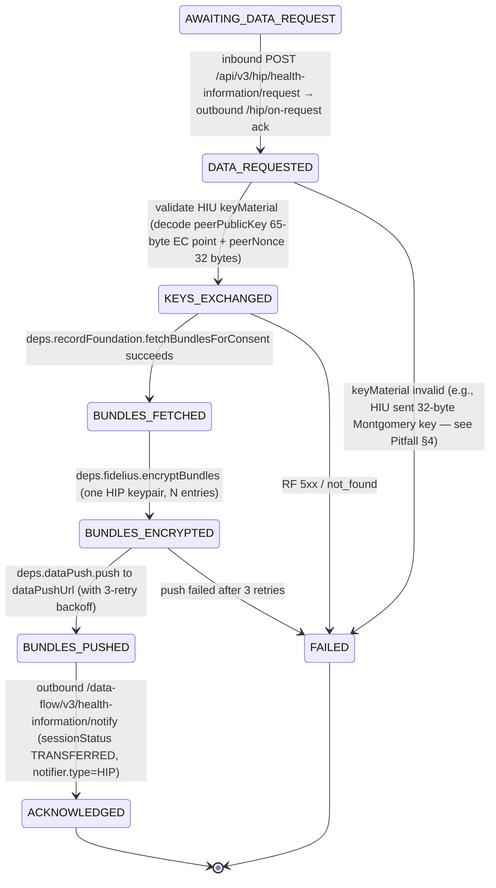

# ABDM Adapter — LLD §08 M3 Flows

The third sprint covers **M3** — patient-data exchange under consent. M3 is the milestone where the platform becomes both a **data-requester (HIU)** that asks another facility for a patient's records, and a **data-provider (HIP)** that ships records on a granted consent using the Fidelius envelope encryption that landed in M2.

This doc is the flow catalogue. The companion [`09-m3-dev-guide.md`](./09-m3-dev-guide.md) is the developer checklist (read it after this one). The [`10-m3-mock-harness-guide.md`](./10-m3-mock-harness-guide.md) is the runtime playbook for driving M3 locally without depending on real ABDM gateway, Record Foundation, or EMPI. For canonical M3 HIP push / Fidelius direction see [`12-phr-push-reconciliation.md`](./12-phr-push-reconciliation.md).

---

## What's new in M3 vs. M2

M2 made the platform a webhook target for the HIP side of linking + consent receipt. M3 introduces three new structural concerns:

1. **HIU role.** The platform is now the *requester*: a doctor at our facility asks for a patient's records held at another HIP. We initiate consent requests, receive grant/deny notifications, fetch artefacts, request data, and receive encrypted bundles. Five distinct inbound CM callbacks per consent-request flow, order-sensitive.
2. **HIP-side data response.** M2 received consent artefacts; M3 *acts* on them. When CM tells us to ship records for a granted consent, we assemble a FHIR bundle, encrypt it with Fidelius (BC Weierstrass curve25519 + AES-256-GCM — reuses [`fidelius-curve25519-bc.ts`](../../../../modules/abdm-adapter/src/lib/fidelius-curve25519-bc.ts) from M2 PR #86), POST to the HIU's `dataPushUrl`, then notify CM of transfer status.
3. **Loopback testing mode.** Because real Record Foundation and a separate HIU service don't exist yet, M3 ships an env-gated harness ([ADR-0033](../../adr/0033-abdm-m3-mock-harness-strategy.md)) that lets one service play both HIP and HIU and drive an end-to-end consent → transfer → decrypt loop in five minutes without external dependencies.

This is the dividing line between M2 and M3.

**Source spec (extracted to repo):** [`docs/external/abdm/v3-m3-hiu-consent-request-health-records-fetch.md`](../../../external/abdm/v3-m3-hiu-consent-request-health-records-fetch.md) — 8936 lines.

**Spec section shorthand.** The spec uses prose headings with `_Toc*` anchor IDs, not numeric subsections. Throughout this doc we use `§X.Y.Z` as a **shorthand for the prose-titled sections** — resolve via the index below. When citing in PR review, prefer the spec line number (canonical, won't drift) plus the heading text.

| Shorthand | Spec heading | Line |
|---|---|---|
| `§4.3.1` | HIE-CM - Consent request init | 1239 |
| `§4.3.2` | HIE-CM - Consent request init - call back | 2973 |
| `§4.3.3` | HIE-CM - Callback API to HIU when a consent request is APPROVED/REVOKED/DENIED | 3109 |
| `§4.3.4` | HIE-CM - API for HIU to respond back to consent HIU callback | 3243 |
| `§4.3.5` | HIE-CM - Consent request status | 3539 |
| `§4.3.6` | HIE-CM - Consent request on-status (callback) | 3887 |
| `§4.3.7` | HIE-CM - Consent request fetch | 3947 |
| `§4.3.8` | HIE-CM - Consent request on-fetch (callback) | 4307 |
| `§5.3.1` | Data flow – Data request invoked by HIU | 4797 |
| `§5.3.2` | Data flow – call back to HIU | 5323 |
| `§5.3.3` | Notify (data flow status) | 5491 |

**State diagrams in [`02-fsm-specifications.md`](../integration-platform/02-fsm-specifications.md)** will be extended to include the three M3 flows as a follow-up (mirrors how M2's hip-initiated-link, consent-notify, add-contexts, and SMS-notify are documented in `05-m2-flows.md` ahead of the FSM doc update).

**Reference impl:** production HIMS under `/home/ayushiqline/projects/hims/abdi-lims-backed`, especially `src/services/milestone3Service.ts` (1132 lines), `src/services/callbackService.ts` (1543 lines), `src/routes/milestone3.ts`, and `src/models/M3Session.ts`. Useful for *which exact body shapes the sandbox accepts in practice* and *which gateway error codes you'll see*. **Do not copy code structure** — production intermixes handlers and persistence; M3 here keeps the M1/M2 typed-port layering. See [`11-m3-doc-vetting-notes.md`](./11-m3-doc-vetting-notes.md) for the bug catalogue you should NOT replicate.

---

## M3 flow taxonomy — two flow kinds, three documentary sub-flows

M3 runtime uses **two flow kinds** — matching the typed `FlowContextMap` in [`modules/abdm-adapter/src/domain/session.ts`](../../../../modules/abdm-adapter/src/domain/session.ts):

| Flow kind (canonical) | Context type | State enum | Role | Covers |
|---|---|---|---|---|
| `abdm.m3.hiu.v1` | `M3HiuContext` (to be defined; today untyped placeholder) | `M3_HIU_STATES` | HIU (us) | Both HIU sub-flows below: consent request (§1) → data fetch (§2). One session row, one state vocabulary. |
| `abdm.m3.hip.v1` | `M3HipContext` (already typed, minimal) | `M3_HIP_STATES` | HIP (us) | M2 consent-notify receive + M3 data response (one state machine spans both; M3 implementation already shipped — see §3) |

This doc narrates the **HIU umbrella** in two sub-flow sections (§1 consent request → §2 data fetch — they share one session row and one state vocabulary) and the **HIP umbrella** in §3. The sub-flow framing is documentary; the runtime is two flow kinds.

**Canonical state arrays — pull from these, do NOT invent new names** (see [`fsm-states.ts`](../../../../packages/ts-sdk-abha/src/constants/fsm-states.ts) lines 88–115):

| `M3_HIU_STATES` | `M3_HIP_STATES` |
|---|---|
| `CONSENT_INIT_REQUESTED` | `CONSENT_NOTIFIED` (set by M2 consent-notify) |
| `AWAITING_PATIENT_APPROVAL` | `CONSENT_PERSISTED` (set by M2 consent-notify) |
| `CONSENT_GRANTED` | `CONSENT_REVOKED` |
| `CONSENT_DENIED` | `AWAITING_DATA_REQUEST` |
| `EXPIRED` | `DATA_REQUESTED` |
| `DATA_REQUESTED` | `KEYS_EXCHANGED` |
| `AWAITING_PUSH` | `BUNDLES_FETCHED` |
| `BUNDLES_RECEIVED` | `BUNDLES_ENCRYPTED` |
| `BUNDLES_DECRYPTED` | `BUNDLES_PUSHED` |
| `RECORDS_INGESTED` | `ACKNOWLEDGED` |
| `ACKNOWLEDGED` | `FAILED` |

Both roles are typically run by the same deployment — a hospital is usually both HIP (holds patients' records) and HIU (consumes records from elsewhere when treating a referred patient).

**Out of scope for this sprint** (deferred to M4): subscription flow (spec §6), long-lived consent supervisor (revoke/re-issue), HIU "linked patients" dashboard, real Record Foundation bundle assembly. See "What's NOT in scope" below.

---

## 1. HIU consent request — sub-flow of `abdm.m3.hiu.v1`

Runs under flow kind `abdm.m3.hiu.v1`, occupying the **first half** of `M3_HIU_STATES`: `CONSENT_INIT_REQUESTED → AWAITING_PATIENT_APPROVAL → CONSENT_GRANTED | CONSENT_DENIED | EXPIRED`. The session row continues into §2 (data fetch) without changing flow kind once the patient approves.

### Staff experience

Doctor at the registration or OPD desk looks up a patient whose ABHA address is known (already linked via M2 or freshly entered). Staff clicks "Request records from other facilities." The platform asks the patient (via CM) to grant consent for the requested HI types and date range. CM forwards the request to the patient's PHR app; the patient sees the consent prompt, approves (or denies). CM notifies us of the outcome; if granted, CM provides one or more consent artefact IDs (one per HIP holding the patient's records). We fetch each artefact, verify the CM's signature, and persist for downstream data-fetch use.

This sub-flow ends at "we have a signed artefact ready to authorize a data request" — state `CONSENT_GRANTED`. The actual data fetch (§2) continues on the same session row, transitioning into `DATA_REQUESTED` next.

### Sequence

```
HIU (us) ──init──▶ CM ──notify──▶ PHR app
                ◀─── on-init (CM acks our request with consentRequestId)
                ◀─── notify (patient APPROVED/DENIED; carries consentArtefacts[])
                ──── on-notify (we ack the notify back to CM)
                ──── fetch (we POST per artefact id)
                ◀─── on-fetch (artefact body + signature)
```

### State diagram

All state names below are members of `M3_HIU_STATES` ([`fsm-states.ts:103-115`](../../../../packages/ts-sdk-abha/src/constants/fsm-states.ts)). The staff-UI POST creates the session at state `CONSENT_INIT_REQUESTED`.

```mermaid
stateDiagram-v2
  [*] --> CONSENT_INIT_REQUESTED: staff UI POST /api/abdm/v1/m3/hiu/consent/request → outbound /consent/v3/request/init
  CONSENT_INIT_REQUESTED --> AWAITING_PATIENT_APPROVAL: inbound /hiu/consent/request/on-init (consentRequest.id received; no error)
  CONSENT_INIT_REQUESTED --> EXPIRED: on-init.error OR 72h timer fires before notify arrives
  AWAITING_PATIENT_APPROVAL --> CONSENT_GRANTED: inbound /hiu/consent/request/notify (status GRANTED) + artefact fetched + signature verified
  AWAITING_PATIENT_APPROVAL --> CONSENT_DENIED: inbound /hiu/consent/request/notify (status DENIED)
  AWAITING_PATIENT_APPROVAL --> EXPIRED: 72h timer fires
  CONSENT_GRANTED --> [*]: ready for §2 data fetch (same session row continues)
  CONSENT_DENIED --> [*]
  EXPIRED --> [*]
```



The `fetch` → `on-fetch` round trip happens **inside** the `AWAITING_PATIENT_APPROVAL → CONSENT_GRANTED` transition: when notify arrives with `status=GRANTED + consentArtefacts[]`, the handler fans out `/fetch` per artefact, awaits each `on-fetch`, verifies the JCS signature, persists the artefact, and only then transitions to `CONSENT_GRANTED`. If signature verification fails or `on-fetch` errors, the transition is to `CONSENT_DENIED` with a recorded error reason (no separate `FAILED` state in `M3_HIU_STATES` for the consent half — the canonical vocabulary collapses to `DENIED|EXPIRED`).

**Implementation note** (so the "one transition per handler" rule in [`09-m3-dev-guide.md §5.4`](./09-m3-dev-guide.md#54-function-shape-and-discipline) doesn't read as contradicted): the **logical** transition is one step (notify → `CONSENT_GRANTED`), but the **implementation** splits across three handlers because the `/fetch` round-trip is asynchronous over the network:
- `handle-notify-callback.ts` — receives the `notify`, records `consentArtefactIds`, kicks off N outbound `/fetch` POSTs, stays in `AWAITING_PATIENT_APPROVAL`.
- `fetch-artefact.ts` — pure outbound poster, one POST per artefact id, no state change.
- `handle-on-fetch-callback.ts` — receives one `on-fetch` per artefact, verifies signature, persists; once all N artefacts are received and persisted, transitions to `CONSENT_GRANTED`. The transition itself is one atomic `deps.sessions.patch({ state: 'CONSENT_GRANTED' })` in the handler that processes the **last** `on-fetch`.

See §5.2 file list for the canonical split.

### Endpoint table

| # | Direction | Endpoint URL | Section | State transition |
|---|---|---|---|---|
| 0 | platform | `POST /api/abdm/v1/m3/hiu/consent/request` (staff UI) | — | session created → `CONSENT_INIT_REQUESTED` |
| 1 | OUT (HIU → CM) | `POST /api/hiecm/consent/v3/request/init` | §4.3.1 | (same state — outbound is part of session creation) |
| 1b | IN (CM → HIU) | `POST {callback}/api/v3/hiu/consent/request/on-init` | §4.3.2 | `→ AWAITING_PATIENT_APPROVAL` / `→ EXPIRED` (on error) |
| 2 | IN (CM → HIU) | `POST {callback}/api/v3/hiu/consent/request/notify` | §4.3.3 | (status routes the subsequent transition) |
| 2b | OUT (HIU → CM) | `POST /api/hiecm/consent/v3/request/hiu/on-notify` | §4.3.4 | (ack only, no state change) |
| 3 | OUT (HIU → CM) | `POST /api/hiecm/consent/v3/fetch` (per artefact id from notify) | §4.3.7 | (intermediate — happens inside the notify→granted transition) |
| 3b | IN (CM → HIU) | `POST {callback}/api/v3/hiu/consent/on-fetch` | §4.3.8 | (intermediate — same transition; signature verified + artefact persisted) |
| 4 | platform | finish the transition once all artefacts fetched & verified | — | `→ CONSENT_GRANTED` (or `→ CONSENT_DENIED` on signature failure) |

**Important:** Spec §4.3.7's path is `/api/hiecm/consent/v3/fetch` — NOT `/request/fetch`. Easy to get wrong because the init/notify/status paths all live under `/request/…`. Verify against spec §4.3.7 header before writing the handler.

### Body shapes (cheat sheet)

**§4.3.1 consent/v3/request/init** — HIU → CM (we send):

```jsonc
{
  "consent": {
    "purpose": { "text": "Care Management", "code": "CAREMGT", "refUri": "www.abdm.gov.in" },
    "patient": { "id": "test.user@sbx" },                  // ABHA address of patient whose records we want
    "hip": { "id": "SBX_OTHER_HIP_001" },                  // optional; pin to a specific HIP, or omit for any
    "careContexts": [],                                    // optional; pin to specific contexts
    "hiu": { "id": "<our HIU ID — from tenant config>" },
    "requester": {
      "name": "Dr. <full readable name from better-auth user.full_name>",
      "identifier": {
        "type": "REGNO",                                   // pin "REGNO" per production HIMS (FT-certified). Spec body examples are inconsistent: init shows REGNO1 (line 1775), on-fetch shows REGNO (line 4689), parameter tables show REGN01. Production sends REGNO and works.
        "value": "<MCI reg no from tenant config; empty string acceptable in sandbox>",
        "system": "https://www.mciindia.org"
      }
    },
    "hiTypes": ["OPConsultation", "Prescription"],         // PascalCase per §4.3.1 spec — see pitfall §pitfall-2
    "permission": {
      "accessMode": "VIEW",                                // VIEW | STORE | QUERY | STREAM
      "dateRange": { "from": "2025-01-01T00:00:00Z", "to": "2026-05-21T00:00:00Z" },
      "dataEraseAt": "2026-08-21T00:00:00Z",               // must be future date
      "frequency": { "unit": "HOUR", "value": 1, "repeats": 0 }
    }
  }
}
```

**§4.3.2 on-init callback** — CM → HIU (we receive):

```jsonc
{
  "consentRequest": { "id": "REQ-<UUID>" },                // persist this — used for everything downstream
  "error": null,                                            // or { code, message }
  "response": { "requestId": "<echo of our outbound REQUEST-ID>" }
}
```

**§4.3.3 notify callback** — CM → HIU (we receive):

```jsonc
{
  "notification": {
    "consentRequestId": "REQ-<UUID>",
    "status": "GRANTED",                                   // or DENIED, REVOKED
    "reason": null,                                         // populated on DENIED
    "consentArtefacts": [                                   // one per HIP holding patient's data
      { "id": "CON-<UUID-1>" },
      { "id": "CON-<UUID-2>" }
    ]
  }
}
```

**§4.3.4 hiu/on-notify** — HIU → CM (we ack):

```jsonc
{
  "acknowledgement": [
    { "status": "OK", "consentId": "CON-<UUID-1>" },
    { "status": "OK", "consentId": "CON-<UUID-2>" }
  ],
  "error": null,
  "response": { "requestId": "<echo of inbound notify REQUEST-ID>" }
}
```

**§4.3.7 consent/v3/fetch** — HIU → CM (we POST per artefact):

```jsonc
{
  "consentId": "CON-<UUID-1>"
}
```

**§4.3.8 on-fetch callback** — CM → HIU (we receive the signed artefact):

```jsonc
{
  "consent": {
    "status": "GRANTED",
    "consentDetail": {
      "consentId": "CON-<UUID-1>",
      "createdAt": "2026-05-21T05:00:00.000Z",
      "patient": { "id": "test.user@sbx" },
      "hip": { "id": "SBX_OTHER_HIP_001" },
      "hiu": { "id": "<our HIU ID>" },
      "purpose": { "text": "Care Management", "code": "CAREMGT", "refUri": "www.abdm.gov.in" },
      "requester": { "name": "Dr. ...", "identifier": { "type": "REGNO", "value": "MH1001", "system": "https://www.mciindia.org" } },
      "hiTypes": ["Prescription", "DiagnosticReport", "OPConsultation"],   // PascalCase per production; see Pitfall 2
      "careContexts": [                                                      // spec line 4725-4735
        {
          "patientReference": "MRN-2024-001",                                // HIP-internal patient reference
          "careContextReference": "COCa496bc2f-ca6c-4af5-b973-02e915fd9815"  // specific encounter / context to authorize
        }
      ],
      "permission": {
        "accessMode": "VIEW",
        "dateRange": { "from": "...", "to": "..." },                         // object, NOT array — see Pitfall 8
        "dataEraseAt": "2126-12-09T00:00:00.000Z",
        "frequency": { "unit": "DAY", "value": 1, "repeats": 0 }
      },
      "consentManager": { "id": "sbx" },
      "schemaVersion": "v3",
      "lastUpdated": "2026-05-21T05:00:00.000Z"
    },
    "signature": "<base64 JWS-like signature over consentDetail; JCS-canonicalized>"
  },
  "response": { "requestId": "<echo of our /fetch REQUEST-ID>" }
}
```

**Persist `careContexts` for the HIU's own use** — the data-fetch flow needs the list of *authorized* careContexts to (a) display in staff UI which encounters are in scope of this consent, and (b) sanity-check that the HIP only pushes entries within that scope (drop / alert on out-of-scope `careContextReference` values in the push body). Note: the per-entry `careContextReference` in our outbound notify body comes from the **push body** (`entries[].careContextReference`, i.e. what the HIP actually shipped), not from this artefact — but the two should be a subset/equal relation, and that's worth asserting. The HIP independently holds the same list via its M2 consent-notify receive (`abdm_consent_artefacts`); we don't ship them ours. Persist in `abdm_m3_consent_artefacts_hiu.care_contexts` (see [`09-m3-dev-guide.md §4.2`](./09-m3-dev-guide.md#42-abdm-m3-consent-artefacts-hiurepots-new)). Production HIMS reads it at `callbackService.ts:992` and persists per-artefact.

The artefact's `signature` is verified using JCS canonicalization (RFC 8785) — reuse [`consent-signature-verifier.ts`](../../../../modules/abdm-adapter/src/lib/consent-signature-verifier.ts) from M2 PR #86. In sandbox / mock mode the verifier returns `signature_valid: false` but still persists the artefact (flagged in `09-m3-dev-guide.md §11` as a follow-up for staging).

### Correlation

- **External correlation:** `REQUEST-ID` header on each call. Our outbound `init` carries a UUID we generate; CM's `on-init` echoes it in `response.requestId`. The CM-issued `consentRequest.id` becomes the long-running flow handle. Notify's `consentArtefacts[].id` becomes the artefact handle for `/fetch`.
- **Internal correlation:** `sessionId` (platform-issued UUID at `CONSENT_INIT_REQUESTED`). All subsequent transitions look up by `(iqTenantId, sessionId)`. We also store `consentRequestId` as a scalar lookup column for inbound notify routing.
- **Idempotency:** `INSERT INTO abdm_inbound_messages (iq_tenant_id, request_id) ON CONFLICT DO NOTHING`. If 0 rows inserted, return `202` immediately — the gateway is retrying.

### Failure modes

- **`on-init.error`** → `EXPIRED` (terminal — `M3_HIU_STATES` has no `FAILED`; encode error reason in context). Common: ABDM-1030 (invalid request id), ABDM-9999 (validation — usually `requester.name` empty or `dataEraseAt` not future). Surface to staff with the error message.
- **`notify.status = DENIED`** → `CONSENT_DENIED` (terminal). Surface to staff with `notify.reason`. NOT an error — the patient is allowed to refuse.
- **72h no notify after `AWAITING_PATIENT_APPROVAL`** → `EXPIRED` (janitor sweep). Surface to staff as "patient did not respond." Default per spec; tunable via `ABDM_M3_CONSENT_REQUEST_EXPIRY_HOURS` env.
- **`on-fetch` signature verification fails** → `CONSENT_DENIED` with `signatureValid=false` recorded on the artefact row. Alert security — a forged artefact, a CM key rotation we missed, or a JCS canonicalization bug.
- **`on-fetch` artefact has unexpected shape** → `CONSENT_DENIED` with parse-error reason; ship raw body to the dead-letter table for inspection.

---

## 2. HIU data fetch — sub-flow of `abdm.m3.hiu.v1`

Continues the same flow kind and session row as §1. Picks up at `CONSENT_GRANTED` and transitions through the **second half** of `M3_HIU_STATES`: `CONSENT_GRANTED → DATA_REQUESTED → AWAITING_PUSH → BUNDLES_RECEIVED → BUNDLES_DECRYPTED → RECORDS_INGESTED → ACKNOWLEDGED`.

### Staff experience

Once §1 finishes at `CONSENT_GRANTED`, the doctor sees "Records available — fetch now" in the UI. Click → we send a data request to CM with our ephemeral ECDH public key + transfer nonce + the URL we want the HIP to push to. CM acks; CM relays to the HIP; the HIP encrypts and pushes; we decrypt and store; we notify CM the transfer is done. Doctor sees the records.

The wait between "data request posted" and "bundle received" can be minutes to hours, depending on HIP responsiveness. A 24-hour timeout flips to `EXPIRED` (per `M3_HIU_STATES`; no separate `TIMEOUT` state exists).

### Sequence

```
HIU (us) ──data-request──▶ CM  (HIU sends consent id + dataPushUrl + ECDH pub key + nonce)
              ◀──── on-request (CM acks with transactionId)
... time passes; CM relays to HIP; HIP encrypts and pushes ...
HIP ──────────▶ HIU dataPushUrl  (encrypted bundle + HIP pub key + HIP nonce)
HIU ──notify──▶ CM  (HIU tells CM transfer status: RECEIVED / FAILED)
```

### State diagram

All state names below are members of `M3_HIU_STATES`. The keypair is generated inline with the outbound data request (no separate intermediate state — `M3_HIU_STATES` doesn't define `KEYPAIR_GENERATED`).

```mermaid
stateDiagram-v2
  CONSENT_GRANTED --> DATA_REQUESTED: staff UI POST /api/abdm/v1/m3/hiu/data-request → generate ECDH keypair + nonce → outbound /data-flow/v3/health-information/request
  DATA_REQUESTED --> AWAITING_PUSH: inbound /hiu/health-information/on-request (sessionStatus REQUESTED); 24h timer armed
  DATA_REQUESTED --> EXPIRED: on-request.error (e.g. ABDM-1092 expired consent)
  AWAITING_PUSH --> BUNDLES_RECEIVED: inbound POST /api/v3/hiu/health-information/transfer/:transferId
  AWAITING_PUSH --> EXPIRED: 24h timer fires without push
  BUNDLES_RECEIVED --> BUNDLES_DECRYPTED: deps.fidelius.decryptBundle succeeds
  BUNDLES_RECEIVED --> EXPIRED: decryption error (with reason recorded in context.error)
  BUNDLES_DECRYPTED --> RECORDS_INGESTED: write bundle_json to abdm_m3_data_transfers + emit abdm.health-record.received
  RECORDS_INGESTED --> ACKNOWLEDGED: outbound /data-flow/v3/health-information/notify (sessionStatus RECEIVED)
  ACKNOWLEDGED --> [*]
  EXPIRED --> [*]
```



`M3_HIU_STATES` does not define a `FAILED` terminal — error outcomes collapse to `EXPIRED` with `context.error` recording the cause. Use `EXPIRED` for any non-success terminal in this sub-flow.

### Endpoint table

| # | Direction | Endpoint URL | Section | State transition |
|---|---|---|---|---|
| 0 | platform | `POST /api/abdm/v1/m3/hiu/data-request` (staff UI) | — | (precondition: state = `CONSENT_GRANTED`) |
| 0b | platform | generate ECDH keypair via `deps.fidelius` (BC Weierstrass curve25519 + 32-byte nonce) | — | (inline; no intermediate state) |
| 1 | OUT (HIU → CM) | `POST /api/hiecm/data-flow/v3/health-information/request` | §5.3.1 | `→ DATA_REQUESTED` |
| 1b | IN (CM → HIU) | `POST {callback}/api/v3/hiu/health-information/on-request` | §5.3.2 | `→ AWAITING_PUSH` / `→ EXPIRED` (on error) |
| 2 | IN (HIP → HIU) | `POST {callback}/api/v3/hiu/health-information/transfer/:transferId` | §5.3 push | `→ BUNDLES_RECEIVED` |
| 2b | platform | `deps.fidelius.decryptBundle({...})` | — | `→ BUNDLES_DECRYPTED` |
| 3 | platform | write `abdm_m3_data_transfers.bundle_json` + emit event | — | `→ RECORDS_INGESTED` |
| 4 | OUT (HIU → CM) | `POST /api/hiecm/data-flow/v3/health-information/notify` (`notifier.type=HIU`) | §5.3.3 | `→ ACKNOWLEDGED` |

**Important:** The data-request URL is `/api/hiecm/data-flow/v3/health-information/request` (no `cm/` segment). Production HIMS gets this right; an early draft of this doc had `cm/request` — corrected per spec §5.3.1.

The push URL path `/api/v3/hiu/health-information/transfer/:transferId` is **our choice** — the spec does not pin a path; we register whatever URL we want in `hiRequest.dataPushUrl`. The transferId in the path lets us look up the transfer's session row without an extra DB index.

**Caveat:** The spec doesn't pin the dataPushUrl path; the HIU registers whatever URL it wants and the gateway has no opinion about the path string per se. That said, production HIMS uses `/pushDataUrl/:tenantId` (`callback.ts:272`) and is the only shape we have **actually run against the real gateway in the FT-certified deployment**. Our transferId-keyed alternative is cleaner (no tenant→session lookup) but is production-risk until the first sandbox round-trip confirms it. If a problem surfaces, fall back to the production-tested path shape.

### Crypto cheat sheet — HIU side

Call the existing `FideliusEncryptor` port via `deps.fidelius` — NOT the lib functions directly. The port is async and exposes `encryptForPeer`, `encryptBundles`, `decryptBundle` (no `Material` suffix). Direct lib imports skip the port pattern, break the testability seam, and would block the future durable-execution port (the lib functions can't be wrapped as activities if they're imported statically).

The port impl is [`data-access/fidelius.ts`](../../../../modules/abdm-adapter/src/data-access/fidelius.ts); under the hood it calls the same vector-tested wrappers in [`lib/fidelius-crypto.ts`](../../../../modules/abdm-adapter/src/lib/fidelius-crypto.ts).

```ts
// On the transition into DATA_REQUESTED: generate ephemeral keypair + nonce via the port.
// `generateOurKeyMaterial` returns base64-encoded strings; encrypt `ourPrivateKey` at rest via
// `PayloadEncryptor` before persisting in abdm_m3_data_transfers.
const { ourPublicKey, ourPrivateKey, ourNonce } = await deps.fidelius.generateOurKeyMaterial();
const hiuPrivateKeyJwk = deps.payloadEncryptor.encrypt(ourPrivateKey);

await deps.dataTransfers.insert({
  iqTenantId, transferId, consentId,
  hiuPublicKeyB64:  ourPublicKey,
  hiuPrivateKeyJwk,                 // encrypted at rest
  hiuNonceB64:      ourNonce,
  // ...other fields elided
});

// Send in /data-flow/.../request body:
//   hiRequest.keyMaterial.dhPublicKey.keyValue = ourPublicKey
//   hiRequest.keyMaterial.nonce                 = ourNonce

// On BUNDLES_RECEIVED, the push body carries HIP's keyMaterial + ciphertext entries:
//   keyMaterial.dhPublicKey.keyValue = HIP's base64-encoded 65-byte uncompressed EC point
//   keyMaterial.nonce                = HIP's 32-byte transfer nonce (base64)
//   entries[].content                = base64(ciphertext || GCM authTag) — Fidelius framing
const transfer = await deps.dataTransfers.findById({ iqTenantId, transferId });
if (!transfer) throw new Error("transfer not found");
const ourPrivateKeyB64 = deps.payloadEncryptor.decrypt(transfer.hiuPrivateKeyJwk);

const plaintext = await deps.fidelius.decryptBundle({
  encryptedPayload: push.entries[0].content,
  peerPublicKey:    push.keyMaterial.dhPublicKey.keyValue,
  peerNonce:        push.keyMaterial.nonce,
  ourPrivateKey:    ourPrivateKeyB64,
  ourNonce:         transfer.hiuNonceB64,
});
const fhirBundle = JSON.parse(plaintext);
```

**What `decryptBundle` does internally** (you don't write this — it's already there):
1. ECDH on BC Weierstrass curve25519 (NOT Montgomery X25519)
2. XOR the two 32-byte nonces; take **first 20 bytes as HKDF salt** and **last 12 bytes as AES-GCM IV**
3. HKDF-SHA256 with empty `info`, 32-byte output → AES-256-GCM key
4. AES-256-GCM decrypt with the IV from step 2; framing is `base64(ciphertext || 16-byte authTag)`

If decryption fails with "tag mismatch", the most likely cause is mis-implemented salt/IV split — see Pitfall §6. XOR order itself does not matter (XOR is commutative).

### Body shapes (cheat sheet)

**§5.3.1 data-flow request** — HIU → CM:

```jsonc
{
  "hiRequest": {
    "consent": { "id": "CON-<UUID>" },                     // from artefact persisted by hiu-consent-request flow
    "dateRange": {
      "from": "2025-01-01T00:00:00Z",
      "to": "2026-05-21T00:00:00Z"
    },
    "dataPushUrl": "https://<our-public-host>/api/v3/hiu/health-information/transfer/TRX-<UUID>",
    "keyMaterial": {
      "cryptoAlg": "ECDH",
      "curve": "Curve25519",
      "dhPublicKey": {
        "expiry": "2026-05-22T00:00:00Z",
        "parameters": "Curve25519/32byte random key",
        "keyValue": "<base64(our 65-byte uncompressed EC public key)>"
      },
      "nonce": "<base64(our 32-byte transfer nonce)>"
    }
  }
}
```

**§5.3.2 on-request callback** — CM → HIU:

```jsonc
{
  "hiRequest": {
    "transactionId": "<gateway-issued UUID; thread it across notify>",
    "sessionStatus": "REQUESTED"
  },
  "error": null,
  "response": { "requestId": "<echo of our request REQUEST-ID>" }
}
```

**Push body (our `/transfer/:transferId` receiver)** — HIP → HIU. The spec describes this at the HIP push side (§5 sequence) without a dedicated body section; the shape is documented in production HIMS and the Postman collection. Mirror this:

```jsonc
{
  "pageNumber": 1,
  "pageCount": 1,
  "transactionId": "<echo of on-request transactionId>",
  "entries": [
    {
      "content": "<base64(encrypted FHIR bundle || GCM authTag)>",
      "media": "application/fhir+json",
      "checksum": "<sha256 hex of plaintext>",
      "careContextReference": "CC-<UUID>"
    }
  ],
  "keyMaterial": {
    "cryptoAlg": "ECDH",
    "curve": "Curve25519",
    "dhPublicKey": {
      "expiry": "2026-05-22T00:00:00Z",
      "parameters": "Curve25519/32byte random key",
      "keyValue": "<base64(HIP's 65-byte uncompressed EC public key)>"
    },
    "nonce": "<base64(HIP's 32-byte transfer nonce)>"
  }
}
```

**§5.3.3 notify** — HIU → CM (sent during transition `RECORDS_INGESTED → ACKNOWLEDGED`):

```jsonc
{
  "notification": {
    "consentId": "CON-<UUID>",
    "transactionId": "<echo of on-request transactionId>",
    "doneAt": "2026-05-21T08:00:00.000Z",
    "notifier": { "type": "HIU", "id": "<our HIU ID>" },
    "statusNotification": {
      "sessionStatus": "RECEIVED",                          // RECEIVED on success; FAILED on decrypt error
      "hipId": "<HIP id from artefact>",
      "statusResponses": [
        { "careContextReference": "CC-<UUID>", "hiStatus": "OK", "description": "received" }
      ]
    }
  }
}
```

### Correlation

- **External:** `transactionId` (CM-issued at on-request) threads request → notify. `consentId` ties this transfer to the artefact.
- **Internal:** `sessionId` (platform UUID, same row as the §1 consent-request flow) + `transferId` (platform UUID minted at the moment of generating the keypair, embedded in `dataPushUrl` path).
- **Idempotency for the push:** `INSERT INTO abdm_inbound_messages (iq_tenant_id, request_id) ON CONFLICT DO NOTHING` keyed on `(iqTenantId, transferId)` rather than `request_id`, since the push from HIP doesn't carry a gateway-issued REQUEST-ID; the path's transferId is the dedupe key.

### Failure modes

`M3_HIU_STATES` has no `FAILED` or `TIMEOUT` — all non-success terminals collapse to `EXPIRED` with `context.error` recording the cause.

- **`on-request.error`** → `EXPIRED` (record `{code, message}` in context). Common: `ABDM-1092` (invalid or expired consent artefact id).
- **24h no push** → `EXPIRED`. Janitor sweep; notify CM with `sessionStatus: FAILED`, `hiStatus: ERRORED`.
- **Decryption fails (tag mismatch)** → `EXPIRED`. Notify CM with `sessionStatus: FAILED`, `hiStatus: ERRORED`. Common causes: salt/IV split wrong (or Fidelius framing reimplemented instead of calling `deps.fidelius.decryptBundle` — see Pitfall §6), HIP's public key not base64-decoded correctly, ciphertext truncated.
- **Bundle parse fails (not valid FHIR JSON)** → `EXPIRED`. Notify CM; ship plaintext to dead-letter table for inspection (security risk if attacker can poison HIU storage — verify FHIR structure before storing).

---

## 3. HIP data response — `abdm.m3.hip.v1`

### What it is

The "other half" of M2's consent receipt. M2 received the consent artefact and acked CM under the same `abdm.m3.hip.v1` flow kind, transitioning the session through `CONSENT_NOTIFIED → CONSENT_PERSISTED`. M3 picks the same session up at `AWAITING_DATA_REQUEST` and does the actual data shipment: when CM tells us to send records for a granted consent we already hold, we assemble the FHIR bundle for the patient + dateRange, encrypt with Fidelius using the HIU's public key from the request, POST to the HIU's `dataPushUrl`, and notify CM of the transfer status.

This flow uses no staff UI — it's driven entirely by the inbound `/hip/health-information/request` callback from CM.

### Sequence

```
CM ──/hip/health-information/request──▶ HIP (us)
                                          (request carries: consent id, dateRange,
                                           dataPushUrl, HIU public key + nonce)
HIP ──on-request──▶ CM                    (immediate ack)
HIP: assemble bundle (RecordFoundationClient — mock returns HealthDocumentRecord placeholder)
HIP: encrypt with Fidelius (HIU public key + transfer nonce from request)
HIP ──encrypted bundle──▶ HIU dataPushUrl (with HIP public key + HIP nonce)
HIP ──notify──▶ CM                        (status TRANSFERRED / FAILED)
```

### State diagram

All state names below are members of `M3_HIP_STATES`. Note: M2's consent-notify receive populates the **first three** states (`CONSENT_NOTIFIED`, `CONSENT_PERSISTED`, `CONSENT_REVOKED`) on the same flow kind; M3 picks up at `AWAITING_DATA_REQUEST` when CM sends the inbound `/hip/health-information/request`.



### Endpoint table

| # | Direction | Endpoint URL | Section | State transition |
|---|---|---|---|---|
| 1 | IN (CM → HIP) | `POST {callback}/api/v3/hip/health-information/request` | §5.3.1 (HIP perspective) | `→ DATA_REQUESTED` (immediate ack via outbound on-request as part of the transition) |
| 1b | OUT (HIP → CM) | `POST /api/hiecm/data-flow/v3/health-information/hip/on-request` | (HIP-side ack — symmetric to §5.3.2) | (part of step 1 transition; no separate state) |
| 2 | platform | decode + validate `keyMaterial`; resolve patientId via M2 `ConsentArtefactsPort.findById` | — | `→ KEYS_EXCHANGED` |
| 3 | platform | `deps.recordFoundation.fetchBundlesForConsent({iqTenantId, patientId, consentId, dateRange})` | — | `→ BUNDLES_FETCHED` |
| 3b | platform | `deps.fidelius.encryptBundles({payloadJsons, peerPublicKey, peerNonce})` (BC Weierstrass curve25519 + AES-256-GCM) | — | `→ BUNDLES_ENCRYPTED` |
| 4 | OUT (HIP → HIU) | `POST <hiRequest.dataPushUrl from §5.3.1 body>` | (push body — same shape as HIU receiver expects) | `→ BUNDLES_PUSHED` |
| 5 | OUT (HIP → CM) | `POST /api/hiecm/data-flow/v3/health-information/notify` (`notifier.type=HIP`) | §5.3.3 | `→ ACKNOWLEDGED` |

### Implementation status — already shipped (do NOT re-build)

The HIP-side data response is **already implemented on this branch**. Use this cheat sheet as a **reading guide** for the existing code, not as code-to-write. What's missing is **only the REST handler wiring** under `rest-handlers/m3/` (the directory is empty as of this writing) — the use-case is done.

| Layer | Where it lives | What it does |
|---|---|---|
| Inbound body parser | [`lib/parse-hi-request-body.ts`](../../../../modules/abdm-adapter/src/lib/parse-hi-request-body.ts) | `parseHiRequestBody(body, requestId): ParsedHiRequest \| null` — handles both `body.hiRequest.consent.id` and `body.consentId` top-level alternative the gateway occasionally sends |
| HIP ack use-case | [`use-cases/m3/hip/handle-hi-request-callback.ts`](../../../../modules/abdm-adapter/src/use-cases/m3/hip/handle-hi-request-callback.ts) | `handleHipHiRequestCallback(...)` — verifies signature, dedupes, parses, transitions session to `DATA_REQUESTED`, kicks off downstream |
| Encrypt + push use-case | [`use-cases/m3/hip/push-health-information.ts`](../../../../modules/abdm-adapter/src/use-cases/m3/hip/push-health-information.ts) | `pushHealthInformationForSession(...)` — fetches bundles, calls `deps.fidelius.encryptBundles`, posts to dataPushUrl, transitions through `KEYS_EXCHANGED → BUNDLES_FETCHED → BUNDLES_ENCRYPTED → BUNDLES_PUSHED` |
| Notify CM use-case | [`use-cases/m3/hip/notify-data-transfer.ts`](../../../../modules/abdm-adapter/src/use-cases/m3/hip/notify-data-transfer.ts) | `notifyHipDataTransfer(...)` — posts `/data-flow/.../notify` with `notifier.type=HIP`, transitions to `ACKNOWLEDGED` |
| Outbound push client | [`data-access/hip-data-push.client.ts`](../../../../modules/abdm-adapter/src/data-access/hip-data-push.client.ts) | `HttpHipDataPushClient implements HipDataPushClient` — POSTs to arbitrary `dataPushUrl`. Helpers: `checksumForContent(content)` (sha256 hex of the **encrypted** payload), `newPushRequestId()` (UUID for REQUEST-ID header) |
| Fidelius port impl | [`data-access/fidelius.ts`](../../../../modules/abdm-adapter/src/data-access/fidelius.ts) | `FideliusEncryptor` class implementing the port; `createFideliusEncryptorFromEnv()` factory |

**Your job in this sprint** (HIP side):
1. Add the inbound REST handler at `rest-handlers/m3/hip-data-request.ts` that calls `handleHipHiRequestCallback` for inbound `POST /api/v3/hip/health-information/request`. Standard dedupe-sandwich pattern from M2; respond 2xx fast.
2. (HIU side is the larger scope — see §1, §2 above + dev-guide §5.)

### Cheat sheet — what the existing HIP code looks like

Read this in conjunction with `push-health-information.ts` open in your editor. The reviewer dispatched the existing implementation against the patterns this doc was originally written for, and these are the canonical shapes:

```ts
// 1. Parse the inbound body (handles consent.id vs top-level consentId quirk).
const parsed = parseHiRequestBody(req.body, requestId);
if (!parsed) return reply.code(400).send({ error: { code: "ABDM-1064", message: "invalid request body" } });

// 2. Resolve patientId from the M2-persisted artefact.
const artefact = await deps.consentArtefacts.findById(iqTenantId, parsed.consentId);
if (!artefact) throw new Error("consent artefact not found — M2 notify must have arrived first");

// 3. Fetch one HealthRecordBundleEntry per care-context covered by this consent.
//    Shape per ports.ts: { careContextReference, contentJson, media }[].
const entries = await deps.recordFoundation.fetchBundlesForConsent({
  iqTenantId,
  patientId: artefact.patientId,
  consentId: parsed.consentId,
  dateRange: parsed.dateRange,
});

// 4. Encrypt all entries under ONE shared HIP keypair + nonce via the port.
//    encryptBundles (plural) generates ONE keypair and encrypts N payloads.
//    Do NOT call encryptForPeer (singular) per-entry — fresh keypair per call breaks decryption.
const batch = await deps.fidelius.encryptBundles({
  payloadJsons:  entries.map((e) => e.contentJson),
  peerPublicKey: parsed.hiuPublicKey,
  peerNonce:     parsed.hiuNonce,
});

// 5. Build push entries — checksum is sha256 of the ENCRYPTED payload (matches HttpHipDataPushClient.checksumForContent).
const pushEntries = entries.map((e, i) => ({
  content: batch.encryptedPayloads[i]!,
  media: e.media,
  checksum: checksumForContent(batch.encryptedPayloads[i]!),  // helper from hip-data-push.client.ts
  careContextReference: e.careContextReference,
}));

// 6. POST to HIU. pageNumber: 0 matches the existing impl (the gateway accepts both 0 and 1; we use 0 to align with code).
await deps.dataPush.push({
  dataPushUrl: parsed.dataPushUrl,
  requestId:   newPushRequestId(),                            // helper from hip-data-push.client.ts
  body: {
    pageNumber: 0,
    pageCount: 1,
    transactionId: parsed.transactionId,
    entries: pushEntries,
    keyMaterial: {
      cryptoAlg: "ECDH",
      curve: "Curve25519",
      dhPublicKey: {
        expiry: new Date(Date.now() + 24 * 60 * 60 * 1000).toISOString(),
        parameters: "Curve25519/32byte random key",
        keyValue: batch.ourPublicKey,
      },
      nonce: batch.ourNonce,
    },
  },
});
```

**Notes on the canonical impl:**
- `parseHiRequestBody` exists precisely to handle the consentId-at-top-level quirk; **do not** destructure `req.body.hiRequest.consent.id` directly in new code paths.
- **One in-process Fidelius path for all receivers** (PHR, HIMS, LIMS, loopback). `FideliusEncryptor.encryptBundles` uses ephemeral per-push keys and emits X509/SPKI `keyToShare` in outbound `keyMaterial.dhPublicKey.keyValue`. Inbound keys accept raw 65-byte EC point or SPKI; normalization is internal. See [`12-phr-push-reconciliation.md`](./12-phr-push-reconciliation.md).
- Checksum defaults to literal `"string"` via `ABDM_M3_PUSH_CHECKSUM_MODE=literal` (production HIMS parity). Override with `sha256` or `md5` for harness tests.
- Push headers: external CM `dataPushUrl` hosts use minimal headers (Content-Type only) by default; loopback adapter URLs get full NHA headers. Configure via `ABDM_M3_DATA_PUSH_MINIMAL_HEADERS`.
- **URL rewrite is loopback-only.** Production/non-loopback always posts to CM-provided `dataPushUrl`. With `ABDM_M3_LOOPBACK_HIU=true`, external CM URLs redirect to the stored adapter HIU transfer endpoint.
- `pageNumber: 0` matches `push-health-information.ts`. The fixture in `test-fixtures/m3/push/encrypted-bundle-sample.json` uses `1` for human-readable logging; either is gateway-accepted.
- `encryptBundles` (plural) is the correct choice for fan-out. The singular `encryptForPeer` generates a fresh keypair per call and would ship N different HIP public keys — only one entry would decrypt at the HIU.
- If you need a deterministic encrypt for tests (fixed HIP keypair + nonce so output is reproducible), use `encryptForPeerMaterialDeterministic` from `lib/fidelius-crypto.ts` — but call it only from test fixtures, not from production use-cases.

**Reuses from M2:**
- `ConsentArtefactsPort.findById(iqTenantId, consentId)` from M2 — gives us `patientId` for the Record Foundation call
- `MockRecordFoundationClient.fetchBundlesForConsent` — returns one `HealthRecordBundleEntry` per care-context, each wrapping a PHR-renderable placeholder bundle (PR #86 must-fix #3 helper) until real RF lands

### Body shapes (cheat sheet)

**Inbound `/hip/health-information/request`** — CM → HIP body matches §5.3.1 verbatim (same body the HIU sent, threaded through CM). See §1 above.

**Outbound `/hip/on-request` ack** — HIP → CM:

```jsonc
{
  "hiRequest": {
    "transactionId": "<echo of inbound transactionId>",
    "sessionStatus": "ACKNOWLEDGED"
  },
  "error": null,
  "response": { "requestId": "<echo of inbound REQUEST-ID>" }
}
```

**Outbound `dataPushUrl` body** — see §2 push body above.

**§5.3.3 notify** (HIP-side variant) — HIP → CM after push completes:

```jsonc
{
  "notification": {
    "consentId": "CON-<UUID>",
    "transactionId": "<echo of inbound transactionId>",
    "doneAt": "2026-05-21T08:00:00.000Z",
    "notifier": { "type": "HIP", "id": "<our HIP ID>" },
    "statusNotification": {
      "sessionStatus": "TRANSFERRED",                       // TRANSFERRED on success; FAILED on retry exhaustion
      "hipId": "<our HIP id>",
      "statusResponses": [
        { "careContextReference": "CC-<UUID>", "hiStatus": "DELIVERED", "description": "sent" }
      ]
    }
  }
}
```

### Correlation

- **External:** `transactionId` (CM-issued, echoed) threads request → push → notify.
- **Internal:** `transferId` (platform UUID minted on inbound `/hip/health-information/request` arrival, mapped to `transactionId` in the session row).
- **Idempotency:** `INSERT INTO abdm_inbound_messages ON CONFLICT DO NOTHING` on `(iqTenantId, request_id)`. CM retries the data-request with the same REQUEST-ID under load.

### Failure modes

- **Bundle assembly fails** — RecordFoundationClient returns 5xx → `FAILED`. Notify CM with `sessionStatus: FAILED`, `hiStatus: ERRORED`, description="bundle assembly failed". (Mock mode always succeeds with placeholder.)
- **Encryption fails — invalid HIU public key** — `keyMaterial.dhPublicKey.keyValue` is not a valid base64 65-byte uncompressed EC point → `FAILED`. Notify CM with `description="invalid HIU public key format"`. Most likely cause: HIU sent a Montgomery X25519 32-byte key (incompatible). Cite the curve-form pitfall doc.
- **`dataPushUrl` POST fails (HIU unreachable, 5xx, timeout)** — retry 3× with exponential backoff (60s / 5min / 30min) via timer rows. After third failure → `FAILED`. Notify CM with `description="push failed after 3 retries"`. Spec doesn't pin the retry count; matches M2 add-contexts §4 policy.
- **HIU returns non-2xx from push** — same retry policy. 4xx errors after first retry should NOT retry further (don't repeatedly POST to a misconfigured HIU); 5xx retries fully.

---

## Common pitfalls — read before writing any handler

These are M3-wide gotchas that bite implementers in sandbox testing. None obvious from a quick spec scan; all real.

### Pitfall 1 — `response.requestId` correlation direction

Same as M2 §pitfall-1. ABDM correlates response posts back via `response.requestId`. **If you omit or generate the wrong value, gateway silently drops the response** and the flow stalls with no error in our logs.

Outbound acks after an inbound callback (HIU `/hiu/on-notify` after notify, HIP `/hip/on-request` after data request) must echo the inbound `REQUEST-ID` in `response.requestId`.

Inbound callbacks that arrive after our outbound posts (`on-init`, `on-fetch`, `on-request`) carry `response.requestId` that echoes **our** outbound REQUEST-ID. Use for correlation; do not model these as outbound DTOs.

### Pitfall 2 — HI type casing (PascalCase per production, despite spec inconsistency)

| Endpoint | Casing in production | Example |
|---|---|---|
| `consent/v3/request/init` body `hiTypes` | PascalCase | `OPConsultation`, `Prescription`, `DiagnosticReport`, `DischargeSummary`, `ImmunizationRecord`, `HealthDocumentRecord`, `WellnessRecord` |
| `on-fetch` body `consentDetail.hiTypes` | PascalCase | same |
| FHIR `Composition.type` inside HealthDocumentRecord bundle | SNOMED code | `419891008` "Record artifact" |

Use the canonical PascalCase per `packages/ts-sdk-abha/src/protocol/m3/common.ts` `HiTypePascal`.

**The spec is internally inconsistent**: spec table-column descriptions and the on-fetch body example (spec line 4639) show PascalCase, but the **init body example at spec line 1803 shows ALL-CAPS** (`OPCONSULTATION`, `WELLNESSRECORD`). Production HIMS (`milestone3Service.ts:225-233`) sends PascalCase and is FT-certified — treat the ALL-CAPS init example as a spec typo. Do not switch casings between endpoints. **Do not** define one ALL-CAPS enum or maintain dual enums; sandbox rejects with `ABDM-9999 "Invalid hi-type"` if you guess wrong.

### Pitfall 3 — Inbound response status: any 2xx works (spec is inconsistent; production runs on 200)

The spec is internally inconsistent on response codes:

| Endpoint | Spec line | Spec says | Production HIMS returns |
|---|---|---|---|
| `consent/request/on-init` | 3105 | `202 Accepted` | 200 (via `res.json()`) |
| `consent/request/notify` | 3237 | `202 Accepted` | 200 |
| `consent/request/on-status` | 3943 | `200 OK` | 200 |
| `consent/on-fetch` | 4773 | `200 OK` | 200 |
| `health-information/on-request` | 5455 / 5487 | `200 OK` **and** `202 Accepted` (spec contradicts itself) | 200 |
| `/hip/health-information/request` (M2 spec line 10497) | — | `202 Accepted` | 200 |

**The gateway accepts any 2xx in practice.** Production HIMS is FT-certified by NHA/ABDM and returns 200 across the board (Express `res.json()` defaults). Pick **either** 200 or 202 consistently in handler code and document the choice in PR — do NOT assert exact-status in integration tests (the test will be silently right by accident or noisy-wrong as soon as sandbox tightens or relaxes). The real requirement is "respond within a few seconds with 2xx so gateway moves on."

### Pitfall 4 — ECDH curve form trap (inherited from M2)

ABDM Fidelius uses **BouncyCastle Weierstrass curve25519** — NOT RFC 7748 Montgomery X25519. The public-key wire format is a **65-byte uncompressed EC point** (`0x04 || x || y`), base64-encoded. Node's native `crypto.diffieHellman()` with X25519 produces a **32-byte Montgomery point** and is wire-incompatible.

This trap cost PR #86 two review rounds. M3 reuses [`fidelius-curve25519-bc.ts`](../../../../modules/abdm-adapter/src/lib/fidelius-curve25519-bc.ts) which is byte-exact with BC's `CustomNamedCurves.getByName("curve25519")`. **Do not introduce a second crypto path.** If decryption fails with "tag mismatch" and the key sizes look 32 bytes vs 65, suspect this immediately.

Cite [`fidelius-bc-vector.test.ts`](../../../../modules/abdm-adapter/src/lib/fidelius-bc-vector.test.ts) — byte-exact assertion against a Java BC-generated vector.

### Pitfall 5 — `dataPushUrl` is external; allowlist + timeout matter

In `ABDM_M3_LOOPBACK_HIU=true` mode the HIP side rewrites `hiRequest.dataPushUrl` to `localhost:3007/...` for local testing. In production (`ABDM_M3_LOOPBACK_HIU=false`) the URL is **whatever the HIU put in the data request** — arbitrary external URL. Two disciplines:

1. **Allowlist via `ABDM_M3_DATA_PUSH_URL_ALLOWLIST`** (comma-separated host list). Empty = any (dev only). Production must enumerate known HIU base URLs.
2. **Timeout** — default 10s per POST attempt; the entire retry budget is bounded by `ABDM_M3_PUSH_TOTAL_TIMEOUT_MS` (default 60s × 3 attempts + backoff).

Without these, a malicious or misconfigured HIU URL becomes an SSRF surface. The mock harness leaves the allowlist empty in dev for convenience.

### Pitfall 6 — Don't reimplement Fidelius; use the wrappers

The real trap when rolling your own HKDF/AES-GCM is the **salt/IV split**, not the XOR direction. XOR of two 32-byte nonces is commutative — `peer XOR ours` produces the same bytes as `ours XOR peer`. What goes wrong is what you do with those 32 bytes:

- HKDF salt = **first 20 bytes** of `peerNonce XOR ourNonce` (`xored.subarray(0, 20)`)
- AES-256-GCM IV = **last 12 bytes** of `peerNonce XOR ourNonce` (`xored.subarray(20, 32)`)
- HKDF info = empty
- HKDF output = 32-byte AES key

If you pass the full 32-byte XOR as the salt, or pass no IV separately to AES-GCM, the symptom is "tag mismatch" with no useful error.

**Don't roll your own — go through the `FideliusEncryptor` port: `deps.fidelius.encryptForPeer`, `deps.fidelius.encryptBundles`, `deps.fidelius.decryptBundle`, and `deps.fidelius.generateOurKeyMaterial`.** The port impl ([`data-access/fidelius.ts`](../../../../modules/abdm-adapter/src/data-access/fidelius.ts)) wraps the lib functions in [`lib/fidelius-crypto.ts`](../../../../modules/abdm-adapter/src/lib/fidelius-crypto.ts), which in turn handle `ecdhSharedSecretBc` + `deriveSaltAndIv` + `deriveAesKey` + AES-GCM with the framing the gateway expects. Internals are byte-exact against the Java BouncyCastle reference; see [`fidelius-java-vector.test.ts`](../../../../modules/abdm-adapter/src/lib/fidelius-java-vector.test.ts). Direct lib imports from use-cases are a ship-blocker (see [`09-m3-dev-guide.md §5.4`](./09-m3-dev-guide.md#54-function-shape-and-discipline)).

### Pitfall 7 — Multi-artefact consents fan out

One consent request can produce N consent artefacts (one per HIP holding the patient's records). The notify body's `consentArtefacts` is an array. The HIU consent-request sub-flow must fan out `/fetch` per artefact id (parallelisable, all within the same `AWAITING_PATIENT_APPROVAL → CONSENT_GRANTED` transition), and the HIU data-fetch sub-flow must accept N parallel `CONSENT_GRANTED` artefacts each requiring its own data request. Don't model the flow as one-artefact-one-flow.

The session row for the consent-request flow has `consentArtefactIds text[]`; downstream data-fetch flows reference one artefact each via `consent_id`.

### Pitfall 8 — `dateRange` shape: object, not array (despite spec parameter tables)

The spec's parameter tables (lines 4897-4905, 9907-9917) describe `dateRange` as an array: `[{from, to}]`. **Ignore the brackets** — the actual body shape across all data-flow and consent endpoints is an **object**: `{from, to}`. See spec body examples (lines 5055-5101, 10005-10011) and production HIMS (`milestone3Service.ts:609-612`). Spec is internally inconsistent; production has been FT-certified with the object shape.

```jsonc
// CORRECT (matches working sandbox + production):
"dateRange": { "from": "...", "to": "..." }

// WRONG (matches spec parameter table but rejected at runtime):
"dateRange": [ { "from": "...", "to": "..." } ]
```

---

## Acceptance for M3 sprint completion

- All three mandatory flows (HIU consent-request, HIU data-fetch, HIP data-response) have populated DTO types in `@hims/ts-sdk-abha/protocol/m3/`.
- Inbound REST handlers in `modules/abdm-adapter/src/rest-handlers/m3/` with **signature verification** (mock-permissive in sandbox), **`REQUEST-ID` idempotency**, and body validation.
- Outbound HTTP clients added: `postConsentRequest`, `postConsentNotifyAck`, `postConsentFetch`, `postDataRequest`, `postDataNotify`, `postOnRequestAck`. The existing `HttpHipDataPushClient` (`data-access/hip-data-push.client.ts`, shipped before this sprint) extended in-place with allowlist gating, loopback rewrite, and 3-retry backoff — see [`09-m3-dev-guide.md §4.5`](./09-m3-dev-guide.md#45-hipdatapushclient--already-exists-extend-do-not-duplicate). Outbound ack bodies (`hiu/on-notify`, `hip/on-request`) carry `response.requestId` echoing the inbound REQUEST-ID.
- Per-flow typed session: each M3 use-case sees `AbdmSession<'abdm.m3.…v1'>` with its own context type. See [`09-m3-dev-guide.md §3`](./09-m3-dev-guide.md#3-per-flow-typed-context).
- New tables migrated: `abdm_m3_consent_requests`, `abdm_m3_consent_artefacts_hiu`, `abdm_m3_data_transfers`. (Spelling discussion same as M2: `abdm_*` or generic `integration_*` — decide with lead.)
- Integration tests: one happy-path against ABDM sandbox per flow; gated behind `RUN_ABDM_SANDBOX_TESTS=1`.
- **Crypto round-trip test** — `m3-fidelius-roundtrip.test.ts` exercises HIU keypair gen → HIP encrypt → HIU decrypt → bundle equality, no sandbox needed.
- Mock harness 5-minute loop completes without error in local dev (see [`10-m3-mock-harness-guide.md`](./10-m3-mock-harness-guide.md)).
- Telemetry counters per state transition: `// TODO(metrics)` markers — same as M1/M2.
- New event emitted: `abdm.health-record.received` (on HIU transition into `RECORDS_INGESTED`).

## What's NOT in scope

- **Subscription flow** (spec §6) — auto-notify HIU of new records. Separate consent model, separate state machine. Defer to M4.
- **Long-lived consent supervisor** (`abdm.consent.lifecycle.v1` per [FSM spec §8](../integration-platform/02-fsm-specifications.md#8-abdmconsentlifecyclev1----the-long-lived-supervisor)). Revoke / re-issue / lifecycle FSM. Document the event boundary (emit `abdm.consent.granted` on HIU transition into `CONSENT_GRANTED`); supervisor consumes later.
- **Real Record Foundation bundle assembly** — `RecordFoundationClient.fetchBundlesForConsent` returns the placeholder PHR-renderable `HealthDocumentRecord` bundle (from PR #86 must-fix #3) in mock mode. Real RF integration lands when RF module ships.
- **Production JWS signature verification on inbound CM callbacks** — sandbox is permissive; document the staging path as a TODO. Same pattern as M2.
- **HIU "incoming records" dashboard** — UI work; M3 backend exposes data via REST and emits the event.
- **FHIR bundle ingestion as projections in Record Foundation** — HIU side writes `bundle_json` JSONB initially; downstream Record Foundation projection is a follow-up.
- **Cross-instance push session affinity** — if the HIP service runs multiple replicas, the push from an external HIU may land on a different replica than the one that issued the data request. The session row in Postgres handles this — no sticky routing needed. Same Postgres-as-source-of-truth pattern as M2's link-token cache.

## Related

- [09-m3-dev-guide.md](./09-m3-dev-guide.md) — step-by-step impl checklist
- [10-m3-mock-harness-guide.md](./10-m3-mock-harness-guide.md) — env flags, 5-minute loop, troubleshooting
- [11-m3-doc-vetting-notes.md](./11-m3-doc-vetting-notes.md) — production HIMS divergences NOT to replicate
- [ADR-0033 mock harness strategy](../../adr/0033-abdm-m3-mock-harness-strategy.md) — why curl-injectable CM + loopback
- [ADR-0030 ABDM Adapter prototype phase](../../adr/0030-abdm-adapter-prototype-phase.md) — Phase 0 module shape
- [05-m2-flows.md](./05-m2-flows.md) — M2 catalogue (compare for shape consistency)
- [06-m2-dev-guide.md](./06-m2-dev-guide.md) — M2 dev checklist (M3 mirrors its structure)
- [04-orchestration-phase-1-http-first.md §11](../integration-platform/04-orchestration-phase-1-http-first.md#11-portability-rules--the-structure-that-makes-future-de-migration-mechanical) — nine portability rules every M3 file must obey
- [docs/external/abdm/v3-m3-…](../../../external/abdm/v3-m3-hiu-consent-request-health-records-fetch.md) — **the source spec.** All paths, body shapes, and error codes here are grounded in this doc; cite §X.Y.Z in PR if a shape needs interpretation.
