# Billing — Schema Design

**Module:** Billing (horizontal supporting module)
**Schema name:** `billing`
**Service host (Phase 1):** embedded in `services/opd-svc`; extracts to `services/billing-svc` in Phase 2+ (no data migration — same `billing.*` schema, same database cluster) per [ADR-0025](../../adr/0025-billing-module-shape-and-phasing.md#packaging--phase-1-vs-extraction)
**Related HLD:** [HLD 06 — Billing](../../hld/06-billing.md) | [HLD 03 — Module shape template](../../hld/03-module-shape-template.md)
**Related ADRs:** [ADR-0008](../../adr/0008-module-shape-and-boundaries.md) (module shape) | [ADR-0009](../../adr/0009-event-driven-inter-module-communication.md) (events) | [ADR-0012](../../adr/0012-multi-tenancy-isolation-strategy.md) (multi-tenancy) | [ADR-0024](../../adr/0024-audit-deferred-to-pre-prod.md) (audit deferral) | [ADR-0025](../../adr/0025-billing-module-shape-and-phasing.md) (billing shape & phasing)
**ERDs (visual, one per phase, cumulative — open in VS Code with the dineug ERD Editor extension):**
- [`billing.phase-1.erd.json`](./billing.phase-1.erd.json) — 8 tables: counter-billing parity (the demo target).
- [`billing.phase-2.erd.json`](./billing.phase-2.erd.json) — 14 tables: adds insurance, corporate clients, packages.
- [`billing.phase-3.erd.json`](./billing.phase-3.erd.json) — 18 tables: adds refunds, payment plans, IPD final bills.
- [`billing.phase-4.erd.json`](./billing.phase-4.erd.json) — 21 tables: adds doctor commissions.
**Schema reference:** [`schema-reference.json`](./schema-reference.json) — full column descriptions, indexes, check constraints, Citus distribution notes
**Lead's reference ERD:** `hospital_billing_.erd.json` (23 tables, shared 2026-05-13). Table and column intent preserved unless explicitly departed from below.

---

## 0. Phasing and scope

The billing module ships in four additive phases. Phase 1 reaches OPD counter-billing parity with the production HIMS. Every later phase adds tables (and adds nullable columns to Phase 1 tables where they are required for the new flow). No data migration risk in advancing phases.

| Phase | Tables (lead's names preserved) | Schema cols at this phase's cutoff |
|---|---|---|
| **Phase 1 — Counter billing parity** | `service_master`, `price_agreements` (basic — `tenant` + `default` agreement types), `bills`, `bill_items`, `payments`, `patient_advances`, `advance_utilizations`, `discount_approvals` | 8 tables, ~210 columns |
| **Phase 2 — Insurance & corporate** | `insurance_providers`, `patient_insurance_policies`, `insurance_claims`, `corporate_clients`, `service_packages`, `package_items`; plus extended `price_agreements` (corporate, insurance entity types) | + 6 tables, ~150 columns |
| **Phase 3 — Refunds, plans, IPD final** | `refunds`, `payment_plans`, `installments`, `ipd_discharge_summaries` | + 4 tables, ~120 columns |
| **Phase 4 — Provider economics** | `doctor_commission_rules`, `doctor_commissions`, `doctor_commission_payouts` | + 3 tables, ~60 columns |

**Not built (per [ADR-0024](../../adr/0024-audit-deferred-to-pre-prod.md)):** the lead's ERD's `billing_audit_log`. Audit substrate is the centralized HTTP-middleware + CDC pipeline; per-module audit tables are throwaway code.

**Not built (per [CLAUDE.md](../../../../CLAUDE.md) — no cross-module patient ownership):** the lead's ERD's `patients` table. Billing holds `patient_id UUID` as a soft reference to EMPI's source-of-truth row.

This LLD covers Phase 1 in column-level detail. Phase 2-4 are sketched at the table level with column-set headings; the working LLD for those phases is appended in revisions as each phase is scheduled.

---

## 1. Distribution model

All billing tables are tenant-scoped operational data. Every table carries `iq_tenant_id UUID NOT NULL` and is **Citus-distributed on `iq_tenant_id`**. This is the standard pattern per [ADR-0012](../../adr/0012-multi-tenancy-isolation-strategy.md): tenant data co-locates on a single shard so that all of a tenant's billing reads and writes are routed to one node, and JOINs across billing tables happen locally without cross-shard fanout.

| Table | Citus mode | Rationale |
|---|---|---|
| `service_master` | Distributed by `iq_tenant_id` | Tenant-scoped catalog (each tenant owns its own service list and pricing). |
| `price_agreements` | Distributed by `iq_tenant_id` | Tenant-scoped pricing overrides. |
| `bills` | Distributed by `iq_tenant_id` | High-volume transactional table; tenant-scoped reads dominate. |
| `bill_items` | Distributed by `iq_tenant_id` (co-located with `bills`) | JOINs to bills via `bill_id` must be local; co-location is mandatory. |
| `payments` | Distributed by `iq_tenant_id` (co-located with `bills`) | JOINs to bills via `bill_id`. |
| `patient_advances` | Distributed by `iq_tenant_id` | Tenant-scoped patient ledger. |
| `advance_utilizations` | Distributed by `iq_tenant_id` (co-located with `patient_advances`, `bills`) | Joins to both. |
| `discount_approvals` | Distributed by `iq_tenant_id` (co-located with `bills`) | JOINs to bills via `bill_id`. |

No reference tables in Phase 1: every table is tenant-scoped because every billing concept is tenant-scoped. (Insurance providers in Phase 2 are arguably platform-shared, but the working assumption per [ADR-0025](../../adr/0025-billing-module-shape-and-phasing.md#deliberate-departures-from-the-leads-erd) is they remain tenant-scoped until a clear multi-tenant catalog need emerges.)

---

## 2. Service catalog — `service_master`

The service master is the tenant-scoped catalog of chargeable services. The lead's ERD has 25 columns; we keep the bulk of them and apply structural rules. The catalog is read on every charge-ingest (to resolve `item_code` to a price), so it stays close to the billing transactional path.

### Columns (matched against lead's ERD)

| Column | Type | Source | Notes |
|---|---|---|---|
| `id` | UUID PK | lead | `gen_random_uuid()` default |
| `iq_tenant_id` | UUID NOT NULL | **added** | Citus distribution column. Lead's ERD had no tenant scoping. |
| `service_code` | VARCHAR(64) NOT NULL | lead | Tenant-unique. UNIQUE (`iq_tenant_id`, `service_code`). |
| `service_name` | TEXT NOT NULL | lead | Display name; snapshotted onto `bill_items.description`. |
| `description` | TEXT | lead | Internal/longer description. |
| `department` | VARCHAR(64) | lead | Soft reference to User Management's department list; not FK. |
| `category` | VARCHAR(64) | lead | e.g., `consultation`, `procedure`, `lab`, `radiology`, `pharmacy`. |
| `sub_category` | VARCHAR(64) | lead | e.g., within `lab`: `biochemistry`, `microbiology`. |
| `base_price` | NUMERIC(18,4) NOT NULL | lead | Default price before any agreements. |
| `tax_percentage` | NUMERIC(7,4) NOT NULL DEFAULT 0 | lead | Snapshotted to `bill_items.tax_percentage` at charge time. |
| `tax_category` | VARCHAR(32) | lead | e.g., `CGST_SGST`, `IGST`, `EXEMPT`. |
| `hsn_sac_code` | VARCHAR(16) | **added** | Required for Indian invoices; lead's ERD has `icd_10_code` and `cpt_code` but not HSN/SAC. We keep all three. |
| `is_insurance_covered` | BOOLEAN DEFAULT true | lead | Snapshotted to `bill_items.is_insurance_covered`. |
| `requires_pre_authorization` | BOOLEAN DEFAULT false | lead | Used by Phase 2 insurance flow. |
| `icd_10_code` | VARCHAR(16) | lead | Optional clinical-coding linkage. |
| `cpt_code` | VARCHAR(16) | lead | Optional procedure-coding linkage. |
| `hcpcs_code` | VARCHAR(16) | lead | Optional. |
| `duration_minutes` | INTEGER | lead | Scheduling hint; not enforced. |
| `requires_doctor_approval` | BOOLEAN DEFAULT false | lead | Charge-ingest emits `discount.requested` if a discount is applied without approval. |
| `is_emergency_service` | BOOLEAN DEFAULT false | lead | Used for emergency-billing reports. |
| `is_active` | BOOLEAN NOT NULL DEFAULT true | lead | Inactive services are not chargeable but are not deleted. |
| `effective_from` | TIMESTAMPTZ | lead | Effective-date range for activations. |
| `effective_to` | TIMESTAMPTZ | lead | NULL = open-ended. |
| `created_at`, `updated_at` | TIMESTAMPTZ | lead | Standard. |
| `created_by`, `updated_by` | UUID | lead | Soft refs to User Management. |

### Constraints

- `UNIQUE (iq_tenant_id, service_code)` — service codes are tenant-scoped.
- `CHECK (base_price >= 0)`, `CHECK (tax_percentage >= 0 AND tax_percentage <= 100)`.
- `CHECK (effective_to IS NULL OR effective_to > effective_from)`.

### Index strategy

- Primary key on `id`.
- Unique index on (`iq_tenant_id`, `service_code`).
- Lookup index on (`iq_tenant_id`, `is_active`, `category`).
- Lookup index on (`iq_tenant_id`, `service_name` text_pattern_ops) for autocomplete in the counter UI.

### Departure from lead

The lead places `service_master` in a global billing context (no tenant scoping). We scope it per tenant because tenants set their own prices and may differ in service availability. If a future scenario emerges where two tenants of the same organisation want to share a catalog, we add a `parent_service_code` or migrate the table to the Master Data service-catalog domain — snapshot pricing on `bill_items` means historical bills are unaffected by such a migration.

---

## 3. Price agreements — `price_agreements`

Tenant-scoped pricing overrides. Phase 1 supports the two most common cases: the per-tenant default agreement (the rack rate is `service_master.base_price`, an override happens via an agreement) and the per-doctor or per-department override (e.g., a senior consultant's consultation is priced higher than the default). Phase 2 extends this to corporate clients (`entity_type='CORPORATE'`) and insurance providers (`entity_type='INSURER'`).

### Columns

| Column | Type | Source | Notes |
|---|---|---|---|
| `id` | UUID PK | lead | |
| `iq_tenant_id` | UUID NOT NULL | **added** | |
| `agreement_code` | VARCHAR(64) NOT NULL | lead | UNIQUE per tenant. |
| `agreement_type` | VARCHAR(32) NOT NULL | lead | Phase 1 values: `TENANT_DEFAULT`, `DOCTOR_OVERRIDE`, `DEPARTMENT_OVERRIDE`. Phase 2 adds `CORPORATE`, `INSURER`. |
| `entity_id` | UUID | lead | Soft ref to whatever the agreement is scoped to (doctor_id, department_id, corporate_client_id, insurance_provider_id). Polymorphic by `agreement_type`. |
| `entity_name` | TEXT | lead | Snapshot of the entity's display name at agreement creation; not maintained. |
| `service_id` | UUID | lead | Soft ref to `service_master.id`. Either `service_id` or `package_id` is set, not both. |
| `package_id` | UUID | lead | Soft ref to `service_packages.id` (Phase 2). |
| `original_price` | NUMERIC(18,4) | lead | Reference price at agreement creation. |
| `agreed_price` | NUMERIC(18,4) NOT NULL | lead | The effective price for this agreement scope. |
| `discount_percentage` | NUMERIC(7,4) | lead | Equivalent to (original − agreed) / original; stored for reporting. |
| `valid_from` | TIMESTAMPTZ NOT NULL | lead | |
| `valid_to` | TIMESTAMPTZ | lead | NULL = open-ended. |
| `minimum_volume` | INTEGER | lead | Phase 2; Phase 1 stores but does not enforce. |
| `payment_terms` | TEXT | lead | Phase 2 corporate client terms. |
| `is_active` | BOOLEAN DEFAULT true | lead | |
| `approved_by` | UUID | lead | Soft ref to User Management. |
| `approval_date` | TIMESTAMPTZ | lead | |
| `created_at`, `updated_at` | TIMESTAMPTZ | lead | |

### Resolution order at charge-ingest

When the charge-ingest handler receives an `item_code`, it resolves the effective price in this order:

1. **Patient-policy override** (Phase 2 only) — if the patient has an active `patient_insurance_policies` row and the policy specifies a per-service rate.
2. **Corporate-client agreement** (Phase 2) — if the bill is associated with a corporate client and an active `CORPORATE` agreement exists for this `service_id` and client.
3. **Insurer agreement** (Phase 2) — if the bill is associated with an insurance claim and an active `INSURER` agreement exists.
4. **Doctor override** (Phase 1) — if `performed_by` matches a `DOCTOR_OVERRIDE` agreement.
5. **Department override** (Phase 1) — if the service's `department` matches a `DEPARTMENT_OVERRIDE` agreement.
6. **Tenant default** (Phase 1) — if a `TENANT_DEFAULT` agreement exists for this `service_id`.
7. **Rack rate** — `service_master.base_price`.

The resolved price is snapshotted to `bill_items.unit_price`. The selected agreement's `id` is recorded on `bill_items.price_agreement_id` (added column not in lead's ERD; used for reporting and reproducibility).

---

## 4. Bills — `bills`

The bill is the financial document. Its row carries the header; line items live in `bill_items`. The lead's ERD has 45 columns on `bills`; we keep the substance and apply structural rules.

### State machine

```mermaid
stateDiagram-v2
    [*] --> DRAFT : first charge captured
    DRAFT --> FINALIZED : finalize action (totals locked)
    DRAFT --> CANCELLED : pre-finalize cancellation
    FINALIZED --> PARTIALLY_PAID : first payment recorded
    PARTIALLY_PAID --> PAID : final payment recorded
    FINALIZED --> PAID : full payment in one transaction
    PAID --> CLOSED : nightly close + reconciliation
    FINALIZED --> CANCELLED : post-finalize cancellation (rare; refund any payments)
    PARTIALLY_PAID --> CANCELLED : post-finalize cancellation
    FINALIZED --> REPLACED : amendment creates new DRAFT bill
    PARTIALLY_PAID --> REPLACED : amendment creates new DRAFT bill
    CANCELLED --> [*]
    CLOSED --> [*]
    REPLACED --> [*]
```



Notes:
- `REPLACED` does not transition further; the new bill is its own row in `DRAFT`, linked via `bills.replaced_bill_id`.
- `CANCELLED` carries `cancellation_reason` and `cancelled_by`.
- `CLOSED` is a nightly-batch transition that locks the bill from any further mutation; today is the cutoff for reconciliation tasks (refund window, late-fee accrual).

### Columns (Phase 1 essentials)

| Column | Type | Source | Notes |
|---|---|---|---|
| `id` | UUID PK | lead | |
| `iq_tenant_id` | UUID NOT NULL | **added** | Citus dist col. |
| `bill_number` | VARCHAR(64) NOT NULL | lead | Tenant-unique, generated. Pattern in [dev-doubts](./dev-doubts/01.md#bill-number-format). UNIQUE (`iq_tenant_id`, `bill_number`). |
| `patient_id` | UUID NOT NULL | lead | Soft ref to EMPI. |
| `visit_id` | UUID | lead | Soft ref to the clinical visit (OPD visit, IPD admission). May be NULL for visit-less charges (pharmacy walk-in). |
| `visit_type` | VARCHAR(16) | lead | Enum: `OPD`, `IPD`, `ER`, `DAYCARE`, `WALK_IN`. |
| `bill_type` | VARCHAR(32) NOT NULL | lead | Enum: `INTERIM` (partial during stay), `FINAL` (discharge / visit close), `STANDALONE` (single-transaction billing). |
| `bill_category` | VARCHAR(32) | lead | Enum: `SELF_PAY`, `INSURANCE`, `CORPORATE`, `MIXED`. |
| `bill_date` | DATE NOT NULL | lead | Defaults to the date of first charge. |
| `due_date` | DATE | lead | For corporate/credit billing; NULL for cash. |
| `discharge_date` | DATE | lead | Phase 3 IPD use. |
| **— Amount roll-ups (recomputed on each item change) —** | | | |
| `subtotal` | NUMERIC(18,4) NOT NULL DEFAULT 0 | lead | Sum of `bill_items.gross_amount`. |
| `discount_amount` | NUMERIC(18,4) NOT NULL DEFAULT 0 | lead | Sum of `bill_items.discount_amount`. |
| `discount_percentage` | NUMERIC(7,4) | lead | Bill-level discount for display; line-level discounts dominate. |
| `discount_reason` | TEXT | lead | When a bill-level discount is applied. |
| `tax_amount` | NUMERIC(18,4) NOT NULL DEFAULT 0 | lead | Sum of `bill_items.tax_amount`. |
| `total_amount` | NUMERIC(18,4) NOT NULL DEFAULT 0 | lead | Pre-rounding total. |
| `round_off_amount` | NUMERIC(18,4) NOT NULL DEFAULT 0 | lead | The rounding adjustment. |
| `net_amount` | NUMERIC(18,4) NOT NULL DEFAULT 0 | lead | `total_amount + round_off_amount`. The final payable. |
| `paid_amount` | NUMERIC(18,4) NOT NULL DEFAULT 0 | lead | Sum of `payments.amount` for non-VOID rows. |
| `advance_adjusted` | NUMERIC(18,4) NOT NULL DEFAULT 0 | lead | Sum of `advance_utilizations.utilized_amount` for this bill. |
| `outstanding_amount` | NUMERIC(18,4) NOT NULL DEFAULT 0 | lead | `net_amount - paid_amount - advance_adjusted`. |
| **— Phase 2 insurance roll-ups (nullable until Phase 2) —** | | | |
| `insurance_claim_amount` | NUMERIC(18,4) | lead | Set when a claim is filed. |
| `insurance_approved_amount` | NUMERIC(18,4) | lead | |
| `insurance_paid_amount` | NUMERIC(18,4) | lead | |
| `insurance_rejected_amount` | NUMERIC(18,4) | lead | |
| `patient_payable` | NUMERIC(18,4) | lead | `net_amount - insurance_paid_amount`. |
| **— Status —** | | | |
| `status` | VARCHAR(16) NOT NULL DEFAULT 'DRAFT' | lead | One of the state-machine values above. |
| `payment_status` | VARCHAR(16) | lead | Derived: `UNPAID`, `PARTIAL`, `PAID`. Stored for index. |
| **— Lineage —** | | | |
| `parent_bill_id` | UUID | lead | For `INTERIM → FINAL` rollups; NULL for standalone or first interim. |
| `replaced_bill_id` | UUID | lead | When this bill replaces another via amendment. |
| **— Corporate / insurance scope (Phase 2 nullable) —** | | | |
| `corporate_client_id` | UUID | lead | Soft ref. |
| `employee_id` | VARCHAR(64) | lead | Snapshot of the corporate employee identifier. |
| `employee_name` | TEXT | lead | Snapshot. |
| `policy_id` | UUID | **renamed from lead's `advance_ids`** | The lead had `advance_ids` as a JSONB array on the bill; we model advance application via `advance_utilizations` rows instead. `policy_id` is added explicitly for the bill–policy linkage. |
| `tax_breakup` | JSONB | lead | `{cgst, sgst, igst, cess}` for invoice rendering. |
| **— Actor and audit-substrate fields —** | | | |
| `notes`, `internal_notes` | TEXT | lead | |
| `cancellation_reason` | TEXT | lead | |
| `created_by`, `approved_by`, `cancelled_by` | UUID | lead | Soft refs to User Management. |
| `created_at`, `updated_at`, `approved_at`, `cancelled_at` | TIMESTAMPTZ | lead | |

### Constraints

- `UNIQUE (iq_tenant_id, bill_number)`.
- `CHECK (status IN ('DRAFT','FINALIZED','PARTIALLY_PAID','PAID','CLOSED','CANCELLED','REPLACED'))`.
- `CHECK (visit_type IN ('OPD','IPD','ER','DAYCARE','WALK_IN'))`.
- `CHECK (bill_type IN ('INTERIM','FINAL','STANDALONE'))`.
- `CHECK (net_amount >= 0 AND paid_amount >= 0 AND outstanding_amount >= 0)`.
- `CHECK (status != 'DRAFT' OR paid_amount = 0)` — no payment against a DRAFT bill.
- `CHECK (replaced_bill_id IS NULL OR status IN ('DRAFT','FINALIZED'))` — only DRAFT or FINALIZED bills replace others (the new bill, when DRAFT; the original, when it transitioned to REPLACED — enforced by the application).

### Indexes

- Primary key on `id`.
- Unique on (`iq_tenant_id`, `bill_number`).
- Lookup: (`iq_tenant_id`, `patient_id`, `bill_date DESC`).
- Lookup: (`iq_tenant_id`, `visit_id`, `status`) — common query: "open bill for this visit".
- Lookup: (`iq_tenant_id`, `status`, `bill_date`) — operator dashboard.
- Lookup: (`iq_tenant_id`, `corporate_client_id`, `due_date`) — Phase 2 corporate AR aging.

### Departures from lead

- The lead's `bills.advance_ids JSONB[]` is replaced by an explicit `advance_utilizations` table. This makes referential queries possible and matches the lead's own intent on `patient_advances.utilized_amount` (which only makes sense if utilisations are first-class rows).
- The lead's `bills.tax_breakup` is kept as JSONB for invoice rendering; querying it remains rare so no GIN index is built in Phase 1.
- Roll-up amounts are kept on the bill row (not derived on read) because the rendering path (PDF, invoice list, dashboard) reads them frequently and the cost of recomputation on every item write is small.

---

## 5. Bill items — `bill_items`

Each chargeable line of a bill. The integrity-critical table: snapshot pricing lives here.

### Columns

| Column | Type | Source | Notes |
|---|---|---|---|
| `id` | UUID PK | lead | |
| `iq_tenant_id` | UUID NOT NULL | **added** | |
| `bill_id` | UUID NOT NULL | lead | Soft ref within schema; CHECK enforced at application layer (same-tenant). |
| `service_id` | UUID | lead | Soft ref to `service_master.id` at the time of capture. |
| `package_id` | UUID | lead | Soft ref to `service_packages.id` (Phase 2). |
| `price_agreement_id` | UUID | **added** | The agreement chosen by the resolution order in §3; for reproducibility. |
| `item_type` | VARCHAR(32) NOT NULL | lead | Enum: `SERVICE`, `PACKAGE`, `PACKAGE_LINE` (an individual line within an applied package), `ADJUSTMENT` (manual line not from catalog). |
| `item_code` | VARCHAR(64) NOT NULL | lead | **Snapshot** of `service_master.service_code` or `service_packages.package_code`. |
| `description` | TEXT NOT NULL | lead | **Snapshot** of `service_master.service_name` or `service_packages.package_name`. |
| `quantity` | NUMERIC(10,2) NOT NULL DEFAULT 1 | lead | Decimal supports lab repeats and partial doses. |
| `unit` | VARCHAR(16) | lead | e.g., `each`, `ml`, `hour`. |
| `unit_price` | NUMERIC(18,4) NOT NULL | lead | **Snapshot** of the resolved price. Immutable post-write. |
| `gross_amount` | NUMERIC(18,4) NOT NULL | lead | `quantity * unit_price`. |
| `discount_percentage` | NUMERIC(7,4) NOT NULL DEFAULT 0 | lead | |
| `discount_amount` | NUMERIC(18,4) NOT NULL DEFAULT 0 | lead | Either pct- or amount-driven; the row stores both for clarity. |
| `net_amount` | NUMERIC(18,4) NOT NULL | lead | `gross_amount - discount_amount`. |
| `tax_percentage` | NUMERIC(7,4) NOT NULL | lead | **Snapshot** of `service_master.tax_percentage`. |
| `tax_amount` | NUMERIC(18,4) NOT NULL | lead | `net_amount * tax_percentage / 100`. |
| `total_amount` | NUMERIC(18,4) NOT NULL | lead | `net_amount + tax_amount`. |
| `tax_category` | VARCHAR(32) | **added (snapshotted)** | Snapshotted from `service_master.tax_category`. |
| `is_insurance_covered` | BOOLEAN NOT NULL | lead | **Snapshot** of `service_master.is_insurance_covered`. |
| `insurance_claim_amount` | NUMERIC(18,4) | lead | Phase 2. |
| `insurance_approved_amount` | NUMERIC(18,4) | lead | Phase 2. |
| `insurance_rejection_reason` | TEXT | lead | Phase 2. |
| `patient_share` | NUMERIC(18,4) | lead | Phase 2 post-claim. |
| **— Provenance (the source clinical event) —** | | | |
| `source_module` | VARCHAR(32) NOT NULL | **added** | e.g., `opd`, `ipd`, `lab`, `pharmacy`, `radiology`, `manual`. |
| `source_ref` | UUID | **added** | The clinical row's ID in its module. NULL for `source_module='manual'`. |
| `performed_date` | TIMESTAMPTZ | lead | When the service was clinically rendered. |
| `performed_by` | UUID | lead | Soft ref to User Management. |
| `department` | VARCHAR(64) | lead | Snapshot for reporting. |
| `status` | VARCHAR(16) NOT NULL DEFAULT 'ACTIVE' | lead | Enum: `ACTIVE`, `VOIDED`. Voiding is a controlled pre-finalize correction; post-finalize correction is via bill amendment. |
| `idempotency_key` | TEXT | **added** | Idempotency-Key from charge-ingest; UNIQUE per tenant. |
| `notes` | TEXT | lead | |
| `created_at`, `updated_at` | TIMESTAMPTZ | lead | |

### Constraints

- `CHECK (gross_amount = ROUND(quantity * unit_price, 4))` — guarded numeric identity; precision matches our money type ([dev-doubts](./dev-doubts/01.md#money-type)).
- `CHECK (net_amount = gross_amount - discount_amount)`.
- `CHECK (total_amount = net_amount + tax_amount)`.
- `CHECK (discount_amount >= 0 AND discount_percentage >= 0 AND discount_percentage <= 100)`.
- `CHECK (tax_amount = ROUND(net_amount * tax_percentage / 100, 4))`.
- `CHECK (item_type IN ('SERVICE','PACKAGE','PACKAGE_LINE','ADJUSTMENT'))`.
- `CHECK (status IN ('ACTIVE','VOIDED'))`.
- `UNIQUE (iq_tenant_id, idempotency_key)` — partial index `WHERE idempotency_key IS NOT NULL`.

### Immutability invariant

Once a `bill_items` row exists, none of its financial fields may change *unless the parent bill is in `DRAFT`*. The check is application-layer (Phase 1). Two enforcement helpers:

- The repository layer's `update` method on `BillItemRepo` validates the parent bill is `DRAFT` before allowing an update.
- A "void" operation on a Drafted bill marks `status='VOIDED'` rather than deleting (preserves the row for audit), and removes its contribution from bill totals.

A future hardening could install a Postgres trigger that raises on UPDATE of a bill_item whose parent's `status != 'DRAFT'`. Phase 1 relies on application-layer enforcement to keep the developer surface small ([dev-doubts](./dev-doubts/01.md#bill-item-immutability-enforcement)).

### Indexes

- Primary key.
- Lookup: (`iq_tenant_id`, `bill_id`, `status`).
- Lookup: (`iq_tenant_id`, `performed_by`, `performed_date`) — Phase 4 doctor-commission accrual scan.
- Lookup: (`iq_tenant_id`, `source_module`, `source_ref`) — reverse lookup from clinical row to billing line.
- Unique (`iq_tenant_id`, `idempotency_key`) WHERE `idempotency_key IS NOT NULL`.

---

## 6. Payments — `payments`

Each payment is a single transaction against a bill. A bill may have many payments (advance utilisation + cash; cash + card split; etc.); a refund is a separate row in `refunds` (Phase 3) and is *not* a negative payment.

### Columns (Phase 1 essentials)

| Column | Type | Source | Notes |
|---|---|---|---|
| `id` | UUID PK | lead | |
| `iq_tenant_id` | UUID NOT NULL | **added** | |
| `payment_number` | VARCHAR(64) NOT NULL | lead | Tenant-unique generated. |
| `receipt_number` | VARCHAR(64) | lead | Generated on success; printed on receipt. UNIQUE (`iq_tenant_id`, `receipt_number`). |
| `bill_id` | UUID | lead | Soft ref. NULL allowed for unallocated payment (rare; reconciled later). |
| `patient_id` | UUID NOT NULL | lead | Soft ref to EMPI. Mirrored from bill for fast queries. |
| `payment_date` | TIMESTAMPTZ NOT NULL DEFAULT now() | lead | |
| `amount` | NUMERIC(18,4) NOT NULL | lead | Positive. |
| `payment_method` | VARCHAR(32) NOT NULL | lead | Enum: `CASH`, `CARD`, `UPI`, `CHEQUE`, `BANK_TRANSFER`, `GATEWAY`, `ADVANCE_UTILIZATION`, `INSURANCE_DISBURSEMENT`, `CORPORATE_INVOICE`. |
| `transaction_id` | TEXT | lead | Method-specific transaction identifier. |
| `reference_number` | TEXT | lead | |
| `authorization_code` | TEXT | lead | Card auth code. |
| **— Card fields (nullable; populated when method='CARD') —** | | | |
| `card_type` | VARCHAR(16) | lead | e.g., `VISA`, `MC`, `RUPAY`. |
| `card_last4` | VARCHAR(4) | lead | Last four digits only — PCI scope minimization. |
| `card_holder_name` | TEXT | lead | |
| **— Bank / cheque fields —** | | | |
| `bank_name` | TEXT | lead | |
| `branch_name` | TEXT | lead | |
| `cheque_number` | VARCHAR(32) | lead | |
| `cheque_date` | DATE | lead | |
| **— UPI fields —** | | | |
| `upi_id` | TEXT | lead | |
| `upi_transaction_id` | TEXT | lead | |
| **— Gateway fields —** | | | |
| `payment_gateway` | VARCHAR(32) | lead | e.g., `RAZORPAY`, `PAYU`. |
| `gateway_response` | JSONB | lead | Full gateway callback for audit. |
| **— Phase 2 insurance disbursement —** | | | |
| `claim_id` | UUID | lead | Soft ref to `insurance_claims` (Phase 2). |
| `tds_deducted` | NUMERIC(18,4) | lead | TDS withheld by the insurer. |
| **— Status & actors —** | | | |
| `status` | VARCHAR(16) NOT NULL DEFAULT 'SUCCESS' | lead | Enum: `PENDING_GATEWAY`, `SUCCESS`, `FAILED`, `VOIDED`. |
| `received_by` | UUID | lead | Counter operator. |
| `verified_by` | UUID | lead | Optional second-set-of-eyes for high-value payments. |
| `notes`, `remarks` | TEXT | lead | |
| `created_at`, `updated_at`, `verified_at` | TIMESTAMPTZ | lead | |

### Constraints

- `UNIQUE (iq_tenant_id, payment_number)`.
- `UNIQUE (iq_tenant_id, receipt_number)` WHERE `receipt_number IS NOT NULL`.
- `CHECK (amount > 0)`.
- `CHECK (payment_method IN (...))` — the enum list above.
- `CHECK (status IN ('PENDING_GATEWAY','SUCCESS','FAILED','VOIDED'))`.

### Indexes

- Primary key.
- Unique on (`iq_tenant_id`, `payment_number`).
- Unique on (`iq_tenant_id`, `receipt_number`) WHERE NOT NULL.
- Lookup: (`iq_tenant_id`, `bill_id`, `payment_date`).
- Lookup: (`iq_tenant_id`, `patient_id`, `payment_date`).
- Lookup: (`iq_tenant_id`, `status`) WHERE `status = 'PENDING_GATEWAY'` — operator reconciliation queue.

### Money flow on payment

When a payment row is inserted with `status='SUCCESS'`:

1. Application reads the parent bill's row (`SELECT ... FOR UPDATE`).
2. Recomputes `bills.paid_amount = SUM(payments.amount WHERE status='SUCCESS')`.
3. Recomputes `bills.outstanding_amount`.
4. Transitions `bills.status` if appropriate (`FINALIZED → PARTIALLY_PAID` on first partial; `PARTIALLY_PAID → PAID` when outstanding reaches zero).
5. Publishes `payment.received` event with the full payment row + bill summary.

The application transaction wraps steps 1–4; the event publish is post-commit (outbox pattern in Phase 2+; Phase 1 uses the in-process bus per [ADR-0017](../../adr/0017-in-process-event-bus-phase-0.md), so the publish is in the same process but post-commit).

---

## 7. Patient advances — `patient_advances` and `advance_utilizations`

Patients pay advances against future or pending services. Each advance carries a running balance; utilisations against bills decrement the balance; refunds are recorded separately (Phase 3).

### `patient_advances` columns

| Column | Type | Source | Notes |
|---|---|---|---|
| `id` | UUID PK | lead | |
| `iq_tenant_id` | UUID NOT NULL | **added** | |
| `advance_number` | VARCHAR(64) NOT NULL | lead | Tenant-unique generated. |
| `patient_id` | UUID NOT NULL | lead | Soft ref to EMPI. |
| `visit_id` | UUID | lead | Optional; some advances are visit-scoped (admission deposit). |
| `advance_amount` | NUMERIC(18,4) NOT NULL | lead | |
| `utilized_amount` | NUMERIC(18,4) NOT NULL DEFAULT 0 | lead | Sum of `advance_utilizations.utilized_amount`. |
| `refunded_amount` | NUMERIC(18,4) NOT NULL DEFAULT 0 | lead | Sum of refunds against this advance (Phase 3). |
| `available_balance` | NUMERIC(18,4) NOT NULL | lead | `advance_amount - utilized_amount - refunded_amount`. |
| `advance_type` | VARCHAR(32) NOT NULL | lead | Enum: `OPD_ADVANCE`, `IPD_DEPOSIT`, `PROCEDURE_DEPOSIT`, `GENERAL`. |
| `purpose` | TEXT | lead | |
| `payment_id` | UUID NOT NULL | lead | Soft ref to the `payments` row that received the advance. |
| `payment_date` | TIMESTAMPTZ NOT NULL | lead | Mirrored from `payments` for fast queries. |
| `payment_method` | VARCHAR(32) NOT NULL | lead | Mirrored. |
| `status` | VARCHAR(16) NOT NULL DEFAULT 'AVAILABLE' | lead | Enum: `AVAILABLE`, `EXHAUSTED`, `EXPIRED`, `REFUNDED`. |
| `valid_until` | DATE | lead | Optional expiry. |
| `received_by` | UUID | lead | |
| `created_at`, `updated_at` | TIMESTAMPTZ | lead | |

### `advance_utilizations` columns

| Column | Type | Source | Notes |
|---|---|---|---|
| `id` | UUID PK | lead | |
| `iq_tenant_id` | UUID NOT NULL | **added** | |
| `advance_id` | UUID NOT NULL | lead | Soft ref to `patient_advances`. |
| `bill_id` | UUID NOT NULL | lead | Soft ref to `bills`. |
| `utilized_amount` | NUMERIC(18,4) NOT NULL | lead | |
| `utilization_date` | TIMESTAMPTZ NOT NULL DEFAULT now() | lead | |
| `utilized_by` | UUID | lead | Counter operator. |
| `notes` | TEXT | lead | |

### Concurrency

Two concurrent counter operators could try to utilise the same advance against different bills. The accounting invariant is `available_balance >= 0`. Phase 1 enforces this with a `SELECT ... FOR UPDATE` on the `patient_advances` row in the utilisation handler, plus a CHECK constraint on the row. Discussion of alternatives (advisory locks, optimistic version columns) in [dev-doubts](./dev-doubts/01.md#advance-utilisation-concurrency).

### Constraints

- `CHECK (advance_amount > 0)`.
- `CHECK (utilized_amount >= 0 AND refunded_amount >= 0)`.
- `CHECK (available_balance = advance_amount - utilized_amount - refunded_amount)`.
- `CHECK (available_balance >= 0)` — guards the critical invariant.
- `CHECK (status IN ('AVAILABLE','EXHAUSTED','EXPIRED','REFUNDED'))`.

### Indexes

- Primary key on both.
- Unique on (`iq_tenant_id`, `advance_number`) for `patient_advances`.
- Lookup: (`iq_tenant_id`, `patient_id`, `status`) WHERE `status='AVAILABLE'` — "what advances does this patient have left?".
- Lookup: (`iq_tenant_id`, `advance_id`) for `advance_utilizations`.
- Lookup: (`iq_tenant_id`, `bill_id`) for `advance_utilizations`.

---

## 8. Discount approvals — `discount_approvals`

A discount above a tenant-configured threshold requires explicit approval. The bill carries the discount totals (`bill_items.discount_amount`, `bills.discount_amount`); approval rows are the audit trail.

### Columns

| Column | Type | Source | Notes |
|---|---|---|---|
| `id` | UUID PK | lead | |
| `iq_tenant_id` | UUID NOT NULL | **added** | |
| `bill_id` | UUID | lead | Soft ref. NULL if the approval is line-scoped. |
| `bill_item_id` | UUID | lead | Soft ref to the specific line. NULL if bill-level. |
| `discount_type` | VARCHAR(16) NOT NULL | lead | Enum: `PERCENTAGE`, `AMOUNT`. |
| `discount_value` | NUMERIC(18,4) NOT NULL | lead | The percent or amount as entered. |
| `discount_amount` | NUMERIC(18,4) NOT NULL | lead | The resolved amount (computed if `discount_type='PERCENTAGE'`). |
| `original_amount` | NUMERIC(18,4) NOT NULL | lead | The gross before discount; for proportion checks. |
| `reason` | TEXT NOT NULL | lead | |
| `reason_category` | VARCHAR(32) | lead | Enum (tenant-configured): `STAFF_DISCOUNT`, `SENIOR_CITIZEN`, `GOODWILL`, `BPL`, `EMPLOYEE`, `OTHER`. |
| `requested_by` | UUID NOT NULL | lead | |
| `approved_by` | UUID | lead | NULL while pending. |
| `approval_level` | VARCHAR(16) | lead | The tenant role that approved (e.g., `BILLING_MANAGER`, `MEDICAL_SUPERINTENDENT`). |
| `status` | VARCHAR(16) NOT NULL DEFAULT 'PENDING' | lead | Enum: `PENDING`, `APPROVED`, `REJECTED`. |
| `supporting_document_url` | TEXT | lead | Configurator-controlled storage; URL only here. |
| `created_at`, `approved_at` | TIMESTAMPTZ | lead | |

### Threshold and routing

The threshold is configured in the [Configurator](../configurator/01-schema-design.md) per tenant. Defaults (overridable):

| Discount amount | Required approval level |
|---|---|
| ≤ 5% of line gross | Counter operator (no approval row needed; status auto-`APPROVED`) |
| > 5% and ≤ 15% | `BILLING_MANAGER` |
| > 15% and ≤ 30% | `MEDICAL_SUPERINTENDENT` |
| > 30% | Board-level approval (handled out of system) |

The threshold-and-role mapping is held in `configurator.discount_approval_policies` (added there in a forthcoming Configurator revision; for Phase 1 the values are hard-coded in the billing module with a TODO marker).

### Constraints

- `CHECK ((bill_id IS NOT NULL) OR (bill_item_id IS NOT NULL))` — must scope to one.
- `CHECK (status IN ('PENDING','APPROVED','REJECTED'))`.
- `CHECK (discount_type IN ('PERCENTAGE','AMOUNT'))`.

### Indexes

- Primary key.
- Lookup: (`iq_tenant_id`, `status`, `created_at`) WHERE `status='PENDING'` — approver dashboard.
- Lookup: (`iq_tenant_id`, `bill_id`).

---

## 9. Phase 2 — Insurance and corporate (sketch)

This section is sketched only; the detailed LLD is appended in a Phase 2 revision.

### Tables

- **`insurance_providers`** — TPA/insurer master per tenant. 26 columns per lead's ERD (`provider_code`, `provider_name`, `provider_type`, `tpa_name`, contact, claim-submission method, credit limit, settlement cycle, etc.). Distributed by `iq_tenant_id`. Decision: stays in `billing` schema in Phase 2; possible migration to Master Data later.
- **`patient_insurance_policies`** — per-patient policy linkage. 27 columns (policy number, holder, sum_insured, copay, deductible, room rent limit, primary/priority order, etc.). Distributed by `iq_tenant_id`. Soft refs to EMPI's `patient_id`.
- **`insurance_claims`** — per-bill claim record. 47 columns (claim number, amounts, deductions breakdown, submission/approval/rejection dates, pre-auth, payment reference, TDS, query and rejection-reason fields). Distributed by `iq_tenant_id`. Soft refs to `bills`, `patient_insurance_policies`, `insurance_providers`. Linked into the [Integration Hub FSM engine](../integration-platform/02-fsm-specifications.md) for submission workflow (the FSM owns the state machine for cashless and reimbursement flows; this table holds the claim's data and current state).
- **`corporate_clients`** — company-billed accounts. 16 columns (client code, name, credit limit, credit days, agreement dates, employee-verification rules). Distributed by `iq_tenant_id`.
- **`service_packages`** + **`package_items`** — marketed bundles (health checkups, surgical packages, maternity packages). Distributed by `iq_tenant_id`. The bill_items snapshot of a sold package generates one `bill_items` row per package_item, each with `item_type='PACKAGE_LINE'` and `package_id` set.

### `price_agreements` extension

Adds `entity_type IN ('CORPORATE','INSURER')` and the resolution-order steps 1–3 in §3.

### Insurance flow ownership split

Per [HLD 05 §4 — Integration and interop](../../hld/05-integration-and-interop.md) and the [Integration Platform LLD](../integration-platform/02-fsm-specifications.md):

| Concern | Owner |
|---|---|
| The FSM that drives a cashless or reimbursement claim through its state machine | Integration Hub |
| The data of the claim (amounts, deductions, status, audit trail) | Billing's `insurance_claims` table |
| Document attachments (forms, supporting docs) | Configurator-controlled storage; URLs on `insurance_claims.supporting_documents JSONB` |
| Pre-authorisation request transport | Integration Hub (calls TPA APIs) |
| The bill's `insurance_*_amount` roll-up columns | Billing (updated as the claim progresses) |

The Integration Hub publishes `insurance-claim.*` events that the billing consumer projects onto `insurance_claims` rows.

---

## 10. Phase 3 — Refunds, payment plans, IPD final bills (sketch)

### Tables

- **`refunds`** — 31 columns per lead's ERD. The lead's design covers refund type, amount, method, bank details, approval/processing workflow, rejection reason. Distributed by `iq_tenant_id`. Soft refs to `bills`, `payments`. Refunds are *not* negative `payments`; they are their own row type. Roll-up on `bills.outstanding_amount` reflects refunds via a separate computed column added in Phase 3.
- **`payment_plans`** + **`installments`** — high-value bill financing. Plan has down-payment, financed amount, installment amount, frequency, late-fee rules. Each installment has due date, status, reminder tracking. The reminder loop runs as a daily job in the embedded service (Phase 1.5 via cron, Phase 3 as a proper scheduled job).
- **`ipd_discharge_summaries`** — final-bill aggregate for inpatient stays. 32 columns rolling up room charges, procedures, medicines, investigations, consultations, advances adjusted, insurance amounts, balance due. This is the financial counterpart to the clinical IPD discharge summary owned by the IPD module.

The Phase 3 split avoids touching Phase 1 tables: refunds attach to existing payments without modifying them; the IPD discharge summary is computed from existing `bills` and `bill_items` rows plus `advance_utilizations`.

---

## 11. Phase 4 — Doctor commissions (sketch)

### Tables

- **`doctor_commission_rules`** — rules per (doctor, service) or (doctor, department). Fields: `commission_type` (percentage, fixed, tiered), `commission_value`, min/max amount, validity window.
- **`doctor_commissions`** — accrued commission rows. Created on every `bill.item-added` event for billable services where the doctor has a rule. Carries `commission_amount`, `status` (`ACCRUED`, `APPROVED`, `PAID`).
- **`doctor_commission_payouts`** — periodic aggregates. Generated by a payout-cycle batch job; links accrued commissions to payment-mode and reference. Status: `DRAFT`, `APPROVED`, `PAID`.

The accrual job is a billing-internal consumer of `bill.item-added`; no other module participates. Phase 4 is the most isolated to ship.

---

## 12. Audit posture

Per [ADR-0024](../../adr/0024-audit-deferred-to-pre-prod.md), billing does **not** build a `billing_audit_log` table. The lead's ERD has one; we omit it.

The substrate that the centralized audit consumer projects from, on the billing side:

1. **Rich event payloads** — `bill.finalized`, `payment.received`, `advance.utilized`, `discount.approved`, `bill.amended` carry before/after states and actor.
2. **Structured request logs** — HTTP middleware in the embedded service records `{request_id, actor, iq_tenant_id, action, resource_type, resource_id, before_state, after_state, timestamp}` on every mutating request.
3. **Soft delete by default** — no hard-delete on `bills`, `bill_items`, `payments`, `patient_advances`. Cancellation and voiding transition status, never DELETE.
4. **Actor capture on every column that needs it** — `created_by`, `approved_by`, `cancelled_by`, `verified_by`, `received_by` etc. populated from the JWT-derived `sub` on every write.

These four substrates are mandatory for Phase 1; the centralized audit consumer is the pre-prod gate.

---

## 13. Money type, rounding, currency

**Money type:** `NUMERIC(18,4)`. Four decimals supports tax math (CGST/SGST at 9% on an odd amount yields fractional paise that should not be silently rounded). Display layer rounds to two decimals for invoice rendering; the database retains the precision so that re-computation of totals is bit-stable.

**Rounding:** standard "round half to even" (banker's rounding) at the display layer. `bills.round_off_amount` carries the final invoice-level adjustment to two decimals on the printed total.

**Currency:** single tenant-scoped currency in Phase 1 (effectively INR for all current adopters). A future multi-currency tenant adds `currency_code CHAR(3)` to bills, payments, advances, refunds; conversion on read is out of scope.

Discussion of alternatives (paise-as-bigint) in [dev-doubts](./dev-doubts/01.md#money-type).

---

## 14. Citus distribution summary

```sql
-- Phase 1 (within billing schema)
SELECT create_distributed_table('billing.service_master',       'iq_tenant_id');
SELECT create_distributed_table('billing.price_agreements',     'iq_tenant_id');
SELECT create_distributed_table('billing.bills',                'iq_tenant_id');
SELECT create_distributed_table('billing.bill_items',           'iq_tenant_id', colocate_with => 'billing.bills');
SELECT create_distributed_table('billing.payments',             'iq_tenant_id', colocate_with => 'billing.bills');
SELECT create_distributed_table('billing.patient_advances',     'iq_tenant_id');
SELECT create_distributed_table('billing.advance_utilizations', 'iq_tenant_id', colocate_with => 'billing.bills');
SELECT create_distributed_table('billing.discount_approvals',   'iq_tenant_id', colocate_with => 'billing.bills');
```

Co-location with `bills` is mandatory for `bill_items`, `payments`, `advance_utilizations`, and `discount_approvals` because every transactional query JOINs to `bills`. `service_master`, `price_agreements`, and `patient_advances` are independently distributed; their queries do not require co-location with bills.

---

## 15. Module shape summary

Per [HLD 03 — Module shape template](../../hld/03-module-shape-template.md):

```
modules/billing/src/
  ports.ts                       → BillRepo, BillItemRepo, PaymentRepo, AdvanceRepo, ServiceMasterRepo, PriceAgreementRepo, DiscountApprovalRepo
  domain/                        → Bill, BillItem, Payment, Advance value objects + state machine helpers + Money type
  use-cases/
    capture-charge.ts            → the charge-ingest entrypoint
    finalize-bill.ts             → DRAFT → FINALIZED transition with total recomputation
    record-payment.ts            → POST /payments
    record-advance.ts            → POST /advances
    utilize-advance.ts           → POST /advances/:id/utilize
    request-discount.ts          → POST /discount-approvals
    approve-discount.ts          → POST /discount-approvals/:id/approve
    amend-bill.ts                → creates the replacement-chain bill in DRAFT
    cancel-bill.ts               → DRAFT|FINALIZED|PARTIALLY_PAID → CANCELLED
  data-access/
    drizzle-bill-repository.ts
    drizzle-bill-item-repository.ts
    drizzle-payment-repository.ts
    drizzle-advance-repository.ts
    drizzle-service-master-repository.ts
    drizzle-price-agreement-repository.ts
    drizzle-discount-approval-repository.ts
  http-handlers/                 → intent-based endpoints (capture-charge, finalize, etc.)
  rest-handlers/                 → RESTful CRUD where appropriate (service-master admin, agreement admin)
  events/publishers/             → bill.*, payment.*, advance.*, discount.* publishers
  events/consumers/              → (none in Phase 1; Phase 2 consumes insurance-claim.* from Integration Hub)
  schema/                        → Drizzle table definitions + migrations
  router.ts                      → mounts handlers under /billing/...
  index.ts                       → public API surface (exported into services/opd-svc in Phase 1)
```

The `index.ts` exports a Fastify plugin (`billingPlugin`) and the domain types. The OPD service mounts it via `app.register(billingPlugin, { prefix: '/billing' })`. On extraction to `services/billing-svc`, the entrypoint becomes the standard Fastify bootstrap that registers `billingPlugin` directly without OPD.

---

## 16. Open follow-ups

See [dev-doubts/01.md](./dev-doubts/01.md) for the developer-facing implementation choices:

- Bill / payment / advance / receipt number format
- Money type (NUMERIC vs paise-bigint)
- Bill-item immutability enforcement (application vs trigger)
- Advance utilisation concurrency strategy
- Tax-rate snapshot vs lookup
- Soft-delete vs status on cancellation
- Receipt PDF generation
- Idempotency-Key TTL and storage

---

## References

- [HLD 06 — Billing](../../hld/06-billing.md)
- [ADR-0025 — Billing module shape and phasing](../../adr/0025-billing-module-shape-and-phasing.md)
- [ADR-0008 — Module shape and boundaries](../../adr/0008-module-shape-and-boundaries.md)
- [ADR-0009 — Event-driven inter-module communication](../../adr/0009-event-driven-inter-module-communication.md)
- [ADR-0012 — Multi-tenancy isolation strategy](../../adr/0012-multi-tenancy-isolation-strategy.md)
- [ADR-0024 — Audit deferred to pre-prod](../../adr/0024-audit-deferred-to-pre-prod.md)
- Lead's reference ERD: `hospital_billing_.erd.json` (23 tables, 2026-05-13)
- Indian accounting convention: Ind AS 115 / IFRS 15 — revenue recognised at the price agreed at the point of transfer-of-control (snapshot-pricing's accounting foundation)
- Citus colocation reference: <https://docs.citusdata.com/en/stable/sharding/data_modeling.html#colocation>
