# Billing — Schema Design

**Module:** Billing (horizontal supporting module)
**Schema name:** `billing`
**Service host (Phase 1):** embedded in `services/opd-svc`; extracts to `services/billing-svc` in Phase 2+ (no data migration — same `billing.*` schema, same database cluster) per [ADR-0025](../../adr/0025-billing-module-shape-and-phasing.md#packaging--phase-1-vs-extraction)
**Related HLD:** [HLD 06 — Billing](../../hld/06-billing.md) | [HLD 03 — Module shape template](../../hld/03-module-shape-template.md)
**Related ADRs:** [ADR-0008](../../adr/0008-module-shape-and-boundaries.md) (module shape) | [ADR-0009](../../adr/0009-event-driven-inter-module-communication.md) (events) | [ADR-0012](../../adr/0012-multi-tenancy-isolation-strategy.md) (multi-tenancy) | [ADR-0024](../../adr/0024-audit-deferred-to-pre-prod.md) (audit deferral) | [ADR-0025](../../adr/0025-billing-module-shape-and-phasing.md) (billing shape & phasing)
**ERDs (visual, one per phase, cumulative — open in VS Code with the dineug ERD Editor extension):**
- [`billing.phase-1.erd.json`](./billing.phase-1.erd.json) — 4 tables, 86 columns: counter-billing parity (the demo target).
- [`billing.phase-2.erd.json`](./billing.phase-2.erd.json) — 14 tables: adds insurance, corporate clients, packages.
- [`billing.phase-3.erd.json`](./billing.phase-3.erd.json) — 18 tables: adds refunds, payment plans, IPD final bills.
- [`billing.phase-4.erd.json`](./billing.phase-4.erd.json) — 21 tables: adds doctor commissions.
**Schema reference:** [`schema-reference.json`](./schema-reference.json) — full column descriptions, indexes, check constraints, Citus distribution notes
**Lead's reference ERD:** `hospital_billing_.erd.json` (23 tables, shared 2026-05-13). Table and column intent preserved unless explicitly departed from below.

---

## 0. Phasing and scope

The billing module ships in four additive phases. Phase 1 is **deliberately the minimal set the existing production OPD counter flow uses** — four tables ([ADR-0025 §phasing](../../adr/0025-billing-module-shape-and-phasing.md#phasing--what-ships-when)). Every later phase adds tables (and adds nullable columns to earlier-phase tables where they are required for the new flow). No data migration risk in advancing phases.

| Phase | Tables (lead's names preserved) | Schema cols at this phase's cutoff |
|---|---|---|
| **Phase 1 — Counter billing parity** | `service_master`, `bills`, `bill_items`, `payments` | 4 tables, 86 columns (16+28+26+16) |
| **Phase 2 — Insurance, corporate, packages, advances, discount-approvals, price-agreements** | + `price_agreements`, `patient_advances`, `advance_utilizations`, `discount_approvals`, `insurance_providers`, `patient_insurance_policies`, `insurance_claims`, `corporate_clients`, `service_packages`, `package_items` | + 10 tables, ~225 columns |
| **Phase 3 — Refunds, plans, IPD final** | + `refunds`, `payment_plans`, `installments`, `ipd_discharge_summaries` | + 4 tables, ~120 columns |
| **Phase 4 — Provider economics** | + `doctor_commission_rules`, `doctor_commissions`, `doctor_commission_payouts` | + 3 tables, ~60 columns |

**Why Phase 1 is 4 tables, not 8.** Earlier drafts of this LLD placed `price_agreements`, `patient_advances`, `advance_utilizations`, and `discount_approvals` in Phase 1. They have been demoted to Phase 2 to match the existing-production OPD counter flow exactly (the EM/tech-lead's mental model) and to keep the first-sprint surface area at the minimum that reaches parity. The full reasoning is in [ADR-0025 §phasing](../../adr/0025-billing-module-shape-and-phasing.md#phasing--what-ships-when); summary:

- `price_agreements` → Phase 2: Phase 1 has no real "agreement"; per-doctor consultation pricing is handled by adding a nullable `provider_id` column on `service_master` (§2.1 below). No resolution-order engine, no chain-of-fallbacks lookup — a single-key lookup on `(service_code, provider_id)`.
- `patient_advances` + `advance_utilizations` → Phase 2: existing OPD counter does not take advances; first real use case is IPD admission deposit (Phase 2+).
- `discount_approvals` → Phase 2: existing flow lets operators enter any discount % freely; approval workflow is a product feature, not a parity requirement. Bill-level discount fields stay on `bills` for Phase 1.

**Phase 2 demoted-from-Phase-1 sections are detailed below at §3, §7, §8** for forward reference — they describe schema that ships in Phase 2, not Phase 1.

**Not built (per [ADR-0024](../../adr/0024-audit-deferred-to-pre-prod.md)):** the lead's ERD's `billing_audit_log`. Audit substrate is the centralized HTTP-middleware + CDC pipeline; per-module audit tables are throwaway code.

**Not built (per [CLAUDE.md](../../../../CLAUDE.md) — no cross-module patient ownership):** the lead's ERD's `patients` table. Billing holds `patient_id UUID` as a soft reference to EMPI's source-of-truth row.

This LLD covers Phase 1 in column-level detail. Sections 3, 7, 8 detail tables that ship in Phase 2 — their column-level design is preserved here for forward reference, with explicit "[Phase 2]" tags on the section headers. Phase 3-4 are sketched at the table level.

---

## 1. Distribution model

All billing tables are tenant-scoped operational data. Every table carries `iq_tenant_id UUID NOT NULL` and is **Citus-distributed on `iq_tenant_id`**. This is the standard pattern per [ADR-0012](../../adr/0012-multi-tenancy-isolation-strategy.md): tenant data co-locates on a single shard so that all of a tenant's billing reads and writes are routed to one node, and JOINs across billing tables happen locally without cross-shard fanout.

**Phase 1 (4 tables):**

| Table | Citus mode | Rationale |
|---|---|---|
| `service_master` | Distributed by `iq_tenant_id` | Tenant-scoped catalog (each tenant owns its own service list and pricing). |
| `bills` | Distributed by `iq_tenant_id` | High-volume transactional table; tenant-scoped reads dominate. |
| `bill_items` | Distributed by `iq_tenant_id` (co-located with `bills`) | JOINs to bills via `bill_id` must be local; co-location is mandatory. |
| `payments` | Distributed by `iq_tenant_id` (co-located with `bills`) | JOINs to bills via `bill_id`. |

**Phase 2 distribution (for forward reference):** `price_agreements`, `patient_advances`, `advance_utilizations`, `discount_approvals`, and the new Phase-2 tables (`insurance_*`, `corporate_clients`, `service_packages`, `package_items`) all distribute by `iq_tenant_id`; `advance_utilizations` + `discount_approvals` co-locate with `bills`. See §14 for the full DDL summary.

No reference tables in Phase 1: every table is tenant-scoped because every billing concept is tenant-scoped.

---

## 2. Service catalog — `service_master`  [Phase 1]

The service master is the tenant-scoped catalog of chargeable services. The lead's ERD has 25 columns; **we keep only the 16 that the existing-production OPD counter flow actually uses in Phase 1** (12 columns dropped as either clinical-coding leftovers or product-driven concerns — see [departures_from_lead_erd.phase_1_column_trim_2026_05_14](./schema-reference.json) for the full drop list). The catalog is read on every charge-ingest (to resolve `(service_code, provider_id)` to a price), so it stays close to the billing transactional path.

### 2.1 Per-doctor pricing in Phase 1 — `provider_id` on `service_master`

Existing production HIMS supports per-doctor consultation pricing. Phase 1 reproduces this **without introducing the `price_agreements` abstraction** (which ships in Phase 2) by adding a nullable `provider_id UUID` column to `service_master`. The catalog row becomes one entry per **(service_code, provider_id)** combination:

| service_code | provider_id | service_name | base_price |
|---|---|---|---|
| `REG_FEE` | NULL | Registration Fee (first visit) | 100.00 |
| `CONS_GENERAL` | NULL | General Consultation (rack rate) | 400.00 |
| `CONS_GENERAL` | `dr-smith-uuid` | General Consultation — Dr Smith | 500.00 |
| `CONS_GENERAL` | `dr-jones-uuid` | General Consultation — Dr Jones | 700.00 |
| `CONS_SPECIALIST` | `dr-kumar-uuid` | Specialist Consultation — Dr Kumar | 1200.00 |
| `PROC_DRESSING` | NULL | Wound Dressing | 200.00 |

**Semantics.**

- `provider_id IS NULL` ⇒ the price does **not** vary by provider (registration, procedures, lab, pharmacy). One row per service_code.
- `provider_id IS NOT NULL` ⇒ the price is **specific to this provider** for this service_code (consultation rows). One row per `(service_code, provider_id)`.
- A given `service_code` may have **either** a rack-rate row (provider_id NULL) **or** per-provider rows, **or both**. The frontdesk UI decides which to send.

**Uniqueness.** The unique index on `service_master` is `(iq_tenant_id, service_code, provider_id) NULLS NOT DISTINCT` (PG15+). The `NULLS NOT DISTINCT` clause makes two NULL provider_ids count as a duplicate, so the index correctly enforces "at most one rack-rate row per service_code" and "at most one row per (service_code, provider_id)" for non-NULL providers. If we need to support PG14, the same constraint can be implemented as two partial-unique indexes.

**Charge-ingest resolution.** A single-key lookup, no fallback chain:

```sql
SELECT * FROM billing.service_master
WHERE iq_tenant_id = $1
  AND service_code = $2
  AND provider_id IS NOT DISTINCT FROM $3   -- treats NULL = NULL
  AND is_active = true;
```

The frontdesk UI submits both `service_code` and `provider_id` on every charge. If the (kind, doctor) pair has no row, the API returns a clear `404 catalog_row_not_found` and the operator either adds the row first or selects a different doctor. **Phase 1 does not synthesise a fallback** — every billable (kind, doctor) pair the tenant offers must exist as a row. This keeps the resolution rule trivially explainable and avoids the appearance of a Phase-1 price-agreement engine.

**Frontdesk UI behaviour.** The "consulting doctor" dropdown is populated by:

```sql
SELECT DISTINCT sm.provider_id, u.full_name
FROM billing.service_master sm
JOIN user_management.users u ON u.id = sm.provider_id  -- soft ref, lookup at read time
WHERE sm.iq_tenant_id = $1
  AND sm.category = 'consultation'
  AND sm.is_active = true
  AND sm.provider_id IS NOT NULL;
```

The selected doctor's `provider_id` plus the chosen service_code (`CONS_GENERAL`, `CONS_SPECIALIST`) form the `(service_code, provider_id)` charge payload. Non-consultation services use `provider_id = NULL`.

**Catalog seeding.** ≤ 20 rows for the Phase 1 demo tenant. Per-doctor consultation rows are inserted at tenant onboarding; non-consultation services use a single rack-rate row each.

**Phase 2 migration story.** When `price_agreements` ships, per-doctor rows can be folded into a single rack-rate row (`provider_id = NULL`) plus per-doctor `DOCTOR_OVERRIDE` entries in `price_agreements`. The migration is mechanical: for each `provider_id IS NOT NULL` row, insert a `price_agreements` row keyed on `service_id + provider_id` and delete the catalog row. **Historical `bill_items` are unaffected** because pricing is snapshotted at charge time: `item_code`, `description`, `unit_price`, `tax_percentage` are copied onto the line item the moment the charge is captured.

**Why not bake the doctor name into `service_code`?** An earlier draft used `CONS_GENERAL_DR_SMITH` as the unique service_code. We rejected that: doctor renames break the catalog, two doctors with similar names need ad-hoc disambiguators, and `service_code` is meant to be a kind/code, not a (kind, doctor) tuple. `provider_id` gives a durable referential link to User Management's staff row without altering the rest of billing's data model.

### Columns (Phase 1 — 16 cols)

| Column | Type | Source | Notes |
|---|---|---|---|
| `id` | UUID PK | lead | `gen_random_uuid()` default |
| `iq_tenant_id` | UUID NOT NULL | **added** | Citus distribution column. Lead's ERD had no tenant scoping. |
| `service_code` | VARCHAR(64) NOT NULL | lead | Service-kind code (e.g., `CONS_GENERAL`, `REG_NEW`). May appear multiple times when per-provider pricing exists — uniqueness is on `(service_code, provider_id)`. |
| `service_name` | TEXT NOT NULL | lead | Display name; snapshotted onto `bill_items.description`. |
| `description` | TEXT | lead | Internal/longer description. |
| `provider_id` | UUID | **added 2026-05-14** | Soft ref (nullable) to the doctor/staff record in User Management. NULL = rack-rate row (price does not vary by provider). NOT NULL = price specific to this provider. See §2.1 above for semantics. |
| `department` | VARCHAR(64) | lead | Soft reference to User Management's department list; not FK. |
| `category` | VARCHAR(64) | lead | e.g., `consultation`, `procedure`, `lab`, `radiology`, `pharmacy`. |
| `sub_category` | VARCHAR(64) | lead | e.g., within `lab`: `biochemistry`, `microbiology`. |
| `base_price` | NUMERIC(18,4) NOT NULL | lead | Price for this row (this service_code at this provider_id). Snapshotted onto `bill_items.unit_price` at charge time. |
| `tax_percentage` | NUMERIC(7,4) NOT NULL DEFAULT 0 | lead | Snapshotted to `bill_items.tax_percentage` at charge time. |
| `is_active` | BOOLEAN NOT NULL DEFAULT true | lead | Inactive services are not chargeable but are not deleted. |
| `created_at`, `updated_at` | TIMESTAMPTZ | lead | Standard. |
| `created_by`, `updated_by` | UUID | lead | Soft refs to User Management. |

**Dropped in Phase 1** (deferred until product asks; see schema-reference.json for full list):
`tax_category`, `hsn_sac_code`, `is_insurance_covered`, `requires_pre_authorization`, `icd_10_code`, `cpt_code`, `hcpcs_code`, `duration_minutes`, `requires_doctor_approval`, `is_emergency_service`, `effective_from`, `effective_to`. These can be added as nullable columns when their consumer arrives (GST e-invoicing, insurance, scheduling, etc.) — no migration risk.

### Constraints

- `UNIQUE (iq_tenant_id, service_code, provider_id) NULLS NOT DISTINCT` — collapses NULL provider_ids; enforces one rack-rate row per service_code plus one row per `(service_code, provider_id)` for non-NULL providers.
- `CHECK (base_price >= 0)`, `CHECK (tax_percentage >= 0 AND tax_percentage <= 100)`.

### Index strategy

- Primary key on `id`.
- Unique index on `(iq_tenant_id, service_code, provider_id) NULLS NOT DISTINCT`.
- Lookup index on `(iq_tenant_id, is_active, category)` — counter UI menu fetch.
- Lookup index on `(iq_tenant_id, provider_id, is_active)` WHERE `provider_id IS NOT NULL` — frontdesk "what services does Dr Smith offer".
- Lookup index on `(iq_tenant_id, service_name)` `text_pattern_ops` — autocomplete.

### Departure from lead

- The lead's `service_master` is global (no tenant scoping). We scope per tenant because tenants set their own prices and service availability.
- The lead's ERD has no provider linkage on `service_master`; per-doctor pricing is implicit. We make it explicit via `provider_id` — a durable soft ref to User Management. This is the Phase 1 substitute for the deferred `price_agreements` table.
- If a future scenario emerges where two tenants of the same organisation want to share a catalog, we either add a `parent_service_code` or migrate the table to the Master Data service-catalog domain. Snapshot pricing on `bill_items` insulates historical bills from any such migration.

---

## 3. Price agreements — `price_agreements`  [Phase 2 — moved from Phase 1]

> **Why this is Phase 2 not Phase 1.** Earlier drafts placed this in Phase 1. Demoted because the existing production OPD counter flow has no real "agreement" — per-doctor consultation pricing is handled in Phase 1 by adding a nullable `provider_id` column to `service_master` (§2.1), not by a resolution-order engine. The agreement abstraction earns its keep when corporate clients and TPAs arrive in Phase 2 with negotiated rates. See [ADR-0025 §phasing](../../adr/0025-billing-module-shape-and-phasing.md#phasing--what-ships-when). The full column-level design is preserved below as forward reference for the Phase 2 build.

Tenant-scoped pricing overrides. Phase 2 supports four agreement types: per-tenant default (override of rack rate), per-doctor override, per-department override, corporate-client override, insurer override.

### Columns

| Column | Type | Source | Notes |
|---|---|---|---|
| `id` | UUID PK | lead | |
| `iq_tenant_id` | UUID NOT NULL | **added** | |
| `agreement_code` | VARCHAR(64) NOT NULL | lead | UNIQUE per tenant. |
| `agreement_type` | VARCHAR(32) NOT NULL | lead | Phase 1 values: `TENANT_DEFAULT`, `DOCTOR_OVERRIDE`, `DEPARTMENT_OVERRIDE`. Phase 2 adds `CORPORATE`, `INSURER`. |
| `entity_id` | UUID | lead | Soft ref to whatever the agreement is scoped to (doctor_id, department_id, corporate_client_id, insurance_provider_id). Polymorphic by `agreement_type`. |
| `entity_name` | TEXT | lead | Snapshot of the entity's display name at agreement creation; not maintained. |
| `service_id` | UUID | lead | Soft ref to `service_master.id`. Either `service_id` or `package_id` is set, not both. |
| `package_id` | UUID | lead | Soft ref to `service_packages.id` (Phase 2). |
| `original_price` | NUMERIC(18,4) | lead | Reference price at agreement creation. |
| `agreed_price` | NUMERIC(18,4) NOT NULL | lead | The effective price for this agreement scope. |
| `discount_percentage` | NUMERIC(7,4) | lead | Equivalent to (original − agreed) / original; stored for reporting. |
| `valid_from` | TIMESTAMPTZ NOT NULL | lead | |
| `valid_to` | TIMESTAMPTZ | lead | NULL = open-ended. |
| `minimum_volume` | INTEGER | lead | Phase 2; Phase 1 stores but does not enforce. |
| `payment_terms` | TEXT | lead | Phase 2 corporate client terms. |
| `is_active` | BOOLEAN DEFAULT true | lead | |
| `approved_by` | UUID | lead | Soft ref to User Management. |
| `approval_date` | TIMESTAMPTZ | lead | |
| `created_at`, `updated_at` | TIMESTAMPTZ | lead | |

### Resolution order at charge-ingest

When the charge-ingest handler receives an `item_code`, it resolves the effective price in this order:

1. **Patient-policy override** (Phase 2 only) — if the patient has an active `patient_insurance_policies` row and the policy specifies a per-service rate.
2. **Corporate-client agreement** (Phase 2) — if the bill is associated with a corporate client and an active `CORPORATE` agreement exists for this `service_id` and client.
3. **Insurer agreement** (Phase 2) — if the bill is associated with an insurance claim and an active `INSURER` agreement exists.
4. **Doctor override** (Phase 1) — if `performed_by` matches a `DOCTOR_OVERRIDE` agreement.
5. **Department override** (Phase 1) — if the service's `department` matches a `DEPARTMENT_OVERRIDE` agreement.
6. **Tenant default** (Phase 1) — if a `TENANT_DEFAULT` agreement exists for this `service_id`.
7. **Rack rate** — `service_master.base_price`.

The resolved price is snapshotted to `bill_items.unit_price`. The selected agreement's `id` is recorded on `bill_items.price_agreement_id` (added column not in lead's ERD; used for reporting and reproducibility).

---

## 4. Bills — `bills`  [Phase 1]

The bill is the financial document. Its row carries the header; line items live in `bill_items`. The lead's ERD has 45 columns on `bills`; **we keep 28 in Phase 1** — the substance the existing-prod OPD counter flow uses. 18 columns deferred to Phase 2/3 (insurance roll-ups, corporate/policy linkage, bill amendment, advance adjustment, IPD discharge, redundant `payment_status`). See [departures_from_lead_erd.phase_1_column_trim_2026_05_14](./schema-reference.json) for the drop list.

### State machine

```mermaid
stateDiagram-v2
    [*] --> DRAFT : first charge captured
    DRAFT --> FINALIZED : finalize action (totals locked)
    DRAFT --> CANCELLED : pre-finalize cancellation
    FINALIZED --> PARTIALLY_PAID : first payment recorded
    PARTIALLY_PAID --> PAID : final payment recorded
    FINALIZED --> PAID : full payment in one transaction
    PAID --> CLOSED : nightly close + reconciliation
    FINALIZED --> CANCELLED : post-finalize cancellation (rare; refund any payments)
    PARTIALLY_PAID --> CANCELLED : post-finalize cancellation
    FINALIZED --> REPLACED : amendment creates new DRAFT bill
    PARTIALLY_PAID --> REPLACED : amendment creates new DRAFT bill
    CANCELLED --> [*]
    CLOSED --> [*]
    REPLACED --> [*]
```



Notes:
- `CANCELLED` carries `cancellation_reason` and `cancelled_by`.
- `CLOSED` is a nightly-batch transition that locks the bill from any further mutation; today is the cutoff for reconciliation tasks (refund window, late-fee accrual).
- `REPLACED` is reserved for the amendment flow that ships in Phase 2 along with the `replaced_bill_id` linkage column (which is **not** in the Phase 1 table). The Phase 1 amendment scenario in [02-scenarios.md](./02-scenarios.md) uses cancel-and-new-bill rather than the replace-linkage; the state-machine value is preserved here so the enum is stable across phases.

### Columns (Phase 1 — 28 cols)

| Column | Type | Source | Notes |
|---|---|---|---|
| `id` | UUID PK | lead | |
| `iq_tenant_id` | UUID NOT NULL | **added** | Citus dist col. |
| `bill_number` | VARCHAR(64) NOT NULL | lead | Tenant-unique, generated. Pattern in [dev-doubts](./dev-doubts/01.md#bill-number-format). UNIQUE (`iq_tenant_id`, `bill_number`). |
| `patient_id` | UUID NOT NULL | lead | Soft ref to EMPI. |
| `visit_id` | UUID | lead | Soft ref to the clinical visit (OPD visit, IPD admission). May be NULL for visit-less charges (pharmacy walk-in). |
| `visit_type` | VARCHAR(16) | lead | Enum: `OPD`, `IPD`, `ER`, `DAYCARE`, `WALK_IN`. Phase 1 always `OPD`; column carried forward so later phases don't migrate. |
| `bill_type` | VARCHAR(32) NOT NULL | lead | Enum: `INTERIM` (partial during stay), `FINAL` (discharge / visit close), `STANDALONE` (single-transaction billing). Phase 1 always `STANDALONE`. |
| `bill_date` | DATE NOT NULL | lead | Defaults to the date of first charge. |
| **— Amount roll-ups (recomputed on each item change) —** | | | |
| `subtotal` | NUMERIC(18,4) NOT NULL DEFAULT 0 | lead | Sum of `bill_items.gross_amount`. |
| `discount_amount` | NUMERIC(18,4) NOT NULL DEFAULT 0 | lead | Sum of `bill_items.discount_amount`. |
| `discount_reason` | TEXT | lead | When a bill-level discount is applied. |
| `tax_amount` | NUMERIC(18,4) NOT NULL DEFAULT 0 | lead | Sum of `bill_items.tax_amount`. |
| `total_amount` | NUMERIC(18,4) NOT NULL DEFAULT 0 | lead | Pre-rounding total. |
| `round_off_amount` | NUMERIC(18,4) NOT NULL DEFAULT 0 | lead | The rounding adjustment. |
| `net_amount` | NUMERIC(18,4) NOT NULL DEFAULT 0 | lead | `total_amount + round_off_amount`. The final payable. |
| `paid_amount` | NUMERIC(18,4) NOT NULL DEFAULT 0 | lead | Sum of `payments.amount` for non-VOID rows. |
| `outstanding_amount` | NUMERIC(18,4) NOT NULL DEFAULT 0 | lead | `net_amount - paid_amount`. (Phase 1 has no advance adjustment.) |
| `tax_breakup` | JSONB | lead | `{cgst, sgst, igst, cess}` for invoice rendering. Optional in Phase 1; populated only when GST e-invoicing is wired in. |
| **— Status —** | | | |
| `status` | VARCHAR(16) NOT NULL DEFAULT 'DRAFT' | lead | One of the state-machine values above. |
| **— Notes —** | | | |
| `notes` | TEXT | lead | Operator notes; visible on receipt. |
| `cancellation_reason` | TEXT | lead | Required when transitioning to `CANCELLED`. |
| **— Actors —** | | | |
| `created_by`, `approved_by`, `cancelled_by` | UUID | lead | Soft refs to User Management. |
| `created_at`, `updated_at`, `approved_at`, `cancelled_at` | TIMESTAMPTZ | lead | |

**Dropped in Phase 1** (see schema-reference.json for the full list): `bill_category`, `due_date`, `discharge_date`, `discount_percentage`, `advance_adjusted`, `insurance_claim_amount`, `insurance_approved_amount`, `insurance_paid_amount`, `insurance_rejected_amount`, `patient_payable`, `payment_status`, `parent_bill_id`, `replaced_bill_id`, `corporate_client_id`, `employee_id`, `employee_name`, `policy_id`, `internal_notes`. All deferred until the consumer (insurance, corporate, IPD, bill amendment) arrives; each is a nullable column add when needed.

### Constraints

- `UNIQUE (iq_tenant_id, bill_number)`.
- `CHECK (status IN ('DRAFT','FINALIZED','PARTIALLY_PAID','PAID','CLOSED','CANCELLED','REPLACED'))`.
- `CHECK (visit_type IN ('OPD','IPD','ER','DAYCARE','WALK_IN'))`.
- `CHECK (bill_type IN ('INTERIM','FINAL','STANDALONE'))`.
- `CHECK (net_amount >= 0 AND paid_amount >= 0 AND outstanding_amount >= 0)`.
- `CHECK (status != 'DRAFT' OR paid_amount = 0)` — no payment against a DRAFT bill.

### Indexes

- Primary key on `id`.
- Unique on (`iq_tenant_id`, `bill_number`).
- Lookup: (`iq_tenant_id`, `patient_id`, `bill_date DESC`).
- Lookup: (`iq_tenant_id`, `visit_id`, `status`) — common query: "open bill for this visit".
- Lookup: (`iq_tenant_id`, `status`, `bill_date`) — operator dashboard.

### Departures from lead

- The lead's `bills.advance_ids JSONB[]` is replaced by an explicit `advance_utilizations` table (Phase 2). This makes referential queries possible and matches the lead's own intent on `patient_advances.utilized_amount` (which only makes sense if utilisations are first-class rows).
- The lead's `bills.tax_breakup` is kept as JSONB for invoice rendering; querying it remains rare so no GIN index is built in Phase 1.
- Roll-up amounts are kept on the bill row (not derived on read) because the rendering path (PDF, invoice list, dashboard) reads them frequently and the cost of recomputation on every item write is small.

---

## 5. Bill items — `bill_items`  [Phase 1]

Each chargeable line of a bill. The integrity-critical table: snapshot pricing lives here.

### Columns (Phase 1 — 26 cols)

| Column | Type | Source | Notes |
|---|---|---|---|
| `id` | UUID PK | lead | |
| `iq_tenant_id` | UUID NOT NULL | **added** | |
| `bill_id` | UUID NOT NULL | lead | Soft ref within schema; CHECK enforced at application layer (same-tenant). |
| `service_id` | UUID | lead | Soft ref to `service_master.id` at the time of capture. |
| `item_type` | VARCHAR(32) NOT NULL | lead | Enum: `SERVICE`, `PACKAGE`, `PACKAGE_LINE` (Phase 2 packaging), `ADJUSTMENT` (manual line not from catalog). Phase 1 writes `SERVICE` only; the enum is preserved for forward compatibility. |
| `item_code` | VARCHAR(64) NOT NULL | lead | **Snapshot** of `service_master.service_code`. |
| `description` | TEXT NOT NULL | lead | **Snapshot** of `service_master.service_name`. |
| `quantity` | NUMERIC(10,2) NOT NULL DEFAULT 1 | lead | Decimal supports lab repeats and partial doses; Phase 1 always 1 for consultation/registration. |
| `unit_price` | NUMERIC(18,4) NOT NULL | lead | **Snapshot** of the resolved price from `service_master.base_price`. Immutable post-write. |
| `gross_amount` | NUMERIC(18,4) NOT NULL | lead | `quantity * unit_price`. |
| `discount_percentage` | NUMERIC(7,4) NOT NULL DEFAULT 0 | lead | |
| `discount_amount` | NUMERIC(18,4) NOT NULL DEFAULT 0 | lead | Either pct- or amount-driven; the row stores both for clarity. |
| `net_amount` | NUMERIC(18,4) NOT NULL | lead | `gross_amount - discount_amount`. |
| `tax_percentage` | NUMERIC(7,4) NOT NULL | lead | **Snapshot** of `service_master.tax_percentage`. |
| `tax_amount` | NUMERIC(18,4) NOT NULL | lead | `net_amount * tax_percentage / 100`. |
| `total_amount` | NUMERIC(18,4) NOT NULL | lead | `net_amount + tax_amount`. |
| **— Provenance (the source clinical event) —** | | | |
| `source_module` | VARCHAR(32) NOT NULL | **added** | e.g., `opd`, `ipd`, `lab`, `pharmacy`, `radiology`, `manual`. Phase 1 always `opd` (frontdesk-driven). |
| `source_ref` | UUID | **added** | The clinical row's ID in its module. NULL for `source_module='manual'`. |
| `performed_date` | TIMESTAMPTZ | lead | When the service was clinically rendered (Phase 1: registration time for consultation). |
| `performed_by` | UUID | lead | Soft ref to User Management; the doctor for consultation lines. Mirrors `service_master.provider_id` of the resolved row. |
| `department` | VARCHAR(64) | lead | Snapshot for reporting. |
| `status` | VARCHAR(16) NOT NULL DEFAULT 'ACTIVE' | lead | Enum: `ACTIVE`, `VOIDED`. Voiding is a controlled pre-finalize correction; post-finalize correction is via bill cancellation + new bill. |
| `idempotency_key` | TEXT | **added** | Idempotency-Key from charge-ingest; UNIQUE per tenant. |
| `notes` | TEXT | lead | |
| `created_at`, `updated_at` | TIMESTAMPTZ | lead | |

**Dropped in Phase 1**: `package_id`, `price_agreement_id` (no agreements in Phase 1), `is_insurance_covered`, `tax_category`, `insurance_claim_amount`, `insurance_approved_amount`, `insurance_rejection_reason`, `patient_share` (insurance is Phase 2), `unit` (quantity defaults to 1 with implicit unit "each" in Phase 1).

### Constraints

- `CHECK (gross_amount = ROUND(quantity * unit_price, 4))` — guarded numeric identity; precision matches our money type ([dev-doubts](./dev-doubts/01.md#money-type)).
- `CHECK (net_amount = gross_amount - discount_amount)`.
- `CHECK (total_amount = net_amount + tax_amount)`.
- `CHECK (discount_amount >= 0 AND discount_percentage >= 0 AND discount_percentage <= 100)`.
- `CHECK (tax_amount = ROUND(net_amount * tax_percentage / 100, 4))`.
- `CHECK (item_type IN ('SERVICE','PACKAGE','PACKAGE_LINE','ADJUSTMENT'))`.
- `CHECK (status IN ('ACTIVE','VOIDED'))`.
- `UNIQUE (iq_tenant_id, idempotency_key)` — partial index `WHERE idempotency_key IS NOT NULL`.

### Immutability invariant

Once a `bill_items` row exists, none of its financial fields may change *unless the parent bill is in `DRAFT`*. The check is application-layer (Phase 1). Two enforcement helpers:

- The repository layer's `update` method on `BillItemRepo` validates the parent bill is `DRAFT` before allowing an update.
- A "void" operation on a Drafted bill marks `status='VOIDED'` rather than deleting (preserves the row for audit), and removes its contribution from bill totals.

A future hardening could install a Postgres trigger that raises on UPDATE of a bill_item whose parent's `status != 'DRAFT'`. Phase 1 relies on application-layer enforcement to keep the developer surface small ([dev-doubts](./dev-doubts/01.md#bill-item-immutability-enforcement)).

### Indexes

- Primary key.
- Lookup: (`iq_tenant_id`, `bill_id`, `status`).
- Lookup: (`iq_tenant_id`, `performed_by`, `performed_date`) — Phase 4 doctor-commission accrual scan.
- Lookup: (`iq_tenant_id`, `source_module`, `source_ref`) — reverse lookup from clinical row to billing line.
- Unique (`iq_tenant_id`, `idempotency_key`) WHERE `idempotency_key IS NOT NULL`.

---

## 6. Payments — `payments`  [Phase 1]

Each payment is a single transaction against a bill. A bill may have many payments (cash + card split; multiple partial payments). A refund is a separate row in `refunds` (Phase 3) and is *not* a negative payment.

### Columns (Phase 1 — 16 cols)

| Column | Type | Source | Notes |
|---|---|---|---|
| `id` | UUID PK | lead | |
| `iq_tenant_id` | UUID NOT NULL | **added** | |
| `payment_number` | VARCHAR(64) NOT NULL | lead | Tenant-unique generated. |
| `receipt_number` | VARCHAR(64) | lead | Generated on success; printed on receipt. UNIQUE (`iq_tenant_id`, `receipt_number`). |
| `bill_id` | UUID | lead | Soft ref. NULL allowed for unallocated payment (rare; reconciled later). |
| `patient_id` | UUID NOT NULL | lead | Soft ref to EMPI. Mirrored from bill for fast queries. |
| `payment_date` | TIMESTAMPTZ NOT NULL DEFAULT now() | lead | |
| `amount` | NUMERIC(18,4) NOT NULL | lead | Positive. |
| `payment_method` | VARCHAR(32) NOT NULL | lead | Phase 1 enum: `CASH`, `CARD`, `UPI`, `CHEQUE`, `BANK_TRANSFER`. (Phase 2 adds `ADVANCE_RECEIPT`, `ADVANCE_UTILIZATION`, `INSURANCE_DISBURSEMENT`, `CORPORATE_INVOICE` along with gateway support.) |
| `transaction_id` | TEXT | lead | **Method-specific transaction id** — single generic column in Phase 1 (covers card auth code, UPI ref, cheque number, gateway txn). Method-specific columns (card_last4, upi_id, cheque_number, etc.) arrive when product asks for them; Phase 1 stores the identifier as a single string. |
| `reference_number` | TEXT | lead | Free-text reference (POS slip number, bank reference) — operator-supplied. |
| `status` | VARCHAR(16) NOT NULL DEFAULT 'SUCCESS' | lead | Phase 1 enum: `SUCCESS`, `FAILED`, `VOIDED`. (Phase 2 adds `PENDING_GATEWAY` when online gateways arrive.) |
| `received_by` | UUID | lead | Counter operator (soft ref to User Management). |
| `notes` | TEXT | lead | |
| `created_at`, `updated_at` | TIMESTAMPTZ | lead | |

**Dropped in Phase 1**: `authorization_code`, `card_type`, `card_last4`, `card_holder_name`, `bank_name`, `branch_name`, `cheque_number`, `cheque_date`, `upi_id`, `upi_transaction_id`, `payment_gateway`, `gateway_response`, `claim_id`, `tds_deducted`, `verified_by`, `verified_at`, `remarks`. Method-specific reference data is captured in `transaction_id` and `reference_number` in Phase 1; richer per-method columns arrive when product wants them (no migration risk — all nullable adds).

### Constraints

- `UNIQUE (iq_tenant_id, payment_number)`.
- `UNIQUE (iq_tenant_id, receipt_number)` WHERE `receipt_number IS NOT NULL`.
- `CHECK (amount > 0)`.
- `CHECK (payment_method IN ('CASH','CARD','UPI','CHEQUE','BANK_TRANSFER'))`.
- `CHECK (status IN ('SUCCESS','FAILED','VOIDED'))`.

### Indexes

- Primary key.
- Unique on (`iq_tenant_id`, `payment_number`).
- Unique on (`iq_tenant_id`, `receipt_number`) WHERE NOT NULL.
- Lookup: (`iq_tenant_id`, `bill_id`, `payment_date`).
- Lookup: (`iq_tenant_id`, `patient_id`, `payment_date`).

### Money flow on payment

When a payment row is inserted with `status='SUCCESS'`:

1. Application reads the parent bill's row (`SELECT ... FOR UPDATE`).
2. Recomputes `bills.paid_amount = SUM(payments.amount WHERE status='SUCCESS')`.
3. Recomputes `bills.outstanding_amount`.
4. Transitions `bills.status` if appropriate (`FINALIZED → PARTIALLY_PAID` on first partial; `PARTIALLY_PAID → PAID` when outstanding reaches zero).
5. Publishes `payment.received` event with the full payment row + bill summary.

The application transaction wraps steps 1–4; the event publish is post-commit (outbox pattern in Phase 2+; Phase 1 uses the in-process bus per [ADR-0017](../../adr/0017-in-process-event-bus-phase-0.md), so the publish is in the same process but post-commit).

---

## 7. Patient advances — `patient_advances` and `advance_utilizations`  [Phase 2 — moved from Phase 1]

> **Why this is Phase 2 not Phase 1.** Earlier drafts placed advances in Phase 1. Demoted because the existing production OPD counter flow does **not** take advances — patients pay the total at registration. The first real advance use case is IPD admission deposit, which arrives no earlier than Phase 2 (and may slip to Phase 3 with IPD itself). Including it in Phase 1 would introduce concepts the EM/tech-lead's mental model has no place for. See [ADR-0025 §phasing](../../adr/0025-billing-module-shape-and-phasing.md#phasing--what-ships-when). Column-level design preserved below as forward reference.

Patients pay advances against future or pending services. Each advance carries a running balance; utilisations against bills decrement the balance; refunds are recorded separately (Phase 3).

### `patient_advances` columns

| Column | Type | Source | Notes |
|---|---|---|---|
| `id` | UUID PK | lead | |
| `iq_tenant_id` | UUID NOT NULL | **added** | |
| `advance_number` | VARCHAR(64) NOT NULL | lead | Tenant-unique generated. |
| `patient_id` | UUID NOT NULL | lead | Soft ref to EMPI. |
| `visit_id` | UUID | lead | Optional; some advances are visit-scoped (admission deposit). |
| `advance_amount` | NUMERIC(18,4) NOT NULL | lead | |
| `utilized_amount` | NUMERIC(18,4) NOT NULL DEFAULT 0 | lead | Sum of `advance_utilizations.utilized_amount`. |
| `refunded_amount` | NUMERIC(18,4) NOT NULL DEFAULT 0 | lead | Sum of refunds against this advance (Phase 3). |
| `available_balance` | NUMERIC(18,4) NOT NULL | lead | `advance_amount - utilized_amount - refunded_amount`. |
| `advance_type` | VARCHAR(32) NOT NULL | lead | Enum: `OPD_ADVANCE`, `IPD_DEPOSIT`, `PROCEDURE_DEPOSIT`, `GENERAL`. |
| `purpose` | TEXT | lead | |
| `payment_id` | UUID NOT NULL | lead | Soft ref to the `payments` row that received the advance. |
| `payment_date` | TIMESTAMPTZ NOT NULL | lead | Mirrored from `payments` for fast queries. |
| `payment_method` | VARCHAR(32) NOT NULL | lead | Mirrored. |
| `status` | VARCHAR(16) NOT NULL DEFAULT 'AVAILABLE' | lead | Enum: `AVAILABLE`, `EXHAUSTED`, `EXPIRED`, `REFUNDED`. |
| `valid_until` | DATE | lead | Optional expiry. |
| `received_by` | UUID | lead | |
| `created_at`, `updated_at` | TIMESTAMPTZ | lead | |

### `advance_utilizations` columns

| Column | Type | Source | Notes |
|---|---|---|---|
| `id` | UUID PK | lead | |
| `iq_tenant_id` | UUID NOT NULL | **added** | |
| `advance_id` | UUID NOT NULL | lead | Soft ref to `patient_advances`. |
| `bill_id` | UUID NOT NULL | lead | Soft ref to `bills`. |
| `utilized_amount` | NUMERIC(18,4) NOT NULL | lead | |
| `utilization_date` | TIMESTAMPTZ NOT NULL DEFAULT now() | lead | |
| `utilized_by` | UUID | lead | Counter operator. |
| `notes` | TEXT | lead | |

### Concurrency

Two concurrent counter operators could try to utilise the same advance against different bills. The accounting invariant is `available_balance >= 0`. Phase 1 enforces this with a `SELECT ... FOR UPDATE` on the `patient_advances` row in the utilisation handler, plus a CHECK constraint on the row. Discussion of alternatives (advisory locks, optimistic version columns) in [dev-doubts](./dev-doubts/01.md#advance-utilisation-concurrency).

### Constraints

- `CHECK (advance_amount > 0)`.
- `CHECK (utilized_amount >= 0 AND refunded_amount >= 0)`.
- `CHECK (available_balance = advance_amount - utilized_amount - refunded_amount)`.
- `CHECK (available_balance >= 0)` — guards the critical invariant.
- `CHECK (status IN ('AVAILABLE','EXHAUSTED','EXPIRED','REFUNDED'))`.

### Indexes

- Primary key on both.
- Unique on (`iq_tenant_id`, `advance_number`) for `patient_advances`.
- Lookup: (`iq_tenant_id`, `patient_id`, `status`) WHERE `status='AVAILABLE'` — "what advances does this patient have left?".
- Lookup: (`iq_tenant_id`, `advance_id`) for `advance_utilizations`.
- Lookup: (`iq_tenant_id`, `bill_id`) for `advance_utilizations`.

---

## 8. Discount approvals — `discount_approvals`  [Phase 2 — moved from Phase 1]

> **Why this is Phase 2 not Phase 1.** Earlier drafts placed this in Phase 1. Demoted because the existing production OPD frontdesk flow has **no approval workflow** — the operator types in any discount amount freely. Threshold-based approvals are a product feature, not a parity requirement. Phase 1 keeps the bill-level discount fields on `bills` (`discount_amount`, `discount_reason`) for recording purposes; `discount_percentage` was dropped from the Phase 1 `bills` table because the operator enters a flat amount (the UI may compute the % for display). No approval row is created. See [ADR-0025 §phasing](../../adr/0025-billing-module-shape-and-phasing.md#phasing--what-ships-when). Column-level design preserved below as forward reference.

A discount above a tenant-configured threshold requires explicit approval. The bill carries the discount totals (`bill_items.discount_amount`, `bills.discount_amount`); approval rows are the audit trail.

### Columns

| Column | Type | Source | Notes |
|---|---|---|---|
| `id` | UUID PK | lead | |
| `iq_tenant_id` | UUID NOT NULL | **added** | |
| `bill_id` | UUID | lead | Soft ref. NULL if the approval is line-scoped. |
| `bill_item_id` | UUID | lead | Soft ref to the specific line. NULL if bill-level. |
| `discount_type` | VARCHAR(16) NOT NULL | lead | Enum: `PERCENTAGE`, `AMOUNT`. |
| `discount_value` | NUMERIC(18,4) NOT NULL | lead | The percent or amount as entered. |
| `discount_amount` | NUMERIC(18,4) NOT NULL | lead | The resolved amount (computed if `discount_type='PERCENTAGE'`). |
| `original_amount` | NUMERIC(18,4) NOT NULL | lead | The gross before discount; for proportion checks. |
| `reason` | TEXT NOT NULL | lead | |
| `reason_category` | VARCHAR(32) | lead | Enum (tenant-configured): `STAFF_DISCOUNT`, `SENIOR_CITIZEN`, `GOODWILL`, `BPL`, `EMPLOYEE`, `OTHER`. |
| `requested_by` | UUID NOT NULL | lead | |
| `approved_by` | UUID | lead | NULL while pending. |
| `approval_level` | VARCHAR(16) | lead | The tenant role that approved (e.g., `BILLING_MANAGER`, `MEDICAL_SUPERINTENDENT`). |
| `status` | VARCHAR(16) NOT NULL DEFAULT 'PENDING' | lead | Enum: `PENDING`, `APPROVED`, `REJECTED`. |
| `supporting_document_url` | TEXT | lead | Configurator-controlled storage; URL only here. |
| `created_at`, `approved_at` | TIMESTAMPTZ | lead | |

### Threshold and routing

The threshold is configured in the [Configurator](../configurator/01-schema-design.md) per tenant. Defaults (overridable):

| Discount amount | Required approval level |
|---|---|
| ≤ 5% of line gross | Counter operator (no approval row needed; status auto-`APPROVED`) |
| > 5% and ≤ 15% | `BILLING_MANAGER` |
| > 15% and ≤ 30% | `MEDICAL_SUPERINTENDENT` |
| > 30% | Board-level approval (handled out of system) |

The threshold-and-role mapping is held in `configurator.discount_approval_policies` (added there in a forthcoming Configurator revision; for Phase 1 the values are hard-coded in the billing module with a TODO marker).

### Constraints

- `CHECK ((bill_id IS NOT NULL) OR (bill_item_id IS NOT NULL))` — must scope to one.
- `CHECK (status IN ('PENDING','APPROVED','REJECTED'))`.
- `CHECK (discount_type IN ('PERCENTAGE','AMOUNT'))`.

### Indexes

- Primary key.
- Lookup: (`iq_tenant_id`, `status`, `created_at`) WHERE `status='PENDING'` — approver dashboard.
- Lookup: (`iq_tenant_id`, `bill_id`).

---

## 9. Phase 2 — Insurance, corporate, packages, advances, discount-approvals, price-agreements (sketch)

The Phase 2 build adds **ten tables** to the Phase 1 four. Four of those ten (`price_agreements`, `patient_advances`, `advance_utilizations`, `discount_approvals`) are already designed at column level in §§3, 7, 8 above — those sections are now their Phase 2 LLD. The other six are sketched below; their detailed LLD is appended in a Phase 2 revision.

### Tables

- **`insurance_providers`** — TPA/insurer master per tenant. 26 columns per lead's ERD (`provider_code`, `provider_name`, `provider_type`, `tpa_name`, contact, claim-submission method, credit limit, settlement cycle, etc.). Distributed by `iq_tenant_id`. Decision: stays in `billing` schema in Phase 2; possible migration to Master Data later.
- **`patient_insurance_policies`** — per-patient policy linkage. 27 columns (policy number, holder, sum_insured, copay, deductible, room rent limit, primary/priority order, etc.). Distributed by `iq_tenant_id`. Soft refs to EMPI's `patient_id`.
- **`insurance_claims`** — per-bill claim record. 47 columns (claim number, amounts, deductions breakdown, submission/approval/rejection dates, pre-auth, payment reference, TDS, query and rejection-reason fields). Distributed by `iq_tenant_id`. Soft refs to `bills`, `patient_insurance_policies`, `insurance_providers`. Linked into the [Integration Hub FSM engine](../integration-platform/02-fsm-specifications.md) for submission workflow (the FSM owns the state machine for cashless and reimbursement flows; this table holds the claim's data and current state).
- **`corporate_clients`** — company-billed accounts. 16 columns (client code, name, credit limit, credit days, agreement dates, employee-verification rules). Distributed by `iq_tenant_id`.
- **`service_packages`** + **`package_items`** — marketed bundles (health checkups, surgical packages, maternity packages). Distributed by `iq_tenant_id`. The bill_items snapshot of a sold package generates one `bill_items` row per package_item, each with `item_type='PACKAGE_LINE'` and `package_id` set.

### `price_agreements` extension

Adds `entity_type IN ('CORPORATE','INSURER')` and the resolution-order steps 1–3 in §3.

### Insurance flow ownership split

Per [HLD 05 §4 — Integration and interop](../../hld/05-integration-and-interop.md) and the [Integration Platform LLD](../integration-platform/02-fsm-specifications.md):

| Concern | Owner |
|---|---|
| The FSM that drives a cashless or reimbursement claim through its state machine | Integration Hub |
| The data of the claim (amounts, deductions, status, audit trail) | Billing's `insurance_claims` table |
| Document attachments (forms, supporting docs) | Configurator-controlled storage; URLs on `insurance_claims.supporting_documents JSONB` |
| Pre-authorisation request transport | Integration Hub (calls TPA APIs) |
| The bill's `insurance_*_amount` roll-up columns | Billing (updated as the claim progresses) |

The Integration Hub publishes `insurance-claim.*` events that the billing consumer projects onto `insurance_claims` rows.

---

## 10. Phase 3 — Refunds, payment plans, IPD final bills (sketch)

### Tables

- **`refunds`** — 31 columns per lead's ERD. The lead's design covers refund type, amount, method, bank details, approval/processing workflow, rejection reason. Distributed by `iq_tenant_id`. Soft refs to `bills`, `payments`. Refunds are *not* negative `payments`; they are their own row type. Roll-up on `bills.outstanding_amount` reflects refunds via a separate computed column added in Phase 3.
- **`payment_plans`** + **`installments`** — high-value bill financing. Plan has down-payment, financed amount, installment amount, frequency, late-fee rules. Each installment has due date, status, reminder tracking. The reminder loop runs as a daily job in the embedded service (Phase 1.5 via cron, Phase 3 as a proper scheduled job).
- **`ipd_discharge_summaries`** — final-bill aggregate for inpatient stays. 32 columns rolling up room charges, procedures, medicines, investigations, consultations, advances adjusted, insurance amounts, balance due. This is the financial counterpart to the clinical IPD discharge summary owned by the IPD module.

The Phase 3 split avoids touching Phase 1 tables: refunds attach to existing payments without modifying them; the IPD discharge summary is computed from existing `bills` and `bill_items` rows plus `advance_utilizations`.

---

## 11. Phase 4 — Doctor commissions (sketch)

### Tables

- **`doctor_commission_rules`** — rules per (doctor, service) or (doctor, department). Fields: `commission_type` (percentage, fixed, tiered), `commission_value`, min/max amount, validity window.
- **`doctor_commissions`** — accrued commission rows. Created on every `bill.item-added` event for billable services where the doctor has a rule. Carries `commission_amount`, `status` (`ACCRUED`, `APPROVED`, `PAID`).
- **`doctor_commission_payouts`** — periodic aggregates. Generated by a payout-cycle batch job; links accrued commissions to payment-mode and reference. Status: `DRAFT`, `APPROVED`, `PAID`.

The accrual job is a billing-internal consumer of `bill.item-added`; no other module participates. Phase 4 is the most isolated to ship.

---

## 12. Audit posture

Per [ADR-0024](../../adr/0024-audit-deferred-to-pre-prod.md), billing does **not** build a `billing_audit_log` table. The lead's ERD has one; we omit it.

The substrate that the centralized audit consumer projects from, on the billing side:

1. **Rich event payloads** — `bill.finalized`, `payment.received`, `advance.utilized`, `discount.approved`, `bill.amended` carry before/after states and actor.
2. **Structured request logs** — HTTP middleware in the embedded service records `{request_id, actor, iq_tenant_id, action, resource_type, resource_id, before_state, after_state, timestamp}` on every mutating request.
3. **Soft delete by default** — no hard-delete on `bills`, `bill_items`, `payments`, `patient_advances`. Cancellation and voiding transition status, never DELETE.
4. **Actor capture on every column that needs it** — `created_by`, `approved_by`, `cancelled_by`, `received_by` etc. populated from the JWT-derived `sub` on every write. (Phase 2 adds `verified_by` on `payments` and `approved_by` on `discount_approvals` when those flows ship.)

These four substrates are mandatory for Phase 1; the centralized audit consumer is the pre-prod gate.

---

## 13. Money type, rounding, currency

**Money type:** `NUMERIC(18,4)`. Four decimals supports tax math (CGST/SGST at 9% on an odd amount yields fractional paise that should not be silently rounded). Display layer rounds to two decimals for invoice rendering; the database retains the precision so that re-computation of totals is bit-stable.

**Rounding:** standard "round half to even" (banker's rounding) at the display layer. `bills.round_off_amount` carries the final invoice-level adjustment to two decimals on the printed total.

**Currency:** single tenant-scoped currency in Phase 1 (effectively INR for all current adopters). A future multi-currency tenant adds `currency_code CHAR(3)` to bills, payments, advances, refunds; conversion on read is out of scope.

Discussion of alternatives (paise-as-bigint) in [dev-doubts](./dev-doubts/01.md#money-type).

---

## 14. Citus distribution summary

```sql
-- Phase 1 (the four Phase 1 tables)
SELECT create_distributed_table('billing.service_master', 'iq_tenant_id');
SELECT create_distributed_table('billing.bills',          'iq_tenant_id');
SELECT create_distributed_table('billing.bill_items',     'iq_tenant_id', colocate_with => 'billing.bills');
SELECT create_distributed_table('billing.payments',       'iq_tenant_id', colocate_with => 'billing.bills');

-- Phase 2 (added as those tables ship; same iq_tenant_id, same cluster, no data migration)
SELECT create_distributed_table('billing.price_agreements',     'iq_tenant_id');
SELECT create_distributed_table('billing.patient_advances',     'iq_tenant_id');
SELECT create_distributed_table('billing.advance_utilizations', 'iq_tenant_id', colocate_with => 'billing.bills');
SELECT create_distributed_table('billing.discount_approvals',   'iq_tenant_id', colocate_with => 'billing.bills');
SELECT create_distributed_table('billing.insurance_providers',  'iq_tenant_id');
SELECT create_distributed_table('billing.patient_insurance_policies', 'iq_tenant_id');
SELECT create_distributed_table('billing.insurance_claims',     'iq_tenant_id', colocate_with => 'billing.bills');
SELECT create_distributed_table('billing.corporate_clients',    'iq_tenant_id');
SELECT create_distributed_table('billing.service_packages',     'iq_tenant_id');
SELECT create_distributed_table('billing.package_items',        'iq_tenant_id');
```

Co-location with `bills` is mandatory for `bill_items`, `payments`, `advance_utilizations`, `discount_approvals`, `insurance_claims` because every transactional query JOINs to `bills`. Catalog and ledger tables (`service_master`, `price_agreements`, `patient_advances`, `insurance_providers`, `corporate_clients`, `service_packages`) distribute independently — their queries do not require co-location.

Per [dev-env-simplifications.md](../../dev-env-simplifications.md), all `create_distributed_table()` calls are gated by `HIMS_CITUS_ENABLED=true`; local development runs vanilla Postgres without the Citus extension.

---

## 15. Module shape summary

Per [HLD 03 — Module shape template](../../hld/03-module-shape-template.md):

```
modules/billing/src/
  ports.ts                       → BillRepo, BillItemRepo, PaymentRepo, ServiceMasterRepo
  domain/                        → Bill, BillItem, Payment value objects + state-machine helpers + Money type
  use-cases/
    capture-charge.ts            → the charge-ingest entrypoint
    finalize-bill.ts             → DRAFT → FINALIZED transition with total recomputation
    record-payment.ts            → POST /payments
    cancel-bill.ts               → DRAFT|FINALIZED|PARTIALLY_PAID → CANCELLED
  data-access/
    drizzle-bill-repository.ts
    drizzle-bill-item-repository.ts
    drizzle-payment-repository.ts
    drizzle-service-master-repository.ts
  http-handlers/                 → intent-based endpoints (capture-charge, finalize, cancel)
  rest-handlers/                 → RESTful CRUD where appropriate (service-master admin in Phase 1)
  events/publishers/             → bill.*, payment.* publishers (Phase 2 adds advance.*, discount.*, insurance.*)
  events/consumers/              → (none in Phase 1; Phase 2 consumes insurance-claim.* from Integration Hub)
  schema/                        → Drizzle table definitions + migrations (4 Phase 1 tables)
  router.ts                      → mounts handlers under /billing/...
  index.ts                       → public API surface (exported into services/opd-svc in Phase 1)
```

Phase 2 adds use-cases (`record-advance`, `utilize-advance`, `request-discount`, `approve-discount`, `amend-bill`), data-access classes (`drizzle-advance-repository`, `drizzle-price-agreement-repository`, `drizzle-discount-approval-repository`), and the corresponding ports (`AdvanceRepo`, `PriceAgreementRepo`, `DiscountApprovalRepo`). Phase 1 does not ship these.

The `index.ts` exports a Fastify plugin (`billingPlugin`) and the domain types. The OPD service mounts it via `app.register(billingPlugin, { prefix: '/billing' })`. On extraction to `services/billing-svc`, the entrypoint becomes the standard Fastify bootstrap that registers `billingPlugin` directly without OPD.

---

## 16. Open follow-ups

See [dev-doubts/01.md](./dev-doubts/01.md) for the developer-facing implementation choices:

- Bill / payment / advance / receipt number format
- Money type (NUMERIC vs paise-bigint)
- Bill-item immutability enforcement (application vs trigger)
- Advance utilisation concurrency strategy
- Tax-rate snapshot vs lookup
- Soft-delete vs status on cancellation
- Receipt PDF generation
- Idempotency-Key TTL and storage

---

## References

- [HLD 06 — Billing](../../hld/06-billing.md)
- [ADR-0025 — Billing module shape and phasing](../../adr/0025-billing-module-shape-and-phasing.md)
- [ADR-0008 — Module shape and boundaries](../../adr/0008-module-shape-and-boundaries.md)
- [ADR-0009 — Event-driven inter-module communication](../../adr/0009-event-driven-inter-module-communication.md)
- [ADR-0012 — Multi-tenancy isolation strategy](../../adr/0012-multi-tenancy-isolation-strategy.md)
- [ADR-0024 — Audit deferred to pre-prod](../../adr/0024-audit-deferred-to-pre-prod.md)
- Lead's reference ERD: `hospital_billing_.erd.json` (23 tables, 2026-05-13)
- Indian accounting convention: Ind AS 115 / IFRS 15 — revenue recognised at the price agreed at the point of transfer-of-control (snapshot-pricing's accounting foundation)
- Citus colocation reference: <https://docs.citusdata.com/en/stable/sharding/data_modeling.html#colocation>
