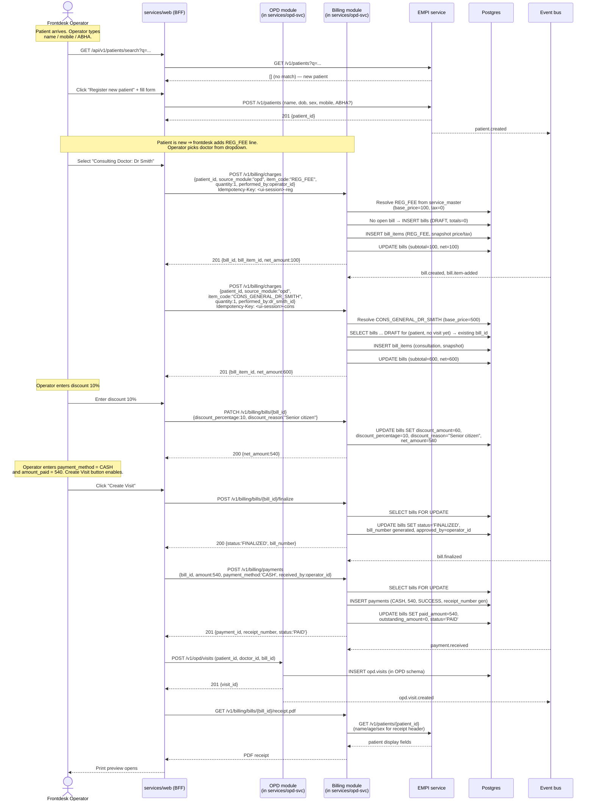
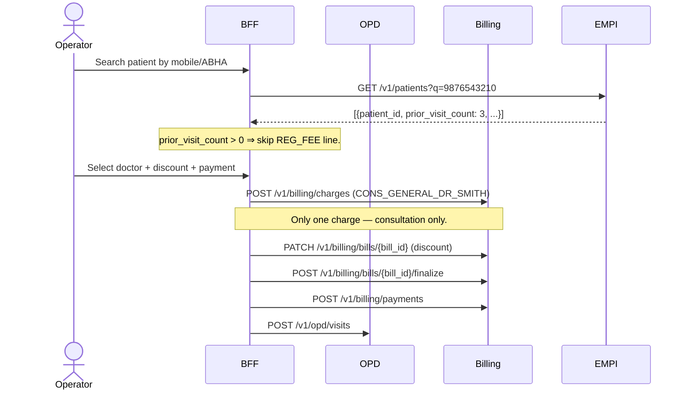
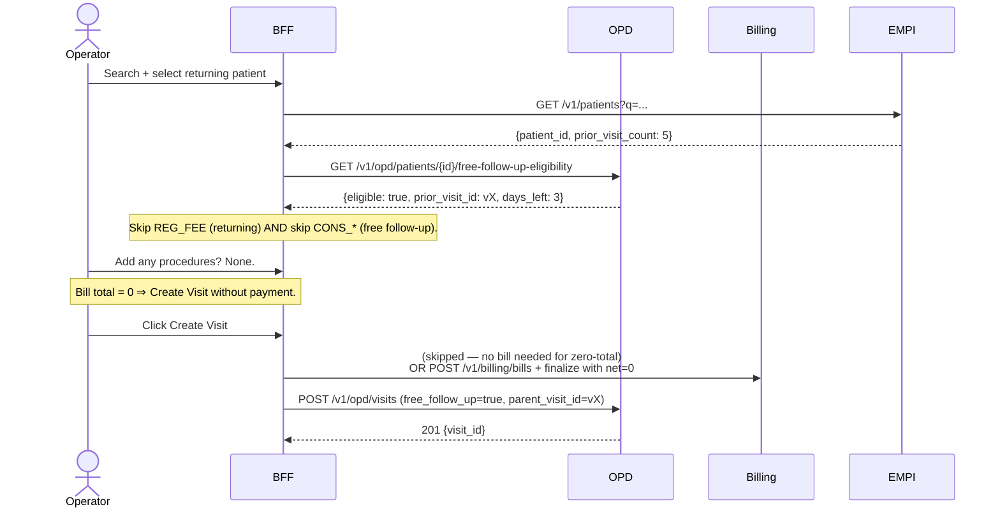
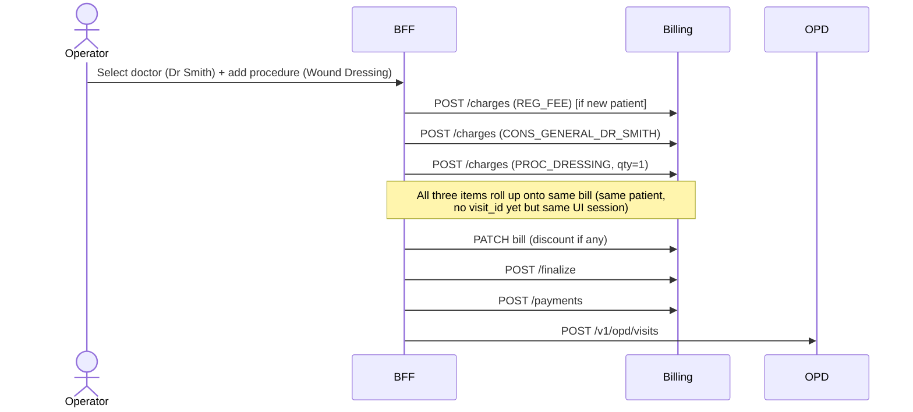
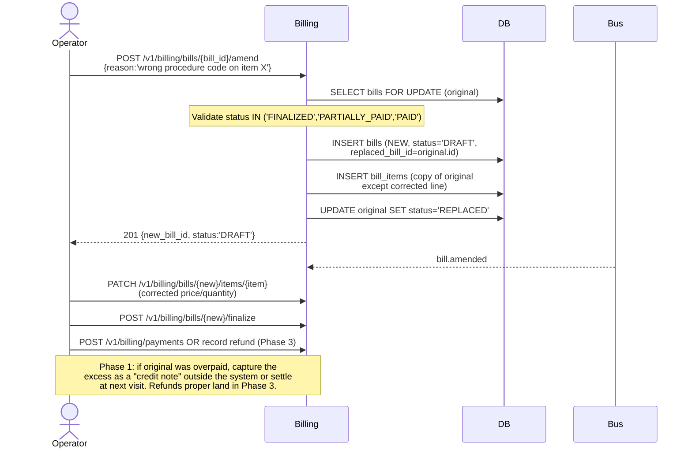
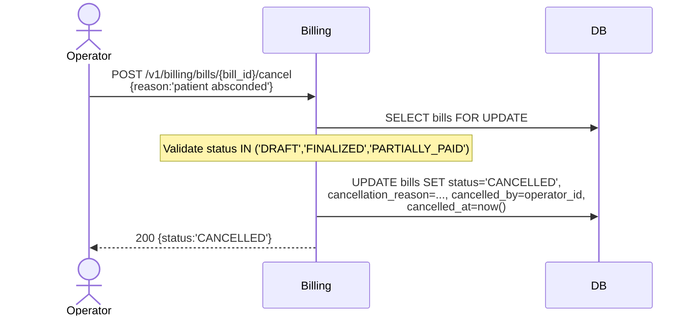
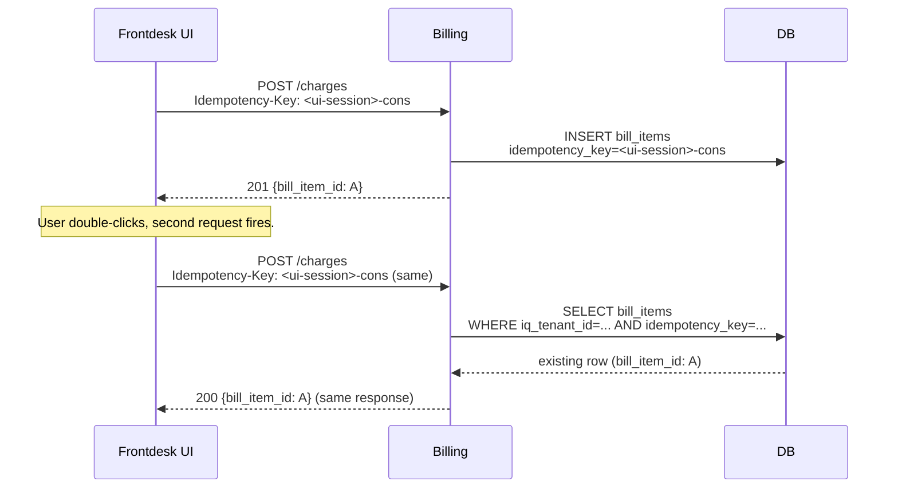

# Billing — Scenarios

**Module:** Billing
**Related:** [01-schema-design.md](./01-schema-design.md) | [HLD 06 — Billing](../../hld/06-billing.md) | [ADR-0025](../../adr/0025-billing-module-shape-and-phasing.md)

This document walks through the Phase 1 happy-path and corner-case flows the schema supports — chosen to match the existing production HIMS OPD counter flow as closely as possible. Phase 2 scenarios (insurance, advances, discount-approval workflow, partial payments) are sketched at the bottom for forward reference.

Sequence diagrams use Mermaid. Actors:

- **Operator** — frontdesk / counter / cashier; uses the web BFF.
- **OPD module** — visit creation, free-follow-up flag, prior-visit check.
- **Billing** — `modules/billing` library (embedded in `services/opd-svc` in Phase 1).
- **EMPI** — patient identity service.
- **Bus** — in-process event bus ([ADR-0017](../../adr/0017-in-process-event-bus-phase-0.md)) in Phase 1.

The four Phase 1 tables exercised: `service_master`, `bills`, `bill_items`, `payments`.

---

## Scenario 1 — New patient OPD registration (the production-parity flow)

**This is the canonical Phase 1 flow.** A patient walks up to the frontdesk for the first time. The operator finds-or-creates the patient (EMPI), captures the registration fee + the consulting doctor's consultation fee, applies a discount if any, takes a single payment, and clicks **Create Visit**. The bill goes DRAFT → FINALIZED → PAID inside that single click, exactly as in the existing production HIMS.



**What the schema enforces:**

- Bill cannot accept a payment in `DRAFT` status (`CHECK (status != 'DRAFT' OR paid_amount = 0)`). The frontdesk UI's "Create Visit" disable-until-amount-matches is a UI guard; the DB constraint is the backstop.
- `bills.outstanding_amount = net_amount - paid_amount` invariant re-asserted on every payment.
- Idempotency-Key on charge POSTs prevents duplicate line items on double-click or network retry.
- The snapshotted `bill_items.unit_price` and `tax_percentage` are immutable; tomorrow's catalog price update does not retroactively change today's receipt.

**Mapping to existing production:** every step above mirrors what the operator does in the production HIMS today, with the same data captured: registration fee, doctor-specific consultation, discount %, payment mode + amount = total, Create Visit click. No new concepts introduced.

---

## Scenario 2 — Return-visit registration (no registration fee)

Same as Scenario 1 except the patient has visited before. The frontdesk UI checks `prior_visit_count > 0` (via EMPI or via OPD's prior-visit count) and **suppresses the REG_FEE line**.



**Key behaviour:** the absence of the REG_FEE charge is the absence — no special "is_returning" column on `bill_items`. Schema is unchanged.

**Where does `prior_visit_count` come from?** Phase 1 implementation: EMPI exposes it as a derived field on the patient resource (cheap projection from OPD's visit table via a `opd.visit.created` consumer). Phase 1.5 alternative: OPD's `GET /v1/opd/patients/{id}/visit-count` endpoint, called by the frontdesk UI directly.

---

## Scenario 3 — Free-follow-up visit (no consultation fee)

The patient's prior consultation marked this follow-up as free (within X days). The frontdesk UI shows a "Free follow-up applies" banner and suppresses the consultation line.



**Phase 1 decision (deferred to dev):** for zero-total visits, do we still create a $0 bill row for audit symmetry, or skip the bill entirely? Recommendation: create a `bill_type='STANDALONE'` bill with `net_amount=0` and `status='PAID'` directly, with no `payments` row. This keeps "every visit has a bill" invariant and makes reporting consistent. Documented in [dev-doubts](./dev-doubts/01.md).

---

## Scenario 4 — Multi-line OPD visit (consultation + minor procedure)

The visit produces more than one chargeable line — the doctor performs a wound dressing or administers an injection during the consultation. Frontdesk captures all charges before Create Visit.



**Key behaviour:** all three charges arrive at billing **before** finalize. The bill accumulates line items in DRAFT state. Frontdesk's "Create Visit" disable-until-paid-matches-total guards the operator. No advances, no approval workflow, no partial payment — exactly the existing-production model.

---

## Scenario 5 — Bill amendment (replacement chain)

A finalised + paid bill is discovered to have a wrong procedure code (the actual procedure was cheaper). The bill is amended.



**Key behaviour:**

- Original bill is preserved with `status='REPLACED'` — never DELETEd.
- The new bill carries `replaced_bill_id` pointing back. Audit trail = the chain.
- Phase 1 has no refunds table (Phase 3); over/under-collection from an amendment is settled at the next visit or recorded as a manual note. This is also what existing production does — amendments at the counter are rare and handled informally.

---

## Scenario 6 — Bill cancellation (post-finalize)

Patient leaves without paying after the bill is raised, or the visit is voided. Cancel the bill.



Phase 1 caveat: any payments already on the bill remain as `payments` rows. If the patient had partially paid before absconding (rare in this flow because amount-paid-must-match-total — but possible if multiple payments were taken across visits), those payment rows stay; refund proper is Phase 3.

---

## Scenario 7 — Idempotent charge-ingest replay

The frontdesk UI double-submits the same charge (operator double-clicks "Add Consultation", or a network blip causes a retry).



**Key behaviour:**

- `UNIQUE (iq_tenant_id, idempotency_key) WHERE idempotency_key IS NOT NULL` on `bill_items` ensures at most one row per key.
- On replay, the handler returns the existing row's data — no 409, no duplicate.
- Phase 1 frontdesk UI generates the Idempotency-Key client-side as `<ui_session_id>-<line_purpose>` (e.g., `abc123-reg`, `abc123-cons`, `abc123-proc-1`).

---

## Phase 2 scenarios (sketches — for forward reference)

The following flows are deliberately **not** in Phase 1. They are sketched here so the team understands how the same schema extends, but they require Phase 2 tables (`patient_advances`, `discount_approvals`, `price_agreements`, `insurance_*`, `corporate_clients`) which Phase 1 does not ship.

### P2-Scenario A — Patient advance receipt + utilisation (Phase 2)

Patient pays ₹2000 at IPD admission (deposit); later the bill of ₹1500 is utilised against it.

```
POST /v1/billing/advances {patient_id, advance_amount:2000, ...}
   → INSERT patient_advances + INSERT payments(method=ADVANCE_RECEIPT)
POST /v1/billing/advances/{id}/utilize {bill_id, utilized_amount:1500}
   → INSERT advance_utilizations + UPDATE patient_advances balance
   → UPDATE bills.advance_adjusted
```

`SELECT ... FOR UPDATE` on the advance row + `CHECK (available_balance >= 0)` guards over-utilisation.

### P2-Scenario B — Discount with approval workflow (Phase 2)

Operator wants to apply a 20% discount on a ₹10,000 bill; threshold (in Configurator) says >15% needs `MEDICAL_SUPERINTENDENT` approval.

```
POST /v1/billing/bills/{id}/discount {discount_percentage:20, reason:'BPL'}
   → INSERT discount_approvals (status='PENDING')
   → bill remains DRAFT with no discount applied yet
Approver: POST /v1/billing/discount-approvals/{id}/approve
   → UPDATE discount_approvals + recompute bill totals + apply discount
```

Phase 1 does not have this — operators apply any % freely (the existing-prod behaviour).

### P2-Scenario C — Cashless insurance flow (Phase 2)

Pre-authorisation request → Integration Hub calls TPA → preauth_number captured → treatment proceeds with charges captured normally → claim submission at discharge → Integration Hub submits → settlement callback updates `insurance_claims` + creates `payments` row of method `INSURANCE_DISBURSEMENT` + updates `bills.insurance_paid_amount`.

See [HLD 05 §4](../../hld/05-integration-and-interop.md) for the FSM ownership split (Integration Hub owns the workflow; billing owns the data of record).

### P2-Scenario D — Partial-then-full payment (Phase 2 — not in Phase 1)

Phase 1 enforces `amount_paid == net_amount` at finalize time (existing-prod constraint). A bill that's `PARTIALLY_PAID` does not arise in Phase 1's frontdesk flow. The state exists in the schema for Phase 2+ when corporate-credit billing introduces "bill now, collect later" semantics.

---

## References

- [01-schema-design.md](./01-schema-design.md) — schema details for every table touched here
- [HLD 06 — Billing](../../hld/06-billing.md)
- [ADR-0025 — Billing module shape and phasing](../../adr/0025-billing-module-shape-and-phasing.md) — phasing rationale + lazy-explosion catalog approach
- [HLD 05 — Integration and interop](../../hld/05-integration-and-interop.md) — Integration Hub's role in Phase 2 insurance flows
- [dev-doubts/01.md](./dev-doubts/01.md) — implementation choices
