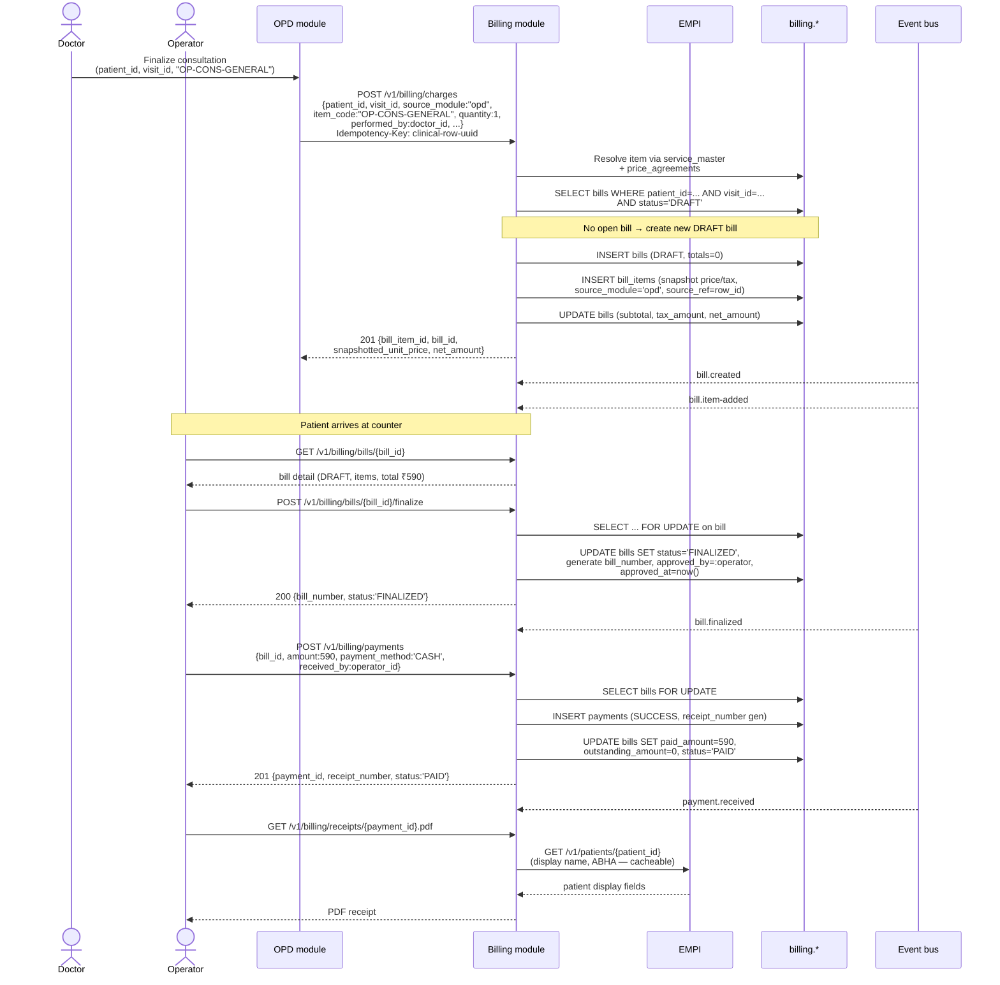
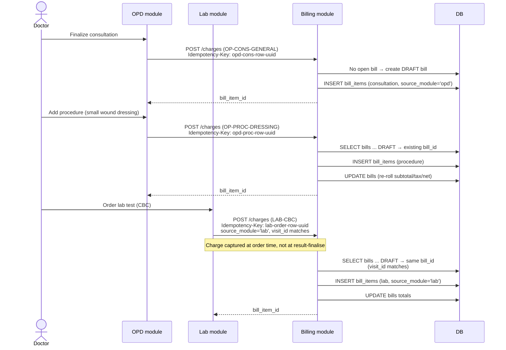
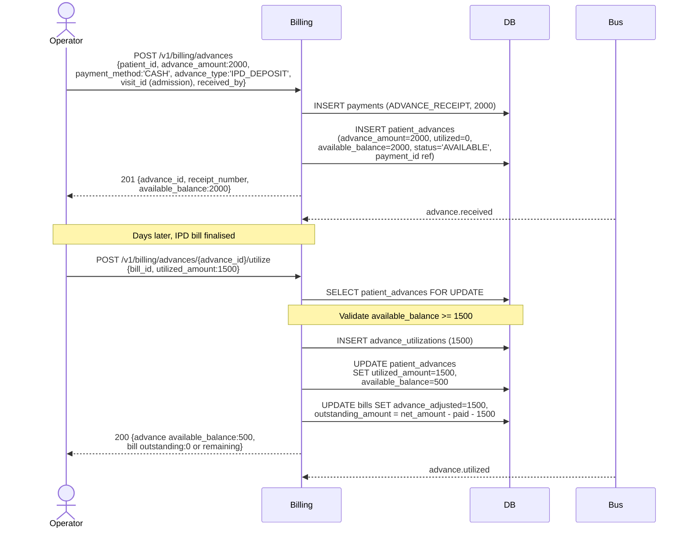
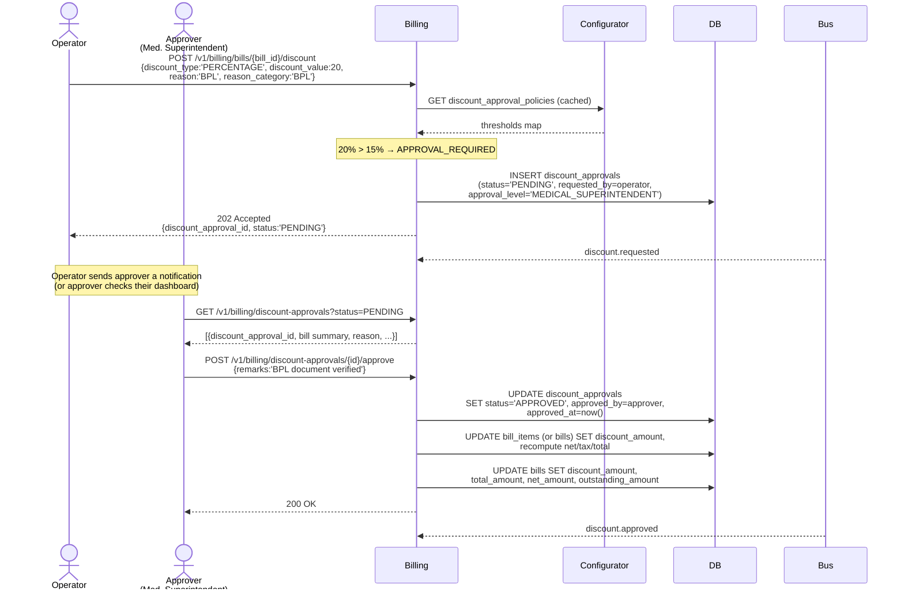
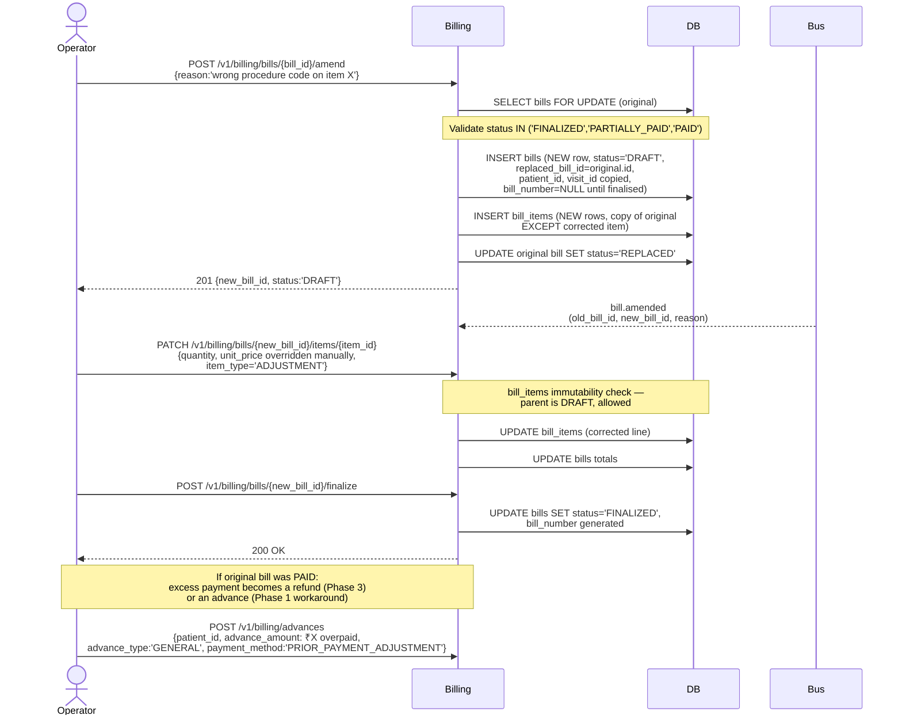
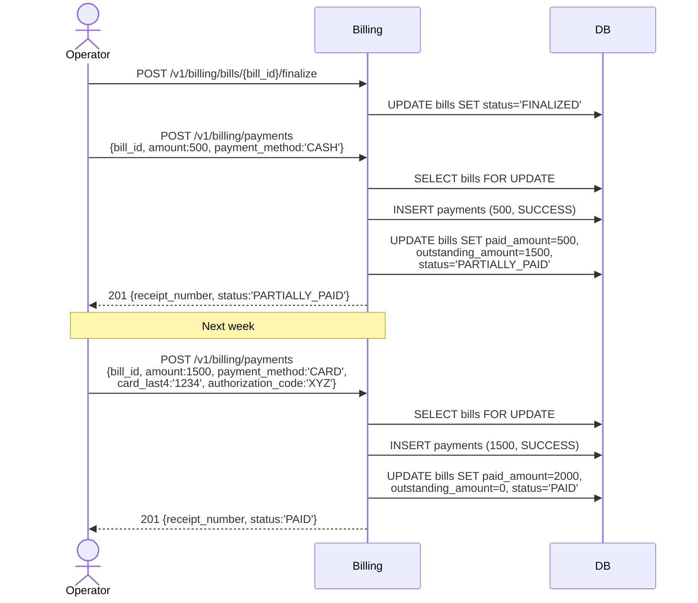
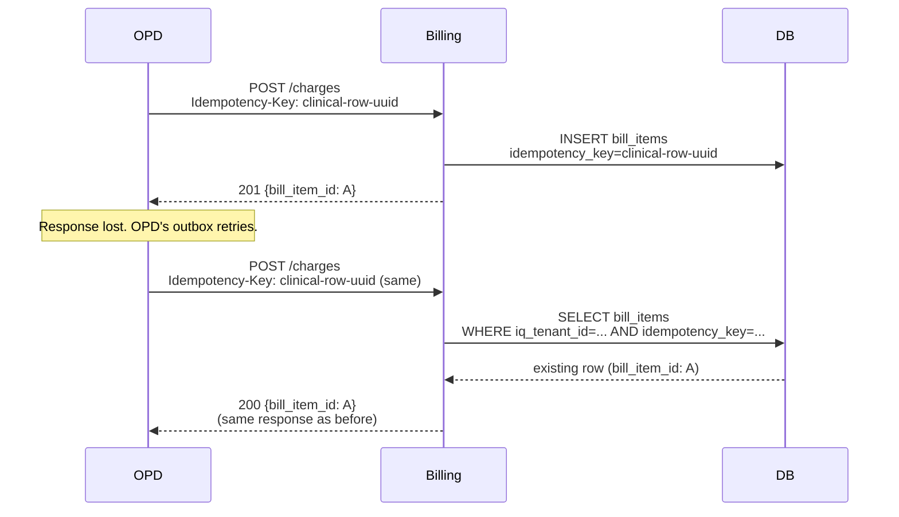
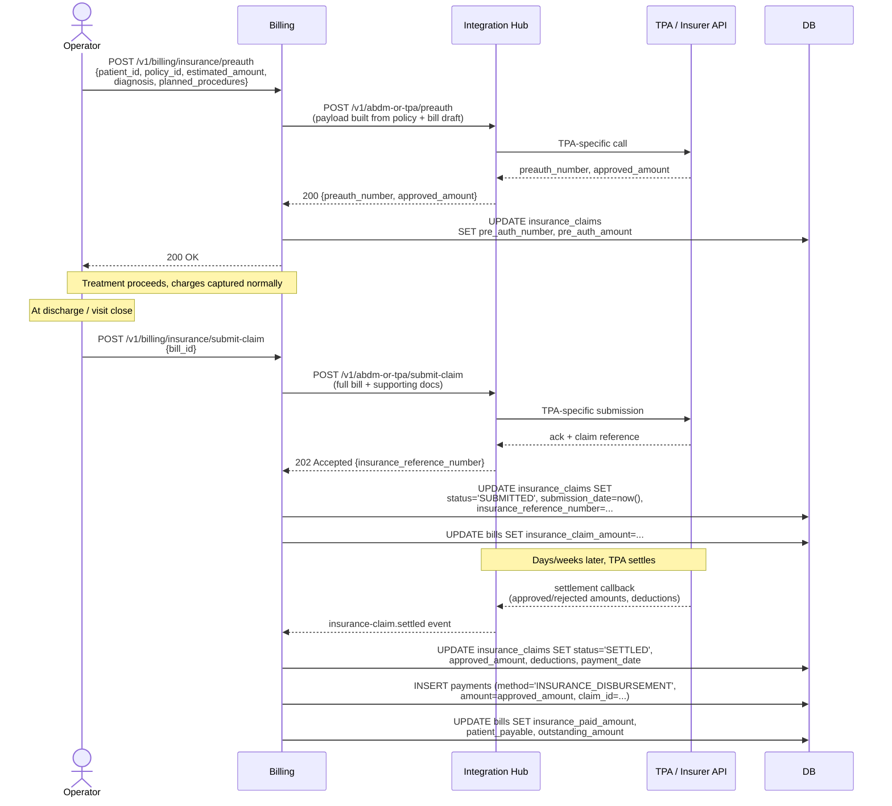
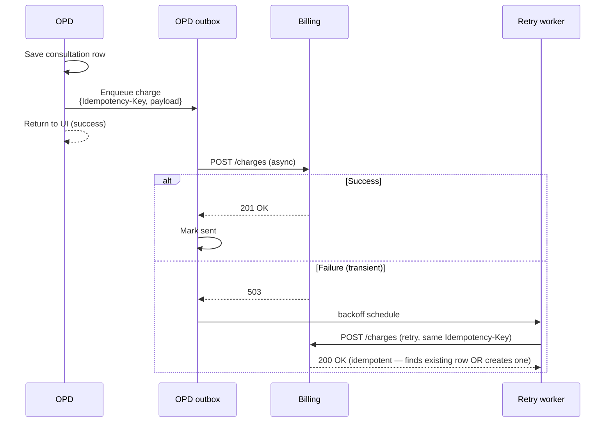

# Billing — Scenarios

**Module:** Billing
**Related:** [01-schema-design.md](./01-schema-design.md) | [HLD 06 — Billing](../../hld/06-billing.md) | [ADR-0025](../../adr/0025-billing-module-shape-and-phasing.md)

This document walks through the Phase 1 (and select Phase 2) happy-path and corner-case flows that the schema supports. Sequence diagrams use Mermaid. Actors:

- **Operator** — counter / cashier / billing clerk at the desk; uses the web BFF.
- **Doctor** — clinician finalising an OPD/IPD/Lab event from the clinical module.
- **Clinical Module** — OPD, IPD, Lab, Pharmacy, Radiology, etc. Phase 1 = OPD only.
- **Billing** — the `modules/billing` library (embedded in `services/opd-svc` in Phase 1).
- **EMPI** — patient identity service.
- **Configurator** — config / threshold lookup.
- **Bus** — the in-process event bus ([ADR-0017](../../adr/0017-in-process-event-bus-phase-0.md)) in Phase 1; replaced by the durable bus in Phase 2+.

---

## Scenario 1 — Single OPD charge → bill → cash payment → receipt (Phase 1 parity flow)

The happy path that reproduces the production HIMS OPD counter flow exactly.



**What the schema enforces:**

- The `Idempotency-Key` on charge-ingest ensures that if OPD retries the call (network blip, clinical-row save before billing ack), the same `bill_items` row is returned, not a new one.
- The bill cannot accept a payment in `DRAFT` status (`CHECK (status != 'DRAFT' OR paid_amount = 0)`).
- The `bills.outstanding_amount = net_amount - paid_amount - advance_adjusted` invariant is re-asserted in every payment transaction.
- The snapshotted `bill_items.unit_price` and `tax_percentage` are immutable; a future change to `service_master.base_price` does not retroactively change the receipt.

---

## Scenario 2 — Multi-charge OPD visit (consultation + procedure + lab)

A single OPD visit produces three charges from three modules (OPD consultation, OPD procedure, Lab test order). They accumulate onto one bill.



**Key behaviour:**

- Three modules emit charges; one bill accumulates them because `(patient_id, visit_id)` is shared.
- Each `bill_items` row carries `source_module` and `source_ref`, so reverse-lookup from a clinical row to its billing line is always possible.
- The bill stays in `DRAFT` until the operator finalises. New charges may still be added while it is `DRAFT`.
- Whether Lab posts a charge *at order time* (Phase 1 default) or *at result-finalise time* is a [dev-doubt](./dev-doubts/01.md#lab-charge-timing); the schema supports both.

---

## Scenario 3 — Patient advance receipt and utilisation

Patient pays ₹2000 in advance at the start of an IPD stay; later the bill of ₹1500 is utilised against the advance, leaving ₹500 available.



**Key behaviour:**

- `SELECT ... FOR UPDATE` on the advance row serialises concurrent utilisations against the same advance.
- `CHECK (available_balance >= 0)` guards against double-spend at the DB level.
- `bills.advance_adjusted` is incremented; `outstanding_amount` is re-derived.
- A second utilisation of ₹500 against another bill works the same way; on third utilisation that would breach the balance, the CHECK constraint fails and the application returns `409 Conflict`.

---

## Scenario 4 — Discount with approval (above threshold)

Operator wants to apply a 20% discount on a ₹10,000 bill. Threshold table says >15% needs `MEDICAL_SUPERINTENDENT` approval.



**Key behaviour:**

- Operator request is non-blocking — the bill remains in `DRAFT` with the discount pending. A separate workflow loop pushes notifications to approvers (out of billing scope).
- On approval, billing recomputes line and bill totals atomically.
- If the approver rejects, `discount_approvals.status='REJECTED'`; bill remains unchanged.
- A ≤5% discount applied by the operator bypasses this workflow entirely — the bill_items row's `discount_amount` is set directly and no approval row is created.

---

## Scenario 5 — Bill amendment (replacement chain)

A finalised bill of ₹5000 is discovered to have a wrong procedure code (the actual procedure was cheaper). The bill is amended.



**Key behaviour:**

- The original bill row is preserved with `status='REPLACED'` — never DELETED.
- The new bill carries `replaced_bill_id` pointing back. The audit trail is the chain.
- Until Phase 3 refunds ship, an overpayment from the original becomes a `patient_advances` row that can be utilised against future bills. The dev-doubts doc records this Phase 1 workaround.

---

## Scenario 6 — Partial payment, then full payment

Patient pays ₹500 of a ₹2000 bill in cash today; pays the remaining ₹1500 by card next week.



---

## Scenario 7 — Bill cancellation (post-finalize)

Patient walked out without paying; bill needs to be cancelled, advances released back.

```mermaid
sequenceDiagram
    actor Operator
    actor Approver
    participant Billing
    participant DB

    Note over Operator: Bill is PARTIALLY_PAID;<br/>patient has gone

    Operator->>Billing: POST /v1/billing/bills/{bill_id}/cancel<br/>{reason:'patient absconded',<br/>approver_id:approver_id}
    Note over Billing: Configurable: post-finalize cancel<br/>requires approval. Phase 1 check is application-layer.
    Billing->>DB: SELECT bills FOR UPDATE
    Note over Billing,DB: Validate status IN ('DRAFT','FINALIZED','PARTIALLY_PAID')
    Billing->>DB: UPDATE bills SET status='CANCELLED',<br/>cancellation_reason=..., cancelled_by=...,<br/>cancelled_at=now()
    Note over Billing,DB: Released advances:<br/>UPDATE patient_advances<br/>SET utilized_amount -= released,<br/>available_balance += released<br/>(Soft-delete the advance_utilizations rows)
    Billing-->>Operator: 200 {bill status:'CANCELLED', payments retained}

    Note over Operator,Billing: Paid amounts remain as payments rows;<br/>they become refunds in Phase 3 (or<br/>unallocated advances as the Phase 1 workaround).
```

---

## Scenario 8 — Idempotent charge-ingest replay

OPD's `finalize-consultation` use-case posts a charge, but the response is lost (network blip). OPD retries with the same `Idempotency-Key`.



**Key behaviour:**

- The `UNIQUE (iq_tenant_id, idempotency_key)` partial index on `bill_items` ensures at most one row exists per key.
- On replay, the handler reads the existing row and returns the same response, not 409.
- TTL for the idempotency-key uniqueness window is a [dev-doubt](./dev-doubts/01.md#idempotency-key-ttl); recommendation is "keep for 30 days then sweep with a job."

---

## Scenario 9 — Phase 2 sketch: cashless insurance with pre-authorisation

The Phase 2 cashless flow involves Integration Hub for transport and FSM, and billing for data. This sketch shows the cross-module choreography.



**Ownership recap** (per [HLD 05 §4](../../hld/05-integration-and-interop.md)):

| Concern | Owner |
|---|---|
| FSM for cashless / reimbursement flow | Integration Hub |
| Transport to TPA / insurer | Integration Hub |
| The data of the claim (amounts, status, audit) | Billing's `insurance_claims` |
| Roll-up onto `bills.insurance_*_amount` | Billing |

---

## Scenario 10 — Charge-ingest failure handling (Phase 1)

OPD's charge-ingest call fails: billing is unavailable, network error, or 500.

**Phase 1 (embedded):** OPD and billing share a process. If billing fails, OPD likely fails too — there is no separation to recover from. The clinical-row save in OPD is the persistent state; on operator-driven retry, the charge can be re-posted.

**Phase 2+ (extracted):**



**Key behaviour:**

- The clinical flow does not block on billing availability.
- The outbox preserves the charge intent; the same Idempotency-Key prevents duplicates.
- After N retries, the outbox surfaces a persistent failure to an ops dashboard. Manual reconciliation is possible because the source clinical row is the recoverable truth.

---

## References

- [01-schema-design.md](./01-schema-design.md) — schema details for every table touched here
- [HLD 06 — Billing](../../hld/06-billing.md)
- [ADR-0025 — Billing module shape and phasing](../../adr/0025-billing-module-shape-and-phasing.md)
- [HLD 05 — Integration and interop](../../hld/05-integration-and-interop.md) — Integration Hub's role in Phase 2 insurance flows
- [Integration Platform FSM specifications](../integration-platform/02-fsm-specifications.md) — the FSM that drives a cashless claim
- [dev-doubts/01.md](./dev-doubts/01.md) — implementation choices the developer makes
