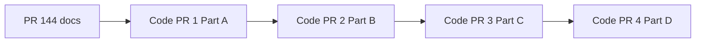

# Integration Hub — LLD index

**GitHub:** [Issue #143 — Phase 1a: Restructure abdm-adapter into integration-hub](https://github.com/IQ-Line/HospitalSaarthi/issues/143)

## PR roadmap (strict order — develop sequentially)

| Step | PR | Purpose | Status |
|------|-----|---------|--------|
| **0** | **#144** | **Docs only** — LLD + guides. Title: `docs(integration-hub): Phase 1a spec` | Complete first |
| **1** | Code PR 1 | Part A — Configurator profiles + scaffold + copy `abdm` (no behaviour change) | After #144 |
| **2** | Code PR 2 | Part B — `integrationContextResolver`, `/api/v3`, M2 consumers (**highest risk**) | After Code PR 1 |
| **3** | Code PR 3 | Part C — `integration_hub` schema + `integration-hub-svc` | After Code PR 2 |
| **4** | Code PR 4 | Part D — delete `abdm-adapter`, regression matrix | After Code PR 3 |

**Do not** start Code PR 2 before Code PR 1 merges, etc. Implementation is **not** complete until Step 4 merges. Details: [03-safe-migration §2](./03-safe-migration-and-cutover.md#2-recommended-code-pr-sequence).

## What to read first

| Doc | Audience | Purpose |
|-----|----------|---------|
| [**01-phase-1a-restructure-and-multi-tenant.md**](./01-phase-1a-restructure-and-multi-tenant.md) | Implementers | **Canonical scope** for Issue #143 — module layout, `tenant_integration_profiles`, env migration, migration parts A–D |
| [**02-issue-143-coverage-matrix.md**](./02-issue-143-coverage-matrix.md) | Tech lead / reviewer | Verifies issue body + comments are documented; file touch list |
| [**03-safe-migration-and-cutover.md**](./03-safe-migration-and-cutover.md) | Implementers | PR split, rollback, **callback deps** (do not break M2/M3), regression matrix |
| [**../../guides/integration-hub-phase-1a-implementation.md**](../../guides/integration-hub-phase-1a-implementation.md) | Developers | Checklist, E2E smoke test, seeding profiles, cutover notes |
| [../integration-platform/orientation.md](../integration-platform/orientation.md) | New hires | Long-term Integration Platform vision (FSM tables, 13-table target) |
| [../integration-platform/04-orchestration-phase-1-http-first.md](../integration-platform/04-orchestration-phase-1-http-first.md) | Architects | HTTP-first orchestration (full generic hub — **mostly deferred** beyond Phase 1a) |
| [../abdm-adapter/01-overview.md](../abdm-adapter/01-overview.md) | ABDM devs | Current Phase 0 `abdm-adapter` behaviour until cutover |

## Phase 1a vs full Integration Platform

Issue #143 **Phase 1a** deliberately ships a **narrow slice**:

1. Rename/rehome `modules/abdm-adapter` → `modules/integration-hub/integrations/abdm/`
2. Rename service → `services/integration-hub-svc`
3. Move DB schema `abdm_adapter` → `integration_hub` (same 8 ABDM tables, same columns)
4. Per-tenant ABDM credentials in `configurator.tenant_integration_profiles`, resolved per request

It does **not** (Phase 1b+) add `integrations` registry, `integration_workflow_transitions`, timer worker, consent table merge, or `atomic-transition.ts`. Those appear in older platform LLDs and in GitHub issue comment attachments — treat them as **deferred**, not Phase 1a blockers.

## Related ADRs

- [ADR-0030 — ABDM adapter prototype phase](../../adr/0030-abdm-adapter-prototype-phase.md)
- [ADR-0011 — Integration Hub split](../../adr/0011-integration-hub-split.md)
- [ADR-0027 — FSM orchestration](../../adr/0027-fsm-orchestration-for-integration-hub.md) (deferred)
