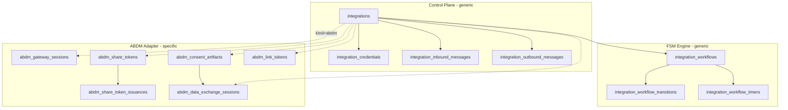
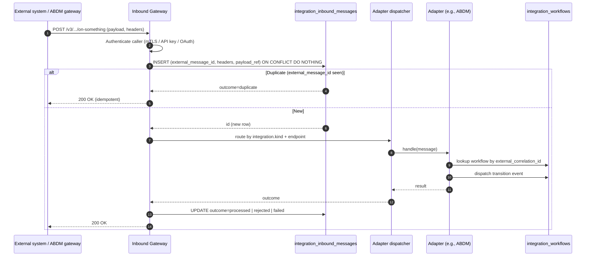

# Integration Platform -- Schema Design

**Module:** Integration Hub (control plane + ABDM adapter)
**Schema name:** `integration_hub`
**Service:** `services/integration-hub-svc/` (Phase 0)
**Module:** `modules/integration-hub/` (Phase 0)
**Related HLD:** [05-integration-and-interop.md](../../hld/05-integration-and-interop.md) (sections 1-4, 7)
**Related ADRs:**
- [ADR-0011](../../adr/0011-integration-hub-split.md) -- Inbound/Outbound split with shared control plane
- [ADR-0027](../../adr/0027-fsm-orchestration-for-integration-hub.md) -- Custom FSM engine
- [ADR-0028](../../adr/0028-record-foundation-fifth-core-module.md) -- Record Foundation owns clinical records (boundary)
- [ADR-0022](../../adr/0022-immutable-fhir-document-storage.md) -- Immutable FHIR Document Bundles
- [ADR-0023](../../adr/0023-distributed-fhir-assembly.md) -- Distributed FHIR assembly
- [ADR-0010](../../adr/0010-fhir-hl7-interop-standards.md) -- FHIR R4 baseline
- [ADR-0013](../../adr/0013-single-database-engine-postgresql.md) -- PostgreSQL only
**ERDs (visual, one per phase, cumulative — open in VS Code with the dineug ERD Editor extension):**
- [`integration-platform.phase-0.erd.json`](./integration-platform.phase-0.erd.json) — 7 tables: generic control plane + FSM engine. No ABDM yet.
- [`integration-platform.phase-1.erd.json`](./integration-platform.phase-1.erd.json) — 13 tables: adds the six ABDM adapter tables.
**Schema reference (programmatic):** [`schema-reference.json`](./schema-reference.json)
**FSM specifications:** [`02-fsm-specifications.md`](./02-fsm-specifications.md)
**Scenarios (sequence diagrams):** [`03-scenarios.md`](./03-scenarios.md)

---

## 1. Scope and non-scope

The Integration Hub is the platform's external boundary. It is **always deployed** alongside the four (now five, per [ADR-0028](../../adr/0028-record-foundation-fifth-core-module.md)) core modules. It is not an optional feature module. Per [HLD 05 section 1](../../hld/05-integration-and-interop.md#1-integration-hub-overview), the Hub runs as two services -- Inbound Gateway and Outbound Connector -- sharing one control plane.

This LLD covers the **control plane data model** (the tables that both services read/write) and the **ABDM adapter schema** (the first integration to register against the control plane). HL7v2 lab analyzer, SOAP/XML TPA, and other adapter-specific schemas will be added in their own LLD increments when those integrations come online.

| In scope (this LLD) | Out of scope |
|---|---|
| Generic integration registry | Per-integration mapping configuration UIs (Configurator's responsibility) |
| Credential vault references (paths only) | Vault implementation (Azure Key Vault, etc. -- see HLD 05 section 7.3) |
| Durable workflow FSM tables | The FSM engine's TypeScript implementation (lives in `@hims/ts-sdk-workflow` -- separate package) |
| Inbound message log (idempotency) | HL7v2 parser implementation |
| Outbound message log (retry/circuit) | Circuit-breaker library choice |
| Audit stream | SIEM integration (downstream consumer of the audit stream) |
| ABDM gateway sessions, share tokens, consent artifacts, link tokens, data-exchange sessions | FHIR resource/bundle assembly (Record Foundation, [ADR-0023](../../adr/0023-distributed-fhir-assembly.md)) |
| ABDM scan-and-share token counter | Patient registration UX (EMPI + the Web BFF) |

This LLD assumes [Configurator LLD](../configurator/01-schema-design.md) provides facility config, [EMPI PR #12](https://github.com/IQ-Line/HospitalSaarthi/pull/12) provides patient identity, and [Record Foundation LLD](../record-foundation/01-schema-design.md) provides care contexts and bundle storage. All three are LLD prerequisites.

---

## 2. Schema-at-a-glance

The twelve tables in `integration_hub` divide into three layers.

| Layer | Tables | What they hold |
|---|---|---|
| **Control plane (generic)** | `integrations`, `integration_credentials`, `integration_inbound_messages`, `integration_outbound_messages` | The shared infrastructure used by every adapter -- registry, credentials, operational transport logs. Not ABDM-specific. **Audit posture:** per [ADR-0024](../../adr/0024-audit-deferred-to-pre-prod.md), there is no per-module audit table. The two transport-message logs and the workflow transition log below are *operational* artefacts (idempotency, retry, observability); the future centralized audit consumer projects regulatory audit from them + domain events. |
| **FSM engine (generic)** | `integration_workflows`, `integration_workflow_transitions`, `integration_workflow_timers` | The durable workflow state machine described in [ADR-0027](../../adr/0027-fsm-orchestration-for-integration-hub.md). Reused by every multi-step adapter. |
| **ABDM adapter (specific)** | `abdm_gateway_sessions`, `abdm_share_tokens`, `abdm_share_token_issuances`, `abdm_consent_artifacts`, `abdm_link_tokens`, `abdm_data_exchange_sessions` | ABDM protocol state. The first adapter built; every other ABDM-specific datum lives in this layer's tables. |

The full column-level definitions are in [`schema-reference.json`](./schema-reference.json). The narrative below explains the design choices that the JSON's structure cannot.



---

## 3. Distribution and tenancy

Per [ADR-0012](../../adr/0012-multi-tenancy-isolation-strategy.md), every table is distributed by `iq_tenant_id`. There are **no reference tables** in this schema. This is deliberate:

- `integrations` is per-tenant: an organization can run with the ABDM-sandbox integration, while another runs with the ABDM-production integration. Configuration is per-tenant.
- Workflows belong to a tenant's patients and a tenant's integrations -- joining workflow state to EMPI patients or to OPD events requires shard-locality.
- Transport message logs are per-tenant by query pattern. Tenant A never reads Tenant B's inbound/outbound message stream.

The cost: `integration_workflow_timers` is queried *globally* by the timer worker (find all due timers across all tenants). To keep the global poll efficient, the timer worker uses a non-tenant-leading index (`(status, fire_at)`) and re-establishes tenant context on each fire. This is the only Integration Hub table whose primary read pattern is cross-tenant.

---

## 4. Generic control plane (sections 4.1-4.5)

### 4.1 `integrations` -- the registry

One row per (tenant, external system, direction). Adapter behaviour at runtime is fully driven by the row's `kind` and `config` columns -- the adapter dispatcher reads `kind` to select the handler implementation and reads `config` for adapter-specific parameters. This is explicit programmable configuration, not classes-and-strategy-pattern indirection.

ABDM-specific config (sandbox example):

```json
{
  "clientIdRef": "env:ABDM_SANDBOX_CLIENT_ID",
  "clientSecretRef": "env:ABDM_SANDBOX_CLIENT_SECRET",
  "gatewayBaseUrl": "https://dev.abdm.gov.in/api/hiecm/gateway/v3",
  "cmId": "sbx",
  "hfrFacilityIdRef": "configurator://facilities/<facilityId>/hfrId",
  "hipBaseUrl": "https://hip.example.org",
  "environment": "sandbox"
}
```

The `env:` URI scheme is the Phase 0/1 default (see §4.2). A production tenant migrates these values to `azure-keyvault://...` (or `aws-sm://...`, `vault://...`) without any schema or code change — the secrets SDK resolves whichever scheme the reference uses.

The `hfrFacilityIdRef` is intentionally indirected through Configurator. Per the question-1 decision, HFR facility IDs live in Configurator, and Integration Hub looks them up at runtime via Configurator's API. This avoids duplicating per-facility identity across two modules.

### 4.2 `integration_credentials` -- references, not bytes

The architecture stores **references** to credentials, never the credentials themselves. The `vault_ref` column is opaque to Integration Hub -- the platform's `@hims/ts-sdk-secrets` package is responsible for resolving the reference to a runtime credential value. The resolver dispatches by URI scheme:

| Scheme | Resolver | Where used |
|---|---|---|
| `env:ABDM_CLIENT_SECRET` | `process.env.ABDM_CLIENT_SECRET` | **Phase 0/1 default** — local dev, sandbox, first-pilot tenant using a single set of platform-owned ABDM sandbox credentials |
| `azure-keyvault://hims/abdm/sandbox/clientSecret` | Azure SDK | Production tenants once Azure Key Vault is provisioned |
| `aws-sm://hims/abdm/...` | AWS Secrets Manager SDK | Alternate cloud |
| `vault://...` | HashiCorp Vault SDK | Self-hosted |
| `file:///etc/hims/secrets/abdm-secret` | Filesystem read (dev only) | One-off local override |

Reasons:

- Same column, same code path, different runtime resolution. Migrating a tenant from `env:` to `azure-keyvault://` is a configuration edit, not a code change.
- Credential rotation is a resolver concern; Integration Hub continues to resolve the same `vault_ref` and gets the new credential transparently when the resolver fetches it.
- Per [ADR-0019](../../adr/0019-fastify-node24-lts.md) the Integration Hub runs on Node.js 24 LTS, where cloud SDKs are first-class. Per [ADR-0016](../../adr/0016-polyglot-nx-monorepo-spec-first-contracts.md) future Python adapters reach the same secret stores via per-language clients.

**Phase 0/1 env-var carve-out.** [HLD 05 §7.3](../../hld/05-integration-and-interop.md#73-credentials-vault) is relaxed for Phase 0 / Phase 1: platform-owned sandbox credentials and a single set of ABDM-vendor credentials may live in `.env` files, gated by deployment environment. This unblocks local development without an Azure Key Vault provisioning dependency. **Pre-production gate:** before any *customer-tenant* production deployment, all `env:` credential references for that tenant must migrate to a real secret store and the platform must verify resolution. This gate is owned alongside [ADR-0024](../../adr/0024-audit-deferred-to-pre-prod.md)'s audit gate and tracked on the prod-cutover checklist.

### 4.3 `integration_inbound_messages` and `integration_outbound_messages` -- transport logs

These two tables are nearly mirror images. They exist to provide:

- **Idempotency.** ABDM gateway, like any well-behaved external system, may retry callbacks. The Inbound Gateway dedups using `external_message_id` (e.g., ABDM `requestId`, HL7v2 `MSH-10`).
- **Replay.** Failed processing can be replayed from the stored payload reference without re-fetching from the external system.
- **Forensics.** "What did we receive at 14:32 IST yesterday" is a single SELECT.

The payload itself is stored at `payload_storage_ref` -- a vault/object-storage URL when payloads are large or sensitive, or an inline JSONB row in a development setup. The split keeps the message-log table small (good for indexing, retention pruning) while preserving full payloads where they are needed.

The Inbound Gateway's processing flow is:



### 4.4 Audit posture — no per-module audit table

Per [ADR-0024](../../adr/0024-audit-deferred-to-pre-prod.md), Integration Hub does **not** build a per-module `integration_audit_log` table. The substrate that the future centralized audit consumer projects from on the Integration Hub side:

1. **`integration_inbound_messages` and `integration_outbound_messages`** — every gateway message in or out is captured here (operational purpose: idempotency, retry, observability; regulatory purpose: traceable transport record).
2. **`integration_workflow_transitions`** — every state change of every workflow, append-only by repository-level discipline (the audit-by-construction property of the FSM engine, [ADR-0027](../../adr/0027-fsm-orchestration-for-integration-hub.md)).
3. **Rich domain events** — `abdm.consent.requested`, `abdm.consent.granted`, `abdm.health-record.disclosed`, etc., carrying before/after state and actor per the [CLAUDE.md](../../../../CLAUDE.md) rich-payload rule.
4. **Structured request logs** — every inbound HTTP request carries `request_id`, `actor`, `iq_tenant_id`, `action`, `resource_type`, `resource_id` from the HTTP middleware ([ADR-0024](../../adr/0024-audit-deferred-to-pre-prod.md)).

These four feeds answer "what data left / arrived under consent X" via cross-reference (`consent_id` carried on both message-log rows and workflow-transition rows). The PHI rule is preserved: message bodies live at `payload_storage_ref` (resolved-on-demand by authorised viewer paths with their own request log), never inline.

**Pre-production gate:** ABDM Facilitation Testing requires evidence of audit. Before any customer-tenant prod deployment, the centralized audit consumer must be live and the four substrates above must be confirmed flowing into it. This gate is the same one [ADR-0024](../../adr/0024-audit-deferred-to-pre-prod.md) defines for the platform.

### 4.5 Boundary against Configurator

Integration Hub does **not** own:

- Tenant registry -- in `configurator.tenants` ([Configurator LLD](../configurator/01-schema-design.md)).
- Facility / HFR IDs -- in Configurator (decision: question 1).
- ABDM credential bytes -- resolved by `@hims/ts-sdk-secrets` from whatever store the `vault_ref` points to (`env:` for Phase 0/1, real store before prod).
- Module enablement -- in Configurator's `module_enrollments`.

When the Integration Hub needs facility data, it calls Configurator's API. When it needs credentials, it calls the secrets SDK. This is enforced by the no-cross-schema-FK rule in [database principles](../../analysis/03-database-principles.md).

---

## 5. FSM engine (sections 5.1-5.4)

The FSM engine is the most consequential piece of the control plane and the one that distinguishes the new platform from `abdi-lims-backed`'s ad-hoc status-field approach. The full justification is [ADR-0027](../../adr/0027-fsm-orchestration-for-integration-hub.md); the schema and runtime patterns are described here.

> **Phase 1 implementation (FSM-lite).** Per [ADR-0026](../../adr/0026-fsm-lite-phase-1.md), Phase 1 implements the six ABDM flows (M1, scan-and-share, M2, M3 HIP, M3 HIU, consent supervisor) as **plain TypeScript code** that reads and writes the three FSM tables below using a small helper package (`@hims/ts-sdk-workflow` exporting `loadWorkflow`, `transitionTo`, `scheduleTimer`, `clearTimer`). The generic engine (JSON definitions, JSON-Logic guards, declarative side-effect catalog, leader-elected timer worker) is the *target* architecture, deferred to Phase 1.5 when a second adapter needs durable workflows. The schema described in §5.1 below is identical in both phases; only the *interpretation* differs. State-machine specifications in [02-fsm-specifications.md](./02-fsm-specifications.md) remain authoritative documentation.

### 5.1 The three tables

- `integration_workflows` -- one row per workflow instance. Holds current state, `external_correlation_id` (the gateway txnId/requestId that incoming callbacks use to find this row), `context` JSONB (instance-specific variables), and links back to the patient and integration.
- `integration_workflow_transitions` -- append-only log of every state change with trigger source and payload. The audit-by-construction property described in ADR-0027.
- `integration_workflow_timers` -- pending wall-clock timers (OTP expiry, consent expiry, retry-after). The timer worker fires due rows.

### 5.2 FSM definitions are configuration, not code

A *definition* (e.g., `abdm.m1.enrollment.v1`) is a JSON document declaring:

```jsonc
{
  "id": "abdm.m1.enrollment.v1",
  "states": ["INIT", "OTP_REQUESTED", "OTP_VERIFIED", "ABHA_CREATED", "ADDRESS_CREATED", "LINKED"],
  "start_state": "INIT",
  "terminal_states": ["LINKED", "FAILED"],
  "transitions": [
    {
      "from": "INIT",
      "event": "request-otp",
      "to": "OTP_REQUESTED",
      "side_effects": ["call:abdm/v3/enrollment/otp/request"],
      "timeout_seconds": 600,
      "on_timeout": { "to": "FAILED", "reason": "otp-not-verified-in-time" }
    },
    {
      "from": "OTP_REQUESTED",
      "event": "verify-otp",
      "to": "OTP_VERIFIED",
      "side_effects": ["call:abdm/v3/enrollment/otp/verify"]
    }
    // ...
  ]
}
```

The engine validates the definition with JSON Schema in CI ([ADR-0027 follow-up actions](../../adr/0027-fsm-orchestration-for-integration-hub.md#follow-up-actions)). Definitions are stored alongside the adapter code (a definition file per adapter, version-pinned in the workflow row). The full M1/M2/M3-HIP/M3-HIU definitions are in [`02-fsm-specifications.md`](./02-fsm-specifications.md).

### 5.3 Transition execution

A transition is the atomic unit:

```mermaid
sequenceDiagram
  autonumber
  participant Caller as Adapter / Inbound Gateway / Timer worker
  participant Eng as FSM Engine
  participant DB as integration_workflows
  participant Trans as integration_workflow_transitions
  participant Timers as integration_workflow_timers
  participant SE as Side-effect runner (HTTP, event publish)

  Caller->>Eng: dispatch(workflow_id, event, payload)
  Eng->>DB: SELECT ... FOR UPDATE (lock workflow row)
  Eng->>Eng: Look up definition; validate (current_state, event) -> next_state
  alt Invalid transition
    Eng-->>Caller: error (rejected_invalid_transition)
  else Valid
    Eng->>SE: execute side_effects (best-effort, recorded in transitions row)
    Eng->>DB: UPDATE current_state = next_state, last_transition_at = now()
    Eng->>Trans: INSERT (workflow_id, from, to, trigger, payload)
    Eng->>Timers: INSERT pending timers from definition (e.g., timeout_seconds)
    Eng->>Timers: UPDATE supersede prior pending timers for this workflow (status='superseded')
    Eng-->>Caller: ok (next_state)
  end
```

Three properties matter:

- **Atomic.** The lock-update-insert sequence is one transaction. Either all of (state change, transition record, timer creation) happen or none.
- **Idempotent on retry.** If the side-effect HTTP call succeeds but the response is lost in transit, the same `event` arriving again finds the same `(current_state, event)` mapping; if the engine has *not* yet committed, the second arrival reattempts; if it *has* committed, the second arrival is a no-op (the transition is recorded once).
- **Auditable.** The `trigger_kind` distinguishes manual override, scheduled timer, external event, and start. Compliance can answer "was this transition human-initiated?" without log-spelunking.

### 5.4 Timer worker

A separate worker (one per Integration Hub pod, leader-elected via PostgreSQL advisory lock) polls:

```sql
WITH due AS (
  SELECT id, iq_tenant_id, workflow_id, transition_event, payload
  FROM integration_workflow_timers
  WHERE status = 'pending' AND fire_at <= now()
  ORDER BY fire_at
  LIMIT 100
  FOR UPDATE SKIP LOCKED
)
UPDATE integration_workflow_timers
SET status = 'fired', fired_at = now()
WHERE id IN (SELECT id FROM due)
RETURNING ...;
```

`SELECT ... FOR UPDATE SKIP LOCKED` is the canonical PostgreSQL pattern for safe distributed work-claim ([PostgreSQL docs -- SKIP LOCKED](https://www.postgresql.org/docs/16/sql-select.html#SQL-FOR-UPDATE-SHARE)). It scales to multiple workers without coordination and degrades gracefully on lock contention.

For each fired row, the worker dispatches the transition event to the FSM engine (which then updates the workflow row, writes the transition record, etc.).

---

## 6. ABDM adapter tables (sections 6.1-6.6)

The ABDM adapter is the first integration to register against the control plane. Its schema covers the protocol state that does not belong in the generic FSM context (because it has its own access patterns and lifecycle).

### 6.1 `abdm_gateway_sessions`

ABDM gateway access tokens (`xToken`) are short-lived (seconds to minutes per [v3 ABHA APIs spec](../../../external/abdm/v3-m1-abha-v3-apis-creation-verification.md)). Refreshing on every request is wasteful; this table caches them per (tenant, environment). The token bytes themselves are written via the secrets SDK (Phase 0/1: an in-process map or `env:`-backed dev store; Phase 2+: the real secret store) and only the `access_token_storage_ref` is stored here -- the same discipline as `integration_credentials`.

### 6.2 `abdm_share_tokens` and `abdm_share_token_issuances`

ABDM scan-and-share gives the patient a QR code; the patient shares their ABHA profile with a facility kiosk; the gateway issues an `on-share` callback to the facility's HIP endpoint with the patient's profile. The HIP must respond with a daily token number that the patient then presents at the registration desk.

This is exactly the production HIMS's `TokenPatient` pattern, but more carefully separated:

- `abdm_share_tokens` -- one row per (facility, day). Holds `next_token_number` for atomic increment. This is the counter.
- `abdm_share_token_issuances` -- one row per actually-issued token. Holds the linked patient (resolved via EMPI), the ABHA address, the token number, and the redemption state.

The split avoids needing a separate "token redeemed" status on the counter row -- redemption is per-issuance, the counter is just per-day.

The facility ID is a *reference* to Configurator's facility registry (`facility_id_ref`). Integration Hub does not own the facility identity itself.

### 6.3 `abdm_consent_artifacts` -- the boundary table

This is where the boundary between Integration Hub and Record Foundation is most carefully drawn (per [ADR-0028](../../adr/0028-record-foundation-fifth-core-module.md)).

| Concern | Owned by |
|---|---|
| The signed consent artifact bytes (gateway-signed JSON) | Integration Hub (`consent_artifact_storage_ref` to vault) |
| The lifecycle of the consent (`requested -> granted -> revoked / expired / exhausted`) | Integration Hub (`status` column, transitions tracked via the M3 workflow) |
| The expiry timestamp `dataEraseAt` | Integration Hub (originating column), Record Foundation (denormalised on `external_health_records` for fast erasure scheduling) |
| Whether a care context can be disclosed under this consent | Integration Hub provides the consent state via API; Record Foundation consults it at disclosure time and projects it into `timeline_index.consent_disclosable` for read-path performance |
| The actual erasure of clinical bytes | Record Foundation (it stores the bytes; it deletes them) |

Both modules need to know about consent. Putting the artifact in Integration Hub (where the protocol owns it) and the disclosure projection in Record Foundation (where the clinical view lives) is the only split that respects both boundaries.

The `data_erase_at` column on `abdm_consent_artifacts` is denormalised from the `permissions` JSONB for fast scheduler polling. The same value is replicated to `record_foundation.external_health_records.data_erase_at` for the same reason on the Record Foundation side. Two writes, one source of truth (the JSON consent artifact stored via the secrets/object-storage SDK).

### 6.4 `abdm_link_tokens`

M2 link tokens are long-lived (hours-to-days) authorisations the gateway issues during user-initiated linking. They authenticate subsequent care-context publication for that patient. Tracking them is necessary for graceful re-publication after token revocation.

### 6.5 `abdm_data_exchange_sessions`

M3 data exchanges are the **purpose** of ABDM: a HIP push or HIU fetch under a granted consent. Each session holds the encryption material (Fidelius) and tracks the bundle delivery state.

A session is 1:1 with an `integration_workflows` row (definition `abdm.m3.hip.v1` or `abdm.m3.hiu.v1`). The split is intentional: the workflow row holds *abstract* state for the FSM engine; the session row holds *concrete* protocol state (encryption keys, push URLs, bundle counts) that the generic FSM engine should not need to understand.

### 6.6 What this schema does NOT include

- **Care contexts** -- in Record Foundation. Discovery is `record_foundation.timeline_index` filtered by `consent_disclosable`.
- **FHIR Document Bundles** -- in Record Foundation's bundle vault. Integration Hub never stores clinical bytes.
- **HIP Composition assembly** -- `@hims/ts-sdk-fhir` + Record Foundation orchestration. Integration Hub fetches the assembled bundle via Record Foundation's API at the moment of M3 push.
- **HIU bundle parsing / display index** -- Record Foundation. Integration Hub decrypts and hands the bundle off via the `abdm.health-record.received` event.

---

## 7. Service deployment

| Concern | `integration-hub-svc` |
|---|---|
| Process | Fastify v5 (per [ADR-0019](../../adr/0019-fastify-node24-lts.md)) |
| Port | 3005 (provisional; assigned in `services/integration-hub-svc/.env.example`) |
| Schema | `integration_hub` |
| External-facing routes | `/v3/hip/*`, `/v3/hiu/*` (ABDM gateway callbacks); `/api/v1/inbound/*` (legacy systems) |
| Internal routes | `/api/v1/integrations`, `/api/v1/workflows`, `/api/v1/abdm/*` |
| Workers | Timer worker (FSM timers); retry worker (outbound retries); session refresher (gateway tokens) |

Per HLD 05's split, the same code base may run as two pod-types:

- **Inbound pod** -- exposes external-facing routes, dispatches to adapters, does not poll workers.
- **Outbound pod** -- exposes internal routes, runs the timer worker and retry worker, makes outbound HTTP calls.

For Phase 0/1 the platform deploys a *single* pod-type running both responsibilities. Splitting comes when traffic and operational maturity warrant it.

---

## 8. Open implementation choices (LLD-defer to dev-doubts)

Captured in [`dev-doubts/01.md`](./dev-doubts/01.md):

1. Timer worker leader-election: `pg_advisory_lock` vs PostgreSQL `LISTEN/NOTIFY` vs Kubernetes leader-election. Recommendation: pg advisory lock (simplest, in-DB).
2. `payload_storage_ref` strategy for v1: PostgreSQL row (TEXT/JSONB) vs object storage. Recommendation: row for messages <100KB, object storage with vault encryption for larger.
3. FSM engine packaging: published as `@hims/ts-sdk-workflow` so future modules (e.g., a future scheduling module) can reuse. Recommendation: yes.
4. Per-tenant timer worker concurrency limits to prevent one noisy tenant from starving others.

---

## References

- HL7 International, "FHIR R4 -- Bundle", https://hl7.org/fhir/R4/bundle.html, accessed 2026-05-08.
- National Health Authority, "ABDM Wrapper API specification", https://github.com/NHA-ABDM/ABDM-wrapper/blob/main/docs/wrapperV3.yaml, accessed 2026-05-08 -- the canonical reference for ABDM endpoint shapes.
- National Health Authority, "ABDM v3 Milestone 1 ABHA APIs (extracted)", [docs/external/abdm/v3-m1-abha-v3-apis-creation-verification.md](../../../docs/external/abdm/v3-m1-abha-v3-apis-creation-verification.md).
- National Health Authority, "ABDM v3 Milestone 2 -- Health Records (extracted)", [docs/external/abdm/v3-m2-health-records-hip-link-discovery-consent-transfer.md](../../../docs/external/abdm/v3-m2-health-records-hip-link-discovery-consent-transfer.md).
- National Health Authority, "ABDM v3 Milestone 3 -- HIU (extracted)", [docs/external/abdm/v3-m3-hiu-consent-request-health-records-fetch.md](../../../docs/external/abdm/v3-m3-hiu-consent-request-health-records-fetch.md).
- PostgreSQL Global Development Group, "SELECT ... FOR UPDATE SKIP LOCKED", https://www.postgresql.org/docs/16/sql-select.html#SQL-FOR-UPDATE-SHARE.
- Hector Garcia-Molina, Kenneth Salem, "Sagas", *ACM SIGMOD 1987*, https://www.cs.cornell.edu/andru/cs711/2002fa/reading/sagas.pdf.
- Gregor Hohpe and Bobby Woolf, *Enterprise Integration Patterns* (Addison-Wesley, 2003), Chapter 8 ("Process Manager").
- Chris Richardson, *Microservices Patterns* (Manning, 2018), Chapter 4 ("Saga pattern").
- Michael Nygard, *Release It!*, 2nd edition (Pragmatic Bookshelf, 2018), Chapter 5 -- Stability Patterns (circuit breaker, bulkheads).
