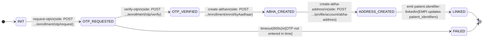
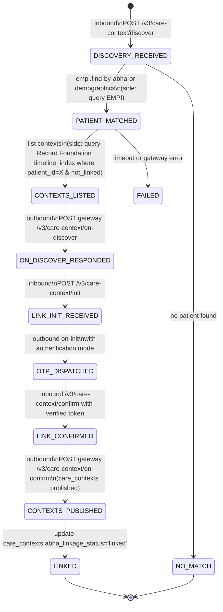
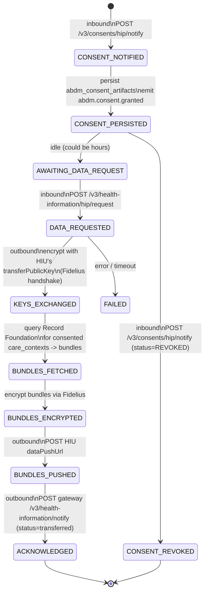
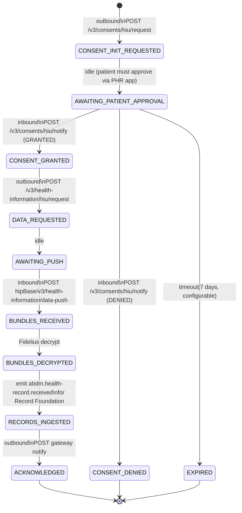
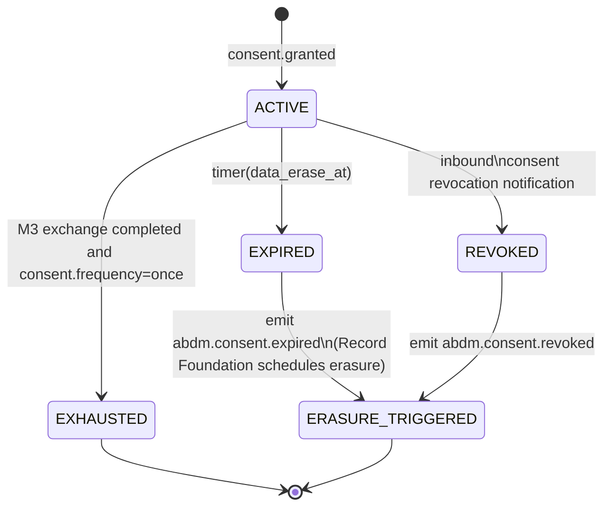

# Integration Platform -- FSM Specifications

**Module:** Integration Hub
**Related:** [`01-schema-design.md`](./01-schema-design.md), [ADR-0027](../../adr/0027-fsm-orchestration-for-integration-hub.md), [ADR-0026](../../adr/0026-fsm-lite-phase-1.md), [`03-scenarios.md`](./03-scenarios.md)
**Source ABDM specs (extracted to repo):**
- [Milestone 1 -- ABHA APIs](../../../docs/external/abdm/v3-m1-abha-v3-apis-creation-verification.md)
- [Milestone 2 -- Health Records / HIP linking](../../../docs/external/abdm/v3-m2-health-records-hip-link-discovery-consent-transfer.md)
- [Milestone 3 -- HIU](../../../docs/external/abdm/v3-m3-hiu-consent-request-health-records-fetch.md)
- [Scan-and-share](../../../docs/external/abdm/v3-scan-and-share.md)

> **Authority and Phase 1 implementation.** This document is the **authoritative specification** for what each ABDM flow does — the states, transitions, guards, side-effects, and timer semantics. It applies to both phases:
>
> - **Phase 1 (FSM-lite, per [ADR-0026](../../adr/0026-fsm-lite-phase-1.md)):** each flow is implemented as **plain TypeScript** (`modules/integration-hub/src/abdm/<flow>.ts`) that uses the small `@hims/ts-sdk-workflow` helpers (`loadWorkflow`, `transitionTo`, `scheduleTimer`, `clearTimer`) to read and write the FSM schema tables. The state-machine diagrams below are the contract the TypeScript implements verbatim.
> - **Phase 1.5+ (generic engine, per [ADR-0027](../../adr/0027-fsm-orchestration-for-integration-hub.md)):** the JSON definition format described in §1 below becomes the *runtime* source; an engine interprets these definitions and dispatches side-effects.
>
> The JSON definitions documented in §1-9 are valid as documentation today and become executable when the engine ships. Either way, the Mermaid state diagrams are the canonical answer to "what does flow X do." See [orientation.md](./orientation.md) for what this means at the developer's keyboard.

---

## 1. Definition format

Every FSM definition is a JSON document validated in CI against a JSON Schema (engine-runtime artefact, Phase 1.5+; until then, the JSON shape serves as documentation of what each TypeScript flow implements). The schema is `infra/schemas/fsm-definition.schema.json` (target file); the structure:

```jsonc
{
  "id": "abdm.m1.aadhaar-otp.v1",            // Pinned to workflow rows; never mutated.
  "description": "...",
  "states": ["INIT", "...", "LINKED", "FAILED"],
  "start_state": "INIT",
  "terminal_states": ["LINKED", "FAILED"],
  "context_schema": { /* JSON Schema for integration_workflows.context */ },
  "transitions": [
    {
      "from": "INIT",
      "event": "request-otp",
      "guard": null,                          // Optional; JSON-Logic predicate evaluated against context
      "to": "OTP_REQUESTED",
      "side_effects": [
        {
          "kind": "outbound_call",
          "endpoint": "abdm/v3/enrollment/otp/request",
          "input_template": { "aadhaar": "{{context.aadhaar}}" },
          "output_to_context": { "txnId": "$.body.txnId" }
        }
      ],
      "timeout_seconds": 600,
      "on_timeout": { "to": "FAILED", "reason": "otp-not-verified-in-time" }
    }
  ]
}
```

Key properties:

- **`id` is version-pinned.** A workflow row stores `definition_id` at start; later changes to the definition do not retroactively affect in-flight workflows. Breaking changes get a new version (`abdm.m1.aadhaar-otp.v2`).
- **Side effects are declarative.** They are not arbitrary code. The catalog of `side_effects[].kind` is bounded: `outbound_call` (HTTP), `event_publish` (event bus), `set_context` (in-memory), `clear_timer`, `set_timer`. New kinds require explicit engine support. (An earlier draft included a `record_audit` kind that wrote to a per-module audit table; removed per [ADR-0024](../../adr/0024-audit-deferred-to-pre-prod.md). State transitions are captured by `integration_workflow_transitions`; transport messages by inbound/outbound message logs; the centralized audit consumer projects from those.)
- **`guard` is JSON-Logic.** Evaluated against `(context, payload)`; transitions whose guard is false are inapplicable. JSON-Logic ([JSON-Logic spec](https://jsonlogic.com/)) keeps guards declarative -- no Turing-complete code in the definition file.
- **Timeouts are per-transition.** A state can declare its outbound transition with a timeout; if the timer fires before the actual transition arrives, the timeout transition runs.

This format is consumed by the engine at runtime and by the CI Mermaid renderer at build time (which generates a state diagram per definition for the docs site).

---

## 2. ABDM FSM taxonomy

| Definition ID | Triggered by | Span | Terminal | Used in |
|---|---|---|---|---|
| `abdm.m1.aadhaar-otp.v1` | UI initiates "create ABHA via Aadhaar OTP" | seconds-to-minutes | `LINKED` (success) / `FAILED` | Patient-registration desk; settings KYC |
| `abdm.m1.find-by-mobile.v1` | UI initiates "find existing ABHA via mobile" | seconds-to-minutes | `FOUND` / `NOT_FOUND` / `FAILED` | Patient-registration desk |
| `abdm.scan-and-share.v1` | Gateway POST `/v3/profile/on-share` (inbound) | seconds (synchronous-ish) | `TOKEN_ISSUED` / `FAILED` | Kiosk QR scan; patient walks up to desk |
| `abdm.m2.user-initiated-link.v1` | Gateway `/v3/care-context/discover` (inbound) | minutes | `LINKED` / `FAILED` / `NO_MATCH` | Patient links from their PHR app |
| `abdm.m2.hip-initiated-link.v1` | Platform UI "link records to ABHA" | minutes | `LINKED` / `FAILED` | Hospital staff initiates linking |
| `abdm.m3.hip.v1` | Inbound consent notification + data request | minutes-to-hours | `ACKNOWLEDGED` / `FAILED` | HIP responds to external HIU's request |
| `abdm.m3.hiu.v1` | Platform UI "request external records" | hours-to-days | `RECORDS_RECEIVED` / `EXPIRED` / `FAILED` | Doctor requests external records for a patient |
| `abdm.consent.lifecycle.v1` | Granted consent | days-to-months | `EXPIRED` / `REVOKED` / `EXHAUSTED` | Long-running consent supervision (timer-driven erasure) |

The first six are operational FSMs. The last is a **consent supervisor** -- a long-lived workflow per consent that owns the `dataEraseAt` timer and the revocation/expiry transitions. Splitting it from `abdm.m3.*` keeps each operational flow short-lived (so `running` workflow rows stay close to active state) while the consent itself can live for months.

---

## 3. `abdm.m1.aadhaar-otp.v1` -- ABHA creation via Aadhaar OTP

### 3.1 State diagram



### 3.2 Transitions (machine-readable shape, abridged)

```jsonc
{
  "id": "abdm.m1.aadhaar-otp.v1",
  "states": ["INIT", "OTP_REQUESTED", "OTP_VERIFIED", "ABHA_CREATED", "ADDRESS_CREATED", "LINKED", "FAILED"],
  "start_state": "INIT",
  "terminal_states": ["LINKED", "FAILED"],
  "transitions": [
    {
      "from": "INIT", "event": "request-otp", "to": "OTP_REQUESTED",
      "side_effects": [{
        "kind": "outbound_call",
        "endpoint": "abdm/v3/enrollment/otp/request",
        "input_template": { "txnId": "{{uuid()}}", "scope": ["abha-enrol"], "loginHint": "aadhaar", "loginId_encrypted": "{{fidelius.encrypt(context.aadhaar, gatewayPubKey)}}", "otpSystem": "aadhaar" },
        "output_to_context": { "txnId": "$.body.txnId" }
      }],
      "timeout_seconds": 600,
      "on_timeout": { "to": "FAILED", "reason": "otp-not-verified-in-time" }
    },
    {
      "from": "OTP_REQUESTED", "event": "verify-otp", "to": "OTP_VERIFIED",
      "side_effects": [{
        "kind": "outbound_call",
        "endpoint": "abdm/v3/enrollment/otp/verify",
        "input_template": { "txnId": "{{context.txnId}}", "authData": { "authMethods": ["otp"], "otp": { "otpValue_encrypted": "{{fidelius.encrypt(payload.otp, gatewayPubKey)}}" } } },
        "output_to_context": { "tToken": "$.body.tToken" }
      }]
    },
    {
      "from": "OTP_VERIFIED", "event": "create-abha", "to": "ABHA_CREATED",
      "side_effects": [{
        "kind": "outbound_call",
        "endpoint": "abdm/v3/enrollment/enrol/byAadhaar",
        "input_template": { "txnId": "{{context.txnId}}", "tToken": "{{context.tToken}}", "consent": "{{context.consent}}" },
        "output_to_context": { "abhaNumber": "$.body.ABHANumber", "abhaProfile": "$.body.ABHAProfile" }
      }]
    },
    {
      "from": "ABHA_CREATED", "event": "create-abha-address", "to": "ADDRESS_CREATED",
      "side_effects": [{
        "kind": "outbound_call",
        "endpoint": "abdm/v3/profile/account/abha-address",
        "input_template": { "txnId": "{{context.txnId}}", "preferredAbhaAddress": "{{context.preferredAbhaAddress}}" },
        "output_to_context": { "abhaAddress": "$.body.abhaAddress" }
      }]
    },
    {
      "from": "ADDRESS_CREATED", "event": "link-to-patient", "to": "LINKED",
      "side_effects": [{
        "kind": "outbound_call",
        "endpoint": "empi/api/v1/patients/{{context.patientId}}/identifiers",
        "input_template": { "identifier_type": "abha_number", "identifier_value": "{{context.abhaNumber}}", "issuing_system": "abdm" }
      }, {
        "kind": "outbound_call",
        "endpoint": "empi/api/v1/patients/{{context.patientId}}/identifiers",
        "input_template": { "identifier_type": "abha_address", "identifier_value": "{{context.abhaAddress}}", "issuing_system": "abdm" }
      }, {
        "kind": "event_publish",
        "event_name": "abdm.m1.completed",
        "payload_template": { "patient_id": "{{context.patientId}}", "abha_number": "{{context.abhaNumber}}", "abha_address": "{{context.abhaAddress}}" }
      }]
    }
  ]
}
```

### 3.3 Why each side effect is here

- **OTP request encrypts Aadhaar with the gateway public key** -- ABDM mandates Fidelius envelope encryption ([ABDM v3 ABHA APIs spec](../../../docs/external/abdm/v3-m1-abha-v3-apis-creation-verification.md)). The `fidelius.encrypt(...)` template helper is provided by `@hims/ts-sdk-abdm-protocol` (lower-level helper, possibly extracted from Integration Hub later per [ADR-0023 follow-up](../../adr/0023-distributed-fhir-assembly.md#follow-up-actions)).
- **`tToken` is captured at OTP verify** -- it authenticates subsequent calls in the same enrollment session.
- **Two separate identifier writes to EMPI** at the LINK step -- ABHA *number* and ABHA *address* are distinct identifiers per ABDM. EMPI's `patient_identifiers` table holds both polymorphically.
- **`abdm.m1.completed` event** signals downstream consumers (e.g., the patient-registration UI) without coupling them to FSM internals.

### 3.4 Failure modes

- **OTP timeout (600s).** ABDM's documented expiry is 10 minutes; the FSM mirrors that. The patient simply restarts.
- **OTP wrong / quota exhausted.** ABDM responds 4xx; the engine's outbound_call retry policy treats 4xx as terminal-fail and transitions to `FAILED` with the gateway error message in `error`.
- **ABHA creation fails (Aadhaar mismatch).** Same: terminal-fail, message preserved in `error`.
- **EMPI link call fails after gateway success.** This is the dangerous case -- the ABHA exists upstream but is not linked locally. Mitigation: the LINK step is wrapped in an outbox-table-and-retry pattern (the side-effect engine writes an outbox entry that the EMPI link is *committed* to a local table; a separate retrier completes if EMPI is briefly unavailable). Acceptable design v1: the workflow stays in `ABHA_CREATED / ADDRESS_CREATED` until EMPI accepts; the `abdm.m1.completed` event fires only after `LINKED`.

---

## 4. `abdm.scan-and-share.v1` -- the kiosk QR flow

This is structurally simpler than M1 -- one inbound callback, one outbound response. It is still expressed as an FSM for two reasons: (1) it shares the audit and idempotency story with the multi-step flows; (2) the flow has a small post-callback action (issuing the daily token, registering the patient via EMPI) that benefits from the engine's atomic-transition guarantee.

```mermaid
stateDiagram-v2
  [*] --> ON_SHARE_RECEIVED: gateway POST /v3/profile/on-share\n(inbound; payload includes ABHA address + profile)
  ON_SHARE_RECEIVED --> PATIENT_RESOLVED: resolve-patient\n(side: POST empi/.../find-or-create)
  PATIENT_RESOLVED --> TOKEN_ALLOCATED: allocate-token\n(atomic counter increment in abdm_share_tokens)
  TOKEN_ALLOCATED --> ACKNOWLEDGED: gateway acknowledges token receipt
  ACKNOWLEDGED --> [*]
  ON_SHARE_RECEIVED --> FAILED: invalid payload / EMPI unavailable
```



The token issuance is the structurally interesting bit:

```sql
-- Atomic increment with concurrency safety
WITH upserted AS (
  INSERT INTO abdm_share_tokens (iq_tenant_id, integration_id, facility_id_ref, issue_date, next_token_number)
  VALUES ($1, $2, $3, current_date, 2)
  ON CONFLICT (iq_tenant_id, facility_id_ref, issue_date)
  DO UPDATE SET next_token_number = abdm_share_tokens.next_token_number + 1
  RETURNING next_token_number - 1 AS token_number
)
INSERT INTO abdm_share_token_issuances (...)
SELECT $1, $2, $3, current_date, token_number, $4 /* abha_address */, $5 /* profile_ref */, ...
FROM upserted
RETURNING token_number;
```

This pattern (`UPSERT ... DO UPDATE ... RETURNING`) is the canonical PostgreSQL atomic counter ([PostgreSQL docs -- INSERT ON CONFLICT](https://www.postgresql.org/docs/16/sql-insert.html#SQL-ON-CONFLICT)). The token_number is computed from the *prior* `next_token_number` and the counter is post-incremented in one statement.

---

## 5. `abdm.m2.user-initiated-link.v1` -- patient links from PHR app

When a patient opens their PHR app and links a facility's records, the gateway initiates discovery against the platform.



The interesting state is `OTP_DISPATCHED -> LINK_CONFIRMED`: it is **inbound**, meaning the engine is *waiting* for an external callback. The FSM engine's design must support waiting states naturally (it does -- the workflow simply has no transition until the inbound message arrives matching this workflow's `external_correlation_id`).

---

## 6. `abdm.m3.hip.v1` -- HIP serves records under consent

Two inbound callbacks; two outbound responses; one critical handoff to Record Foundation.



The critical Record Foundation handoff happens at `BUNDLES_FETCHED`. Integration Hub does *not* assemble bundles. It calls Record Foundation:

```http
POST /api/v1/disclosures
Authorization: Bearer <internal service-account JWT>
{
  "consent_artifact_id": "<uuid>",
  "patient_id": "<uuid>",
  "care_context_ids": ["<uuid>", "..."],
  "hi_types": ["OPConsultation","Prescription"],
  "date_range": { "from": "2025-01-01", "to": "2026-04-30" }
}
```

Record Foundation responds with a list of `bundle_storage_id`s. Integration Hub fetches the bytes via `GET /api/v1/bundles/:id` (also Record Foundation), encrypts them with Fidelius, and pushes them to the HIU's `dataPushUrl`. Record Foundation never sees the gateway, the encryption keys, or the HIU.

---

## 7. `abdm.m3.hiu.v1` -- platform fetches external records

Mirror of M3-HIP from the other side.



The 7-day timeout on `AWAITING_PATIENT_APPROVAL` exists because patient-initiated consent in ABDM does not expire from the gateway side at a fixed wall-clock time -- the platform must give up at some point or it will keep an orphan workflow forever. The timeout is configurable per integration in `integrations.config.consent_request_timeout_seconds`.

---

## 8. `abdm.consent.lifecycle.v1` -- the long-lived supervisor

Once a consent enters `granted`, a *supervisor* workflow is started that owns the consent's wall-clock lifetime. This workflow is special:

- It can live for months (the consent's `dataEraseAt` could be 6 months out).
- It does no protocol work; it just waits for one of three signals.



Splitting this from the M3 operational FSMs keeps each `running` workflow short-lived (the M3-HIU operational workflow ends at `ACKNOWLEDGED` once data is received), while the consent's wall-clock lifetime is owned by a separate, idle supervisor that the timer worker advances when due.

This is the "Process Manager" pattern from Hohpe & Woolf ([Enterprise Integration Patterns, 2003, pp. 312-321](https://www.enterpriseintegrationpatterns.com/patterns/messaging/ProcessManager.html)) applied at two granularities.

---

## 9. Engine guarantees the FSMs depend on

The engine implementation contract ([ADR-0027](../../adr/0027-fsm-orchestration-for-integration-hub.md)) must provide:

| Guarantee | Why these FSMs need it |
|---|---|
| Atomic transition (lock + state update + transition row + timer changes in one TX) | Otherwise a crash between writes leaves the workflow in an inconsistent state |
| Idempotent re-dispatch of the same event | Inbound callbacks can be re-delivered; the engine must absorb duplicates |
| Wall-clock timers with `SELECT ... FOR UPDATE SKIP LOCKED` polling | OTP / consent expiry / patient approval timeout |
| Ordered transition log per workflow | M3-HIP audit must show "consent received -> data requested -> bundles pushed -> ack" in order |
| `external_correlation_id` lookup index on the workflow row | Inbound callback router must resolve the correlation in O(log n) |
| Graceful failure on side-effect errors (preserve current_state, schedule retry per outbound retry policy) | Gateway transient failures must not corrupt FSM state |

---

## 10. Testing the FSMs

Each FSM definition gets a Vitest test file (`tests/fsm/abdm.m1.aadhaar-otp.v1.spec.ts` etc.). The test pattern:

```ts
import { definition } from "@hims/integration-hub/fsm/abdm.m1.aadhaar-otp.v1";
import { runFsmReplay } from "@hims/ts-sdk-workflow/testing";

it("happy path -- aadhaar OTP enrolment", async () => {
  const result = await runFsmReplay(definition, [
    { event: "request-otp", context: { aadhaar: "<encrypted-test>", patientId: "p1", consent: {} } },
    { event: "verify-otp",   payload: { otp: "123456" } },
    { event: "create-abha" },
    { event: "create-abha-address", payload: { preferredAbhaAddress: "ayush@sbx" } },
    { event: "link-to-patient" },
  ]);
  expect(result.finalState).toBe("LINKED");
  expect(result.transitions).toHaveLength(5);
});

it("fails on invalid OTP", async () => { /* ... */ });
it("times out when OTP not entered", async () => { /* simulated timer */ });
```

`runFsmReplay` is a deterministic replay harness that stubs side-effects with the test's expected responses. There is no real network call; FSM correctness is a pure-function property. End-to-end gateway integration is a separate test suite (`tests/integration/abdm-sandbox.spec.ts`) that runs against the actual ABDM sandbox.

---

## References

- Hector Garcia-Molina, Kenneth Salem, "Sagas", *ACM SIGMOD 1987*, https://www.cs.cornell.edu/andru/cs711/2002fa/reading/sagas.pdf -- the formal basis for long-running, compensable workflows.
- Gregor Hohpe and Bobby Woolf, *Enterprise Integration Patterns* (Addison-Wesley, 2003), Chapter 8 -- "Process Manager" pattern, https://www.enterpriseintegrationpatterns.com/patterns/messaging/ProcessManager.html.
- "JsonLogic", https://jsonlogic.com/, accessed 2026-05-08 -- the predicate language used for FSM guards.
- PostgreSQL Global Development Group, "INSERT ... ON CONFLICT", https://www.postgresql.org/docs/16/sql-insert.html#SQL-ON-CONFLICT, accessed 2026-05-08.
- National Health Authority, "ABDM v3 Milestone 1 ABHA APIs", [docs/external/abdm/v3-m1-abha-v3-apis-creation-verification.md](../../../docs/external/abdm/v3-m1-abha-v3-apis-creation-verification.md) (extracted 2026-05-08).
- National Health Authority, "ABDM v3 Milestone 2 -- Health Records (HIP)", [docs/external/abdm/v3-m2-health-records-hip-link-discovery-consent-transfer.md](../../../docs/external/abdm/v3-m2-health-records-hip-link-discovery-consent-transfer.md).
- National Health Authority, "ABDM v3 Milestone 3 -- HIU", [docs/external/abdm/v3-m3-hiu-consent-request-health-records-fetch.md](../../../docs/external/abdm/v3-m3-hiu-consent-request-health-records-fetch.md).
- National Health Authority, "ABDM Wrapper -- wrapperV3.yaml", https://github.com/NHA-ABDM/ABDM-wrapper/blob/main/docs/wrapperV3.yaml, accessed 2026-05-08 -- the canonical reference for endpoint paths and payload shapes.
