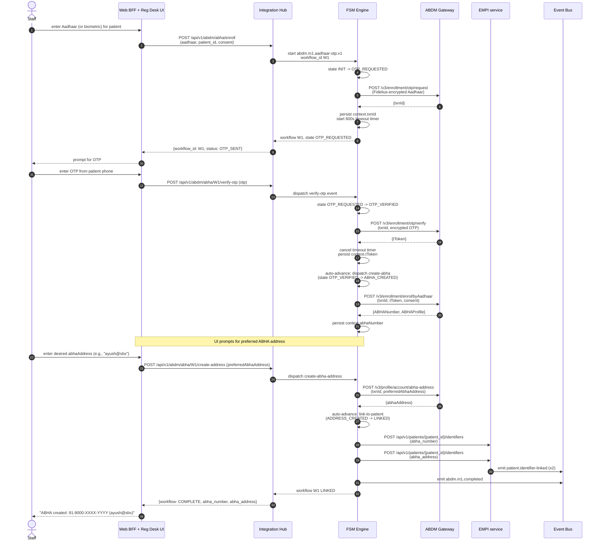
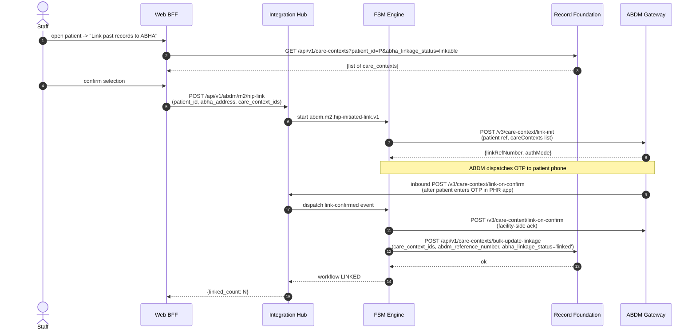
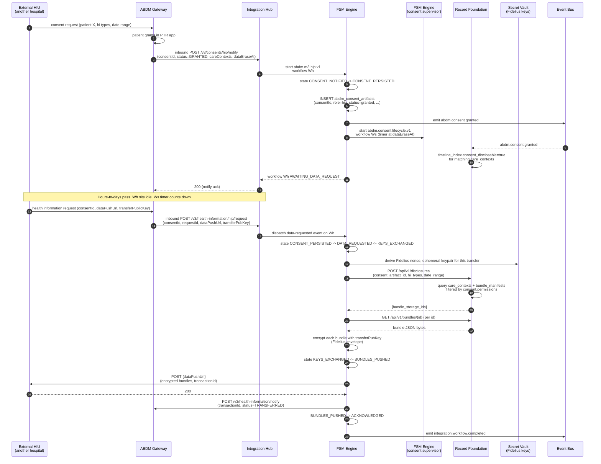
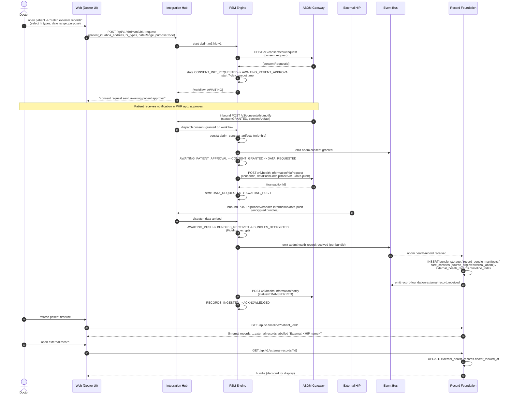
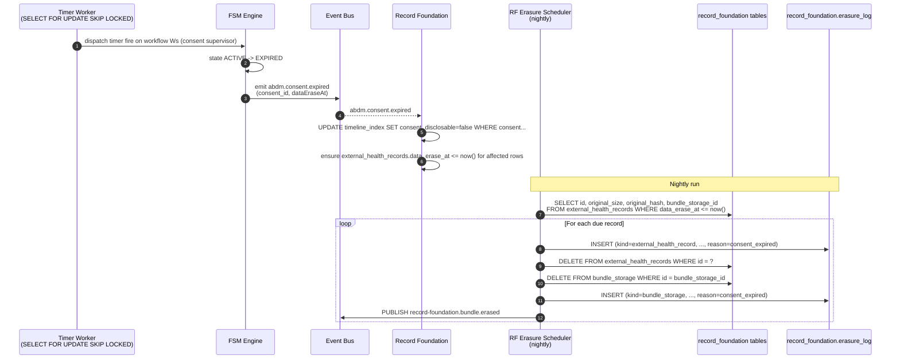
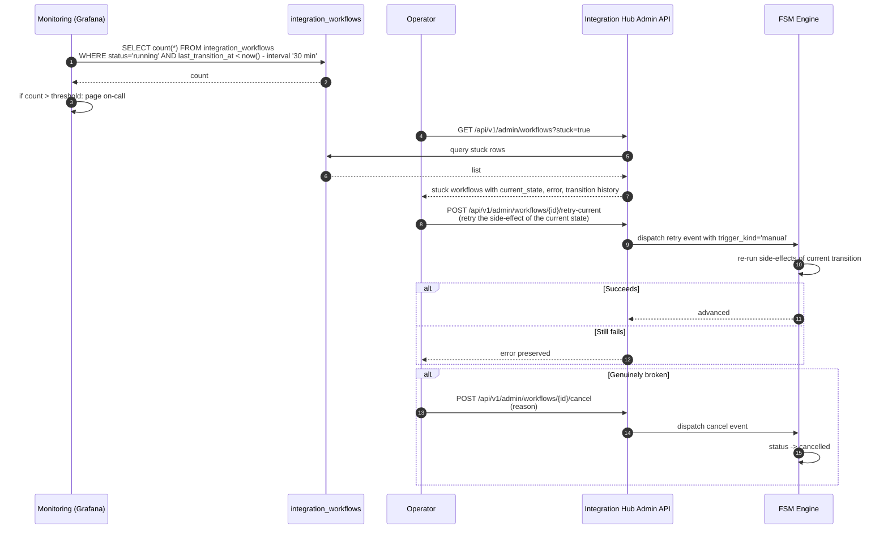

# Integration Platform -- Scenarios

End-to-end walkthroughs of the most consequential ABDM flows, illustrating how the Integration Hub, Record Foundation, EMPI, and Configurator collaborate. Each scenario references the FSM definition (from [`02-fsm-specifications.md`](./02-fsm-specifications.md)) and the schema tables (from [`01-schema-design.md`](./01-schema-design.md)).

---

## Scenario 1 -- Patient walks in, kiosk QR scan, registration desk redeems

The patient arrives at the facility, opens their PHR app, scans the kiosk QR. The platform must (a) receive the on-share callback from the gateway, (b) resolve the patient via EMPI, (c) issue a daily token, (d) surface the token at the registration desk.

```mermaid
sequenceDiagram
  autonumber
  actor Patient
  participant PHR as Patient PHR app
  participant ABDM as ABDM Gateway
  participant IGW as Integration Hub<br/>(Inbound)
  participant FSM as FSM Engine
  participant EMPI as EMPI service
  participant DB as integration_hub<br/>(abdm_share_tokens / issuances)
  participant Bus as Event Bus
  participant Web as Web BFF + Reg Desk UI

  Patient->>PHR: scan facility QR
  PHR->>ABDM: profile-share request<br/>(facility id, ABHA address)
  ABDM->>IGW: POST /v3/profile/on-share<br/>(payload: ABHA address + profile)
  IGW->>IGW: authenticate (gateway mTLS),<br/>idempotency check via integration_inbound_messages
  IGW->>FSM: start workflow abdm.scan-and-share.v1
  FSM->>EMPI: POST /api/v1/patients/find-or-create<br/>(abha_address, demographics)
  EMPI-->>FSM: {patient_id}
  FSM->>DB: UPSERT abdm_share_tokens<br/>(facility, today, next_token_number+1)<br/>RETURNING token_number
  FSM->>DB: INSERT abdm_share_token_issuances<br/>(token_number, patient_id, abha_address, profile_ref)
  FSM->>Bus: publish abdm.scan-and-share.token-issued
  FSM-->>IGW: TOKEN_ISSUED (token_number)
  IGW-->>ABDM: 200 { tokenNumber: N }
  Bus-->>Web: token-issued event
  Web->>Web: surface "Patient with token N has arrived"
  Patient->>Web: walks up to desk, mentions token N
  Web->>DB: GET abdm_share_token_issuances WHERE token_number = N AND issue_date = today
  DB-->>Web: {patient_id, profile}
  Web->>EMPI: GET /api/v1/patients/{patient_id}
  EMPI-->>Web: full patient record
  Web-->>Patient: registration completed; redirect to OPD queue
```

Notes:

- The **EMPI find-or-create** step deserves attention. EMPI's existing `register-patient` use-case ([PR #12](https://github.com/IQ-Line/HospitalSaarthi/pull/12)) handles the "create if not found, update if found" semantics. ABHA address is one identifier; the call also passes demographics from the gateway-shared profile so EMPI's dedup logic runs.
- **Idempotency.** If the gateway retries the on-share callback (network blip), `integration_inbound_messages` rejects the duplicate by `external_message_id` (the gateway-supplied requestId) and returns the original token number. The token counter is **not** incremented twice.
- **Token redemption.** The reg-desk UI looks up the token by `(token_number, issue_date)` -- the unique compound key. Once redeemed, `abdm_share_token_issuances.redeemed_at` is set; this both blocks re-redemption and feeds analytics ("token issued at 09:14, redeemed at 09:21 -- 7 minute walk-from-kiosk-to-desk").

---

## Scenario 2 -- New patient, no ABHA, kiosk-driven Aadhaar OTP enrollment

The patient does not have an ABHA. At the kiosk (or at the registration desk), the staff initiates ABHA creation via Aadhaar OTP. This is the M1 flow from [§3 of `02-fsm-specifications.md`](./02-fsm-specifications.md#3-abdmm1aadhaar-otpv1--abha-creation-via-aadhaar-otp).



Notes:

- **`auto-advance`** transitions are the FSM engine convenience for cases where one transition's success deterministically triggers the next. They are still recorded as separate transitions in `integration_workflow_transitions` -- the engine emits them, but each is its own row for audit clarity.
- **Failure recovery.** If the patient enters wrong OTP, `verify-otp` fails (gateway 4xx). The engine's outbound retry policy treats 4xx as terminal-fail. The workflow transitions to `FAILED`, the UI shows the gateway error, and the staff can start a new workflow. The original failed workflow is preserved for audit.
- **Two identifier rows in EMPI.** ABHA *number* and ABHA *address* are distinct identifiers (recall the EMPI schema in [PR #12](https://github.com/IQ-Line/HospitalSaarthi/pull/12)'s `patient_identifiers` polymorphic table). EMPI's `patients.abha_number` denormalised column is also updated by the EMPI use-case (the link call's handler sets it for fast lookup).
- **`patient_id` exists before the workflow starts.** The patient was created in EMPI when the staff opened the kiosk session (anonymous "walk-in" patient). The M1 workflow links ABHA to that pre-existing patient row. This avoids the chicken-and-egg of "no patient yet -> no patient_id -> can't reference in workflow."

---

## Scenario 3 -- HIP-initiated linking of past records (existing patient, newly-acquired ABHA)

The hospital has historical records for a patient who has just acquired an ABHA. Staff initiates linking to publish those care contexts under the ABHA.



Notes:

- **Discovery is Record Foundation's API** -- not a query directly against operational modules. Record Foundation's `timeline_index` projection (or a direct `care_contexts` query) is the source.
- **The OTP is between ABDM and the patient's phone**, not between the platform and the patient. The platform never sees the OTP; it just waits for the gateway's `link-on-confirm` callback.
- **The link operation is bulk** -- one call attaches ABDM reference numbers to many care contexts at once. Per-context linking would multiply round-trips for no benefit.

---

## Scenario 4 -- M3 HIP: external HIU requests records under granted consent

A doctor at another hospital (the HIU) requests this patient's records. The patient grants consent in their PHR app. The platform receives the consent notification, then later receives the data request, fetches bundles from Record Foundation, and pushes them encrypted to the HIU.



Notes:

- **Two workflows** are started by the consent grant: the M3-HIP **operational** workflow (which finishes at `ACKNOWLEDGED`) and the consent **lifecycle supervisor** (which lives until `dataEraseAt`). This is the "Process Manager at two granularities" pattern from [§8 of FSM specs](./02-fsm-specifications.md#8-abdmconsentlifecyclev1--the-long-lived-supervisor).
- **Fidelius encryption** is the ABDM-mandated envelope encryption. The platform never sees the HIU's *plaintext* records on the wire; the bundles are encrypted with the HIU's `transferPublicKey` before leaving the Hub. The secrets SDK resolves the Fidelius signing/encryption material; the ephemeral keypair is derived per-transfer.
- **Record Foundation does not perform encryption.** It returns plaintext bundles to Integration Hub; encryption happens in the Hub. This preserves the boundary -- Record Foundation's job is the byte-exact retrieval, not protocol-specific transformations.
- **Audit substrate.** Every step writes to `integration_workflow_transitions` (state changes) and `integration_outbound_messages` (the encrypted bundle leaving the platform), with `consent_id` set on both. The future centralized audit consumer answers the regulatory question "show me everything that happened under consent X" by joining those two streams. Per [ADR-0024](../../adr/0024-audit-deferred-to-pre-prod.md), there is no per-module audit table here.

---

## Scenario 5 -- M3 HIU: doctor pulls external records for a patient

A doctor opens a patient and requests records from external HIPs. The platform initiates consent, the patient approves in their PHR app, the records flow back, Record Foundation ingests them.



Notes:

- **Patient approval can take days.** The 7-day timer in `AWAITING_PATIENT_APPROVAL` is the explicit timeout; without it, abandoned consent requests would orphan workflow rows indefinitely.
- **`abdm.health-record.received` is the boundary event.** Integration Hub's job ends here; Record Foundation's begins. The two services are decoupled by the event bus -- if Record Foundation is briefly unavailable, the event sits in the bus and is consumed when Record Foundation comes back.
- **Display labelling.** The doctor sees an `External: <HIP name>` tag on every externally received record. This is *not* a UX nicety -- it is medico-legal hygiene. The platform never lets external records masquerade as locally authored data. The tag flows from `care_contexts.source_origin = 'external_abdm'` -> `timeline_index.origin_label = "External: <HIP name>"`.
- **`doctor_viewed_at` audit.** First view is recorded for compliance. Phase 4 EMR will surface "unread external record" badges from this column.

---

## Scenario 6 -- Consent expires; bundles erased

The doctor used a one-month consent. A month later, the lifecycle supervisor's timer fires.



Notes:

- **The supervisor expires the consent declaratively** -- it does not erase. Erasure is Record Foundation's responsibility; the supervisor's signal causes Record Foundation to mark records as erasure-due and the scheduler to follow through.
- **Two-step erasure** (mark-disclosable=false, then schedule-then-erase) gives the doctor time to be informed (the timeline immediately stops showing the records under that consent) before bytes are physically deleted at the next scheduler run.
- **`erasure_log` precedes `DELETE`.** The order matters for crash safety: a half-erasure that leaves an `erasure_log` row plus an unleated source row will be re-encountered on the next run and idempotently completed. The reverse order would lose the audit if the system crashed between DELETE and erasure_log INSERT.
- **DPDP Act section 11.** This scenario is the operational form of compliance.

---

## Scenario 7 -- Operations: a stuck workflow (gateway returned an unexpected error)

ABDM occasionally returns 500-class errors for transient gateway issues. The workflow row's `last_transition_at` ages without progress. Operations should be alerted.



Notes:

- **Stuck-workflow detection** is a single SQL query against `last_transition_at`. The index `idx_workflows_status_age` makes it cheap.
- **Manual retry** is a first-class engine operation, not a database update. It runs through the same engine code as automatic retries, generating a new `integration_workflow_transitions` row with `trigger_kind='manual'` and `actor=<user_id>`.
- **Cancellation is a transition.** The engine writes the `cancelled` status, runs any compensating side-effects defined for cancellation in the FSM definition (none for ABDM today, but the hook exists), and emits `integration.workflow.failed`.

---

## References

- See [`02-fsm-specifications.md`](./02-fsm-specifications.md) References for ABDM v3 spec extracts and FSM-pattern citations.
- HL7 International, "FHIR R4 -- Bundle", https://hl7.org/fhir/R4/bundle.html, accessed 2026-05-08.
- National Health Authority, "ABDM Wrapper -- sample HIP and HIU specs", https://github.com/NHA-ABDM/ABDM-wrapper/tree/main/sample-hip and `/sample-hiu`, accessed 2026-05-08 -- protocol shapes for the inbound/outbound endpoints used in scenarios above.
