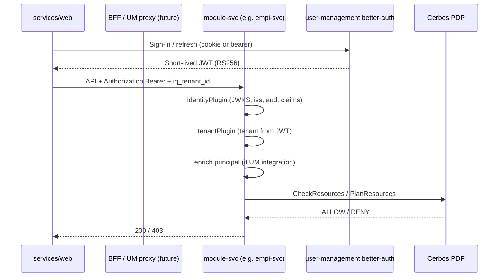

# Unified Service Authentication and Authorization

> **Status:** Draft v0.2 (2026-05-19) — incorporates architecture review (M1–M5, P1–P6)  
> **Audience:** backend and frontend developers, architects, security reviewers  
> **Purpose:** One canonical plan to stop ad-hoc auth bypasses, align every current and future service on the same security stack, and document how the web app, BFF, and module services fit together.

**Cross-references:**

- [HLD 04 — AuthN/AuthZ flow](../../hld/04-authn-authz-flow.md)
- [ADR-0015 — BFF role and zero-trust](../../adr/0015-bff-role-zero-trust.md)
- [ADR-0004 — Cerbos sidecar](../../adr/0004-authz-cerbos-sidecar.md)
- [Dev-environment simplifications](../../dev-env-simplifications.md) (`PERMISSIVE_MODE`, pre-prod gates)
- [Monorepo setup — SDK packages](../repo-structure/01-monorepo-setup.md)
- [User Management — Phase 1A shared SDK note](../user-management/03-phase-1a-shared-sdk-note.md)
- [Frontend structure](../frontend/01-frontend-structure.md)

---

## 1. Problem statement

Today the platform has **correct building blocks** but **inconsistent adoption**:

| Symptom | Risk |
|--------|------|
| Some services use `ENABLE_AUTH=true`; others omit JWT verification entirely | Unauthenticated access to patient/billing/config APIs in dev; easy to ship the same gap to staging |
| EMPI/ABDM register `identityPlugin` with **only** `jwksUrl` (no `issuer` / `audience`) | Weaker validation than `validateAuthConfig()`; type-unsafe shortcut |
| Billing injects a **mock tenant header** when none is sent | Anyone who can reach the port can act as a fixed tenant |
| `tenantPlugin` prefers **header** tenant over JWT `Principal.tenantId` | Tenant spoofing when auth is on but clients send `x-tenant-id` |
| Login flow still hardcodes tenant after better-auth sign-in | JWT `iq_tenant_id` ignored; tenant header/catalog context out of sync with identity |
| Cerbos `authzPlugin` only wired on **user-management-svc** | Other modules declare `authMode: "protected"` routes but PEP may not run |
| Master Data (Python) uses a **separate** JWT path (HS256 / optional verify) | Divergent trust model from TypeScript services |
| No `services/bff/` yet; Vite proxies `/api` to UM and some paths directly to module ports | Token may not be validated on every hop |

**Goal:** Any new `services/<module>-svc` should enable platform security in **one registration call** and **one env contract**, with production failing fast if misconfigured.

**In scope:** Human user JWT authn (better-auth / UM), per-service Cerbos authz, tenant binding from JWT, Fastify service bootstrap.

**Explicitly deferred (not omitted):** Service-to-service machine principals (`kind: service` JWTs) — follow-up ADR + UM issuance (see §4.5). Python `py-sdk-identity` until a second Python HTTP service exists (see §6).

---

## 2. Recommendation — do not add a second identity stack

### 2.1 Keep focused SDK packages (already correct)

The monorepo already follows **Interface Segregation** — one job per package:

| Package | Responsibility |
|---------|----------------|
| `@hims/ts-sdk-identity` | JWT verification (JWKS), `request.user` / `Principal`, `validateAuthConfig()` |
| `@hims/ts-sdk-tenant` | `request.tenantId`, AsyncLocalStorage tenant scope |
| `@hims/ts-sdk-authz` | Cerbos PEP, `authMode: "protected" \| "public"`, `checkResource` / `planResources` |
| `@hims/ts-sdk-http` | Standard `401` / `403` problem responses |
| `@hims/ts-sdk-testing` | Test principals, mock Cerbos |

**Do not** merge these into a monolithic `platform-auth` package. Tests, embedded mode, and services that only need identity (internal health) benefit from narrow imports.

### 2.2 Add one thin facade (Fastify-only)

Introduce a **composition package** (~200–400 lines) that every TypeScript `services/*-svc/src/main.ts` uses.

**Package name (team review):** Working title `@hims/ts-sdk-service-security`. Alternative `@hims/ts-sdk-fastify-security` is more accurate — the facade registers Fastify plugins only and does not help Master Data (Python), which keeps its own middleware. Pick one name in Phase 0 before implementation; exports stay `registerServiceSecurity()`.

```typescript
// packages/ts-sdk-fastify-security/src/register-service-security.ts (proposed API)

import type { FastifyInstance } from "fastify";
import { identityPlugin, validateAuthConfig } from "@hims/ts-sdk-identity";
import { tenantPlugin } from "@hims/ts-sdk-tenant";
import { authzPlugin, assertCerbosReachable } from "@hims/ts-sdk-authz";
import { resolveServiceSecurityPolicy } from "./policy.js";

export interface RegisterServiceSecurityOptions {
  /** Fastify scope (usually the `/api/<module>/v1` encapsulated plugin). */
  api: FastifyInstance;
  /** Paths that skip JWT (e.g. module-local public hooks). Health is always skipped. */
  skipPathPrefixes?: string[];
  /** Register Cerbos PEP. Default: true only when `AUTH_POLICY=required`. */
  enableAuthz?: boolean;
  /** Optional Cerbos target resolver (per service). */
  resolveAuthzTarget?: AuthzPluginOptions["resolveTarget"];
  /** Fail startup if Cerbos unreachable (recommended for staging/prod). */
  assertCerbosOnStartup?: boolean;
}

export async function registerServiceSecurity(
  opts: RegisterServiceSecurityOptions,
): Promise<ServiceSecurityContext> {
  const policy = resolveServiceSecurityPolicy();

  if (policy === "required") {
    const identity = validateAuthConfig();
    await opts.api.register(identityPlugin, {
      ...identity,
      skipPathPrefixes: opts.skipPathPrefixes,
    });
    await opts.api.register(tenantPlugin, { tenantSource: "jwt" }); // see §4.3
  } else if (policy === "optional") {
    opts.api.log.warn(
      { policy, service: opts.api.pluginName },
      "AUTH_POLICY=optional — JWT not enforced; use only for local development",
    );
    await opts.api.register(tenantPlugin, { tenantSource: "header-or-jwt" });
  } else {
    // policy === "disabled" — integration tests only; blocked in production
    await opts.api.register(tenantPlugin, { tenantSource: "header-or-jwt" });
  }

  // Authz only when identity is verified — optional/disabled modes skip PEP entirely.
  // Local Cerbos testing: AUTH_POLICY=required + PERMISSIVE_MODE=true (see §3.3).
  if (policy === "required" && opts.enableAuthz !== false) {
    const cerbosUrl = process.env.CERBOS_URL?.trim();
    if (!cerbosUrl) throw new Error("CERBOS_URL required when AUTH_POLICY=required");
    if (opts.assertCerbosOnStartup) await assertCerbosReachable(cerbosUrl);
    await opts.api.register(authzPlugin, {
      cerbosUrl,
      resolveTarget: opts.resolveAuthzTarget,
    });
  }

  return { policy };
}
```

**Why a facade instead of copy-paste in each `main.ts`?**

- Single place for **policy matrix** (dev vs staging vs prod).
- Deprecates per-service `ENABLE_AUTH` string parsing.
- Ensures **plugin order**: identity → tenant → authz (tenant must read verified JWT).
- New services get security by default; opt-out is explicit and test-only.

`user-management-svc` remains special: it **hosts** better-auth and principal enrichment plugins; it still uses `identityPlugin` + `authzPlugin` but registers better-auth **before** identity on public `/api/auth/*` paths.

---

## 3. Environment contract (replace `ENABLE_AUTH`)

### 3.1 Canonical variables (root `.env`)

Canonical values live in **root** [`.env.example`](../../../../.env.example) (aligned with PR #67 — BFF/UM dev proxy on port **3000**):

```env
# Issuer = user-management-svc better-auth (via BFF / VITE_API_BASE_URL in dev)
JWKS_URL=http://localhost:3000/api/auth/.well-known/jwks.json
JWT_ISSUER=http://localhost:3000
JWT_AUDIENCE=hims-platform
CERBOS_URL=localhost:3593
```

If your local root `.env` still points JWKS at `:3010` (direct `user-management-svc` port), **issuer, audience, and JWKS host must match the process that actually signs tokens** — mismatched triples cause `401` on every service. Prefer `3000` when using the web app proxy; use `3010` only when calling UM directly and set all three vars consistently.

Every authenticated service **must** use `validateAuthConfig()` (issuer + audience + JWKS) — never `{ jwksUrl }` alone.

### 3.2 `AUTH_POLICY` (new, replaces `ENABLE_AUTH`)

| Value | JWT required | Cerbos PEP registered | Allowed environments |
|-------|--------------|----------------------|----------------------|
| `required` | Yes | Yes — enforce unless `PERMISSIVE_MODE=true` (log-only) | staging, production |
| `optional` | No (warn on startup) | **No** — no principal to evaluate | local dev only |
| `disabled` | No | No | **tests only** |

**Derivation (recommended):**

Use **`DEPLOY_ENV`** (or `APP_ENV`) for deployment tier — not `NODE_ENV=staging`. Node convention is `NODE_ENV=production` in staging builds (minification, no dev assertions), so a staging check on `NODE_ENV` alone will miss real staging deployments.

```text
if DEPLOY_ENV is "staging" or "production"
  → AUTH_POLICY=required (hard-coded; cannot override)

else if DEPLOY_ENV unset and NODE_ENV === "production"
  → AUTH_POLICY=required
  (safety net: release build without DEPLOY_ENV still requires auth)

else if AUTH_POLICY env set explicitly
  → use env (only when DEPLOY_ENV is development or unset)

else if legacy ENABLE_AUTH === "true"
  → AUTH_POLICY=required (migration shim; log deprecation)

else
  → AUTH_POLICY=optional
```

`registerServiceSecurity` throws if `policy` is `optional` or `disabled` while `DEPLOY_ENV` is `staging`/`production` (or `NODE_ENV=production` with `DEPLOY_ENV` unset).

Remove `ENABLE_AUTH` from all services after migration (one release cycle).

### 3.3 Interaction with dev knobs

From [dev-env-simplifications.md](../../dev-env-simplifications.md):

| Knob | Local dev | Staging / prod |
|------|-----------|----------------|
| `DEPLOY_ENV` | `development` (or unset) | `staging` / `production` |
| `AUTH_POLICY` | `optional` (default) | `required` (derived from `DEPLOY_ENV`) |
| `PERMISSIVE_MODE` | `true` only meaningful with `AUTH_POLICY=required` | `false` or unset |
| Mock tenant injection | **Forbidden** when `AUTH_POLICY=required` | **Forbidden** |

**Important:** `PERMISSIVE_MODE` bypasses **authorization**, not **authentication**. It only applies when `AUTH_POLICY=required` and `authzPlugin` is registered. With `AUTH_POLICY=optional`, there is no JWT and no PEP — use that for handler-only local work; use `required` + `PERMISSIVE_MODE=true` to exercise Cerbos logging without denying traffic.

---

## 4. Security architecture (end-to-end)

### 4.1 Trust model (zero-trust between modules)



- **BFF** (when deployed): JWT signature check + Token Handler refresh — **not** fine-grained AuthZ ([ADR-0015](../../adr/0015-bff-role-zero-trust.md)).
- **Each module**: repeats JWT verification and runs Cerbos — defense in depth.

### 4.2 Identity issuer (single source of truth)

| Concern | Owner |
|---------|--------|
| Sign-in, sessions, refresh | `user-management-svc` — better-auth `/api/auth/*` |
| JWT issuance (RS256, 5m access) | better-auth JWT plugin + UM claims loader |
| JWKS | `GET /api/auth/.well-known/jwks.json` |
| Capability / role data | User Management DB + Cerbos policies |

No module should issue **user** JWTs except UM.

Internal RPC-style endpoints (e.g. principal enricher, diagnostics) **accept** UM-issued JWTs only — they must not re-issue, downgrade, or substitute HS256 dev tokens for RS256 platform JWTs.

### 4.3 Tenant binding — close the spoofing gap

**Current behavior:** `tenantPlugin` uses `iq_tenant_id` / `x-tenant-id` headers **before** JWT `user` claims.

**Required behavior when `AUTH_POLICY=required`:**

1. `identityPlugin` runs first and sets `request.user.tenantId` from claim `iq_tenant_id`.
2. `tenantPlugin` sets `request.tenantId` from **`request.user.tenantId` only**.
3. If client sends `iq_tenant_id` / `x-tenant-id` **different** from JWT → `403` (`AUTH_TENANT_MISMATCH`), not silent override.
4. If header is **omitted**, tenant comes from JWT only (no echo mode — clients may stop sending redundant headers once handlers read `request.tenantId`).

Implement via `tenantPlugin` option: `tenantSource: "jwt" | "header-or-jwt"` — two modes only. Default `"jwt"` when registered through the facade with `AUTH_POLICY=required`; `"header-or-jwt"` for `optional` / `disabled` dev and test paths.

### 4.4 Route-level authorization

Module routers should mark routes explicitly (billing already does):

```typescript
app.get("/items", { config: { authMode: "public" } }, listPublic);
app.post("/items", { config: { authMode: "protected" } }, createItem);
```

**Convention:**

- Default for undocumented routes: treat as **`protected`** once `authzPlugin` is registered (fail-safe).
- `public` only for: health, OpenAPI docs (if exposed), webhooks with separate auth, better-auth routes.

Each module needs Cerbos policies under `infra/cerbos/policies/<module>/` before staging.

### 4.5 Service-to-service (**deferred** — follow-up ADR)

Not in Phase 1–4 of this plan. Target model: caller presents **service-account JWT** (`kind: service`) → callee runs `identityPlugin` + `authzPlugin`. Document issuance/rotation in a dedicated ADR; do not use shared static API keys as a stopgap.

---

## 5. Frontend ↔ backend token flow

### 5.1 Current (partially correct)

| Piece | Location | Behavior |
|-------|----------|----------|
| Auth client | `services/web/src/lib/auth-client.ts` | better-auth against `VITE_API_BASE_URL` |
| Token storage | `stores/auth.store.ts` | `accessToken` in memory (good) |
| API calls | `lib/api-client.ts` | Sends `Authorization: Bearer` when token present |
| Route guard | `routes/_authenticated.tsx` | Redirects unauthenticated users |
| Cerbos UX | `CerbosProvider` + principal query | **UX only** — not security |

### 5.2 Gaps to fix

| Gap | Status / plan |
|-----|----------------|
| Dev login UI bypassing better-auth | **Removed** (PR #77, 2026-05-19) — login page uses better-auth only. Add guardrail: any future shortcut must be behind `import.meta.env.DEV && VITE_ALLOW_DEV_LOGIN=true`; staging builds must not set that flag. If PR #69 reintroduces a temporary shortcut, treat it as debt until real-login tenant wiring lands. |
| Real login tenant mismatch | **Open** — `login.tsx` still calls `setTenant` with hardcoded `DEV_TENANT_ID` after sign-in instead of JWT `iq_tenant_id` / UM profile |
| Direct proxy to registration-svc | Acceptable in dev; **registration-svc must use `AUTH_POLICY=required`** when exposed beyond localhost |
| No global 401 handler | On `401`, clear auth store and redirect to `/login` (except auth endpoints) |
| Calls without token succeed on open services | Fixed when all services use `AUTH_POLICY=required` in staging |

### 5.3 BFF / proxy target (medium term)

1. Add `services/bff/` (or extend UM) to proxy `/api/{module}/v1/*` → module ports.
2. BFF runs `identityPlugin` once (optional optimization — modules still verify).
3. Vite dev proxy: single target for `/api` (already mostly true except registration).

Until BFF exists, **every module port exposed to the LAN must enforce JWT** — not only UM.

---

## 6. Polyglot services (Master Data — Python)

Master Data today uses `app/middleware/auth_policy.py` with dev bypass and optional HS256.

**Target alignment:**

| Concern | TypeScript | Python (master-data) |
|---------|------------|----------------------|
| Verify RS256 JWT | `ts-sdk-identity` | `pyjwt` + JWKS fetcher (cache TTL same as TS) |
| Issuer / audience | `validateAuthConfig()` | Same env vars |
| Superadmin routes | Cerbos + capabilities | Keep role gate but **after** JWT verify |
| Dev bypass | `AUTH_POLICY=optional` | `AUTH_DISABLED` only in pytest, never in staging |

Extract shared JWKS URL / issuer / audience docs; consider `py-sdk-identity` only when a second Python service exists (per monorepo LLD).

---

## 7. Current service audit (baseline)

*Verified against `dev` branch HEAD 2026-05-19 unless noted.*

| Service | JWT (`identityPlugin`) | Full `validateAuthConfig` | Cerbos (`authzPlugin`) | Tenant bypass risk | Notes |
|---------|------------------------|---------------------------|------------------------|--------------------|-------|
| user-management-svc | Yes (always) | Yes | Yes | Low (UM owns auth) | better-auth host |
| registration-svc | If `ENABLE_AUTH` | When enabled | No | Medium | Prod requires `ENABLE_AUTH` |
| empi-svc | If `ENABLE_AUTH` | **No** (jwks only) | No | High (header tenant) | Fix config + policy |
| abdm-adapter-svc | If `ENABLE_AUTH` | **No** | No | High | Same as EMPI |
| billing-svc | **No** | — | **No PEP on svc** — module routes set `authMode: "protected"` | **Critical** — `main.ts` injects `DEV_MOCK_TENANT_ID` when header missing | Priority 1; recent billing PRs did not wire identity/Cerbos on the service |
| configurator-svc | **No** | — | No | High | See route notes below |
| master-data (Python) | Partial | Divergent | N/A | Dev bypass flags | Align JWKS path |

**Configurator — routes to mark `authMode: "public"` explicitly** (everything else `protected` once PEP exists):

| Route area | Rationale |
|------------|-----------|
| `GET /organizations`, `GET /tenants` (list/read) | Platform operators / bootstrap discovery before full session (narrow to superadmin via Cerbos when wired) |
| `POST /organizations`, `POST /tenants` | Initial hospital onboarding — highest risk; prefer superadmin + break-glass policy, not anonymous |
| `GET/PATCH/DELETE` org/tenant by id, all `/tenants/:id/modules/*` | Normal tenant-scoped admin — **protected**; tenant from JWT |

Until the facade lands, configurator remains header-tenant-only like billing — treat as high risk on any non-localhost bind.

---

## 8. Implementation roadmap

### Phase 0 — Document + policy (this doc, no code)

- [x] Publish unified plan
- [ ] Team review: package name (`ts-sdk-fastify-security` vs `ts-sdk-service-security`), `AUTH_POLICY` values, `DEPLOY_ENV` convention for CI/K8s
- [ ] Add pre-prod checklist item: no service ships without `AUTH_POLICY=required` in staging

### Phase 1 — Package + tenant hardening (1 sprint)

| Task | Deliverable |
|------|-------------|
| Create facade package (name TBD) | `registerServiceSecurity()`, `resolveServiceSecurityPolicy()` using `DEPLOY_ENV`, tests |
| Extend `tenantPlugin` | `tenantSource`, JWT-only mode, mismatch → 403 |
| Deprecation shim | Map `ENABLE_AUTH` → `AUTH_POLICY` with warning log |
| Unit tests | Policy matrix: prod rejects `optional` / `disabled` |

### Phase 2 — Wire all TypeScript services (1 sprint)

| Service | Work |
|---------|------|
| billing-svc | Remove mock tenant hook; register security; add Cerbos policies |
| configurator-svc | Register security; mark org/tenant bootstrap routes `public` explicitly |
| empi-svc, abdm-adapter-svc, registration-svc | Replace manual `ENABLE_AUTH` block with facade; full `validateAuthConfig` |
| user-management-svc | Use facade for consistency (keep better-auth registration separate) |

### Phase 3 — Authorization completeness (ongoing)

| Task | Deliverable |
|------|-------------|
| Cerbos policies per module | `infra/cerbos/policies/{billing,empi,...}` |
| Module routers | Audit `authMode` on every route; OpenAPI `security: bearerAuth` |
| `PERMISSIVE_MODE=false` in staging CI | Integration tests hit real PDP |
| Principal enricher | HTTP adapter to UM for modules that need capabilities (pattern from UM enricher plugin) |

### Phase 4 — Frontend + BFF (1 sprint)

| Task | Deliverable |
|------|-------------|
| Dev-login guardrail | PR #77 removed UI shortcuts; add `VITE_ALLOW_DEV_LOGIN` gate if any shortcut returns; verify staging build never enables it |
| Global 401 → logout | `api-client.ts` |
| BFF skeleton | Proxy + JWKS verify; Vite single `/api` target |
| E2E smoke | Playwright: login → EMPI → billing with real JWT |

### Phase 5 — Python + service accounts

| Task | Deliverable |
|------|-------------|
| Master Data JWKS verifier | Match TS claims |
| Service account JWT | ADR + issuance via UM |

---

## 9. Standard service bootstrap (target `main.ts`)

After Phase 2, every TypeScript service should resemble:

```typescript
import Fastify from "fastify";
import { registerOpenApiDocs } from "@hims/ts-sdk-openapi";
import { registerServiceSecurity } from "@hims/ts-sdk-fastify-security"; // name TBD
import { createRouter } from "@hims/<module>";

async function main() {
  const app = Fastify({ logger: true });
  app.get("/healthz", async () => ({ status: "ok" }));

  await registerOpenApiDocs(app, { /* ... */ });

  await app.register(async (api) => {
    await registerServiceSecurity({
      api,
      skipPathPrefixes: ["/docs"],
      assertCerbosOnStartup: process.env.NODE_ENV !== "development",
    });
    await api.register(createRouter(deps), { prefix: "/<module>/v1" });
  }, { prefix: "/api" });

  await app.listen({ port: PORT, host: "0.0.0.0" });
}
```

**Checklist for new services:**

1. Add module OpenAPI `securitySchemes.bearerAuth`.
2. Add Cerbos policy folder + tests.
3. Add `.env.example` lines: `DEPLOY_ENV`, `AUTH_POLICY`, `JWKS_URL`, `JWT_ISSUER`, `JWT_AUDIENCE`, `CERBOS_URL`.
4. Never inject mock tenant IDs in production code paths.
5. Integration tests use `@hims/ts-sdk-testing` principal factory + `AUTH_POLICY=required`.

---

## 10. Security verification checklist (pre-prod)

Use this before any module touches a real tenant:

- [ ] `AUTH_POLICY=required` — anonymous API calls return `401`
- [ ] Invalid/expired JWT returns `401` with `AUTH_INVALID_TOKEN`
- [ ] Wrong `iq_tenant_id` header vs JWT returns `403`
- [ ] `PERMISSIVE_MODE=false` — denied action returns `403` from Cerbos
- [ ] OpenAPI documents `bearerAuth` on protected operations
- [ ] No `Dev Login` in staging frontend build
- [ ] JWKS URL points at UM issuer actually running in that environment
- [ ] Service ports not published on `0.0.0.0` in prod without auth (K8s NetworkPolicy)

---

## 11. What not to do

| Anti-pattern | Why |
|--------------|-----|
| New monolithic `platform-sdk` with auth + DB + events | Violates package taxonomy; hard to test |
| Trust `x-tenant-id` without JWT in production | Tenant spoofing |
| Only authenticate at BFF | Breaks S2S and fragmented deployment ([ADR-0015](../../adr/0015-bff-role-zero-trust.md)) |
| Put capabilities in JWT | Stale grants; violates HLD-04 |
| Per-service copy of `ENABLE_AUTH` parsing | Drift (current problem) |
| `authMode: "protected"` without `authzPlugin` registered | False sense of security (billing today) |

---

## 12. FAQ

**Q: Why not one package called `ts-sdk-auth`?**  
A: Identity, tenant context, and Cerbos PEP evolve independently. The facade composes them; it does not replace them.

**Q: Can I skip Cerbos in dev?**  
A: Yes — set `AUTH_POLICY=required` and `PERMISSIVE_MODE=true` (PEP registered, decisions logged, traffic allowed). `AUTH_POLICY=optional` skips both JWT and PEP; use only when you are not testing auth at all.

**Q: Does the frontend need to send `iq_tenant_id` if it's in the JWT?**  
A: For transition, yes — many handlers read headers today. After tenant hardening, header must **match** JWT or be omitted.

**Q: Is better-auth the only IdP forever?**  
A: UM is the identity **adapter** ([ADR-0003](../../adr/0003-better-auth-identity-adapter.md)). `ts-sdk-identity` stays IdP-agnostic at the JWT/JWKS layer.

---

## 13. Document history

| Date | Change |
|------|--------|
| 2026-05-19 | Initial draft: audit, facade recommendation, migration phases |
| 2026-05-19 | v0.2: review fixes — JWKS port 3000, drop tenant echo mode, authz only when `required`, `DEPLOY_ENV` ladder, PR #77 dev login, configurator route table, S2S scope-out, package naming note |
