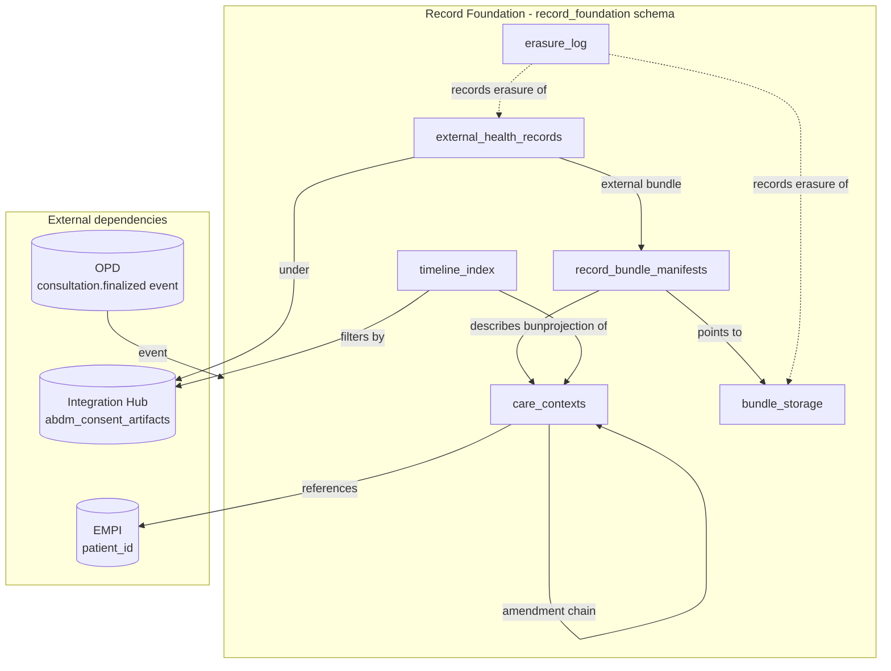
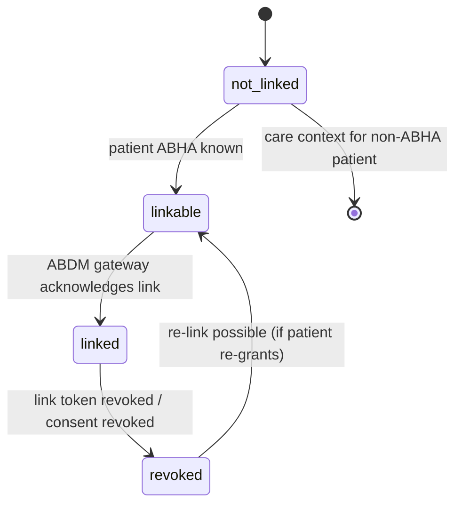
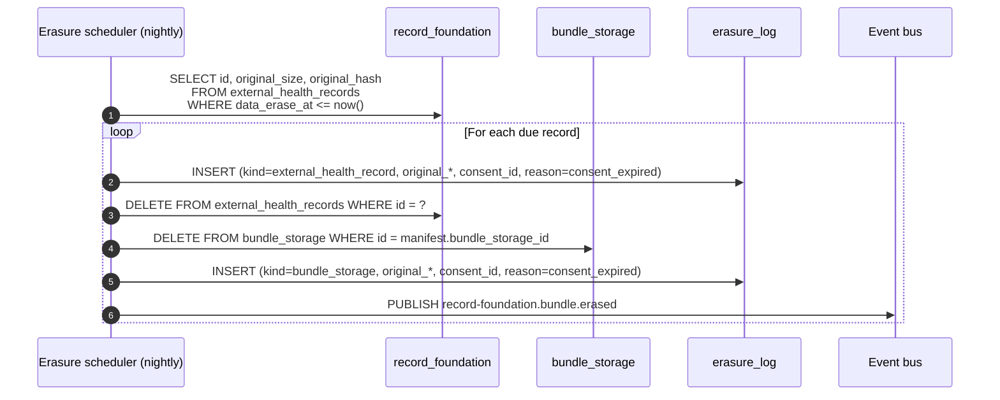

# Record Foundation -- Schema Design

**Module:** Record Foundation (fifth core platform module per [ADR-0021](../../adr/0021-record-foundation-fifth-core-module.md))
**Schema name:** `record_foundation`
**Service:** `services/record-foundation-svc/` (Phase 1)
**Module:** `modules/record-foundation/` (Phase 1)
**Related HLD:** [02-core-modules.md](../../hld/02-core-modules.md) (target update -- add Record Foundation as a fifth core module), [05-integration-and-interop.md section 4](../../hld/05-integration-and-interop.md#4-abdmabha-integration)
**Related ADRs:**
- [ADR-0021](../../adr/0021-record-foundation-fifth-core-module.md) -- Record Foundation as fifth core module
- [ADR-0022](../../adr/0022-immutable-fhir-document-storage.md) -- Immutable FHIR Document Bundles
- [ADR-0023](../../adr/0023-distributed-fhir-assembly.md) -- Distributed FHIR assembly via per-module serializers
- [ADR-0010](../../adr/0010-fhir-hl7-interop-standards.md) -- FHIR R4 baseline
- [ADR-0011](../../adr/0011-integration-hub-split.md) -- defines the Integration Hub boundary on the other side
**ERD (visual):** [`record-foundation.erd.json`](./record-foundation.erd.json)
**Schema reference (programmatic):** [`schema-reference.json`](./schema-reference.json)
**Scenarios:** [`02-scenarios.md`](./02-scenarios.md)

---

## 1. Purpose and scope

Record Foundation is the **substrate** for clinical-record concerns that operational modules cannot own individually and that EMPI / Integration Hub must not absorb. It owns four things:

1. **Care-context registry** -- the cross-module index of records linkable to ABDM (or queryable via the doctor's timeline).
2. **Internal FHIR Document Bundle vault** -- the immutable artifacts produced by clinical modules at finalisation, stored byte-exactly per [ADR-0022](../../adr/0022-immutable-fhir-document-storage.md).
3. **External HIU bundle inbox** -- the bundles received from external HIPs via ABDM Milestone 3.
4. **Timeline read-model + erasure scheduler** -- the read-projection and the lifecycle worker that honours `dataEraseAt`.

This is **not** the Phase 4 EMR product. The Phase 4 EMR is a richer clinical UI built **on top of** Record Foundation. The boundary is intentionally enforced in [ADR-0021 §"Boundary against the four existing core modules"](../../adr/0021-record-foundation-fifth-core-module.md#boundary-against-the-four-existing-core-modules).

| Owns | Does not own |
|---|---|
| Care-context lifecycle and ABDM linkage state | Source clinical data (OPD visits, lab rows, prescriptions -- those modules own them) |
| FHIR Document Bundle assembly orchestration | Per-resource serialisation (modules own that, [ADR-0023](../../adr/0023-distributed-fhir-assembly.md)) |
| Immutable bundle storage | Patient identity (EMPI) |
| External HIU bundle persistence + display index | ABDM transport, gateway sessions, consent artifacts (Integration Hub) |
| Erasure scheduling | Specialty UI, AI summaries, MRD deficiency workflows (Phase 4) |
| Timeline read-projection (`timeline_index`) | Tenant config, facility identity (Configurator) |

---

## 2. Schema-at-a-glance

Six tables under `record_foundation`. The full column-level definitions are in [`schema-reference.json`](./schema-reference.json); the narrative explains the design.

| Table | Purpose | Mutability |
|---|---|---|
| `care_contexts` | The discoverable record units. One row per (patient, source clinical event). | Mutable (status, linkage state, supersession). |
| `record_bundle_manifests` | One row per assembled or received FHIR Document Bundle. Links the care-context to the stored bytes. | Append-only (a new bundle = a new manifest, never UPDATE). |
| `bundle_storage` | Byte-exact storage. **INSERT-only.** Erasure deletes the row + writes `erasure_log`. | INSERT + DELETE only. NEVER UPDATE. |
| `external_health_records` | Inbox for external HIU-received bundles + display summary. | Mutable for `doctor_viewed_at`; otherwise insert + erase. |
| `timeline_index` | Denormalised read projection. Rebuildable. | Rebuilt by event consumers; never the source of truth. |
| `erasure_log` | Append-only audit of erasures. | Append-only. |

---

## 3. The Immutable Document Paradigm in the schema

The most important schema-level property is the strict separation of **manifest** from **bytes**.

- `record_bundle_manifests` holds *what the bundle is* (kind, profile URL, validation status, hash, producer).
- `bundle_storage` holds *the bundle bytes*.

Storage rows have **no UPDATE path** on the bundle bytes. Repository code that allows updates is rejected at code review; database triggers can be added in v1.5 to enforce structurally if `INSERT/DELETE`-only discipline ever leaks. This is the structural enforcement of [ADR-0022](../../adr/0022-immutable-fhir-document-storage.md).

The hash (`bundle_hash` -- SHA-256 of bundle bytes) lives on the manifest, not the storage row. This means a hash mismatch between `bundle_hash` (from manifest) and a freshly recomputed hash from bytes is *evidence of tampering*. The platform can verify integrity at any read.

**Amendments.** Clinical corrections are not edits. They are *new bundles* that supersede prior ones. The supersession is recorded:

- At the FHIR level: the new bundle's `Composition.relatesTo` carries `code='replaces'` referencing the prior `Composition` ([HL7 FHIR R4 -- Composition.relatesTo](https://hl7.org/fhir/R4/composition-definitions.html#Composition.relatesTo)).
- At the schema level: a new `care_contexts` row with `supersedes_id` pointing to the prior `care_contexts.id`, and the prior row's `status` set to `superseded`. Both rows persist.

Both bundles remain in the vault. Disclosure flows always serve the latest non-superseded bundle. Audit and the timeline can show the supersession history.

---

## 4. `care_contexts` -- the discoverable units

A care context is anything ABDM (or the doctor's timeline) treats as a discrete record unit. The schema's `source_record_type` enum mirrors ABDM's HI types:

| `source_record_type` | ABDM HI Type | Owning module |
|---|---|---|
| `opd_visit` | OPConsultation | OPD |
| `ipd_admission` | DischargeSummary (when discharged) | IPD |
| `lab_report` | DiagnosticReport | Lab |
| `prescription` | Prescription | OPD (for OPD-authored Rx); Pharmacy may publish for OTC |
| `radiology_report` | DiagnosticReport (imaging) | Radiology |
| `discharge_summary` | DischargeSummary | IPD |
| `immunisation_record` | ImmunizationRecord | Vaccination |
| `wellness_record` | WellnessRecord | Future Wellness module |
| `health_document` | HealthDocumentRecord | Document repository (catch-all) |
| `external_record` | (any -- as received) | -- (no source module; received from external HIP) |

### 4.1 Origin tracking

The `source_origin` column distinguishes three origins of a care-context:

- `platform_module` -- authored inside this platform (OPD wrote the visit, Lab finalised the report).
- `legacy_system` -- ingested through Integration Hub from a legacy HIS the tenant still operates ([HLD 05 fragmented-adoption story](../../hld/05-integration-and-interop.md#25-the-fragmented-adoption-story)).
- `external_abdm` -- received from an external HIP via ABDM Milestone 3.

Origin is critical: external_abdm-origin contexts have a `data_erase_at` constraint (consent-mandated erasure); platform_module-origin contexts are retained per the platform's retention policy. Origin also drives display: external records are clearly labelled in the timeline (`origin_label = 'External: <HIP display name>'`) so the doctor never confuses an externally received record with locally authored data.

### 4.2 ABDM linkage state machine

`abha_linkage_status` is intentionally separate from `status` (the clinical lifecycle: `draft / final / superseded / cancelled / archived`). A care context can be `final` and `not_linked` (clinically complete but the patient has no ABHA), or `final` and `linked` (the standard happy path).

### 4.3 Supersession

When a clinician amends a finalised note (rare, but legally important), the OPD module publishes a new `consultation.finalized` event with `supersedes_consultation_id` set. Record Foundation:

1. Inserts a new `care_contexts` row with `supersedes_id` pointing to the prior row.
2. Sets the prior row's `status = 'superseded'`.
3. Stores the new bundle. The old bundle remains in `bundle_storage`.
4. Updates `timeline_index` to show the new bundle as the current entry, with a "previously amended on <date>" tag.

For ABDM HIP discovery, only the latest non-superseded chain is presented. For audit / dispute resolution, the full chain is queryable.

---

## 5. `record_bundle_manifests` and `bundle_storage`

### 5.1 The split

`bundle_storage` is the byte vault. `record_bundle_manifests` is the metadata layer.

This split makes:

- **Storage migration trivial.** The manifest row's `bundle_storage_id` always points somewhere; whether the bytes are inline JSONB (v1 default) or in object storage (post-launch) is a property of the storage row, not the manifest.
- **Validation history queryable.** The manifest row records `validation_status` and `validation_errors`; failures are visible without reading bundle bytes.
- **Hash + signature ownership clear.** The manifest holds the hash of the bytes the platform produced. A signature, when present, signs those exact bytes. This is the structural property [ADR-0022](../../adr/0022-immutable-fhir-document-storage.md) requires.

### 5.2 What the SDK does

`@hims/ts-sdk-fhir` (per [ADR-0023](../../adr/0023-distributed-fhir-assembly.md)) provides:

- `Composition` builders for each NRCeS profile (`OpConsultRecord`, `Prescription`, `DischargeSummary`, etc.).
- `Bundle` builder that wraps a Composition and entries with deterministic key ordering (so re-producing the same logical bundle produces the same bytes).
- A profile validator that runs the bundle against the NRCeS R4 ImplementationGuide assets.
- Identifier-system constants (ABHA URI, MRN URI).

Modules call SDK builders to produce *resources* (`Encounter`, `MedicationRequest`, `DiagnosticReport`). Record Foundation calls the SDK's Composition + Bundle builders to assemble. Both sides share validation logic.

### 5.3 Storage strategy for v1

`storage_kind = 'inline_jsonb'`. Bundles live in a JSONB column. Reasons:

- Bundle sizes for OPConsultRecord and Prescription are typically <100KB. PostgreSQL handles JSONB at this scale comfortably.
- Tenant sharding via Citus colocates a tenant's bundles on a single shard with the tenant's other data (EMPI patient, OPD visit, etc.). Reading a bundle and the linked source data is shard-local.
- No additional infrastructure dependency in Phase 1.

`storage_kind = 'object_storage_ref'` is reserved for post-launch when Discharge Summaries (which can be large) routinely exceed comfortable inline limits. The schema accommodates the future move without migration of existing rows.

### 5.4 Encryption

- `encryption_kind = 'at_rest_pg'` -- relies on PostgreSQL's at-rest encryption (provided by the deployment platform; Azure Database for PostgreSQL flexible server, AWS RDS encryption, etc.).
- `encryption_kind = 'at_rest_object_kms'` -- when bundles move to object storage with platform-managed KMS keys.
- `encryption_kind = 'app_encrypted'` -- application-layer envelope encryption, available for tenants requiring stronger controls. Out of scope for v1; the column exists as a future-proof.

---

## 6. `external_health_records` -- the HIU inbox

When the platform acts as HIU and fetches records from external HIPs (M3), the bundles arrive encrypted. Integration Hub decrypts (Fidelius) and emits `abdm.health-record.received` (per [Integration Platform LLD section 4.4](../integration-platform/01-schema-design.md#44-integration_audit_log--the-regulatory-stream)). Record Foundation's consumer:

1. Inserts a `bundle_storage` row with the decrypted bundle bytes.
2. Inserts a `record_bundle_manifests` row (`producer_kind = 'external_hip'`, `validation_status = 'not_validated'` -- we trust the source HIP's declared profile conformance and do not re-validate).
3. Inserts a `care_contexts` row with `source_origin = 'external_abdm'` and `data_erase_at` set from the consent.
4. Inserts an `external_health_records` row with the parsed display summary (title, attestor, primary diagnosis from the Composition).
5. Updates `timeline_index` to surface the new record.
6. Publishes `record-foundation.external-record.received`.

The `display_summary` is the only piece of *parsed* data extracted -- enough to render a timeline row without reading the bundle. The bundle bytes are never modified.

The `doctor_viewed_at` column supports the "unread external record" UX badge that the future Phase 4 EMR will surface; for v1 it is populated by the doctor's open-record action via a Record Foundation API call.

---

## 7. `timeline_index` -- the read projection

A doctor opening a patient timeline expects:

- A chronological list of care contexts, internal and external interleaved.
- Per item: title, subtitle, origin label, occurred-at, sensitivity hint, link to open the record.

Without a projection, this view JOINs `care_contexts` + `record_bundle_manifests` + `external_health_records` + (per care-context type) the source module's row -- across schemas, which is forbidden ([no cross-schema FKs / queries](../../analysis/03-database-principles.md)). With the projection, a single SELECT from `timeline_index` answers it.

The projection is **rebuildable**: replaying `record-foundation.care-context.registered` + `record-foundation.bundle.stored` + `record-foundation.external-record.received` + `abdm.consent.granted/revoked` events in order regenerates the table. This makes the projection safe to drop and rebuild on schema changes or projection-logic fixes.

ABDM HIP discovery uses the same projection: `SELECT FROM timeline_index WHERE patient_id = $1 AND consent_disclosable = true`. The projection's `consent_disclosable` flag is maintained by the consent-event consumer, not computed at read time -- the same row read by the doctor's UI is read by the discovery handler.

---

## 8. `erasure_log` -- proving compliance

DPDP Act section 11 imposes an erasure obligation. ABDM consent's `dataEraseAt` is the operational form of that obligation. The platform must be able to show *that it erased what it was supposed to, when it was supposed to*.

`erasure_log` is the append-only proof:

- One row per erasure (of an `external_health_record`, of a `bundle_storage` row, of a `care_contexts` row).
- Captures the original size + hash before deletion (for integrity-of-the-erasure-record).
- Captures the consent under which the original was disclosed.
- Captures the trigger (`scheduler` / `manual:<user_id>`) and the reason (`consent_expired` / `consent_revoked` / `manual_purge` / `retention_policy`).

The scheduler that performs erasure runs nightly. Its logic:

The order matters: the `erasure_log` row is INSERTed *before* the source row is DELETEed, so a crash mid-loop leaves a half-erasure that re-runs idempotently (the second pass finds no source row but the `erasure_log` row already exists, so it does nothing).

---

## 9. Distribution and tenancy

All six tables distributed by `iq_tenant_id`. No reference tables. Reasons identical to Integration Hub: every concern is patient-scoped, hence tenant-scoped. Bundle storage co-locates with `care_contexts` and EMPI's `patients`, so reading a patient's full record set is shard-local.

The single cross-tenant query is the erasure scheduler's `WHERE data_erase_at <= now()`. To keep this efficient without forcing a global scan, the index `idx_external_records_erase_due` is on `data_erase_at` alone (not tenant-leading). The same trick is used by Integration Hub's timer worker.

---

## 10. Service deployment

| Concern | `record-foundation-svc` |
|---|---|
| Process | Fastify v5 ([ADR-0019](../../adr/0019-fastify-node24-lts.md)) |
| Port | 3006 (provisional) |
| Schema | `record_foundation` |
| Public endpoints (consumed by Integration Hub for ABDM HIP, by Phase 4 EMR for timeline) | `/api/v1/care-contexts`, `/api/v1/bundles`, `/api/v1/timeline`, `/api/v1/external-records` |
| Internal endpoints | `/api/v1/admin/erasure-runs` (manual trigger / dry-run for ops) |
| Workers | Erasure scheduler (nightly cron); event consumers (`consultation.finalized`, `abdm.consent.*`, `abdm.health-record.received`) |

Deployment shape mirrors EMPI's: one pod-type, horizontally scalable, no leader-election needed for normal operation (event consumers are competing-consumers; the erasure scheduler uses pg advisory lock).

---

## 11. Open implementation choices (LLD-defer)

Captured in [`dev-doubts/01.md`](./dev-doubts/01.md):

1. Bundle digital signatures: enable in v1 (signed at finalisation by a tenant-scoped signing key) or defer? Recommendation: schema accommodates them; v1 leaves them off and the column nullable.
2. Validation strictness: reject `validation_status='invalid'` bundles or warn-and-store? Recommendation: reject for `producer_kind='platform_module'` (we control them); warn-and-store for `producer_kind='external_hip'` (we cannot reject what an external system has already sent).
3. Object-storage extraction threshold for bundles. Recommendation: 256KB.
4. Timeline projection rebuild strategy: incremental on event vs nightly full rebuild. Recommendation: incremental, with manual full-rebuild trigger for ops.

---

## References

- HL7 International, "FHIR R4 -- Documents", https://hl7.org/fhir/R4/documents.html, accessed 2026-05-08.
- HL7 International, "FHIR R4 -- Composition.relatesTo", https://hl7.org/fhir/R4/composition-definitions.html#Composition.relatesTo, accessed 2026-05-08.
- National Resource Centre for EHR Standards (NRCeS), "ABDM FHIR Implementation Guide R4", https://nrces.in/ndhm/fhir/r4/index.html, accessed 2026-05-08.
- Government of India, "Digital Personal Data Protection Act, 2023", https://www.meity.gov.in/writereaddata/files/Digital%20Personal%20Data%20Protection%20Act%202023.pdf, sections 6 (consent), 8(3) (accuracy), 11 (erasure).
- Pat Helland, "Immutability Changes Everything", *ACM Queue* (2015), https://queue.acm.org/detail.cfm?id=2884038.
- Eric Evans, *Domain-Driven Design* (Addison-Wesley, 2003), Chapter 14 (Bounded Context).
- HL7 International, "FHIR R4 -- ImplementationGuide and StructureDefinition", https://hl7.org/fhir/R4/profiling.html, accessed 2026-05-08.
- Agent reviews, [agent-reviews/g/fhir-care-context-storage-review.md](../../../agent-reviews/g/fhir-care-context-storage-review.md), [agent-reviews/t/hld-emr-mrd-abdm-care-context-review/review.md](../../../agent-reviews/t/hld-emr-mrd-abdm-care-context-review/review.md).
