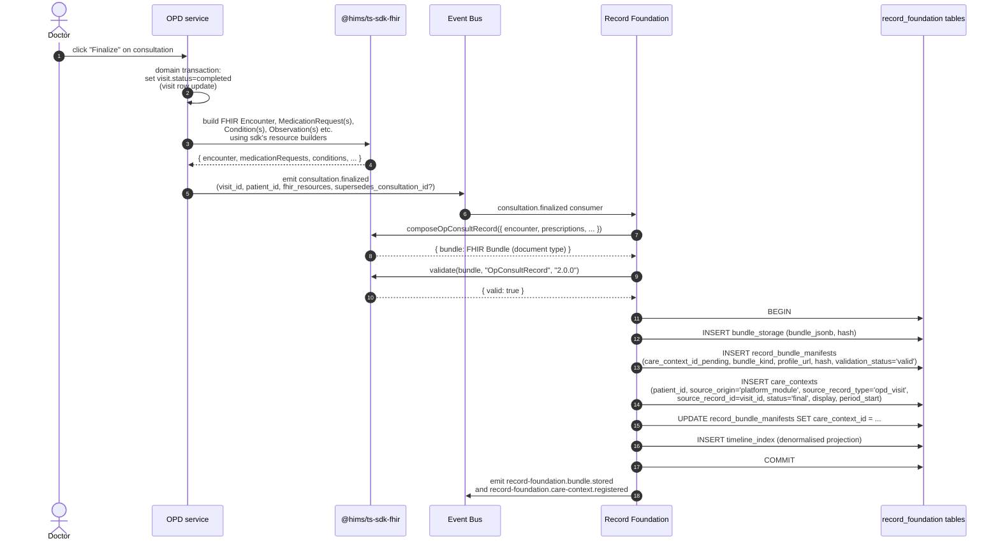
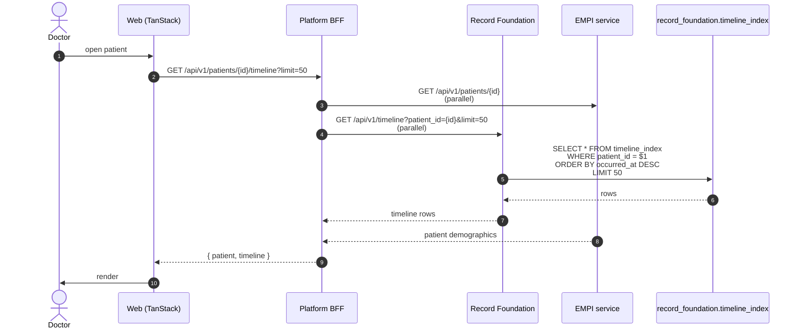
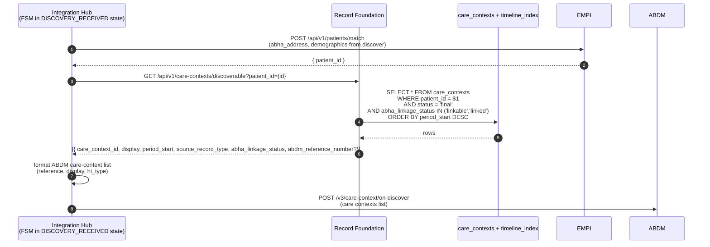
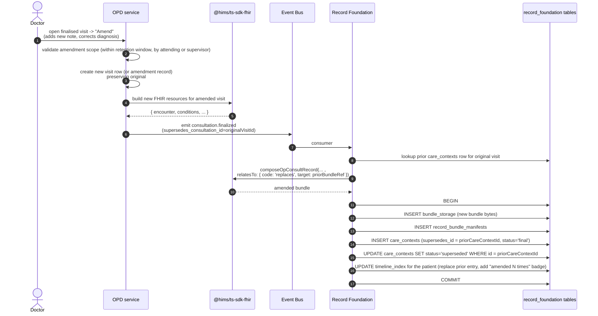
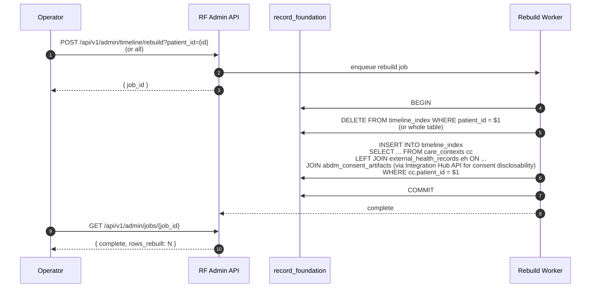

# Record Foundation -- Scenarios

End-to-end walkthroughs of the consequential flows Record Foundation orchestrates. The Integration Hub LLD's [`03-scenarios.md`](../integration-platform/03-scenarios.md) covers the ABDM-side narrative; this file is the *Record Foundation perspective* on the same flows, plus the internal-only scenarios (consultation finalisation, timeline rendering, amendment).

---

## Scenario 1 -- OPD consultation finalises; care context registered, bundle stored

A doctor finalises an OPD consultation. The OPD module produces FHIR resources for the consultation per [ADR-0023](../../adr/0023-distributed-fhir-assembly.md) and emits `consultation.finalized` with the resources attached. Record Foundation composes them into an OPConsultRecord Document Bundle, validates against the NRCeS profile, stores immutably, and registers the care context.



Notes:

- **OPD owns FHIR resource serialisation.** Per [ADR-0023](../../adr/0023-distributed-fhir-assembly.md), the OPD module knows what an Encounter looks like for an OPD visit. The SDK provides builders (`buildEncounter({ visit, patient, practitioner, ... })`); OPD's serialiser composes them.
- **Record Foundation does Composition assembly.** It takes the resources OPD provides, wraps them in a Composition + Bundle of type `document` per the NRCeS OpConsultRecord profile.
- **Validation before storage.** A bundle that fails NRCeS profile validation never enters the vault. The platform fails fast at finalisation rather than at ABDM disclosure time (where a failure would be a Facilitation Testing regression).
- **Single transaction.** All writes (bytes, manifest, care context, timeline projection) are one transaction. A crash leaves either everything or nothing -- no orphan bytes, no orphan manifests.
- **`bundle_jsonb` hashing.** The hash is computed over the bundle's serialised bytes (not over the Drizzle Drizzle in-memory representation) so that re-reading and re-serialising is deterministic. The SDK uses canonical JSON ordering ([RFC 8785 / JCS](https://www.rfc-editor.org/rfc/rfc8785)) so different runtimes produce identical bytes.

### What if validation fails?

If `validate(bundle, ...).valid === false`:

- The transaction does not commit.
- The OPD module's `consultation.finalized` event is dead-lettered (the bus pattern for failed processing).
- An ops alert fires; Record Foundation's `validation_status='invalid'` column records the errors.
- For `producer_kind='platform_module'`, the platform's policy is **reject** (we control our own serialisers and a validation failure indicates a bug we should fix, not paper over).
- For `producer_kind='external_hip'` (Scenario 4 below), the policy is **warn-and-store** -- we cannot reject what an external system has already sent us.

---

## Scenario 2 -- Doctor opens patient timeline



Notes:

- **Single index scan.** The `(iq_tenant_id, patient_id, occurred_at)` index serves the timeline query in O(log n). No JOINs, no cross-schema reaches, no fan-out across modules.
- **Parallelisation in BFF.** EMPI and Record Foundation are queried in parallel. The BFF stitches.
- **No clinical bytes here.** The timeline shows titles, subtitles, dates, origin labels. The actual record bytes are fetched only when the doctor opens a specific entry (Scenario 5 below).

---

## Scenario 3 -- ABDM HIP discovery answers "what care contexts exist for this ABHA?"

The Integration Hub's M2 user-initiated-link FSM ([Integration Platform Scenario 3](../integration-platform/03-scenarios.md#scenario-3----hip-initiated-linking-of-past-records-existing-patient-newly-acquired-abha) and M2 user-initiated FSM in [`02-fsm-specifications.md`](../integration-platform/02-fsm-specifications.md)) needs to answer the gateway's `/v3/care-context/discover` callback. It calls Record Foundation.



Notes:

- **`abha_linkage_status IN ('linkable','linked')`** -- discoverable means linkable. `not_linked` rows are not surfaced because the patient hasn't bridged identity yet. `revoked` rows are not surfaced because they were explicitly removed.
- **Display strings are pre-formatted.** Record Foundation's `display` column on `care_contexts` is the patient-facing string; the FSM does not have to compute display on the fly.
- **Reference numbers.** Linked contexts already have `abdm_reference_number`; relinking-incompatible. Linkable contexts have NULL; the FSM will populate after the gateway acknowledges the link.

---

## Scenario 4 -- External HIU bundle arrives; ingested into Record Foundation

This is the Record Foundation side of [Integration Platform Scenario 5](../integration-platform/03-scenarios.md#scenario-5----m3-hiu-doctor-pulls-external-records-for-a-patient).

```mermaid
sequenceDiagram
  autonumber
  participant Hub as Integration Hub<br/>(after Fidelius decrypt)
  participant Bus as Event Bus
  participant RF as Record Foundation<br/>(consumer)
  participant SDK as @hims/ts-sdk-fhir
  participant DB as record_foundation tables

  Hub->>Bus: emit abdm.health-record.received<br/>(patient_id, bundle_bytes_ref, consent_artifact_id, source_hip_id, data_erase_at)
  Bus->>RF: consumer
  RF->>Hub: GET decrypted bundle bytes (fetch from inbound message storage_ref)
  Hub-->>RF: bundle JSONB
  RF->>SDK: parse(bundle); extractDisplaySummary(bundle)
  SDK-->>RF: { profile, profileVersion, displaySummary }
  RF->>SDK: validate(bundle, profile, profileVersion)
  SDK-->>RF: { valid: maybe; warnings: [...] }
  Note over RF: For external bundles, validation_status set to 'valid' or 'invalid' but never reject -- store anyway.

  RF->>DB: BEGIN
  RF->>DB: INSERT bundle_storage (bundle_jsonb, hash)
  RF->>DB: INSERT record_bundle_manifests<br/>(producer_kind='external_hip', producer_id=source_hip_id, ...)
  RF->>DB: INSERT care_contexts<br/>(source_origin='external_abdm', source_record_type='external_record', ...,<br/>data_erase_at)
  RF->>DB: INSERT external_health_records<br/>(patient_id, care_context_id, bundle_manifest_id, consent_artifact_id, source_hip_id, display_summary, data_erase_at)
  RF->>DB: INSERT timeline_index<br/>(origin_label="External: <hip>", consent_disclosable=true)
  RF->>DB: COMMIT
  RF->>Bus: emit record-foundation.external-record.received
```

Notes:

- **Parsing for display, not for ingestion.** The `display_summary` is extracted (title, attestor, primary diagnosis from the Composition's first Section). The bundle bytes themselves are stored *unchanged*. Modifying them would invalidate any HIP signature and break dispute-evidence.
- **External validation policy.** Per [§11 of `01-schema-design.md`](./01-schema-design.md#11-open-implementation-choices-lld-defer): warn-and-store. We log validation issues but never reject an externally received bundle.
- **`consent_disclosable=true`** is set immediately because the receiving consent is *granting* the platform (HIU-side) access to view this record. The platform is the consent's "accessor"; for the platform's doctors, the record is disclosable until the consent expires.

---

## Scenario 5 -- Doctor opens an external record

```mermaid
sequenceDiagram
  autonumber
  actor Doc as Doctor
  participant Web as Web
  participant RF as Record Foundation
  participant DB as record_foundation tables

  Doc->>Web: click external record in timeline
  Web->>RF: GET /api/v1/external-records/{id}
  RF->>DB: SELECT bundle_storage.bundle_jsonb<br/>JOIN record_bundle_manifests<br/>JOIN external_health_records ON ...<br/>WHERE external_health_records.id = $1
  DB-->>RF: bundle + manifest + receipt metadata
  RF->>DB: UPDATE external_health_records SET doctor_viewed_at = COALESCE(doctor_viewed_at, now()) WHERE id = $1
  RF->>RF: bundle byte hash recompute<br/>(integrity check vs manifest.hash)
  alt Hash matches
    RF-->>Web: { bundle, manifest, receipt, integrity: 'ok' }
  else Hash mismatch
    RF->>RF: alert ops; do not return bundle bytes
    RF-->>Web: { error: 'integrity-failed' }
  end
  Web->>Web: render bundle (Composition narrative + Section views)
```

Notes:

- **Integrity check on every read.** The hash recompute is cheap (SHA-256 over JSON bytes) and is the platform's defence against silent storage corruption. A mismatch is a serious incident.
- **`doctor_viewed_at` once.** The COALESCE ensures we record the *first* view, not subsequent views; the audit answer is "was this disclosed to a doctor in this organization, and when".
- **Render is client-side.** The bundle is FHIR JSON; the Web service reads the Composition's text narratives and Section structures. The Phase 4 EMR product will provide richer views; v1 shows narratives.

---

## Scenario 6 -- Amendment: doctor corrects a finalised consultation



Notes:

- **Both bundles persist.** The original is in `bundle_storage` with `status='superseded'` on its care_context; the new one with `status='final'`. ABDM HIP discovery presents the latest. Audit / dispute resolution can produce both.
- **`Composition.relatesTo` pattern** is the FHIR-standard way ([HL7 FHIR R4 -- Composition.relatesTo](https://hl7.org/fhir/R4/composition-definitions.html#Composition.relatesTo)). The bundle declares its lineage so any consumer (HIU, archive, PHR app) can render the supersession.
- **No edit-in-place.** The OPD module *cannot* mutate the original visit row's clinical fields; its data model treats finalised visits as immutable. Amendments produce new rows. This discipline matches the Record Foundation discipline and avoids drift.

---

## Scenario 7 -- Erasure scheduler nightly run

The full Record Foundation walkthrough of [Integration Platform Scenario 6](../integration-platform/03-scenarios.md#scenario-6----consent-expires-bundles-erased).

```mermaid
sequenceDiagram
  autonumber
  participant Cron as Erasure Scheduler<br/>(pg_cron at 02:00 IST nightly)
  participant DB as record_foundation
  participant Bus as Event Bus

  Cron->>DB: BEGIN; SELECT pg_advisory_lock(...)<br/>(prevent concurrent runs)
  Cron->>DB: SELECT eh.id, eh.bundle_manifest_id, m.bundle_storage_id, eh.original_size, eh.consent_artifact_id, eh.patient_id, eh.data_erase_at<br/>FROM external_health_records eh JOIN record_bundle_manifests m ON ...<br/>WHERE eh.data_erase_at <= now() LIMIT 1000
  loop For each due record (batched 100 at a time)
    Cron->>DB: BEGIN
    Cron->>DB: INSERT erasure_log (kind=external_health_record, ..., reason='consent_expired', actor='scheduler')
    Cron->>DB: DELETE FROM external_health_records WHERE id = ?
    Cron->>DB: INSERT erasure_log (kind=bundle_storage, ..., original_size, original_hash)
    Cron->>DB: DELETE FROM bundle_storage WHERE id = bundle_storage_id
    Cron->>DB: DELETE FROM record_bundle_manifests WHERE id = bundle_manifest_id
    Cron->>DB: UPDATE care_contexts SET status='archived' WHERE id = (related)
    Cron->>DB: DELETE FROM timeline_index WHERE care_context_id = ?
    Cron->>DB: COMMIT
    Cron->>Bus: PUBLISH record-foundation.bundle.erased
  end
  Cron->>DB: SELECT pg_advisory_unlock(...)
  Cron->>DB: COMMIT
```

Notes:

- **Advisory lock** prevents two scheduler instances (e.g., during rolling deploy) from racing.
- **Per-record transaction.** A single failed erasure doesn't abort the whole run.
- **`care_contexts` archived, not deleted.** Erasure removes *bytes*; the `care_contexts` row's existence (sans referenced bundle) is regulatory evidence that this record once existed under this patient. The `status='archived'` row is small and retained.
- **Timeline projection cleanup.** The `timeline_index` row is removed so the doctor's timeline no longer surfaces the erased record.

---

## Scenario 8 -- Operations: rebuild the timeline projection

A bug in the projection consumer could accumulate drift between source tables and `timeline_index`. The rebuild operation is admin-initiated.



Notes:

- **Per-patient scope** for safety. Rebuilding the entire table is gated behind a separate admin permission and run during low-traffic windows.
- **Cross-module call** for consent disclosability. Integration Hub's `GET /api/v1/abdm/consents/active?patient_id=X` returns the current consent state; the rebuild applies it to the projection. This is the only place Record Foundation reaches across to Integration Hub for write-time data; runtime reads on the projection are local.

---

## References

- HL7 International, "FHIR R4 -- Bundle of type document", https://hl7.org/fhir/R4/documents.html, accessed 2026-05-08.
- HL7 International, "FHIR R4 -- Composition.relatesTo", https://hl7.org/fhir/R4/composition-definitions.html#Composition.relatesTo, accessed 2026-05-08.
- IETF, "RFC 8785 -- JSON Canonicalization Scheme (JCS)", https://www.rfc-editor.org/rfc/rfc8785, accessed 2026-05-08 -- the canonical JSON ordering used by `@hims/ts-sdk-fhir` so re-serialising a logically identical bundle produces identical bytes.
- PostgreSQL Global Development Group, "Advisory Locks", https://www.postgresql.org/docs/16/explicit-locking.html#ADVISORY-LOCKS, accessed 2026-05-08 -- used by the erasure scheduler.
- Government of India, "Digital Personal Data Protection Act, 2023", https://www.meity.gov.in/writereaddata/files/Digital%20Personal%20Data%20Protection%20Act%202023.pdf, sections 6 (consent) and 11 (erasure).
