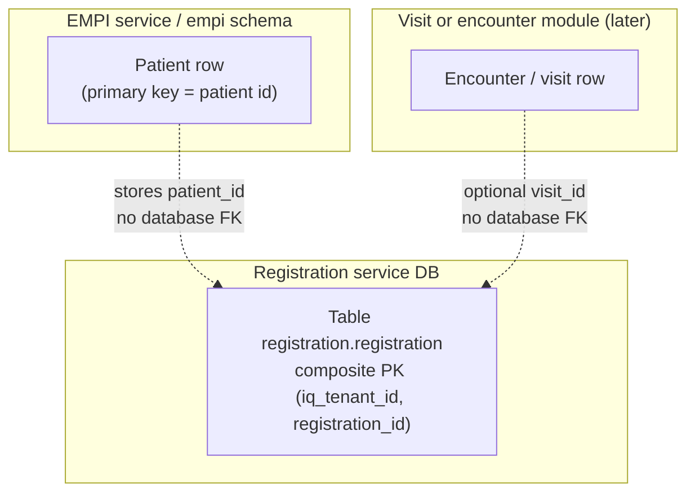
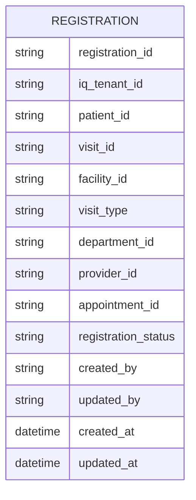
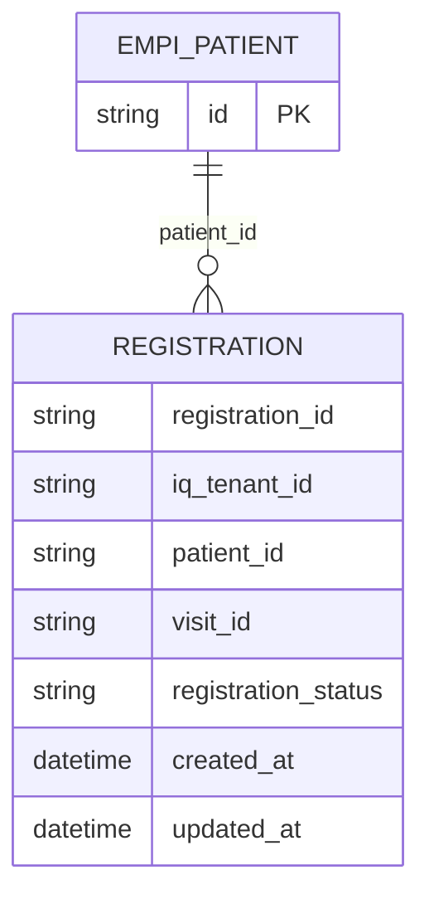
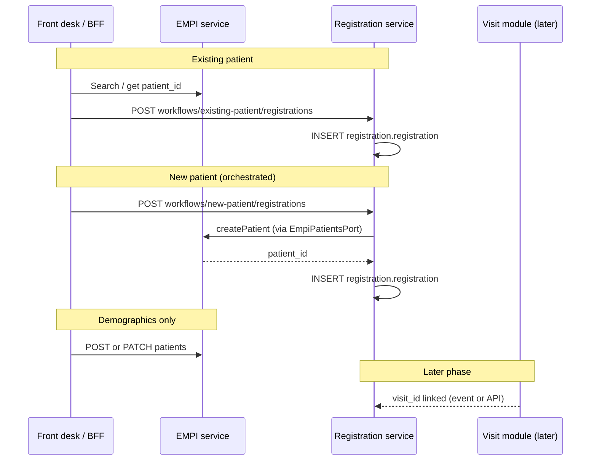

# Registration module — LLD overview

**Status:** Phase 0 scaffold (encounter intake + workflow hooks)  
**OpenAPI:** `specs/openapi/registration.v1.yaml`  
**Code:** `modules/registration/` · **Service:** `services/registration-svc/` (default port **3004**, prefix **`/api/registration/v1`**)

---

## 1. Purpose

Registration stores **one row per encounter-intake episode** for a tenant: who (patient), optional visit/appointment links, site (facility), clinical context (department, provider, visit type), and **status**. It is shared by **OPD**, **IPD**, **Emergency**, and other visit-based flows so front desk and clinical modules do not duplicate “arrival” state.

- **Not** EMPI: demographics and UHID stay in `empi.patients`.
- **Not** Master Data: catalogs (departments, visit types, facilities) are mastered there; this module stores **references** (UUIDs / codes agreed with consumers).
- **No cross-schema foreign keys** to EMPI or OPD: `patient_id` and `visit_id` are logical references validated at orchestration or via events.

---

## 2. ERD (physical model in this service)

The registration service persists **one table** in schema `registration`. Other systems are **logical** links only (no FK in PostgreSQL).

Mermaid **`erDiagram`** parsers differ by product version: use **`string`** / **`datetime`** for attributes (avoid `uuid`, `text`, `timestamptz` in diagrams if preview fails). **Diagram A** is a **flowchart** and renders in almost all Mermaid previews.

### Diagram A — entity relationship (flowchart, portable)



### Diagram B — `erDiagram` (Mermaid-native types)

Single physical table; attribute types use **`string`** / **`datetime`** so strict Mermaid parsers accept the diagram. Full SQL types are in the migration and the column table below.



### Diagram C — logical link to EMPI (`erDiagram`)



**Composite primary key:** `(iq_tenant_id, registration_id)` — tenant-safe and Citus-friendly.

**Indexes:** `(iq_tenant_id, patient_id)`, `(iq_tenant_id, visit_id)`, `(iq_tenant_id, registration_status)`.

**Migration:** `modules/registration/migrations/0000_registration_schema.sql`

---

## 3. How registration is handled (behaviour)

### 3.1 What this service does

1. **Accepts intake context** (patient, optional visit, facility, department, provider, appointment, visit type, status).
2. **Persists** a single `registration.registration` row scoped by `iq_tenant_id`.
3. **Returns** the row (including generated `registration_id` and timestamps) for downstream modules (queue, OPD sheet, billing projections).

It does **not** own long-lived patient demographics; it only stores `patient_id` once EMPI has issued it (or after the orchestrated new-patient path creates the patient via EMPI).

### 3.2 Existing patient (visit / encounter intake)

Typical desk flow:

1. Clerk **searches EMPI** (`GET /api/empi/v1/patients` or search params) and obtains `patient_id`.
2. Clerk submits intake: **`POST /workflows/existing-patient/registrations`** or **`POST /registrations`** with the same JSON body (`patient_id` required plus optional visit context).
3. Registration service **inserts one row** and returns `201` with the registration resource.

`visit_id` may be null at registration time and filled later when the visit/encounter module creates an encounter (API patch, event consumer, or BFF orchestration — phased in later LLDs).

### 3.3 New patient (single-call intake when wired)

When the deployment injects **`EmpiPatientsPort`** into the registration router:

1. Client sends **`POST /workflows/new-patient/registrations`** with `patient` (same shape as EMPI create patient) plus optional visit fields.
2. Service calls **EMPI** to create the patient, receives **`patient_id`**, then **creates the registration row** as in 3.2.

If the EMPI gateway is **not** configured, this endpoint returns **503** with `empi_gateway_not_configured` so operators know to wire the adapter or to use the two-step flow (EMPI create, then existing-patient registration).

### 3.4 Patient demographics only (edit / correction)

**Create or update demographics** (name, DOB, phone, and so on) stays on **EMPI** (`POST /api/empi/v1/patients`, `PATCH /api/empi/v1/patients/{id}` per `specs/openapi/empi.v1.yaml`). Registration does not duplicate that data; it only references `patient_id` on the intake row.

### 3.5 End-to-end picture (conceptual)



---

## 4. Column reference

| Column | Type | Notes |
|--------|------|--------|
| `registration_id` | uuid | Part of composite PK with `iq_tenant_id`; default `gen_random_uuid()`. |
| `iq_tenant_id` | uuid | Citus distribution key; required on every row. |
| `visit_id` | uuid nullable | Set when visit/encounter service creates the encounter. |
| `patient_id` | uuid not null | EMPI patient id (same tenant). |
| `facility_id` | uuid nullable | Site / branch. |
| `visit_type` | text nullable | e.g. `opd_first`, `ipd_admission`; align with Master Data when catalogued. |
| `department_id` | uuid nullable | Scheduling / authz context. |
| `provider_id` | uuid nullable | Ordering / attending provider. |
| `appointment_id` | uuid nullable | Scheduling link. |
| `registration_status` | text not null | Default `pending`; expand to enum + state machine later. |
| `created_by`, `updated_by` | uuid nullable | Audit (platform `auditColumns()`). |
| `created_at`, `updated_at` | timestamptz | Audit. |

---

## 5. Module layout

```
modules/registration/src/
  ports.ts                    # RegistrationRepo, EmpiPatientsPort
  domain/registration.types.ts
  schema/tables.ts            # Drizzle: registration.registration
  data-access/registration.repo.ts
  use-cases/create-registration.ts
  use-cases/get-registration.ts
  use-cases/create-intake-for-new-patient.ts
  rest-handlers/registrations.handler.ts
  rest-handlers/route-schemas.ts
  rest-handlers/serialize-registration.ts
  http-handlers/workflow-intake.handler.ts
  router.ts
  index.ts
```

---

## 6. APIs (Phase 0)

| Method | Path | Description |
|--------|------|-------------|
| POST | `/registrations` | Create row; body requires `patient_id` (EMPI-resolved). |
| GET | `/registrations/{registrationId}` | Fetch by id (tenant from header). |
| POST | `/workflows/existing-patient/registrations` | Same body as `POST /registrations`; intent URL for existing-patient desk flow. |
| POST | `/workflows/new-patient/registrations` | Demographics + visit fields; creates patient via EMPI gateway then row. **503** if gateway not configured. |

Patch, status transitions, and list filters are deferred until OPD/IPD contracts are wired.

---

## 7. BFF and web

- BFF proxies **`/api/registration/v1`** → `REGISTRATION_URL` (default `http://localhost:3004`).
- Web `apiClient` sends **`iq_tenant_id`** for paths under `/api/registration/v1/` (same rule as EMPI).

---

## 8. Integration checklist (later phases)

1. **After EMPI patient create** — BFF or client calls `POST /registrations` or the existing-patient workflow with `patient_id`, or uses the new-patient workflow when `EmpiPatientsPort` is wired.
2. **When visit exists** — OPD (or orchestration) updates `visit_id` or emits `visit.created` consumed by Registration.
3. **Master Data** — resolve `visit_type`, `department_id`, `facility_id` against tenant-effective catalogs.
4. **Events** — publish `registration.created` / `registration.updated` with rich payload for projections (queue display, billing).

---

## 9. Operational notes

- Apply SQL migration before starting `registration-svc`.
- Default status `pending`; transition rules and Cerbos actions to be defined with OPD/IPD LLDs.
