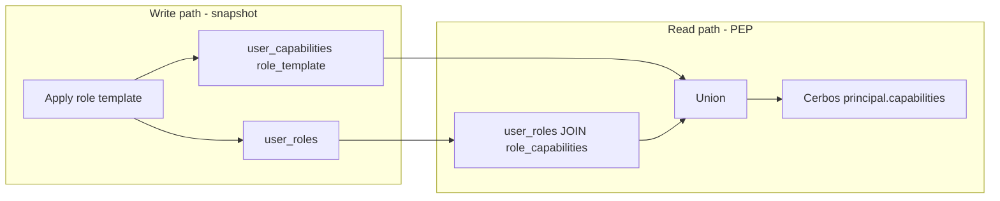

# PR #56 — Review gap audit (implementation vs latest reviewer feedback)

**Audit date:** 2026-05-17  
**Scope:** User Management entitlement-aware runtime authorization + role-template snapshot model  
**Method:** Static code trace (handlers → use-cases → repositories → principal enrichment), OpenAPI contract, tests, and existing LLD docs. GitHub PR comments were not available (`gh` unauthenticated); blocker IDs **B1–B6** follow the review brief supplied for this audit.

---

## Executive summary

| Category | Count | Notes |
|----------|------:|-------|
| Merge blockers (B1–B5) | **Fixed** | Snapshot apply/re-apply, detach revoke, manual preservation, HTTP subset, terminology cleanup |
| Hygiene (B6) | **Ready** | No `dist/`, `.nx/`, or `.vite/` in git diff; `.gitignore` covers artifacts |
| Fully addressed (non-blocker) | **9+ areas** | Entitlement, provisioning transaction, startup validation, vocabulary, legacy route removal |
| Architecture alignment (entitlement-aware UM) | **Yes** | Configurator + MD + UM boundaries respected |
| Architecture alignment (snapshot role semantics) | **Write path complete** | PEP still hybrid until #60; documented in ADR-0031 |

**Verdict:** Reviewer blockers **B1–B5** are implemented and covered by tests (148 UM + 18 svc + 10 web via direct Vitest). **B6** is PR hygiene only. **#60** (snapshot-only PEP) remains a follow-up PR.

**Verification (2026-05-17):** `pnpm exec vitest run` in `modules/user-management`, `services/user-management-svc`, and `services/web/src/features/user-management` — all green. `nx run *:test` blocked by unrelated `ts-sdk-authz:build` tsc rootDir issue.

---

## 1. Blocker audit (B1–B6)

### B1 — Re-apply subset narrowing

| Field | Value |
|-------|-------|
| **Status** | **FIXED** |
| **Severity** | Was merge blocker |

**Expected behavior (reviewer):** When a role template is applied again for the same `(user, role)` with a smaller `role_template_capability_ids` set, active `user_capabilities` rows for that role must be **synchronized** to the new set (revoke extras scoped by `source_role_id`).

**Current behavior:**

| Layer | Behavior |
|-------|----------|
| Use-case | `applyRoleTemplate` (`apply-role-template.ts`) correctly computes `capabilityIdsToApply` including subset validation. |
| Drizzle | `DrizzleUserAccessRepository.applyRoleTemplate` only **inserts** capability IDs not already active; never revokes removed subset members. Re-apply is idempotent-add-only. |
| In-memory | `InMemoryUserAccessRepository.applyRoleTemplate` **returns early** if `user_roles` association already exists — re-apply does not update capabilities at all. |

**Evidence:**

```124:193:modules/user-management/src/data-access/user-access-repository.ts
  async applyRoleTemplate(...) {
    // ...
    const capabilityIdsToInsert = [...new Set(input.capabilityIds)].filter(
      (capabilityId) => !existingIds.has(capabilityId),
    );
    // inserts/upserts only — no revoke of role_template grants outside the new set
```

```37:41:modules/user-management/src/data-access/in-memory-user-access-repository.ts
    const existing = this.roleTemplates.get(key);
    if (existing) {
      return existing;  // re-apply no-op
    }
```

**Remaining risk:** Admin narrows a template subset; user retains capabilities from the previous superset → **authorization wider than intended**.

**Files to change:**

- `modules/user-management/src/data-access/user-access-repository.ts` — `applyRoleTemplate`
- `modules/user-management/src/data-access/user-provisioning-repository.ts` — `applyRoleTemplateInTx`
- `modules/user-management/src/data-access/in-memory-user-access-repository.ts` — align re-apply semantics
- New integration tests: re-apply narrows `user_capabilities` for `source_role_id`

**Complexity:** Medium (1–2 days) — shared “sync role template grants” helper used by apply + provisioning.

---

### B2 — Orphaned `role_template` grants

| Field | Value |
|-------|-------|
| **Status** | **FIXED** |
| **Severity** | Was merge blocker |

**Expected behavior (reviewer):** Detaching a role template must not leave stale `grant_source = role_template` rows that still authorize the user.

**Current behavior (after fix):**

| Layer | Behavior |
|-------|----------|
| `detachRoleTemplate` | Deletes `user_roles` row, then soft-revokes active `role_template` grants where `source_role_id` matches. |
| `user_capabilities` | Matching snapshot rows get `revoked_at` / `revoked_by_user_id`; manual, delegated, and system grants unchanged. |
| OpenAPI | Documents revoke-on-detach semantics. |
| Tests | `in-memory-user-access-repository.test.ts`, `detach-role-template-route.test.ts`, `role-template-grant-writes.test.ts`. |
| PEP | Hybrid read still applies (#60); detach no longer leaves active `role_template` snapshot rows for the detached role. |

**Implementation:** `revokeRoleTemplateCapabilitySnapshot()` reuses `planRoleTemplateCapabilitySync([], …)` (empty desired set) in the same transaction as `user_roles` delete.

---

### B3 — Manual grant clobbering

| Field | Value |
|-------|-------|
| **Status** | **FIXED** |
| **Severity** | Was merge blocker (data integrity) |

**Expected behavior:** Applying a role template must **not** overwrite an existing active `grant_source = manual` row for the same `capability_id`.

**Current behavior:** `onConflictDoUpdate` on `(tenant, user, capability)` always sets `grant_source: "role_template"`, wiping manual provenance.

**Evidence:**

```178:192:modules/user-management/src/data-access/user-access-repository.ts
            .onConflictDoUpdate({
              // ...
              set: {
                grant_source: "role_template",
                source_role_id: input.roleId,
                // ...
              },
            });
```

Same pattern in `user-provisioning-repository.ts` → `applyRoleTemplateInTx`.

**Remaining risk:** Manual grants silently become template copies; audit and `replaceManualCapabilityGrants` semantics break.

**Files to change:**

- `user-access-repository.ts`, `user-provisioning-repository.ts`
- Conflict policy: **skip update** when existing active row is `manual`, or use conditional SQL
- Tests: apply template does not change `grant_source` of pre-existing manual grant

**Complexity:** Small–medium (0.5–1 day).

---

### B4 — Handler ignores subset

| Field | Value |
|-------|-------|
| **Status** | **FIXED** |
| **Severity** | Was merge blocker |

**Expected behavior:** `POST /users/{id}/roles` accepts optional `role_template_capability_ids` (same rules as create-user / use-case).

**Current behavior:**

| Surface | Subset support |
|---------|----------------|
| `createUser` + OpenAPI | Yes (`role_template_capability_ids`) |
| `applyRoleTemplate` use-case | Yes |
| `POST /users/{id}/roles` handler | **No** — only `{ role_id }` forwarded |
| OpenAPI `POST /users/{id}/roles` | **No** property for subset |
| Frontend `ApplyRoleTemplateBody` | **Only** `role_id`; `user-access-panel` applies full template |

**Evidence:**

```200:204:modules/user-management/src/rest-handlers/user-handlers.ts
        const applied = await applyRoleTemplate(
          deps.applyRoleTemplateDeps,
          { tenantId, actorId, correlationId: cid },
          { user_id: request.params.id, role_id: request.body.role_id },
        );
```

**Files to change:**

- `specs/openapi/user-management.v1.yaml`
- `user-handlers.ts`
- `services/web/src/features/user-management/types.ts` — `ApplyRoleTemplateBody`
- `user-access-panel.tsx` — capability picker for apply flow (mirror create-user)
- Regenerate contract / `admin-surface-routes.test.ts` if needed

**Complexity:** Medium (1–2 days) — mostly API + UI wiring; depends on B1 for re-apply.

---

### B5 — Legacy role-assignment terminology cleanup

| Field | Value |
|-------|-------|
| **Status** | **FIXED** |
| **Severity** | Was merge blocker (hygiene / confusion) |

**Done:**

- Removed legacy routes/repos; admin API uses `/users/{id}/roles` only
- Removed `DuplicateRoleAssignmentError`, `RoleAssignmentNotFoundError`, `RoleAssignment` type, orphaned OpenAPI `RoleAssignment` schema
- Cerbos resource kind renamed to `user_role_template` (policy, tests, PEP resolver, UX map)
- Event validator renamed to `validateAppliedRoleTemplateAssociationPayload`
- Frontend uses `AppliedRoleTemplate`; removed dead hooks and `legacy-role-assignments` query keys

---

### B6 — Generated build artifacts / hygiene

| Field | Value |
|-------|-------|
| **Status** | **NOT FIXED** |
| **Severity** | Merge blocker (process) |

**Observation:** Working tree contains untracked `.nx/cache/**`, `packages/ts-sdk-*/dist/**`, `modules/user-management/node_modules/.vite/**`. `.gitignore` covers `.nx/` and `dist/` but artifacts must not be added in PR #56.

**Action:** Ensure PR diff excludes build outputs; run `git status` before merge; optionally add ignore rules for `packages/*/dist` if packages emit outside `dist/` root.

**Complexity:** Trivial (minutes) if nothing staged; **do not commit** cache/dist.

---

## 2. ADR / documentation requirements

### What exists

| Document | Covers |
|----------|--------|
| `04-module-capability-vocabulary.md` | Entitlement boundaries; **hybrid** effective access note |
| `runtime-authorization-validation-checklist.md` | Fail-closed, cache, startup, transactional create |
| `runtime-capability-vocabulary.md` | Cerbos key format |
| OpenAPI `user-management.v1.yaml` | Copy-on-apply; detach leaves copies |

### What is missing or stale

| Gap | Impact |
|-----|--------|
| **No ADR** for snapshot vs live PEP, `grant_source`, detach/revoke, re-apply sync | Reviewer cannot sign off architecture |
| `01-schema-design.md` | Updated — Phase 1A `user_roles` / `user_capabilities` + ADR-0031; target-state `role_assignments` labeled future |
| `02-scenarios.md` | Updated — Phase 1A API uses `/users/{id}/roles`; §9+ target-state only |
| No **#60 transition** doc (live JOIN + overrides table) | Future refactor risk |
| OpenAPI says runtime resolves from `user_capabilities` only; code also live-joins roles | Contract lie |

### Merge-ready docs?

**No.** Minimum for merge:

1. **ADR or LLD addendum** (recommended: `docs/architecture/adr/00xx-um-role-template-snapshot-semantics.md`):
   - Snapshot-at-write for `user_capabilities`
   - `grant_source` + `source_role_id` model
   - Re-apply = sync; detach = revoke template grants (if B2 adopted)
   - PEP: snapshot-only vs hybrid (pick one; see §4)
   - Explicit non-goals for #56; pointer to #60
2. Update `01-schema-design.md` / `02-scenarios.md` tables and flows
3. Align OpenAPI descriptions with chosen detach/re-apply semantics

---

## 3. End-to-end role semantics trace

| Flow | Source of truth (write) | Revoke path | Audit trail | Drizzle vs in-memory |
|------|-------------------------|-------------|-------------|----------------------|
| **Create user** | `UserProvisioningRepository.provisionUserWithAccess` (transaction) | N/A | Event `user.created` only; **no** `permission_change_audit` | In-memory provisioning rolls back; access repo diverges on re-apply |
| **Apply role template** | `user_roles` + insert `user_capabilities` (`role_template`) | None on re-apply | None | In-memory: first apply only |
| **Re-apply template** | Same as apply | **Missing** (B1) | None | In-memory: no-op |
| **Subset apply** | Create-user + use-case yes; HTTP apply **no** (B4) | **Missing** (B1) | None | Same |
| **Detach role** | Delete `user_roles` | **Does not revoke** snapshots (B2) | None | Test expects grants remain |
| **Replace manual grants** | `replaceManualCapabilityGrants` — manual only | Revokes manual not in desired set | None | Aligned |
| **Principal enrichment** | `DrizzlePrincipalAuthorizationRepository.listEffectiveCapabilityKeys` | N/A (read) | N/A | In-memory tests **seed** keys; no live-join simulation |

### `grant_source` model (current)

| Value | Written by | Revoked by |
|-------|------------|------------|
| `manual` | create-user, `PUT .../capabilities` | `replaceManualCapabilityGrants` |
| `role_template` | apply template, create-user templates | **Nothing** (B2) |
| `delegated` / `system` | Not in scope of PR #56 write paths | — |

### API snapshot shape

`getUserCapabilities` splits `direct_grants` vs `copied_grants` by `grant_source === role_template` — consistent with storage, not with hybrid PEP.

---

## 4. Snapshot vs live architecture

**Classification: partially transitioned hybrid**



| Location | Model |
|----------|-------|
| `user-access-repository.applyRoleTemplate` | Snapshot copy |
| `principal-authorization-repository.ts` | **Snapshot ∪ live join** |
| `default-principal-service.ts` comment | Documents hybrid |
| OpenAPI GET `/users/{id}/roles` | Says reporting only; runtime from `user_capabilities` |
| `04-module-capability-vocabulary.md` | Documents hybrid explicitly |

**Contradictions:**

- OpenAPI runtime note vs PEP live join
- Detach removes association but snapshots (+ possibly live join before detach) disagree with “role removed” UX
- Tests encode copy-forward detach; reviewer wants revocation

**Recommendation for #56 (without implementing #60):** Pick **snapshot-only PEP** (read `user_capabilities` where `revoked_at IS NULL` only) for consistency with copy-on-apply, **or** document hybrid as temporary with #60 removing live join. Reviewer snapshot semantics align with **snapshot-only PEP**.

---

## 5. Future migration friendliness (#60)

Target: live `user_roles ⨝ role_capabilities` + `user_capabilities` as explicit overrides.

| Concern | Assessment |
|---------|------------|
| `source_role_id` outside data-access | Exposed on `UserCapabilityGrant` in domain/API — **acceptable** for future override detection |
| APIs coupled to snapshot | `POST /roles` copy semantics; `getUserCapabilities` copied vs direct — **migration will need API versioning or behavior flag** |
| Irreversible assumptions | Detach-without-revoke + hybrid PEP make “association removed” ≠ “access removed” — **fix in B2** before #60 |
| Refactor difficulty | **Medium** — `grant_source` + `source_role_id` help; live join in PEP must be removed deliberately in #60 |

**Do not implement live-only model in #56** per constraints; do **document** #60 target in ADR.

---

## 6. Implementation matrix

| Reviewer item | Status | Current behavior | Remaining work | Files |
|---------------|--------|------------------|----------------|-------|
| **B1** Re-apply subset narrowing | FIXED | `syncRoleTemplateCapabilitySnapshot` on apply/re-apply | — | `role-template-grant-writes.ts`, repositories, tests |
| **B2** Orphaned `role_template` grants | FIXED | Detach revokes scoped `role_template` snapshot grants | — | `user-access-repository.ts`, `role-template-grant-writes.ts`, OpenAPI, tests, UI copy |
| **B3** Manual grant clobbering | FIXED | Conditional upsert / planner skips manual | — | `role-template-grant-writes.ts`, repositories, tests |
| **B4** Handler ignores subset | FIXED | OpenAPI + handler + web subset picker | — | `user-management.v1.yaml`, `user-handlers.ts`, `user-access-panel.tsx`, route tests |
| **B5** Role-assignment stack cleanup | FIXED | Terminology aligned to applied role templates | — | errors, Cerbos, OpenAPI, web, events |
| **B6** Build artifact hygiene | READY | No artifacts in git diff; `.gitignore` OK | Confirm before merge | PR hygiene only |
| Entitlement-aware filtering | FULLY FIXED | Configurator + MD + assert on writes | — | `assert-runtime-capabilities-entitled-for-tenant.ts`, ports/adapters |
| Transactional create user | FULLY FIXED | Single TX for user + grants | Compensating auth rollback (#future) | `user-provisioning-repository.ts` |
| Startup validation | FULLY FIXED | Fail-fast env + catalog | — | `validate-runtime-authorization.ts` |
| Capability provenance | FULLY FIXED | Nullable MD fields | Sync port (#future) | `capability-provenance.ts`, migration |
| Assignable capabilities API | FULLY FIXED | `GET /capabilities/assignable` | — | `list-assignable-runtime-capabilities.ts` |
| Runtime vocabulary alignment | FULLY FIXED | Keys + startup checks | — | `runtime-capability-vocabulary.md` |
| Legacy assign/revoke routes removed | FULLY FIXED | No `/role-assignments` handlers | — | `router.ts` |
| Snapshot semantics ADR | FIXED | [ADR-0031](../../adr/0031-um-role-template-snapshot-semantics.md); LLD + OpenAPI aligned | — | `docs/architecture/adr/0031-um-role-template-snapshot-semantics.md` |
| #60 transition doc | NOT FIXED | — | ADR section + issue link | ADR |
| `permission_change_audit` | NOT FIXED | No writes on grant changes | Future / separate scope | schema exists, no writers |
| PEP snapshot-only | NOT FIXED | Hybrid union read | Align with ADR (#56 or #60) | `principal-authorization-repository.ts` |

---

## 7. Recommended implementation order

### Merge blockers (do first)

1. **B3** — Stop manual grant clobbering (smallest, highest integrity).
2. **B1 + B4** — Shared `syncRoleTemplateGrants(tenant, user, roleId, capabilityIds, actor)`; wire HTTP + OpenAPI + UI subset.
3. **B2** — Revoke `role_template` + matching `source_role_id` on detach; update tests + OpenAPI.
4. **ADR + OpenAPI + LLD** — Record decisions; resolve PEP snapshot-only vs hybrid.
5. **B5** — Dead code / stale doc cleanup.
6. **B6** — Confirm PR contains no `dist/`, `.nx/cache/`.

### Safe cleanup (done — B5)

- Frontend uses `AppliedRoleTemplate` only; dead `useAssignRole` / `useRevokeRole` removed.
- Errors use `USER_ROLE_TEMPLATE_*` only; Cerbos resource kind is `user_role_template`.

### Future architecture (#60 — separate PR)

- Remove live join from `DrizzlePrincipalAuthorizationRepository`.
- Introduce overrides-only `user_capabilities` semantics.
- Migration backfill / dual-read period.

### Out of scope (explicit)

- Redesign entitlement architecture.
- Remove transactional provisioning.
- Implement live-only model now.
- `permission_change_audit` writers (unless reviewer elevates).

---

## 8. Entitlement-aware UM alignment

**Still aligned.** This PR correctly:

- Treats Configurator as tenant module enablement only.
- Resolves module slugs via Master Data at integration boundary.
- Filters assignable and asserted capabilities in UM.
- Fails closed on upstream errors (`MODULE_ENTITLEMENT_LOOKUP_FAILED`).
- Does not query MD permissions at PDP time.

Role-semantics blockers are **orthogonal** to entitlement; fixing B1–B4 does not weaken entitlement gates.

---

## 9. Blocker count and complexity estimates

| ID | Status | Complexity |
|----|--------|------------|
| B1 | Fixed | — |
| B2 | Fixed | — |
| B3 | Fixed | — |
| B4 | Fixed | — |
| B5 | Fixed | — |
| B6 | Ready (hygiene) | **XS** |

**Open merge blockers: 0** (B1–B5 complete; B6 = do not commit cache/dist).

**Follow-up (#60):** snapshot-only PEP — separate PR.

---

## 10. Verification checklist (post-fix)

```bash
pnpm exec nx run user-management:test
pnpm exec nx run user-management-svc:test
pnpm exec nx run web:test
pnpm exec tsx services/user-management-svc/scripts/validate-user-management-openapi.mts
```

**Tests present (verified 2026-05-17):**

- Re-apply narrows/widens: `in-memory-user-access-repository.test.ts`, `role-template-grant-writes.test.ts`
- Manual grant preserved: `role-template-grant-writes.test.ts`, `in-memory-user-provisioning-repository.test.ts`
- Detach revokes: `detach-role-template-route.test.ts`, in-memory tests
- HTTP subset: `apply-role-template-route.test.ts`
- Entitlement fail-closed: `apply-role-template.entitlement.test.ts`, `create-user.test.ts`, others

**Still open:**

- Principal effective capabilities snapshot-only policy (#60)
- OpenAPI validate script vs internal diagnostic routes
- Nx `ts-sdk-authz:build` blocks `nx run *:test` (use direct Vitest)

---

*Audit updated after implementation; initial snapshot was read-only pre-fix.*
