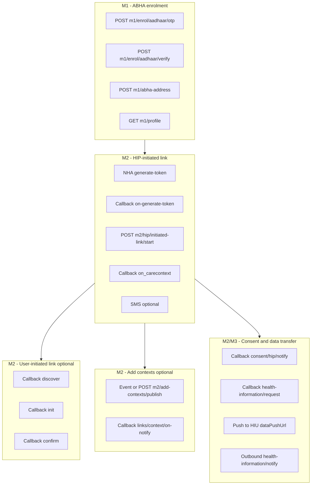

# ABDM Adapter — Full E2E test guide (M1 → M2 → M3) and production cutover

This is the **operator guide** for testing the complete ABDM journey on sandbox and for knowing **exactly what must change before live (production) traffic**.

> **Start here if you want a short, easy map:**  
> **[abdm-adapter-m2-simple-reference.md](./abdm-adapter-m2-simple-reference.md)** — which doc to read, static vs env vars, link token vs old LIMS, three flows.

**Related docs**

| Doc | Purpose |
|-----|---------|
| **[M2 simple reference](./abdm-adapter-m2-simple-reference.md)** | **Read first** — easy overview |
| [M2 hands-on walkthrough](./abdm-adapter-m2-hands-on-walkthrough.md) | ngrok + Postman + curl steps |
| [M2 runbook](./abdm-adapter-m2-runbook.md) | Dev checklist, smoke scripts |
| [M1 runbook](./abdm-adapter-m1-runbook.md) | ABHA enrolment APIs |
| [05-m2-flows.md](../architecture/lld/abdm-adapter/05-m2-flows.md) | Flow catalogue, link token cache |
| [06-m2-dev-guide.md](../architecture/lld/abdm-adapter/06-m2-dev-guide.md) | Implementation detail |
| [milestone2.md](../../milestone2.md) | NHA API text |
| Postman `Milestone_2_16_02_2026_6e734af067 (1).postman_collection.json` | Sandbox request examples |
| [OpenAPI](../../specs/openapi/abdm-adapter.v1.yaml) | Platform APIs (`/api/abdm/v1/*`) |

**Service:** `abdm-adapter-svc` — default port **3007**.

> **New to M2 / confused about Swagger vs Postman?**  
> Use **[abdm-adapter-m2-hands-on-walkthrough.md](./abdm-adapter-m2-hands-on-walkthrough.md)** (ngrok, Postman order, HIP link + consent + record fetch).

---

## 0. One-time setup (sandbox)

### 0.1 Copy environment

```bash
cp services/abdm-adapter-svc/.env.example services/abdm-adapter-svc/.env
```

Edit **`.env`** (never commit secrets or your personal mobile):

| Variable | Sandbox value | Notes |
|----------|---------------|--------|
| `ABDM_SANDBOX_CLIENT_ID` / `SECRET` | From NHA sandbox portal | Required for all NHA calls |
| `DATABASE_URL` | Postgres URL | Root `.env` or `ABDM_DATA_DATABASE_URL` |
| `ABDM_DEV_TENANT_ID` | e.g. `00000000-0000-4000-8000-0000000000aa` | Same UUID as `x-tenant-id` on platform APIs |
| `ABDM_X_HIP_ID` | **`IN3610001625`** | Your facility HIP (HFR) |
| `ABDM_X_CM_ID` | **`sbx`** | Sandbox consent manager |
| `ABDM_M2_MOCK_PLATFORM` | `true` for dev without EMPI/RF | Set `false` when EMPI + Record Foundation run |
| `ABDM_MOCK_ABHA_ADDRESS` | Patient ABHA used in Postman | Must match generate-token / link patient |
| `ABDM_DEFAULT_SMS_PHONE` | **Your mobile E.164** e.g. `+91XXXXXXXXXX` | SMS after HIP link; see § SMS |
| `ABDM_HIP_DISPLAY_NAME` | Hospital display name in SMS | Optional |

### 0.2 Migrate and start

```bash
npx nx run abdm-adapter-svc:db-migrate
npx nx run abdm-adapter-svc:serve
```

Verify: `GET http://localhost:3007/healthz` → `{ "status": "ok" }`.

### 0.3 Register callback URL (mandatory for real M2)

ABDM **cannot** call `localhost`. Use a public tunnel:

```bash
ngrok http 3007
```

In **NHA sandbox / HFR** for HIP `IN3610001625`, set **bridge / callback URL** to the ngrok **origin only** (no path), e.g. `https://abc123.ngrok-free.app`.

NHA will POST to `{callback}/api/v3/...` (paths below).

### 0.4 Headers you use everywhere

**Platform APIs** (`/api/abdm/v1/*`):

| Header | Value |
|--------|--------|
| `x-tenant-id` | `ABDM_DEV_TENANT_ID` |
| `Content-Type` | `application/json` |

**NHA → HIP callbacks** (Postman simulates these; gateway sends in prod):

| Header | Value |
|--------|--------|
| `REQUEST-ID` | New UUID per request (dedupe key) |
| `TIMESTAMP` | ISO-8601 UTC |
| `X-HIP-ID` | `IN3610001625` (must match `ABDM_X_HIP_ID`) |
| `X-CM-ID` | `sbx` |

---

## 1. End-to-end flow overview



**Recommended first full sandbox path:** M1 (create ABHA) → M2 HIP link (Postman) → Consent (Postman Data Transfer) → HI request (Postman).

---

## 2. Phase M1 — Register / create ABHA

Use **your** service base: `http://localhost:3007/api/abdm/v1`.

All steps need `x-tenant-id: <ABDM_DEV_TENANT_ID>`.

| Step | Method | Path | Body / query | Saves |
|------|--------|------|--------------|-------|
| 0 Smoke | `GET` | `/m0/gateway/session` | — | Gateway token works |
| 1 OTP | `POST` | `/m1/enrol/aadhaar/otp` | `{ "aadhaarNumber": "12 digits" }` | `sessionId`, `txnId` |
| 2 Verify | `POST` | `/m1/enrol/aadhaar/verify` | `{ "sessionId", "otp", "mobile" }` | ABHA profile tokens in session |
| 3 Mobile OTP | `POST` | `/m1/enrol/mobile-verify/otp` | `{ "sessionId" }` | — |
| 4 Mobile verify | `POST` | `/m1/enrol/mobile-verify/verify` | `{ "sessionId", "otp" }` | — |
| 5 Suggestions | `GET` | `/m1/abha-address/suggestions?sessionId=` | — | ABHA address options |
| 6 Create address | `POST` | `/m1/abha-address` | `{ "sessionId", "abhaAddress" }` | **`abhaAddress`** for M2 |
| 7 Profile | `GET` | `/m1/profile?sessionId=` | — | Confirm ABHA created |

**After M1:** Note the **`abhaAddress`** (e.g. `yourname@sbx`). Use it in M2 generate-token and `initiated-link/start`. Set `ABDM_MOCK_ABHA_ADDRESS` to the same value if using mock EMPI.

Details: [abdm-adapter-m1-runbook.md](./abdm-adapter-m1-runbook.md).

---

## 3. Phase M2 — HIP-initiated linking (primary hospital flow)

Matches Postman folder **HIP Initiated Linking**.

### 3.1 Who calls what

| Step | Caller | Target | Our handler |
|------|--------|--------|-------------|
| 1 | HIMS | `POST /api/abdm/v1/m2/link-token/acquire` | Session `TOKEN_REQUESTED` |
| 2 | NHA | `POST {callback}/api/v3/hip/token/on-generate-token` | Link token cache; poll `GET /m2/link-token/status` |
| 3 | You / HIMS | `POST /api/abdm/v1/m2/hip/initiated-link/start` | Outbound `link/carecontext` |
| 4 | NHA | `POST {callback}/api/v3/link/on_carecontext` | Session → `LINKED` |
| 5 | Adapter (auto) | NHA `…/sms/notify2` | If `phoneNo` or `ABDM_DEFAULT_SMS_PHONE` set |
| 6 | NHA | `POST {callback}/api/v3/patients/sms/on-notify` | SMS ack |

### 3.2 Step 1–2 — Generate link token (Postman)

In Postman (NHA, not our service):

- URL: `https://dev.abdm.gov.in/api/hiecm/v3/token/generate-token`
- Headers: gateway bearer, `REQUEST-ID`, `TIMESTAMP`, **`X-HIP-ID: IN3610001625`**, `X-CM-ID: sbx`
- Body: patient `abhaAddress`, `name`, `gender`, `yearOfBirth` (same ABHA as M1)

**Check:** Adapter logs show `on-generate-token`. DB:

```sql
SELECT abha_address, expires_at FROM abdm_adapter.abdm_link_tokens
WHERE abha_address = '<your-abha@sbx>';
```

### 3.3 Step 3 — Staff link start (platform API)

```bash
curl -sS -X POST "http://localhost:3007/api/abdm/v1/m2/hip/initiated-link/start" \
  -H "Content-Type: application/json" \
  -H "x-tenant-id: 00000000-0000-4000-8000-0000000000aa" \
  -d '{
    "abhaAddress": "<your-abha@sbx>",
    "patientName": "Test Patient",
    "gender": "M",
    "yearOfBirth": 1990,
    "phoneNo": "+91XXXXXXXXXX",
    "careContexts": [
      {
        "referenceNumber": "VISIT-2026-001",
        "display": "OP consultation",
        "hiType": "OPCONSULTATION"
      }
    ]
  }'
```

**HI type for `link/carecontext`:** use **ALL CAPS** (`OPCONSULTATION`, `PRESCRIPTION`, …) — see [05-m2-flows.md § Pitfall 2](../architecture/lld/abdm-adapter/05-m2-flows.md).

**SMS:** If `phoneNo` is in the body **or** `ABDM_DEFAULT_SMS_PHONE` is in `.env`, the adapter sends SMS after step 4 succeeds. Use the **same mobile** registered on the ABHA / sandbox patient.

### 3.4 Step 4 — Verify link

```sql
SELECT session_id, flow_kind, state, request_id
FROM abdm_adapter.abdm_sessions
WHERE flow_kind = 'abdm.m2.hip-initiated-link.v1'
ORDER BY created_at DESC LIMIT 3;
```

Expected final state: **`LINKED`**.

### 3.5 Optional — Manual SMS

```bash
curl -sS -X POST "http://localhost:3007/api/abdm/v1/m2/sms/notify" \
  -H "Content-Type: application/json" \
  -H "x-tenant-id: <tenant-uuid>" \
  -d '{ "phoneNo": "+91XXXXXXXXXX", "hipName": "Your Hospital" }'
```

---

## 4. Phase M2 — User-initiated linking (PHR app)

Patient discovers hospital from PHR; gateway calls **your** HIP.

| Step | Inbound to you | HTTP status | Adapter outbound |
|------|----------------|-------------|----------------|
| Discover | `POST /api/v3/hip/patient/care-context/discover` | **200** | `on-discover` |
| Init | `POST /api/v3/hip/link/care-context/init` | **200** | `on-init` |
| Confirm | `POST /api/v3/hip/link/care-context/confirm` | **202** | `on-confirm` (uses **`X-HIU-ID`**, not HIP) |

**Requires:** `ABDM_M2_MOCK_PLATFORM=true` **or** real `EMPI_BASE_URL` + `RECORD_FOUNDATION_BASE_URL` so discover can match patient and list care contexts.

Postman folder: **User Initiated Linking**.

---

## 5. Phase M2 — Add contexts (new visit after link)

Triggered when Record Foundation registers a new care context for an **already linked** patient.

| Trigger | API |
|---------|-----|
| Event | `record-foundation.care-context.registered` on in-process bus |
| Manual | `POST /api/abdm/v1/m2/add-contexts/publish` |

**Manual example:**

```bash
curl -sS -X POST "http://localhost:3007/api/abdm/v1/m2/add-contexts/publish" \
  -H "Content-Type: application/json" \
  -H "x-tenant-id: <tenant-uuid>" \
  -d '{
    "abhaAddress": "<linked-abha@sbx>",
    "patientReference": "<patient-id-or-mrn>",
    "careContextReference": "VISIT-2026-002",
    "hiType": "OPCONSULTATION"
  }'
```

**HI type for context notify:** **PascalCase** (`OPConsultation`) — adapter maps from ALL CAPS.

**Callback:** `POST /api/v3/links/context/on-notify` → session `COMPLETED`.

---

## 6. Phase M2/M3 — Consent and health information transfer

Postman folder: **Data Transfer (HIP)**.

### 6.1 Consent notify (HIU → HIP via gateway)

| Direction | URL |
|-----------|-----|
| Inbound | `POST /api/v3/consent/request/hip/notify` |
| Outbound ack | NHA `POST /api/hiecm/consent/v3/request/hip/on-notify` |

**Check:**

```sql
SELECT consent_id, patient_id, status FROM abdm_adapter.abdm_consent_artefacts
ORDER BY granted_at DESC LIMIT 5;
```

### 6.2 Health information request → push → notify

| Step | Direction | URL / action |
|------|-----------|----------------|
| 1 | Inbound | `POST /api/v3/hip/health-information/request` (body includes `hiRequest.consent`, `dataPushUrl`, `keyMaterial`) |
| 2 | Outbound ack | NHA `…/health-information/hip/on-request` |
| 3 | Outbound push | **POST to `dataPushUrl`** from request (HIU webhook) |
| 4 | Outbound notify | NHA `…/data-flow/v3/health-information/notify` |

**Prerequisites for push to succeed:**

1. Consent row exists for `consent.id` in the request.
2. `RECORD_FOUNDATION` returns bundles (`fetchBundlesForConsent`) or mock returns sample bundle.
3. **`dataPushUrl`** is reachable from the adapter (use webhook.site in Postman).
4. Sandbox uses **Fidelius stub** (not real encryption) — see production section.

---

## 7. Complete API map (this service)

### 7.1 Platform — you call these (`/api/abdm/v1`)

| Path | Method | When |
|------|--------|------|
| `/m0/gateway/session` | GET | Smoke test |
| `/m1/enrol/aadhaar/otp` | POST | M1 start |
| `/m1/enrol/aadhaar/verify` | POST | M1 |
| `/m1/abha-address` | POST | M1 — get ABHA address |
| `/m1/profile` | GET | M1 — verify profile |
| `/m2/hip/initiated-link/start` | POST | **Link care contexts** |
| `/m2/add-contexts/publish` | POST | Publish new visit |
| `/m2/sms/notify` | POST | SMS nudge |

Swagger: `http://localhost:3007/docs`.

#### Why Swagger shows only 3 M2 APIs (not a bug)

`/docs` is generated from [`specs/openapi/abdm-adapter.v1.yaml`](../../specs/openapi/abdm-adapter.v1.yaml) with prefix **`/api/abdm/v1`**. That file documents **staff/platform** endpoints only.

| Swagger (M2-HIP-Linking) | Who calls it |
|--------------------------|--------------|
| `POST /m2/hip/initiated-link/start` | HIMS / your UI |
| `POST /m2/add-contexts/publish` | HIMS / manual trigger |
| `POST /m2/sms/notify` | HIMS / manual trigger |

**Not listed in Swagger** (by design): discover, init, confirm, consent notify, HI request, link-token callback, etc. Those are **NHA → HIP callbacks** on **`/api/v3/…`**. The gateway (or Postman simulating the gateway) POSTs to your ngrok URL — they are not in the public OpenAPI wrapper (see M2 dev guide §6).

To test callbacks: use **Postman** (`Milestone_2_…` collection) or curl to `http://localhost:3007/api/v3/…` — see §7.2 below.

### 7.2 Gateway callbacks — NHA calls these (`/api/v3`)

| Path | Method | Flow |
|------|--------|------|
| `/hip/token/on-generate-token` | POST | Link token |
| `/link/on_carecontext` | POST | HIP link result |
| `/hip/patient/care-context/discover` | POST | User-initiated |
| `/hip/link/care-context/init` | POST | User-initiated |
| `/hip/link/care-context/confirm` | POST | User-initiated |
| `/links/context/on-notify` | POST | Add contexts ack |
| `/patients/sms/on-notify` | POST | SMS ack |
| `/consent/request/hip/notify` | POST | Consent |
| `/hip/health-information/request` | POST | HI request |

---

## 8. Postman collection → test order

Use collection: `Milestone_2_16_02_2026_6e734af067 (1).postman_collection.json`.

| Order | Folder | Purpose |
|-------|--------|---------|
| 1 | Registration and Auth | Gateway session token |
| 2 | (M1 via platform APIs or ABHA Postman) | Create ABHA |
| 3 | HIP Initiated Linking | generate-token → (callback) → use platform `initiated-link/start` |
| 4 | User Initiated Linking | Optional PHR path |
| 5 | Deep Linking | SMS (or use platform `/m2/sms/notify`) |
| 6 | Data Transfer (HIP) | Consent + HI request + push |

---

## 9. Automated tests

```bash
# Unit tests (CI-safe)
npx nx run abdm-adapter:test

# Sandbox integration (needs DATABASE_URL + credentials)
RUN_ABDM_SANDBOX_TESTS=1 \
  DATABASE_URL=postgresql://... \
  ABDM_SANDBOX_CLIENT_ID=... \
  ABDM_SANDBOX_CLIENT_SECRET=... \
  pnpm -F @hims/abdm-adapter test:sandbox
```

---

## 10. Production / live cutover — what MUST change

**The same code paths run in sandbox and production.** Differences are **configuration, crypto, and infrastructure** — not separate “test-only” branches in business logic (except `ABDM_M2_MOCK_PLATFORM` and signature sandbox bypass).

### 10.1 Environment matrix

| Variable | Sandbox (current) | Production / staging |
|----------|-------------------|----------------------|
| `ABDM_GATEWAY_BASE_URL` | `https://dev.abdm.gov.in` | **Production gateway URL** from NHA |
| `ABDM_ABHA_API_BASE_URL` | `https://abhasbx.abdm.gov.in/abha/api` | **Production ABHA API** base |
| `ABDM_X_CM_ID` | `sbx` | **Production CM id** (not `sbx`) |
| `ABDM_X_HIP_ID` | `IN3610001625` (sandbox HIP) | **Production HIP** from HFR |
| `ABDM_SANDBOX_CLIENT_ID` / `SECRET` | Sandbox credentials | **Production client credentials** (secrets manager) |
| `ABDM_M2_MOCK_PLATFORM` | `true` in dev | **`false`** — mandatory |
| `EMPI_BASE_URL` | Optional / mock | **Required** — real patient match |
| `RECORD_FOUNDATION_BASE_URL` | Optional / mock | **Required** — bundles + link status |
| `ABDM_DEV_TENANT_ID` | Single dev tenant UUID | **Multi-tenant:** map `X-HIP-ID` / facility → tenant (extend `resolve-callback-tenant.ts`) |
| `ENABLE_AUTH` | `false` locally | **`true`** + `JWKS_URL` |
| `ABDM_TOKEN_ENCRYPTION_KEY` | Optional in dev | **Required** — session token encryption at rest |
| `NODE_ENV` | `development` | `production` / `staging` |

### 10.2 Code / components to replace before live HI transfer

| Component | Today (sandbox-safe) | Production requirement |
|-----------|----------------------|-------------------------|
| `FideliusEncryptorStub` | Base64 dev wrapper | **Real Fidelius** (Curve25519 + ChaCha20-Poly1305) per NHA |
| `verifyAbdmSignature` | Always `true` in sandbox | **JWS verification** against gateway JWKS (see dev guide § staging) |
| In-process `InProcessEventBus` | OK for single instance | **Durable bus** (NATS/Kafka) when multiple replicas |
| OTP rate limit | In-process map | **Redis** (or equivalent) when horizontally scaled |
| Callback URL | ngrok | **Stable HTTPS ingress** (LB + TLS), registered in HFR |

### 10.3 High-traffic checklist (nothing breaks under load)

| Area | Mechanism today | Production recommendation |
|------|-----------------|---------------------------|
| Inbound dedupe | `abdm_inbound_messages` unique `(tenant, request_id)` | Keep — safe for retries |
| Gateway bearer | Cached in `HttpGatewayClient` | Shared cache per instance; monitor 401 refresh |
| Link token | DB + JWT `exp` | Index on `(iq_tenant_id, abha_address)`; no long blocking calls in handlers |
| Sessions | Postgres rows | Connection pool sizing; partition/archive old sessions by policy |
| Handlers | Thin → use-case | Keep handlers ≤50 LOC; no heavy work in route |
| Data push | Sync HTTP to HIU URL | Timeouts (`ABDM_GATEWAY_TIMEOUT_MS`); consider async job if HIU slow |
| Secrets | `.env` | **Vault / K8s secrets** — never commit |

### 10.4 Production verification gate (before go-live)

- [ ] Callback URL registered in **production** HFR for production HIP
- [ ] `ABDM_M2_MOCK_PLATFORM=false`, EMPI + RF URLs verified
- [ ] End-to-end on **staging** NHA: HIP link → consent → HI push with **real Fidelius**
- [ ] Signature verification enabled and tested
- [ ] `ENABLE_AUTH=true` on platform routes
- [ ] Load test: duplicate `REQUEST-ID` returns idempotent 200/202 without double side effects
- [ ] Multi-tenant callback routing tested if more than one facility
- [ ] Alerts on session `FAILED` states and gateway 5xx

### 10.5 What you do NOT need to change for production

- URL paths (`/api/v3/*`, `/api/abdm/v1/m2/*`) — same contract
- Use-case / port layering — same (orchestration portability per HLD 04 §11)
- Drizzle schema — same tables; scale Postgres/Citus as usual
- OpenAPI platform spec — same operations; update server URLs in deployment docs only

---

## 11. Troubleshooting quick reference

| Symptom | Fix |
|---------|-----|
| No callback received | ngrok down or wrong bridge URL; check NHA portal |
| `503` link token | Run Postman generate-token first; wait for `on-generate-token` |
| SMS not received | Wrong `phoneNo`; ABHA mobile must match sandbox; check `on-notify` callback |
| Consent push fails | No row in `abdm_consent_artefacts`; run consent notify first |
| Push to HIU fails | `dataPushUrl` not reachable; firewall; use webhook.site for test |
| Discover empty | Enable mock or wire EMPI; ABHA must match |
| Production only: invalid signature | Enable JWS verifier; check gateway JWKS |

---

## 12. Local smoke script

```bash
./services/abdm-adapter-svc/scripts/m2-local-smoke.sh
```

Simulates link-token callback + `initiated-link/start` without full Postman (still needs sandbox creds for outbound NHA).
