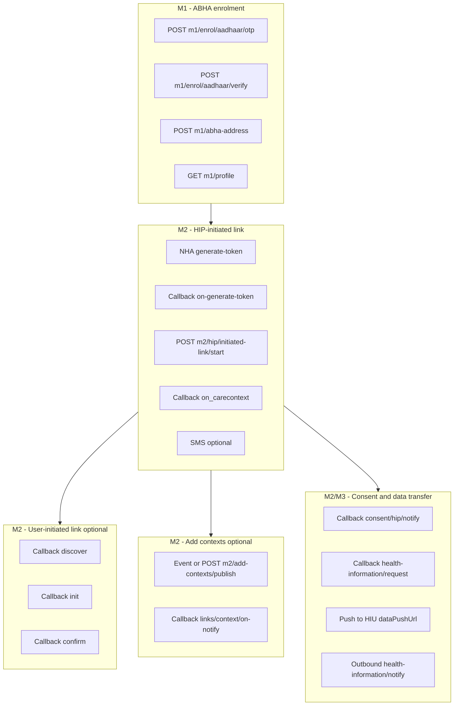

# ABDM Adapter — Full E2E test guide (M1 → M2 → M3) and production cutover

This is the **operator guide** for testing the complete ABDM journey on sandbox and for knowing **exactly what must change before live (production) traffic**.

> **M2-only cheat sheet:** [abdm-adapter-m2-simple-reference.md](./abdm-adapter-m2-simple-reference.md) (link token, old LIMS vs adapter).  
> **This file** is the main entry for M1 + M2 + M3 + production.

**Related docs (all guides in `docs/guides/`)**

| Doc | Purpose |
|-----|---------|
| **[M2 simple reference](./abdm-adapter-m2-simple-reference.md)** | One-page map: static vs env, link token, three flows |
| **[This file](./abdm-adapter-e2e-and-production.md)** | **Full M1→M2→M3 sandbox + production env (§10) + §12 fresh run** |
| [M1 runbook](./abdm-adapter-m1-runbook.md) | M1 enrolment, verify, login — API table + session states |
| [M2 hands-on walkthrough](./abdm-adapter-m2-hands-on-walkthrough.md) | ngrok + Postman + curl (HIP link) |
| [M2 runbook](./abdm-adapter-m2-runbook.md) | M2 dev checklist, smoke scripts |
| [M3 developer + TC-01–34](./abdm-adapter-m3-developer-and-e2e.md) | M3 mock harness, test catalogue, implementation phases |
| [OpenAPI / Swagger](../../specs/openapi/abdm-adapter.v1.yaml) | Staff platform APIs only — `http://localhost:3007/docs` |
| [08-m3-flows.md](../architecture/lld/abdm-adapter/08-m3-flows.md) | M3 callback catalogue (not in Swagger) |
| Postman `Milestone_2_16_02_2026_6e734af067 (1).postman_collection.json` | NHA sandbox examples |

**Service:** `abdm-adapter-svc` — default port **3007**.  
**Env template:** `services/abdm-adapter-svc/.env.example` (comments point back to this guide §0 and §10).

---

## Pick your task (avoid confusion)

| I need to… | Open | Env block |
|------------|------|-----------|
| Create / verify ABHA (M1) | [M1 runbook](./abdm-adapter-m1-runbook.md) + **§2** below | §0.1 (sandbox creds) |
| Link patient visits to ABHA (M2 HIP) | [M2 simple reference](./abdm-adapter-m2-simple-reference.md) → [hands-on](./abdm-adapter-m2-hands-on-walkthrough.md) | §0.1 + ngrok §0.3 |
| **Live sandbox** M3 consent + data fetch | **§6A** + **§12** | **§0.1.1** (not mock flags) |
| Local M3 without NHA (5 min) | [M3 developer guide](./abdm-adapter-m3-developer-and-e2e.md) + `full-loop.sh` | `ABDM_M3_MOCK_GATEWAY=true`, `ABDM_M3_LOOPBACK_HIU=true` |
| Wire hospital **web UI** to ABDM | Swagger `/docs` + platform paths **§7.1** | Same as flow you test; **no M3 UI in `services/web` yet** |
| **Production** cutover | **§10** + `.env.example` “PRODUCTION” section | §10.1 matrix — unset all dev-only flags |

**Three “doors” (same for M1/M2/M3):**

1. **Platform** — you call `http://localhost:3007/api/abdm/v1/...` (Swagger).
2. **Outbound gateway** — adapter → NHA (not in Swagger).
3. **Inbound callbacks** — NHA → `{ngrok}/api/v3/...` (Postman or real CM; not in Swagger).

---

## What is implemented vs still open

| Area | Backend (`abdm-adapter`) | Frontend (`services/web`) |
|------|--------------------------|---------------------------|
| M1 ABHA enrol / verify / profile | Done — `/m1/*` | Partial — register patient may use another BFF; align with **§2** |
| M2 HIP link, add-contexts, SMS | Done — `/m2/*` + `/api/v3/*` callbacks | Not fully wired in web |
| M3 HIU consent request + grant | Done — `/m3/hiu/consent/*` + callbacks | **Todo** — poll session in UI |
| M3 HIU data transfer + bundle | Done — `/m3/hiu/data-request`, `/transfers/{id}` | **Todo** — show received FHIR |
| OpenAPI / Swagger | Done — `specs/openapi/abdm-adapter.v1.yaml` | Consumers use generated client or fetch |

Types for M1–M3 live in `packages/ts-sdk-abha` (`protocol/m1`, `m2`, `m3`).

> **Swagger vs Postman:** Swagger lists **staff** endpoints only. Callbacks are documented in **§7.2** and LLD `08-m3-flows.md`, not in `/docs`.

---

## 0. One-time setup (sandbox)

### 0.1 Copy environment

```bash
cp services/abdm-adapter-svc/.env.example services/abdm-adapter-svc/.env
```

Edit **`.env`** (never commit secrets or your personal mobile):

| Variable | Sandbox value | Notes |
|----------|---------------|--------|
| `ABDM_SANDBOX_CLIENT_ID` / `SECRET` | From NHA sandbox portal | Required for all NHA calls |
| `DATABASE_URL` | Postgres URL | Root `.env` or `ABDM_DATA_DATABASE_URL` |
| `ABDM_DEV_TENANT_ID` | e.g. `00000000-0000-4000-8000-0000000000aa` | Same UUID as `x-tenant-id` on platform APIs |
| `ABDM_X_HIP_ID` | **`IN3610001625`** | Your facility HIP (HFR) |
| `ABDM_X_CM_ID` | **`sbx`** | Sandbox consent manager |
| `ABDM_M2_MOCK_PLATFORM` | `true` for dev without EMPI/RF | Set `false` when EMPI + Record Foundation run |
| `ABDM_MOCK_ABHA_ADDRESS` | Patient ABHA used in Postman | Must match generate-token / link patient |
| `ABDM_DEFAULT_SMS_PHONE` | **Your mobile E.164** e.g. `+91XXXXXXXXXX` | SMS after HIP link; see § SMS |
| `ABDM_HIP_DISPLAY_NAME` | Hospital display name in SMS | Optional |

#### 0.1.1 Sandbox **live M3 E2E** (real NHA gateway + ngrok)

Use this block in `services/abdm-adapter-svc/.env` when running the **verified** sandbox path (M2 link on your HIP → M3 consent → data fetch). Do **not** use these values in production.

| Variable | Sandbox live M3 value | Why |
|----------|----------------------|-----|
| `ABDM_X_HIU_ID` | Same as HIP if combined bridge, e.g. `IN3610001625` | HIU id on consent init / data-request |
| `ABDM_M3_MOCK_GATEWAY` | **`false`** | Real CM `consent/request/init` and `health-information/request` |
| `ABDM_M3_LOOPBACK_HIU` | **`false`** | Real `dataPushUrl` + CM-driven HIP push |
| `ABDM_ADAPTER_PUBLIC_BASE_URL` | **`https://<your-ngrok-host>.ngrok-free.dev`** (no trailing path) | Embedded in HIU `dataPushUrl`; must match HFR bridge URL |
| `ABDM_DEV_INBOUND_SIMULATION` | **`false`** (single line in `.env`) | Sends real HIP `on-notify` ack to CM (avoids **ABDM-8877**); do not duplicate `true` |
| `ABDM_ALLOW_INSECURE_CALLBACKS` | **`true`** (local dev only) | Accepts CM callbacks when gateway JWS verify fails in dev (`hip/health-information/request` **401** without it) |

**Never in production:** `ABDM_DEV_INBOUND_SIMULATION`, `ABDM_ALLOW_INSECURE_CALLBACKS`, `ABDM_M3_MOCK_GATEWAY=true`, `ABDM_M3_LOOPBACK_HIU=true`.

See **§6A** (Path A walkthrough) and **§12** (fresh E2E from scratch). Production matrix: **§10.1**.

#### 0.1.2 M3 — which env profile am I using?

Pick **one** profile. Mixing flags causes “no ngrok callbacks” or “transfer stuck AWAITING_PUSH”.

| Profile | `ABDM_M3_MOCK_GATEWAY` | `ABDM_M3_LOOPBACK_HIU` | `ABDM_DEV_INBOUND_SIMULATION` | `ABDM_ALLOW_INSECURE_CALLBACKS` | How to test |
|---------|------------------------|-------------------------|--------------------------------|----------------------------------|-------------|
| **Local mock loop** | `true` | `true` | optional `true` for curl inject | optional | `bash modules/abdm-adapter/scripts/m3/full-loop.sh` |
| **Live sandbox M3** | **`false`** | **`false`** | **`false`** | **`true`** (dev only) | §6A + §12 + real PHR grant |
| **Production** | **`false`** | **`false`** | unset | unset | §10.4 gate |

Also set `ABDM_X_HIU_ID` to your sandbox HIU (often **same as** `ABDM_X_HIP_ID` when one bridge serves both roles, e.g. `IN3610001625`).

### 0.2 Migrate and start

```bash
npx nx run abdm-adapter-svc:db-migrate
npx nx run abdm-adapter-svc:serve
```

Verify: `GET http://localhost:3007/healthz` → `{ "status": "ok" }`.

### 0.3 Register callback URL (mandatory for real M2)

ABDM **cannot** call `localhost`. Use a public tunnel:

```bash
ngrok http 3007
```

In **NHA sandbox / HFR** for HIP `IN3610001625`, set **bridge / callback URL** to the ngrok **origin only** (no path), e.g. `https://abc123.ngrok-free.app`.

NHA will POST to `{callback}/api/v3/...` (paths below).

### 0.4 Headers you use everywhere

**Platform APIs** (`/api/abdm/v1/*`):

| Header | Value |
|--------|--------|
| `x-tenant-id` | `ABDM_DEV_TENANT_ID` |
| `Content-Type` | `application/json` |

**NHA → HIP callbacks** (Postman simulates these; gateway sends in prod):

| Header | Value |
|--------|--------|
| `REQUEST-ID` | New UUID per request (dedupe key) |
| `TIMESTAMP` | ISO-8601 UTC |
| `X-HIP-ID` | `IN3610001625` (must match `ABDM_X_HIP_ID`) |
| `X-CM-ID` | `sbx` |

---

## 1. End-to-end flow overview



**Recommended first full sandbox path:** M1 (ABHA) → M2 HIP link + `add-contexts` (§6A.2) → M3 HIU consent + grant in PHR (§6A.3) → `data-request` (§6A.4). Fresh run checklist: **§12**.

---

## 2. Phase M1 — Register / create ABHA

Use **your** service base: `http://localhost:3007/api/abdm/v1`.

All steps need `x-tenant-id: <ABDM_DEV_TENANT_ID>`.

### 2.1 Linked mobile (4 platform calls — recommended when Aadhaar OTP mobile = primary)

| Step | Method | Path | Body / query | Saves |
|------|--------|------|--------------|-------|
| 0 Smoke | `GET` | `/m0/gateway/session` | — | Gateway token works |
| 1 OTP | `POST` | `/m1/enrol/aadhaar/otp` | `{ "aadhaarNumber": "12 digits" }` | `sessionId`, `txnId` |
| 2 Verify | `POST` | `/m1/enrol/aadhaar/verify` | `{ "sessionId", "otp", "mobile", "useAadhaarLinkedMobile": true }` | Tokens; `mobileVerifySkipped: true` → session `MOBILE_OTP_VERIFIED` |
| 3 Suggestions | `GET` | `/m1/abha-address/suggestions?sessionId=` | — | ABHA address options |
| 4 Create address | `POST` | `/m1/abha-address` | `{ "sessionId", "abhaAddress" }` | **`abhaAddress`** for M2 |
| 5 Profile | `GET` | `/m1/profile?sessionId=` | — | Confirm ABHA created |

### 2.2 Different primary mobile (6 platform calls — NHA Step 4 required)

Same as §2.1 through step 2, but set **`useAadhaarLinkedMobile: false`** on verify. Then:

| Step | Method | Path | Body / query |
|------|--------|------|--------------|
| 3 Mobile OTP | `POST` | `/m1/enrol/mobile-verify/otp` | `{ "sessionId", "mobile" }` |
| 4 Mobile verify | `POST` | `/m1/enrol/mobile-verify/verify` | `{ "sessionId", "otp" }` |
| 5–7 | — | suggestions → abha-address → profile | Same as §2.1 steps 3–5 |

If **`useAadhaarLinkedMobile`** is omitted on verify, the adapter infers skip from NHA **`ABHAProfile.mobile`** (non-null = linked mobile saved).

Use **`GET /m1/sessions/{sessionId}`** when the UI needs `nextStep` after verify.

**After M1:** Note the **`abhaAddress`** (e.g. `yourname@sbx`). Use it in M2 generate-token and `initiated-link/start`. Set `ABDM_MOCK_ABHA_ADDRESS` to the same value if using mock EMPI.

Details: [abdm-adapter-m1-runbook.md](./abdm-adapter-m1-runbook.md).

---

## 3. Phase M2 — HIP-initiated linking (primary hospital flow)

Matches Postman folder **HIP Initiated Linking**.

### 3.1 Who calls what

| Step | Caller | Target | Our handler |
|------|--------|--------|-------------|
| 1 | HIMS | `POST /api/abdm/v1/m2/link-token/acquire` | Session `TOKEN_REQUESTED` |
| 2 | NHA | `POST {callback}/api/v3/hip/token/on-generate-token` | Link token cache; poll `GET /m2/link-token/status` |
| 3 | You / HIMS | `POST /api/abdm/v1/m2/hip/initiated-link/start` | Outbound `link/carecontext` |
| 4 | NHA | `POST {callback}/api/v3/link/on_carecontext` | Session → `LINKED` |
| 5 | Adapter (auto) | NHA `…/sms/notify2` | If `phoneNo` or `ABDM_DEFAULT_SMS_PHONE` set |
| 6 | NHA | `POST {callback}/api/v3/patients/sms/on-notify` | SMS ack |

### 3.2 Step 1–2 — Generate link token (Postman)

In Postman (NHA, not our service):

- URL: `https://dev.abdm.gov.in/api/hiecm/v3/token/generate-token`
- Headers: gateway bearer, `REQUEST-ID`, `TIMESTAMP`, **`X-HIP-ID: IN3610001625`**, `X-CM-ID: sbx`
- Body: patient `abhaAddress`, `name`, `gender`, `yearOfBirth` (same ABHA as M1)

**Check:** Adapter logs show `on-generate-token`. DB:

```sql
SELECT abha_address, expires_at FROM abdm_adapter.abdm_link_tokens
WHERE abha_address = '<your-abha@sbx>';
```

### 3.3 Step 3 — Staff link start (platform API)

```bash
curl -sS -X POST "http://localhost:3007/api/abdm/v1/m2/hip/initiated-link/start" \
  -H "Content-Type: application/json" \
  -H "x-tenant-id: 00000000-0000-4000-8000-0000000000aa" \
  -d '{
    "abhaAddress": "<your-abha@sbx>",
    "patientName": "Test Patient",
    "gender": "M",
    "yearOfBirth": 1990,
    "phoneNo": "+91XXXXXXXXXX",
    "careContexts": [
      {
        "referenceNumber": "VISIT-2026-001",
        "display": "OP consultation",
        "hiType": "OPCONSULTATION"
      }
    ]
  }'
```

**HI type for `link/carecontext`:** use **ALL CAPS** (`OPCONSULTATION`, `PRESCRIPTION`, …) — see [05-m2-flows.md § Pitfall 2](../architecture/lld/abdm-adapter/05-m2-flows.md).

**SMS:** If `phoneNo` is in the body **or** `ABDM_DEFAULT_SMS_PHONE` is in `.env`, the adapter sends SMS after step 4 succeeds. Use the **same mobile** registered on the ABHA / sandbox patient.

### 3.4 Step 4 — Verify link

```sql
SELECT session_id, flow_kind, state, request_id
FROM abdm_adapter.abdm_sessions
WHERE flow_kind = 'abdm.m2.hip-initiated-link.v1'
ORDER BY created_at DESC LIMIT 3;
```

Expected final state: **`LINKED`**.

### 3.5 Optional — Manual SMS

```bash
curl -sS -X POST "http://localhost:3007/api/abdm/v1/m2/sms/notify" \
  -H "Content-Type: application/json" \
  -H "x-tenant-id: <tenant-uuid>" \
  -d '{ "phoneNo": "+91XXXXXXXXXX", "hipName": "Your Hospital" }'
```

---

## 4. Phase M2 — User-initiated linking (PHR app)

Patient discovers hospital from PHR; gateway calls **your** HIP.

| Step | Inbound to you | HTTP status | Adapter outbound |
|------|----------------|-------------|----------------|
| Discover | `POST /api/v3/hip/patient/care-context/discover` | **200** | `on-discover` |
| Init | `POST /api/v3/hip/link/care-context/init` | **200** | `on-init` |
| Confirm | `POST /api/v3/hip/link/care-context/confirm` | **202** | `on-confirm` (uses **`X-HIU-ID`**, not HIP) |

**Requires:** `ABDM_M2_MOCK_PLATFORM=true` **or** real `EMPI_BASE_URL` + `RECORD_FOUNDATION_BASE_URL` so discover can match patient and list care contexts.

Postman folder: **User Initiated Linking**.

---

## 5. Phase M2 — Add contexts (new visit after link)

Triggered when Record Foundation registers a new care context for an **already linked** patient.

| Trigger | API |
|---------|-----|
| Event | `record-foundation.care-context.registered` on in-process bus |
| Manual | `POST /api/abdm/v1/m2/add-contexts/publish` |

**Manual example:**

```bash
curl -sS -X POST "http://localhost:3007/api/abdm/v1/m2/add-contexts/publish" \
  -H "Content-Type: application/json" \
  -H "x-tenant-id: <tenant-uuid>" \
  -d '{
    "abhaAddress": "<linked-abha@sbx>",
    "patientReference": "<patient-id-or-mrn>",
    "careContextReference": "VISIT-2026-002",
    "hiType": "OPCONSULTATION"
  }'
```

**HI type for context notify:** **PascalCase** (`OPConsultation`) — adapter maps from ALL CAPS.

**Callback:** `POST /api/v3/links/context/on-notify` → session `COMPLETED`.

---

## 6. Phase M2/M3 — Consent and health information transfer

Postman folder: **Data Transfer (HIP)**.

### 6.1 Consent notify (HIU → HIP via gateway)

| Direction | URL |
|-----------|-----|
| Inbound | `POST /api/v3/consent/request/hip/notify` |
| Outbound ack | NHA `POST /api/hiecm/consent/v3/request/hip/on-notify` |

**Check:**

```sql
SELECT consent_id, patient_id, status FROM abdm_adapter.abdm_consent_artefacts
ORDER BY granted_at DESC LIMIT 5;
```

### 6.2 Health information request → push → notify

| Step | Direction | URL / action |
|------|-----------|----------------|
| 1 | Inbound | `POST /api/v3/hip/health-information/request` (body includes `hiRequest.consent`, `dataPushUrl`, `keyMaterial`) |
| 2 | Outbound ack | NHA `…/health-information/hip/on-request` |
| 3 | Outbound push | **POST to `dataPushUrl`** from request (HIU webhook) |
| 4 | Outbound notify | NHA `…/data-flow/v3/health-information/notify` |

**Prerequisites for push to succeed:**

1. Consent row exists for `consent.id` in the request.
2. `RECORD_FOUNDATION` returns bundles (`fetchBundlesForConsent`) or mock returns sample bundle.
3. **`dataPushUrl`** is reachable from the adapter (use webhook.site in Postman).
4. Sandbox uses **Fidelius stub** (not real encryption) — see production section.

---

## 6A. Phase M3 — HIU consent + data fetch (sandbox Path A, live gateway)

**Goal:** Link patient to **your** HIP (`IN3610001625`), grant consent in PHR for **HIMS Multi Tenant Facility 13**, fetch records as HIU — all via real NHA callbacks on ngrok.

**Prerequisites:** §0.1.1 env, ngrok → `3007`, Postman **Session API** + **Update Bridge URL**, ABHA e.g. `kamalthefirst@sbx`.

### 6A.1 HIP vs HIU (why you saw `IN0910033064`)

| ID | Role | Source |
|----|------|--------|
| `IN3610001625` | Your **HIU** (requester) + **HIP** (holder) in `.env` | `ABDM_X_HIU_ID`, `ABDM_X_HIP_ID` |
| `IN0910033064` | **CHC Mohanlalganj** — another linked HIP | Patient grant in PHR when records live at CHC |

`hip_id_env_mismatch` in logs is a **warning** only: CM sent `X-HIP-ID` for CHC while your env default is `IN3610001625`. For Path A, pin `hipId` in consent and grant **your** facility in PHR.

### 6A.2 M2 — link + publish visit (required before grant)

| Step | API | Expected |
|------|-----|----------|
| 1 | `POST /m2/link-token/acquire` | 202 `TOKEN_REQUESTED` → poll `GET /m2/link-token/status` until `tokenReady: true` |
| 2 | ngrok | `POST /api/v3/hip/token/on-generate-token` → 200 |
| 3 | `POST /m2/hip/initiated-link/start` (care context `VISIT-2026-001`, `hiType: OPConsultation`) | 202 `CC_LINK_REQUESTED` |
| 4 | ngrok | `POST /api/v3/link/on_carecontext` → 202 |
| 5 | `GET /m2/sessions/{linkSessionId}` | **`LINKED`** |
| 6 | `POST /m2/add-contexts/publish` (`eventDate` inside consent date range) | 202 |
| 7 | ngrok | `POST /api/v3/links/context/on-notify` → 202 |
| 8 | PHR **Linked facilities** | **HIMS Multi Tenant Facility 13** shows **VISIT-2026-001** |

**`add-contexts/publish` body example:**

```json
{
  "abhaAddress": "kamalthefirst@sbx",
  "patientReference": "kamalthefirst@sbx",
  "careContextReference": "VISIT-2026-001",
  "hiType": "OPConsultation",
  "eventDate": "2026-02-15T10:00:00.000Z"
}
```

PHR **My records** may stay empty; consent uses **Linked facilities**, not My records.

### 6A.3 M3 — consent (platform)

`POST /api/abdm/v1/m3/hiu/consent/request` — save **`sessionId`** from 202.

```json
{
  "patientAbhaAddress": "kamalthefirst@sbx",
  "hipId": "IN3610001625",
  "purpose": "CAREMGT",
  "hiTypes": [
    "OPConsultation",
    "Prescription",
    "DiagnosticReport",
    "DischargeSummary",
    "ImmunizationRecord",
    "HealthDocumentRecord",
    "WellnessRecord"
  ],
  "dateRange": {
    "from": "2026-01-01T00:00:00.000Z",
    "to": "2026-05-25T12:10:00.000Z"
  },
  "requesterName": "Kamal Jeet Arya",
  "requesterRegNo": "REG001"
}
```

| ngrok callback | Status |
|----------------|--------|
| `hiu/consent/request/on-init` | 200 |

PHR → **Consents** → Grant (**HIMS Multi Tenant Facility 13**, not CHC). NHA FAQ #47: send **all** `hiTypes` if Grant is disabled with “no facility available”.

Poll: `GET /m3/hiu/consent/request/{sessionId}` → **`CONSENT_GRANTED`**, copy **`consentArtefactIds[0]`**.

| ngrok after grant | Status |
|-------------------|--------|
| `consent/request/hip/notify` | 202 |
| `hiu/consent/request/notify` | 200 |
| `hiu/consent/on-fetch` | 200 |

### 6A.4 M3 — data fetch (platform)

`POST /api/abdm/v1/m3/hiu/data-request`:

```json
{ "consentId": "<consentArtefactIds[0]>" }
```

Save **`transferId`** from 202. Poll every 15–30s:

`GET /api/abdm/v1/m3/hiu/transfers/{transferId}`

| ngrok | Status | Meaning |
|-------|--------|---------|
| `hiu/health-information/on-request` | 200 | CM accepted HIU data request |
| `hip/health-information/request` | **202** (not 401) | CM asked HIP to push |
| `hiu/health-information/transfer/{transferId}` | 200 | Bundle received |

**Success:** transfer state **`ACKNOWLEDGED`**, `bundle` populated.

**Swagger localhost calls do not appear on ngrok** — only NHA callbacks do.

### 6A.5 Three doors (reminder)

| Door | Who | Example |
|------|-----|---------|
| 1 Platform | You / Swagger | `POST localhost:3007/api/abdm/v1/m3/...` |
| 2 Outbound gateway | Adapter → NHA | Consent init, HIP ack (not in Swagger) |
| 3 Inbound callbacks | NHA → ngrok → adapter | `on-init`, `on-request`, `hip/health-information/request` |

---

## 7. Complete API map (this service)

### 7.1 Platform — you call these (`/api/abdm/v1`)

| Path | Method | When |
|------|--------|------|
| `/m0/gateway/session` | GET | Smoke test |
| `/m1/enrol/aadhaar/otp` | POST | M1 start |
| `/m1/enrol/aadhaar/verify` | POST | M1 — optional `useAadhaarLinkedMobile` skips mobile-verify when linked |
| `/m1/enrol/mobile-verify/otp` | POST | M1 — **different primary mobile only** |
| `/m1/enrol/mobile-verify/verify` | POST | M1 — **different primary mobile only** |
| `/m1/abha-address/suggestions` | GET | M1 — after `MOBILE_OTP_VERIFIED` |
| `/m1/abha-address` | POST | M1 — get ABHA address |
| `/m1/sessions/{sessionId}` | GET | M1 — state + `nextStep` |
| `/m1/profile` | GET | M1 — verify profile |
| `/m2/link-token/acquire` | POST | Pre-mint link token (wait for `on-generate-token`) |
| `/m2/link-token/status` | GET | Poll `TOKEN_AVAILABLE` |
| `/m2/hip/initiated-link/start` | POST | **Link care contexts** |
| `/m2/sessions/{sessionId}` | GET | Poll M2 link session (`LINKED`) |
| `/m2/add-contexts/publish` | POST | Publish visit to CM (PHR shareable) |
| `/m2/sms/notify` | POST | SMS nudge |
| `/m3/hiu/consent/request` | POST | Start HIU consent |
| `/m3/hiu/consent/request/{sessionId}` | GET | Poll consent (`CONSENT_GRANTED`) |
| `/m3/hiu/data-request` | POST | Start data fetch |
| `/m3/hiu/transfers/{transferId}` | GET | Poll transfer + read bundle |

Swagger: `http://localhost:3007/docs`.

#### Why Swagger shows only 3 M2 APIs (not a bug)

`/docs` is generated from [`specs/openapi/abdm-adapter.v1.yaml`](../../specs/openapi/abdm-adapter.v1.yaml) with prefix **`/api/abdm/v1`**. That file documents **staff/platform** endpoints only.

| Swagger (M2-HIP-Linking) | Who calls it |
|--------------------------|--------------|
| `POST /m2/hip/initiated-link/start` | HIMS / your UI |
| `POST /m2/add-contexts/publish` | HIMS / manual trigger |
| `POST /m2/sms/notify` | HIMS / manual trigger |

**Not listed in Swagger** (by design): discover, init, confirm, consent notify, HI request, link-token callback, etc. Those are **NHA → HIP callbacks** on **`/api/v3/…`**. The gateway (or Postman simulating the gateway) POSTs to your ngrok URL — they are not in the public OpenAPI wrapper (see M2 dev guide §6).

To test callbacks: use **Postman** (`Milestone_2_…` collection) or curl to `http://localhost:3007/api/v3/…` — see §7.2 below.

### 7.2 Gateway callbacks — NHA calls these (`/api/v3`)

| Path | Method | Flow |
|------|--------|------|
| `/hip/token/on-generate-token` | POST | Link token |
| `/link/on_carecontext` | POST | HIP link result |
| `/hip/patient/care-context/discover` | POST | User-initiated |
| `/hip/link/care-context/init` | POST | User-initiated |
| `/hip/link/care-context/confirm` | POST | User-initiated |
| `/links/context/on-notify` | POST | Add contexts ack |
| `/patients/sms/on-notify` | POST | SMS ack |
| `/consent/request/hip/notify` | POST | Consent |
| `/hiu/consent/request/on-init` | POST | M3 consent init ack |
| `/hiu/consent/request/notify` | POST | M3 consent status |
| `/hiu/consent/on-fetch` | POST | M3 artefact fetch |
| `/hiu/health-information/on-request` | POST | M3 data-request ack |
| `/hiu/health-information/transfer/{transferId}` | POST | Encrypted bundle push (HIU receiver) |
| `/hip/health-information/request` | POST | HI request (HIP must return 202) |

---

## 8. Postman collection → test order

Use collection: `Milestone_2_16_02_2026_6e734af067 (1).postman_collection.json`.

| Order | Folder | Purpose |
|-------|--------|---------|
| 1 | Registration and Auth | Gateway session token |
| 2 | (M1 via platform APIs or ABHA Postman) | Create ABHA |
| 3 | HIP Initiated Linking | generate-token → (callback) → use platform `initiated-link/start` |
| 4 | User Initiated Linking | Optional PHR path |
| 5 | Deep Linking | SMS (or use platform `/m2/sms/notify`) |
| 6 | Data Transfer (HIP) | Consent + HI request + push |

---

## 9. Automated tests

```bash
# Unit tests (CI-safe)
npx nx run abdm-adapter:test

# Sandbox integration (needs DATABASE_URL + credentials)
RUN_ABDM_SANDBOX_TESTS=1 \
  DATABASE_URL=postgresql://... \
  ABDM_SANDBOX_CLIENT_ID=... \
  ABDM_SANDBOX_CLIENT_SECRET=... \
  pnpm -F @hims/abdm-adapter test:sandbox
```

---

## 10. Production / live cutover — what MUST change

**The same code paths run in sandbox and production.** Differences are **configuration, crypto, and infrastructure** — not separate “test-only” branches in business logic (except `ABDM_M2_MOCK_PLATFORM` and signature sandbox bypass).

### 10.1 Environment matrix

| Variable | Sandbox (current) | Production / staging |
|----------|-------------------|----------------------|
| `ABDM_GATEWAY_BASE_URL` | `https://dev.abdm.gov.in` | **Production gateway URL** from NHA |
| `ABDM_ABHA_API_BASE_URL` | `https://abhasbx.abdm.gov.in/abha/api` | **Production ABHA API** base |
| `ABDM_X_CM_ID` | `sbx` | **Production CM id** (not `sbx`) |
| `ABDM_X_HIP_ID` | `IN3610001625` (sandbox HIP) | **Production HIP** from HFR |
| `ABDM_SANDBOX_CLIENT_ID` / `SECRET` | Sandbox credentials | **Production client credentials** (secrets manager) |
| `ABDM_M2_MOCK_PLATFORM` | `true` in dev | **`false`** — mandatory |
| `EMPI_BASE_URL` | Optional / mock | **Required** — real patient match |
| `RECORD_FOUNDATION_BASE_URL` | Optional / mock | **Required** — bundles + link status |
| `ABDM_DEV_TENANT_ID` | Single dev tenant UUID | **Multi-tenant:** map `X-HIP-ID` / facility → tenant (extend `resolve-callback-tenant.ts`) |
| `ENABLE_AUTH` | `false` locally | **`true`** + `JWKS_URL` |
| `ABDM_TOKEN_ENCRYPTION_KEY` | Optional in dev | **Required** — session token encryption at rest |
| `NODE_ENV` | `development` | `production` / `staging` |
| `ABDM_CM_CONSENT_VERIFY_CERT_PEM` | Optional | **Required** for real consent notify |
| `ABDM_GATEWAY_JWKS_URL` | Dev default | **Production** gateway JWKS |
| `ABDM_SMS_PROVIDER` | `logging` | **`twilio`** or **`http`** for real OTP SMS |
| `ABDM_HIP_TENANT_MAP` | Optional JSON | **Required** multi-facility: `{"<HIP_ID>":"<tenant-uuid>"}` |
| `ABDM_ALLOW_INSECURE_CALLBACKS` | `true` in dev (live M3 ngrok) | **Unset** |
| `ABDM_DEV_INBOUND_SIMULATION` | `false` for live M3; `true` only for curl fixtures | **Unset** |
| `ABDM_FIDELIUS_USE_STUB` | Optional dev | **Unset** |
| `ABDM_M3_MOCK_GATEWAY` | `true` for local mock loop | **`false`** — real CM outbound |
| `ABDM_M3_LOOPBACK_HIU` | `true` for `full-loop.sh` | **`false`** — real HIU `dataPushUrl` |
| `ABDM_M3_DATA_PUSH_URL_ALLOWLIST` | empty (any host) | **Required** — comma-separated allowed HIU hosts |
| `ABDM_X_HIU_ID` | Sandbox: same as HIP e.g. `IN3610001625`, or `SBX_TEST_HIU_001` in mock loop | **Production HIU** from HFR (must match consent init header) |
| `ABDM_ADAPTER_PUBLIC_BASE_URL` | ngrok HTTPS origin (live M3) or `http://localhost:3007` (loopback) | Stable HTTPS ingress for `dataPushUrl` |

M3 developer guide and TC-01–TC-34 catalogue: [abdm-adapter-m3-developer-and-e2e.md](./abdm-adapter-m3-developer-and-e2e.md).

**Production startup checks:** `ABDM_M2_MOCK_PLATFORM=false`; `EMPI_BASE_URL` and `RECORD_FOUNDATION_BASE_URL` set; migrations `0000`–`0003` applied; HFR bridge URL = production ingress (no ngrok).

### 10.2 Code / components (Round 2 — current vs production config)

| Component | Implementation | Production requirement |
|-----------|----------------|-------------------------|
| Fidelius | `FideliusEncryptor` — BC Weierstrass curve25519 (`@noble/curves`), Java interop test | **Unset** `ABDM_FIDELIUS_USE_STUB`; do not use legacy stub |
| Gateway JWS | `verifyAbdmSignature` — RS256 + JWKS (`ABDM_GATEWAY_JWKS_URL`) | **Unset** `ABDM_ALLOW_INSECURE_CALLBACKS`; set production JWKS |
| Consent signature | JCS (`canonicalize`) + `ABDM_CM_CONSENT_VERIFY_CERT_PEM` | CM signing cert from NHA |
| Link OTP | `DrizzleLinkOtpsRepo` — `abdm_link_otps` table (SHA-256 hash) | Apply migration `0002_abdm_link_otps.sql`; multi-pod safe |
| User-initiated SMS | `createSmsClientFromEnv()` — `http` / `twilio` / `logging` | `ABDM_SMS_PROVIDER=twilio` or `http` with credentials |
| EMPI discover | `EmpiClientError` → **502** on upstream failure (not “patient not found”) | `EMPI_BASE_URL` required |
| In-process `InProcessEventBus` | OK for single instance | **Durable bus** (NATS/Kafka) when multiple replicas |
| M1 OTP rate limit | In-process map | **Redis** when horizontally scaled (separate from link OTP table) |
| Callback URL | ngrok | **Stable HTTPS ingress** (LB + TLS), registered in HFR |

### 10.3 High-traffic checklist (nothing breaks under load)

| Area | Mechanism today | Production recommendation |
|------|-----------------|---------------------------|
| Inbound dedupe | `abdm_inbound_messages` unique `(tenant, request_id)` | Keep — safe for retries |
| Gateway bearer | Cached in `HttpGatewayClient` | Shared cache per instance; monitor 401 refresh |
| Link token | DB + JWT `exp` | Index on `(iq_tenant_id, abha_address)`; no long blocking calls in handlers |
| Sessions | Postgres rows | Connection pool sizing; partition/archive old sessions by policy |
| Handlers | Thin → use-case | Keep handlers ≤50 LOC; no heavy work in route |
| Data push | Sync HTTP to HIU URL | Timeouts (`ABDM_GATEWAY_TIMEOUT_MS`); consider async job if HIU slow |
| Secrets | `.env` | **Vault / K8s secrets** — never commit |

### 10.4 Production verification gate (before go-live)

- [ ] Callback URL registered in **production** HFR for production HIP
- [ ] `ABDM_M2_MOCK_PLATFORM=false`, EMPI + RF URLs verified
- [ ] Migration `0002_abdm_link_otps.sql` applied (multi-pod OTP)
- [ ] End-to-end on **staging** NHA: HIP link → consent → HI push with **real Fidelius** (Java interop vector passes in CI)
- [ ] Gateway JWS + consent CM cert configured; `ABDM_ALLOW_INSECURE_CALLBACKS` unset
- [ ] `ABDM_SMS_PROVIDER` delivers OTP to test handset
- [ ] `ENABLE_AUTH=true` on platform routes
- [ ] Load test: duplicate `REQUEST-ID` returns idempotent 200/202 without double side effects
- [ ] Multi-tenant callback routing tested if more than one facility
- [ ] Alerts on session `FAILED` states and gateway 5xx

### 10.5 What you do NOT need to change for production

- URL paths (`/api/v3/*`, `/api/abdm/v1/m2/*`) — same contract
- Use-case / port layering — same (orchestration portability per HLD 04 §11)
- Drizzle schema — same tables; scale Postgres/Citus as usual
- OpenAPI platform spec — same operations; update server URLs in deployment docs only

---

## 11. Troubleshooting quick reference

| Symptom | Fix |
|---------|-----|
| No callback received | ngrok down or wrong bridge URL; check NHA portal |
| No ngrok lines after **restart** | Restart does not trigger CM — POST new `data-request` or replay HIP callback (§12) |
| `503` link token | `POST /m2/link-token/acquire`; poll status until `tokenReady: true` |
| `link-token/status` `NOT_FOUND` but `tokenReady: true` | OK — token is in cache; proceed to `initiated-link/start` |
| Consent init **400** `ABDM-1070` duplicate request | PHR **Consents → Requested** — deny/revoke old pending requests for same patient+HIU+HIP; change `dateRange`; start new `POST /m3/hiu/consent/request` |
| PHR Grant disabled / “no facility available” | Run `add-contexts/publish`; grant **HIMS** not CHC; set `dateRange.to` to **current UTC** (not `T00:00:00.000Z` on today — excludes same-day links); adapter auto-bumps past midnight `to` on consent init |
| M1 suggestions **409** after verify only | Complete **mobile-verify** otp + verify (§2 steps 3–4) or poll `GET /m1/sessions/{sessionId}` for `nextStep` |
| PHR “no facility” but adapter `CONSENT_GRANTED` | PHR UI can lag; trust `GET /m3/hiu/consent/request/{sessionId}` |
| `hip_id_env_mismatch` IN0910033064 | Patient granted **CHC**; use `hipId: IN3610001625` + Path A link |
| Consent 202 in ~20ms, no ngrok `on-init` | `ABDM_M3_MOCK_GATEWAY=true` — set **`false`** |
| Data-request `EXPIRED` **ABDM-8877** | `ABDM_DEV_INBOUND_SIMULATION=false`; HIP must ack `on-notify` within ~60s |
| `hip/health-information/request` **401** | Set `ABDM_ALLOW_INSECURE_CALLBACKS=true` in dev; **restart** serve; CM must retry or replay (§12.4) |
| `hip/health-information/request` **400** `ABDM-1015` | Outbound HIP ack to gateway failed (often duplicate replay / stale `transactionId`). Adapter still returns **202** and attempts push; check serve logs `abdm.m3.hip_hi.gateway_ack_failed`. For replay use a **new** `REQUEST-ID` header (ngrok replay reuses id → idempotent skip). Prefer fresh `POST /m3/hiu/data-request` |
| Transfer stuck `AWAITING_PUSH` | Fix 401 on HIP ack (gateway POST retries once); HIP push uses HIU `data_push_url` from DB when CM sends PHR URL; watch ngrok `transfer/{transferId}` 200 |
| `transfer/{id}` **400** `ABDM-1088` Invalid Consent artefact | Often **replay** on an old transfer/consent CM no longer tracks. Run **fresh** `POST /m3/hiu/data-request` (new `transferId`). Adapter still stores bundle and returns **200** to HIP even if CM notify fails (check `abdm.m3.hiu_data_flow_notify_failed` in logs) |
| ngrok `transfer/{id}` **200** in ~1ms, poll still `AWAITING_PUSH` | Idempotency collision: CM sets HIP `REQUEST-ID` = HIU `transferId`; fixed by dedupe key `transfer-push:{transferId}:…`. **Restart serve**, new `data-request`, expect transfer **200** with longer duration (~100ms+) then **`ACKNOWLEDGED`** |
| Logs `hip_hi.push_failed` + transfer **200** ~76ms | Usually **HIP→CM notify** missing `doneAt`/`notifier` (fixed). Poll `GET /transfers/{id}` — if **`ACKNOWLEDGED`**, M3 data path succeeded despite notify warn |
| Second `data-request` → 400 “Session not ready” | Session already `DATA_REQUESTED`/`AWAITING_PUSH` — use §12 new run or replay HIP step |
| SMS not received | Wrong `phoneNo`; ABHA mobile must match sandbox; check `on-notify` callback |
| Consent push fails | No row in `abdm_consent_artefacts`; run consent notify first |
| Push to HIU fails | `dataPushUrl` not reachable; firewall; use webhook.site for test |
| Discover empty | Enable mock or wire EMPI; ABHA must match |
| Production only: invalid signature | Enable JWS verifier; check gateway JWKS; **unset** `ABDM_ALLOW_INSECURE_CALLBACKS` |

---

## 12. Fresh E2E run (new patient / new visit)

Use this checklist for a **clean demo** (new `sessionId`, `transferId`, care context reference). Constant headers: `x-tenant-id: 00000000-0000-4000-8000-0000000000aa`.

### 12.1 Before you start

- [ ] `.env` matches **§0.1.1** (`ABDM_M3_MOCK_GATEWAY=false`, `ABDM_DEV_INBOUND_SIMULATION=false`, `ABDM_ALLOW_INSECURE_CALLBACKS=true`)
- [ ] `npx nx run abdm-adapter-svc:serve` restarted after `.env` change
- [ ] ngrok `http 3007` running; **Update Bridge URL** in Postman to ngrok HTTPS origin
- [ ] Pick new care context id e.g. `VISIT-2026-002` (do not reuse an old consent’s visit if revoked)

### 12.2 M2 link (≈10 min)

- [ ] `POST /m2/link-token/acquire` → poll `GET /m2/link-token/status?abhaAddress=...` until `tokenReady: true`
- [ ] ngrok: `on-generate-token` 200
- [ ] `POST /m2/hip/initiated-link/start` with new `referenceNumber`
- [ ] ngrok: `on_carecontext` 202
- [ ] `GET /m2/sessions/{id}` → `LINKED`
- [ ] `POST /m2/add-contexts/publish` with matching `careContextReference` + `eventDate` in range
- [ ] ngrok: `links/context/on-notify` 202
- [ ] PHR Linked facilities shows new visit

### 12.3 M3 consent (≈5 min)

- [ ] Deny any **old** pending consents in PHR (optional)
- [ ] `POST /m3/hiu/consent/request` with `hipId: IN3610001625` + all `hiTypes` → save **sessionId**
- [ ] ngrok: `on-init` 200
- [ ] PHR Consents → Grant on **HIMS Multi Tenant Facility 13**
- [ ] ngrok: `hip/notify`, `hiu/.../notify`, `on-fetch`
- [ ] `GET /m3/hiu/consent/request/{sessionId}` → `CONSENT_GRANTED`, save **consentArtefactIds[0]**

### 12.4 M3 data fetch (≈5 min)

- [ ] `POST /m3/hiu/data-request` with `consentId` → save **transferId**
- [ ] ngrok: `hiu/health-information/on-request` 200
- [ ] ngrok: `hip/health-information/request` **202** (if **401**, restart + `ABDM_ALLOW_INSECURE_CALLBACKS=true`, then replay or wait for CM retry)
- [ ] ngrok: `hiu/health-information/transfer/{transferId}` 200
- [ ] `GET /m3/hiu/transfers/{transferId}` → **`ACKNOWLEDGED`** + `bundle`

### 12.5 Record proof (optional)

```bash
# Consent session
curl -sS -H "x-tenant-id: $ABDM_DEV_TENANT_ID" \
  "http://localhost:3007/api/abdm/v1/m3/hiu/consent/request/<sessionId>"

# Transfer
curl -sS -H "x-tenant-id: $ABDM_DEV_TENANT_ID" \
  "http://localhost:3007/api/abdm/v1/m3/hiu/transfers/<transferId>"
```

Ngrok inspector: `http://127.0.0.1:4040` — export or screenshot callback list.

---

## 13. Local smoke script

```bash
./services/abdm-adapter-svc/scripts/m2-local-smoke.sh
```

Simulates link-token callback + `initiated-link/start` without full Postman (still needs sandbox creds for outbound NHA).

---

## 14. Guide index (`docs/guides/`)

| File | Use when |
|------|----------|
| `abdm-adapter-e2e-and-production.md` | End-to-end operator + production (this doc) |
| `abdm-adapter-m1-runbook.md` | M1-only depth (login, verify, profile) |
| `abdm-adapter-m2-simple-reference.md` | M2 mental model + env cheat sheet |
| `abdm-adapter-m2-hands-on-walkthrough.md` | First-time sandbox HIP link |
| `abdm-adapter-m2-runbook.md` | M2 implementation / smoke |
| `abdm-adapter-m3-developer-and-e2e.md` | M3 TC catalogue + mock harness |

**LLD (architecture):** `docs/architecture/lld/abdm-adapter/02-m1-flows.md`, `05-m2-flows.md`, `08-m3-flows.md`.
