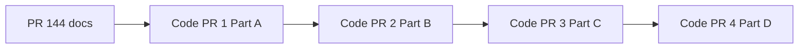

# Integration Hub Phase 1a — implementation and E2E guide

**Spec:** [01-phase-1a-restructure-and-multi-tenant.md](../architecture/lld/integration-hub/01-phase-1a-restructure-and-multi-tenant.md)  
**Coverage audit:** [02-issue-143-coverage-matrix.md](../architecture/lld/integration-hub/02-issue-143-coverage-matrix.md)  
**Safe migration:** [03-safe-migration-and-cutover.md](../architecture/lld/integration-hub/03-safe-migration-and-cutover.md)  
**Tracking:** [GitHub issue #143](https://github.com/IQ-Line/HospitalSaarthi/issues/143)

**PR #144 is docs-only.** Rename to `docs(integration-hub): Phase 1a spec`. Code ships in **four follow-up PRs** in **strict order** — see [03-safe-migration §2](../architecture/lld/integration-hub/03-safe-migration-and-cutover.md#2-recommended-code-pr-sequence).

## 0. Development order (follow this sequence)



| Step | When to start | Checklist section |
|------|---------------|-------------------|
| 0 — #144 | Done | Read LLD 01–03 (no code) |
| 1 — Code PR 1 | After #144 merged | §2 Code PR 1 below |
| 2 — Code PR 2 | After Code PR 1 merged | §2 Code PR 2 below |
| 3 — Code PR 3 | After Code PR 2 merged | §2 Code PR 3 below |
| 4 — Code PR 4 | After Code PR 3 merged + smoke | §2 Code PR 4 + §4 E2E |

Use this guide while executing **one code PR at a time**. Read **03-safe-migration** before Code PR 2 — callback routes must not keep using a single boot-time `xHipId`. Protocol-level ABDM E2E (M1 enrolment, M2 link, M3 mock loop) stays in the existing runbooks — only **service name**, **env prefix**, and **credential source** change.

| Still valid after cutover | Path |
|---------------------------|------|
| M1 runbook | [abdm-adapter-m1-runbook.md](./abdm-adapter-m1-runbook.md) |
| M2 reference | [abdm-adapter-m2-simple-reference.md](./abdm-adapter-m2-simple-reference.md) |
| M3 mock / dev | [abdm-adapter-m3-developer-and-e2e.md](./abdm-adapter-m3-developer-and-e2e.md) |
| Production E2E | [abdm-adapter-e2e-and-production.md](./abdm-adapter-e2e-and-production.md) |
| M3 crypto / PHR | [../architecture/lld/abdm-adapter/12-phr-push-reconciliation.md](../architecture/lld/abdm-adapter/12-phr-push-reconciliation.md) |

---

## 1. Before you start

**Current repo state (pre–Phase 1a):**

- Module: `modules/abdm-adapter/` (`@hims/abdm-adapter`)
- Service: `services/abdm-adapter-svc/` (default port **3007**)
- DB schema: `abdm_adapter` (8 tables)
- Credentials: boot-time env (see `services/abdm-adapter-svc/.env.example`)
- Callback tenant: `ABDM_HIP_TENANT_MAP` or `ABDM_DEV_TENANT_ID` ([`resolve-callback-tenant.ts`](../../modules/abdm-adapter/src/lib/resolve-callback-tenant.ts))

**Target state:**

- Module: `modules/integration-hub/` with `integrations/abdm/`
- Service: `services/integration-hub-svc/`
- DB schema: `integration_hub` (same 8 ABDM tables)
- Credentials: `configurator.tenant_integration_profiles` + `integrationContextResolver` middleware
- Callback tenant: lookup `hip_id` on profiles table

---

## 2. Implementation checklist (by Code PR — same order as §0)

### Code PR 1 — Part A (Foundation)

- [ ] `tenant_integration_profiles` in configurator (Drizzle + migration + partial unique on `hip_id` + port + repo)
- [ ] **configurator-svc REST CRUD** for profiles (required — not SQL-only)
- [ ] **Seed script** `scripts/seed-abdm-profile-from-env.mts` — `pnpm seed-abdm-profile` or `make seed-abdm-profile`
- [ ] Scaffold `modules/integration-hub/` (`package.json`, `project.json`, `tsconfig.json`, Nx tags)
- [ ] Copy `modules/abdm-adapter/src/*` → `integrations/abdm/` (no behaviour change)
- [ ] `lib/integration-context.ts` — types for `IntegrationContext` / `request.integrationCtx`
- [ ] `lib/per-tenant-secrets.ts` — implements `SecretsClient` from profile (+ `env:` fallback)
- [ ] `lib/integration-profile-repo.ts` — read active profile by `iq_tenant_id`; read by `hip_id` for callbacks

### Code PR 2 — Part B (Multi-tenant refactor)

- [ ] All rest handlers: `options` → `request.integrationCtx.deps` (or helper `getAbdmDeps(request)`)
- [ ] `router.ts`: `createRouter()` registers routes without `AbdmAdapterDeps` closure
- [ ] **`/api/v3` callbacks:** after `resolveCallbackTenantId`, build deps for that tenant (see 03-safe-migration §4.2)
- [ ] **`registerM2EventConsumers`:** `sharedInfra` + `buildAbdmDepsForTenant(event.iq_tenant_id, …)` per event (envelope `iq_tenant_id`, 03 §4.3)
- [ ] `HttpGatewayClient`: `xCmId` from deps per request/call; **disable** process-wide token cache (03 §6)
- [ ] `createSmsClientFromEnv` removed from hot path; `createSmsClientFromProfile(profile)`
- [ ] `resolve-callback-tenant.ts`: DB `hip_id` → `iq_tenant_id` (keep `x-tenant-id` header for mock scripts)

### Code PR 3 — Part C (Schema + service)

- [ ] `INTEGRATION_HUB_SCHEMA_NAME = 'integration_hub'` in `schema/tables.ts`
- [ ] Import path fixes under `integrations/abdm/`
- [ ] `services/integration-hub-svc/src/main.ts`: middleware + deployment env only
- [ ] `workers/janitor.ts` extracted
- [ ] `normalizeIntegrationHubEnvAliases()` — full old→new table in [01-phase-1a §7.5](../architecture/lld/integration-hub/01-phase-1a-restructure-and-multi-tenant.md#75-normalizeintegrationhubenvaliases-reference-code-pr-3)
- [ ] `specs/openapi/integration-hub.v1.yaml` (rename from `abdm-adapter.v1.yaml`)
- [ ] Makefile / docker / devops-handoff updates

### Code PR 4 — Part D (Cleanup)

- [ ] Remove `modules/abdm-adapter/` and `services/abdm-adapter-svc/`
- [ ] `pnpm install`
- [ ] Full smoke below passes

---

## 3. Seeding `tenant_integration_profiles` (local)

After Part A migration, prefer the seed script (reads `services/abdm-adapter-svc/.env`):

```bash
npx nx run configurator:db-migrate
pnpm seed-abdm-profile   # or: make seed-abdm-profile
```

Requires `DATABASE_URL`, `make seed`, and `ABDM_X_HIP_ID` / `ABDM_X_HIU_ID` in `.env`. If `ABDM_DEV_TENANT_ID` in `.env` is not in the DB, the seed script falls back to the platform dev tenant (`DEVELOPMENT_SEED_TENANT_ID`); align `ABDM_DEV_TENANT_ID` with that UUID for callbacks.

**By-hip lookup (internal):** In dev, `CONFIGURATOR_INTERNAL_API_KEY` unset → no header required. In production, set the same value on configurator-svc and send `x-configurator-internal-key` from integration-hub-svc (Code PR 2).

```bash
curl -s "http://localhost:3001/api/configurator/v1/integration-profiles/by-hip/IN3610001625"
# With key: curl -H "x-configurator-internal-key: $CONFIGURATOR_INTERNAL_API_KEY" ...
```

Manual SQL (alternative):

```sql
INSERT INTO configurator.tenant_integration_profiles (
  iq_tenant_id,
  integration_kind,
  is_active,
  hip_id,
  hiu_id,
  cm_id,
  client_id,
  client_secret,
  default_sms_phone,
  hip_display_name,
  callback_base_url,
  sms_provider,
  sms_config,
  gateway_environment
) VALUES (
  '00000000-0000-4000-8000-0000000000aa',  -- same as old ABDM_DEV_TENANT_ID
  'abdm',
  true,
  'IN3610001625',                            -- old ABDM_X_HIP_ID
  'SBX_TEST_HIU_001',                        -- old ABDM_X_HIU_ID
  'sbx',
  '<sandbox-client-id>',
  '<sandbox-client-secret>',
  '+91XXXXXXXXXX',
  'Hospital Saarthi Test HIP',
  'http://localhost:3007',                   -- or ngrok URL
  'logging',
  '{}'::jsonb,
  'sandbox'
);
```

**Callback test:** a second tenant with a different `hip_id` proves multi-tenant callback routing without `ABDM_HIP_TENANT_MAP`.

---

## 4. E2E smoke test (after Part D)

Run in order. Failures usually mean middleware did not load a profile or env aliases were not wired.

### 4.1 Build and migrate

```bash
pnpm install
npx nx run integration-hub-svc:db-migrate
npx nx run integration-hub-svc:serve
```

Expect service on `INTEGRATION_HUB_SVC_PORT` (default **3007** unless changed).

### 4.2 Health

```bash
curl -sS "http://localhost:3007/healthz"
curl -sS "http://localhost:3007/api/abdm/v1/healthz"
```

Both should return `{"status":"ok"}` (or equivalent).

### 4.3 Platform route with tenant header (profile required)

Any M1 route that calls the gateway proves per-tenant OAuth credentials:

```bash
export TENANT=00000000-0000-4000-8000-0000000000aa
curl -sS -X POST "http://localhost:3007/api/abdm/v1/abha/enrol/aadhaar/request-otp" \
  -H "Content-Type: application/json" \
  -H "x-tenant-id: $TENANT" \
  -d '{"aadhaar":"XXXXXXXXXXXX"}'
```

**Expect:** not `500` from “missing profile”; gateway may return sandbox validation errors — that is fine.

**Failure modes:**

| Symptom | Likely cause |
|---------|----------------|
| 404 / unknown tenant | No row in `tenant_integration_profiles` for `x-tenant-id` |
| 401 from NHA | Wrong `client_id` / `client_secret` in profile |
| Wrong HIP in outbound headers | Profile `hip_id` mismatch |

### 4.4 Callback tenant resolution (DB `hip_id`)

Simulate an inbound callback with `X-HIP-ID` set to the profile’s `hip_id` (no `ABDM_HIP_TENANT_MAP` in env):

- Use existing M2/M3 mock scripts under `modules/abdm-adapter/scripts/` (update path after move to `integrations/abdm/scripts/`).
- Or POST a minimal discover callback documented in [abdm-adapter-m2-simple-reference.md](./abdm-adapter-m2-simple-reference.md).

**Expect:** handler runs under the tenant that owns that `hip_id` in `tenant_integration_profiles`.

### 4.5 Regression suites

```bash
npx nx run integration-hub:test --skip-nx-cache
# or until rename lands:
npx nx run abdm-adapter:test --skip-nx-cache
```

M3 mock full loop (after script paths updated):

```bash
bash modules/integration-hub/integrations/abdm/scripts/m3/full-loop.sh
```

### 4.6 Multi-tenant spot check

1. Insert a **second** profile row (different `iq_tenant_id`, different `hip_id`).
2. Repeat §4.3 with each `x-tenant-id`.
3. Confirm gateway calls use the matching HIP/client credentials (log `X-HIP-ID` or gateway request audit).

---

## 5. Env file template (deployment-only)

After Phase 1a, `.env` for `integration-hub-svc` should **not** contain `ABDM_X_HIP_ID`, `ABDM_SANDBOX_CLIENT_*`, or `ABDM_HIP_TENANT_MAP`. Keep:

- `DATABASE_URL` / `INTEGRATION_HUB_DATABASE_URL`
- `INTEGRATION_HUB_ABDM_GATEWAY_BASE_URL`, `INTEGRATION_HUB_ABDM_ABHA_API_BASE_URL`
- `INTEGRATION_HUB_TOKEN_ENCRYPTION_KEY`
- M3 dev flags: `INTEGRATION_HUB_ABDM_M3_MOCK_GATEWAY`, `INTEGRATION_HUB_ABDM_M3_LOOPBACK_HIU`
- `EMPI_BASE_URL`, `RECORD_FOUNDATION_BASE_URL`
- `ENABLE_AUTH`, `JWKS_URL` (staging+)

Tenant credentials belong in Configurator (API or SQL seed), not in the service env.

---

## 6. What Phase 1a does *not* require passing

Do not block the issue on:

- 13-table `integration_hub` control plane ([schema-reference.json](../architecture/lld/integration-platform/schema-reference.json))
- `integration_workflow_transitions` / timer worker
- `atomic-transition.ts` replacing every `sessions.patch()`
- Consent table merge (3 → 2)
- OpenAPI paths beyond rename/metadata update

Track those in follow-up issues when product prioritises them.

---

## 7. Document map (issue #143 attachments)

| GitHub comment | Content | Phase 1a? |
|----------------|---------|-----------|
| Issue body | Directory + profiles + migration A–D | **Yes — implement** |
| ADR-0030 paste | Prototype rationale | Reference only |
| 04-orchestration paste | HTTP-first + portability rules | Deferred |
| DEVNOTE paste | Full hub transition + 13 tables | Deferred |
| schema-reference.json paste | Full ERD | Deferred |
| Ayush note 2026-05-29 | Comments are outdated/deferred | **Authoritative scope trim** |

Canonical specs live under `docs/architecture/lld/integration-hub/`, not in the issue comments.

---

## 8. PR order (docs + four code PRs)

| PR | Contents | Gate |
|----|----------|------|
| **#144** | Docs only (this guide + LLD) | Review; no code expected |
| **Code 1** | Part A — configurator table + CRUD + seed + scaffold + copy ABDM | Configurator tests; `abdm-adapter-svc` unchanged |
| **Code 2** | Part B — per-request deps (platform + **callbacks** + event consumers) | Unit tests; callback multi-tenant check |
| **Code 3** | Part C — schema `integration_hub`, `integration-hub-svc`, env aliases | Smoke §4.1–4.3 |
| **Code 4** | Part D — delete Phase 0 paths | Full regression + [03 §8](../architecture/lld/integration-hub/03-safe-migration-and-cutover.md#8-regression-matrix-must-pass-before-part-d) |

Details: [03-safe-migration §2](../architecture/lld/integration-hub/03-safe-migration-and-cutover.md#2-recommended-code-pr-sequence).

### `ABDM_DEV_TENANT_ID` (do not confuse with removed P0 vars)

- **Removed** as a source of HIP/client credentials.
- **Kept** on `integration-hub-svc` only for **callback** tenant fallback when DB `hip_id` lookup fails and no `x-tenant-id` header — log a warning.
- Platform `/api/abdm/v1` routes: require `tenant_integration_profiles` row → 404 if missing.
