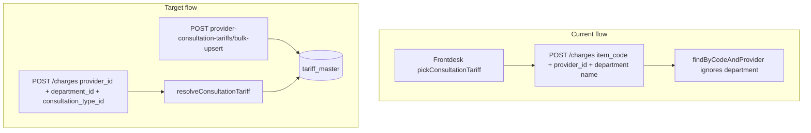

# Billing Service: Department-Aware Doctor Consultation Fees

**Status:** Planned  
**Scope:** Billing module + billing-svc only (UM orchestration and frontdesk are follow-ups)  
**Spec-first:** [specs/openapi/billing.v1.yaml](../specs/openapi/billing.v1.yaml) updated before handler code

---

## 1. Objective

Support per-doctor, per-department consultation pricing:

```
Doctor A
  Cardiology  → ₹800
  Neurology   → ₹1200

Doctor B
  Cardiology  → ₹1000
```

Today billing only enforces uniqueness on `(iq_tenant_id, service_code, provider_id)`, which allows **one consultation fee per provider** regardless of department. Charge resolution uses `findByCodeAndProvider` and **ignores department**, while frontdesk already filters tariffs by department name client-side — inconsistent and insufficient.

**Billing must become department-aware** using `department_id` (Master Data UUID), with consultation type as a first-class dimension.

---

## 2. Current state (codebase facts)

| Area | Location | Today |
|------|----------|-------|
| Tariff table | [modules/billing/migrations/0000_billing_master.sql](../modules/billing/migrations/0000_billing_master.sql) | `department varchar(64)` name only; unique on `(tenant, service_code, provider_id)` |
| Effective dating | Same migration | **`effective_from` / `effective_to` already exist** — do not re-add |
| Charge lookup | [modules/billing/src/data-access/tariff-master.repository.ts](../modules/billing/src/data-access/tariff-master.repository.ts) | `findByCodeAndProvider(code, providerId)` — no department |
| Charge use-case | [modules/billing/src/use-cases/capture-charge.ts](../modules/billing/src/use-cases/capture-charge.ts) | Uses lookup above; `department` only copied to `bill_items` |
| Charge API body | [modules/billing/src/rest-handlers/billing-schemas.ts](../modules/billing/src/rest-handlers/billing-schemas.ts) | `item_code` required; `department` string only |
| Frontdesk | [services/web/src/features/frontdesk/lib/resolve-registration-tariff.ts](../services/web/src/features/frontdesk/lib/resolve-registration-tariff.ts) | `pickConsultationTariff` filters by department **name** — business logic on frontend |
| MD departments | [modules/master-data/alembic/versions/026_departments_catalog.py](../modules/master-data/alembic/versions/026_departments_catalog.py) | UUID `departments.id` per tenant/global catalog |



---

## 3. Design principles

1. **Spec first** — OpenAPI before handlers.
2. **Billing owns pricing rules** — service code generation, default tax, consultation category, validation, duplicate prevention.
3. **No cross-module imports** — validate provider/department via HTTP ports (UM, Master Data).
4. **No frontend orchestration** — single bulk-upsert API for provisioning (called by UM later, not N× `POST /services` from UI).
5. **Mixed catalog** — rack-rate rows (registration, procedures) and provider consultation rows coexist with **separate partial unique indexes**.
6. **Snapshot pricing unchanged** — `bill_items` still snapshot price at charge time.

---

## 4. Database changes

### 4.1 New table: `billing.consultation_types`

Billing-owned catalog (tenant-scoped, Citus-distributed on `iq_tenant_id`).

```sql
CREATE TABLE billing.consultation_types (
  id uuid NOT NULL DEFAULT gen_random_uuid(),
  iq_tenant_id uuid NOT NULL,
  code varchar(64) NOT NULL,           -- e.g. GENERAL_CONSULTATION, SPECIALIST, FOLLOW_UP
  display_name text NOT NULL,
  is_active boolean NOT NULL DEFAULT true,
  created_at timestamptz NOT NULL DEFAULT now(),
  updated_at timestamptz NOT NULL DEFAULT now(),
  PRIMARY KEY (iq_tenant_id, id),
  UNIQUE (iq_tenant_id, code)
);
```

**V1 seed:** one row per tenant — `GENERAL_CONSULTATION` / "General consultation". Future types (specialist, follow-up, teleconsult) added via admin API or migration without schema change.

### 4.2 Alter `billing.tariff_master`

Add columns (migration `0002_provider_consultation_tariffs.sql`):

```sql
ALTER TABLE billing.tariff_master
  ADD COLUMN department_id uuid NULL,
  ADD COLUMN consultation_type_id uuid NULL;
```

**Notes:**

- Keep existing `department varchar(64)` as optional **denormalized display** (populated at write from MD); **`department_id` is source of truth** for provider consultation rows.
- **`effective_from` / `effective_to` already exist** — no change except using them in overlap validation for provider tariffs.

Optional FK-style comment only (no cross-schema FK): `department_id` → master-data `departments.id`; `consultation_type_id` → `billing.consultation_types.id` (same schema).

### 4.3 Unique constraints — dual partial indexes

The catalog is **mixed**. Do **not** replace the global unique index for all rows.

| Row kind | Example | Uniqueness |
|----------|---------|------------|
| Rack / non-provider | `REG_FEE`, `PROC_DRESSING` (`provider_id IS NULL`) | `(iq_tenant_id, service_code, provider_id)` |
| Provider consultation | Doctor + dept + type | `(iq_tenant_id, provider_id, department_id, consultation_type_id)` |

**Migration steps:**

1. Drop existing global `uq_tariff_master_tenant_code_provider`.
2. Recreate as **partial** index for rack rates only:

```sql
CREATE UNIQUE INDEX uq_tariff_master_rack_code
  ON billing.tariff_master (iq_tenant_id, service_code, provider_id)
  NULLS NOT DISTINCT
  WHERE provider_id IS NULL;
```

3. Add provider consultation index:

```sql
CREATE UNIQUE INDEX uq_tariff_provider_dept_consult_type
  ON billing.tariff_master (iq_tenant_id, provider_id, department_id, consultation_type_id)
  WHERE provider_id IS NOT NULL
    AND department_id IS NOT NULL
    AND consultation_type_id IS NOT NULL;
```

4. Add lookup index for charge resolution:

```sql
CREATE INDEX idx_tariff_resolve_consultation
  ON billing.tariff_master (iq_tenant_id, provider_id, department_id, consultation_type_id, effective_from DESC)
  WHERE is_active = true
    AND provider_id IS NOT NULL;
```

### 4.4 Backfill / migration strategy

Existing provider consultation rows (legacy lazy-explosion):

- Set `consultation_type_id` = tenant default `GENERAL_CONSULTATION` id.
- Leave `department_id = NULL`.
- Keep `is_active = true`.
- Continue to work via **`item_code` charge path** until re-provisioned.

New doctor provisioning (bulk-upsert) **requires** `department_id` + `consultation_type_id`.

**Risk:** Multiple legacy rows per doctor with different `service_code` and NULL `department_id` do not collide on the new partial index. Document that operators should re-provision via bulk-upsert for dept-specific pricing.

---

## 5. Domain model & ports

### 5.1 Extend `TariffMasterRow`

File: [modules/billing/src/domain/tariff-master.types.ts](../modules/billing/src/domain/tariff-master.types.ts)

```typescript
department_id: string | null;
consultation_type_id: string | null;
```

### 5.2 New types

```typescript
// consultation-type.types.ts
export type ConsultationTypeRow = {
  id: string;
  iq_tenant_id: string;
  code: string;
  display_name: string;
  is_active: boolean;
};

// provider-consultation-tariff.types.ts
export type ProviderConsultationTariffItem = {
  department_id: string;
  consultation_type_id: string;
  base_price: string;
  tax_percentage: string;
  effective_from?: string;
  effective_to?: string | null;
  is_active?: boolean;
};

export type ProviderConsultationTariffView = ProviderConsultationTariffItem & {
  id: string;              // tariff_master.id
  provider_id: string;
  service_code: string;    // read-only, billing-generated
  service_name: string;
};
```

### 5.3 Port extensions

File: [modules/billing/src/ports.ts](../modules/billing/src/ports.ts)

```typescript
export interface ConsultationTypeRepo {
  findById(tenantId: string, id: string): Promise<ConsultationTypeRow | undefined>;
  findByCode(tenantId: string, code: string): Promise<ConsultationTypeRow | undefined>;
  listActive(tenantId: string): Promise<ConsultationTypeRow[]>;
}

export interface TariffMasterRepo {
  // existing...
  findByCodeAndProvider(...): Promise<TariffMasterRow | undefined>;  // keep for rack / legacy

  resolveConsultationTariff(
    tenantId: string,
    input: {
      providerId: string;
      departmentId: string;
      consultationTypeId: string;
      asOf?: Date;
    },
  ): Promise<TariffMasterRow | undefined>;

  upsertProviderConsultationTariff(
    tenantId: string,
    providerId: string,
    item: ProviderConsultationTariffItem,
    meta: { serviceCode: string; serviceName: string; actorId?: string | null },
  ): Promise<TariffMasterRow>;

  listProviderConsultationTariffs(
    tenantId: string,
    providerId: string,
    filters?: { departmentId?: string; consultationTypeId?: string; isActive?: boolean },
  ): Promise<TariffMasterRow[]>;
}

/** Cross-module — HTTP adapters in billing-svc */
export interface ProviderDirectoryPort {
  assertActiveProvider(tenantId: string, providerId: string): Promise<void>;
  getProviderDisplayName(tenantId: string, providerId: string): Promise<string>;
}

export interface DepartmentDirectoryPort {
  assertActiveDepartment(tenantId: string, departmentId: string): Promise<{ id: string; name: string; code: string }>;
}
```

---

## 6. Use-cases (business logic)

All use-cases are **functions** in `modules/billing/src/use-cases/`.

### 6.1 `resolveConsultationTariff`

**File:** `resolve-consultation-tariff.ts`

```typescript
resolveConsultationTariff(deps, tenantId, {
  providerId,
  departmentId,
  consultationTypeId,
  asOf?,  // default now() for effective dating
})
```

**Logic:**

1. Validate UUIDs present.
2. Query `tariffRepo.resolveConsultationTariff` — active row matching `(provider, department, type)` effective at `asOf`.
3. Return `NOT_FOUND` if missing (`catalog_row_not_found`).

Used by `captureCharge` when consultation context is provided.

### 6.2 `bulkUpsertProviderConsultationTariffs`

**File:** `bulk-upsert-provider-consultation-tariffs.ts`

**Input:**

```json
{
  "provider_id": "doctor-uuid",
  "items": [
    {
      "department_id": "cardiology-uuid",
      "consultation_type_id": "general-type-uuid",
      "base_price": "800.0000",
      "tax_percentage": "18.0000",
      "effective_from": "2026-05-29T00:00:00Z",
      "effective_to": null,
      "is_active": true
    }
  ]
}
```

**Behavior (idempotent):**

1. Validate `provider_id` via `ProviderDirectoryPort`.
2. For each item:
   - Validate `department_id` via `DepartmentDirectoryPort`.
   - Validate `consultation_type_id` via `ConsultationTypeRepo`.
   - Validate prices (non-negative, tax 0–100).
   - Check effective window overlap with other active rows for same natural key (if overlapping windows not allowed in v1).
   - **Generate `service_code`** via internal policy (see §7).
   - **Generate `service_name`** e.g. `"Consultation — Dr Patel — Cardiology"`.
   - Upsert on `(tenant, provider_id, department_id, consultation_type_id)` — update price/tax/effective dates if exists, insert if not.
3. Return array of `ProviderConsultationTariffView`.
4. Safe for retries (same payload → same result).

**Transaction:** all items in one DB transaction; all-or-nothing.

### 6.3 `listProviderConsultationTariffs`

**File:** `list-provider-consultation-tariffs.ts`

Filter `tariff_master` where `provider_id = ?` and `consultation_type_id IS NOT NULL`, optionally by `department_id`. Map to read DTO.

### 6.4 Update `captureCharge`

**File:** [modules/billing/src/use-cases/capture-charge.ts](../modules/billing/src/use-cases/capture-charge.ts)

**Two resolution paths:**

| Path | When | Lookup |
|------|------|--------|
| **Legacy / rack** | `item_code` provided (registration, procedures, legacy doctor rows) | `findByCodeAndProvider(tenantId, item_code, providerId)` |
| **Consultation** | `provider_id` + `department_id` + `consultation_type_id` provided | `resolveConsultationTariff(...)` |

**Validation:**

- If consultation fields present → `item_code` optional.
- If consultation fields absent → `item_code` required (unchanged).
- Reject ambiguous payloads (both paths incomplete).

**Bill item:** still snapshot `item_code`, `unit_price`, `tax_percentage`, `description` from resolved tariff row.

---

## 7. Billing-owned policies

### 7.1 Service code generation

**Clients must NOT supply `service_code` on bulk-upsert.**

Internal function `deriveProviderConsultationServiceCode()` in `modules/billing/src/domain/consultation-service-code.ts`:

**Recommended v1 policy:**

```
CONSULT_{consultationTypeCode}_{departmentCode}
```

- Uppercase, slug-safe, max 64 chars.
- Example: `CONSULT_GENERAL_CONSULTATION_CARDIOLOGY`
- Collision handling: append short hash suffix if length exceeded.

Alternative acceptable: opaque `CONS-{first-8-of-tariff-id}` on insert only — less debuggable.

**Single function, unit-tested** — no duplication in handlers or frontend.

### 7.2 Default tax and category

On bulk-upsert, when `tax_percentage` omitted:

- Use tenant billing config default (env or `billing.tenant_settings` future table).
- V1 fallback: `0` or tenant seed value in migration.

Set on row:

- `category` = `consultation-fee` (align with [master-data picklist](../modules/master-data/alembic/versions/033_picklist_values_seed.py))
- `sub_category` = consultation type code

### 7.3 Validation rules

| Rule | Error code |
|------|------------|
| Provider not found / inactive | `VALIDATION` / `provider_not_found` |
| Department not found / inactive | `VALIDATION` / `department_not_found` |
| Consultation type not found / inactive | `VALIDATION` / `consultation_type_not_found` |
| Duplicate natural key (DB unique violation) | `CONFLICT` |
| Overlapping effective windows (if enforced) | `CONFLICT` / `effective_overlap` |
| Negative price or invalid tax | `VALIDATION` |
| Empty `items` array on bulk-upsert | `VALIDATION` |

---

## 8. API changes (OpenAPI)

**File:** [specs/openapi/billing.v1.yaml](../specs/openapi/billing.v1.yaml)

### 8.1 New tag: `Provider Consultation Tariffs`

#### `POST /v1/billing/provider-consultation-tariffs/bulk-upsert`

- **Auth:** Bearer + `iq_tenant_id`
- **Capability:** `tariff-master:tariff-master:create` and/or `update` (Cerbos)
- **Request:** `BulkUpsertProviderConsultationTariffsRequest`
- **Response:** `201` — `{ data: ProviderConsultationTariff[] }`

#### `GET /v1/billing/provider-consultation-tariffs`

- **Query:** `provider_id` (required), `department_id`, `consultation_type_id`, `is_active`
- **Response:** `200` — `{ data: ProviderConsultationTariff[] }`

#### `GET /v1/billing/consultation-types` (optional v1)

- List active consultation types for tenant (for admin UI / UM orchestration).

### 8.2 Update `POST /v1/billing/charges`

Extend `CaptureChargeRequest`:

```yaml
properties:
  item_code:
    type: string
    description: Required for rack/legacy charges. Optional when provider_id + department_id + consultation_type_id supplied.
  provider_id:
    type: string
    format: uuid
    nullable: true
  department_id:
    type: string
    format: uuid
    nullable: true
  consultation_type_id:
    type: string
    format: uuid
    nullable: true
  department:
    type: string
    nullable: true
    deprecated: true
    description: Legacy display name. Prefer department_id.
```

**oneOf validation (document in spec):**

- Rack/legacy: `item_code` required.
- Consultation: `provider_id` + `department_id` + `consultation_type_id` required.

### 8.3 DTO schemas

```yaml
ProviderConsultationTariff:
  type: object
  required: [id, provider_id, department_id, consultation_type_id, base_price, tax_percentage, service_code, service_name, is_active]
  properties:
    id: { type: string, format: uuid }
    provider_id: { type: string, format: uuid }
    department_id: { type: string, format: uuid }
    consultation_type_id: { type: string, format: uuid }
    base_price: { $ref: '#/components/schemas/Money' }
    tax_percentage: { type: string }
    service_code: { type: string, readOnly: true }
    service_name: { type: string, readOnly: true }
    effective_from: { type: string, format: date-time }
    effective_to: { type: string, format: date-time, nullable: true }
    is_active: { type: boolean }

BulkUpsertProviderConsultationTariffsRequest:
  type: object
  required: [provider_id, items]
  additionalProperties: false
  properties:
    provider_id: { type: string, format: uuid }
    items:
      type: array
      minItems: 1
      items:
        type: object
        required: [department_id, consultation_type_id, base_price]
        additionalProperties: false
        properties:
          department_id: { type: string, format: uuid }
          consultation_type_id: { type: string, format: uuid }
          base_price: { $ref: '#/components/schemas/Money' }
          tax_percentage: { type: string }
          effective_from: { type: string, format: date-time }
          effective_to: { type: string, format: date-time, nullable: true }
          is_active: { type: boolean, default: true }
```

---

## 9. HTTP handlers & wiring

### 9.1 Module router

**Files:**

- [modules/billing/src/router.ts](../modules/billing/src/router.ts) — register new routes
- New: `modules/billing/src/rest-handlers/provider-consultation-tariff.handlers.ts`
- Update: [modules/billing/src/rest-handlers/billing.handlers.ts](../modules/billing/src/rest-handlers/billing.handlers.ts) (charge only if split)

### 9.2 Authz

**File:** [modules/billing/src/authz/billing-authz-target-resolver.ts](../modules/billing/src/authz/billing-authz-target-resolver.ts)

| Route | Action |
|-------|--------|
| `POST .../bulk-upsert` | `tariff-master.create` (or new `provider-tariff.upsert`) |
| `GET .../provider-consultation-tariffs` | `tariff-master.read` |
| `GET .../consultation-types` | `tariff-master.read` |

Update [infra/cerbos/policies/billing/tariff_master.yaml](../infra/cerbos/policies/billing/tariff_master.yaml) if new actions added.

### 9.3 billing-svc adapters

**New files in** `services/billing-svc/src/adapters/`:

- `http-provider-directory-adapter.ts` → UM `GET /users/:id` or `/providers`
- `http-department-directory-adapter.ts` → MD `GET /departments/:id`

Inject into router factory alongside existing DB repos.

---

## 10. Drizzle schema

**File:** [modules/billing/src/schema/tables.ts](../modules/billing/src/schema/tables.ts)

- Add `consultationTypes` table definition.
- Extend `billingMaster` with `department_id`, `consultation_type_id` columns.

Run migration script consistent with existing [modules/billing/migrations](../modules/billing/migrations/) pattern.

---

## 11. Tests

### 11.1 Unit tests (Vitest)

| Test file | Cases |
|-----------|-------|
| `resolve-consultation-tariff.test.ts` | Happy path; not found; inactive row; effective date boundary |
| `bulk-upsert-provider-consultation-tariffs.test.ts` | Insert; update same key; idempotent retry; invalid provider/dept/type; duplicate |
| `consultation-service-code.test.ts` | Deterministic code generation; length limit |
| `capture-charge.test.ts` | Extend: consultation path without item_code; legacy item_code path unchanged |

### 11.2 Cerbos tests

**File:** [infra/cerbos/tests/billing_tariff_permissions_test.yaml](../infra/cerbos/tests/billing_tariff_permissions_test.yaml)

- Allow bulk-upsert with `tariff-master:tariff-master:create`
- Deny without capability
- Tenant mismatch denied

---

## 12. Implementation phases

### Phase P0 — Schema (blocking)

- [ ] `0002_provider_consultation_tariffs.sql`
- [ ] Drizzle tables + domain types
- [ ] Seed `consultation_types` per tenant (or bootstrap on first bulk-upsert)

### Phase P1 — Core use-cases

- [ ] `ConsultationTypeRepo` + `TariffMasterRepo` extensions (Drizzle + in-memory for tests)
- [ ] `deriveProviderConsultationServiceCode`
- [ ] `resolveConsultationTariff`
- [ ] `bulkUpsertProviderConsultationTariffs`
- [ ] `listProviderConsultationTariffs`
- [ ] HTTP ports + billing-svc adapters

### Phase P2 — OpenAPI + HTTP

- [ ] Update `billing.v1.yaml`
- [ ] Register handlers + authz resolver entries
- [ ] Update `captureCharge` + charge schema

### Phase P3 — Tests & docs

- [ ] Unit + Cerbos tests
- [ ] Update [docs/architecture/lld/billing/01-schema-design.md](../docs/architecture/lld/billing/01-schema-design.md) §2.1 for department-aware model

### Phase P4 — Consumers (out of billing scope, separate PRs)

- [ ] **User Management:** orchestrate bulk-upsert after user create (doctor + dept affiliations)
- [ ] **Frontdesk:** pass `department_id` + `consultation_type_id` on consultation charges; remove `pickConsultationTariff` over time
- [ ] Optional: `GET /v1/billing/services/resolve` for thin clients

---

## 13. Acceptance criteria

Billing work is **complete** when:

- [ ] A doctor can have **different consultation fees per department** (Doctor A: Cardiology ₹800, Neurology ₹1200).
- [ ] Uniqueness enforced on `(provider_id, department_id, consultation_type_id)` for provider consultation rows.
- [ ] Rack-rate services (`REG_FEE`, etc.) still work with `(service_code, provider_id NULL)` index.
- [ ] `POST /provider-consultation-tariffs/bulk-upsert` is **idempotent** and does not accept client `service_code`.
- [ ] `GET /provider-consultation-tariffs?provider_id=` returns dept/type/price rows for edit screens.
- [ ] Charge resolution uses **`department_id` + `consultation_type_id`** on consultation path.
- [ ] Legacy rows (`department_id NULL`) remain chargeable via **`item_code`** path.
- [ ] Billing validates provider and department via ports; generates service codes and names internally.
- [ ] OpenAPI spec matches runtime behavior.
- [ ] Cerbos policies and tests cover new routes.

---

## 14. Out of scope (this plan)

- User Management `user_department_affiliations` table
- Create-user modal UI
- Phase 2 `price_agreements`
- Changing historical `bill_items` (immutable by design)

---

## 15. File checklist

| File | Action |
|------|--------|
| `specs/openapi/billing.v1.yaml` | Add paths + schemas |
| `modules/billing/migrations/0002_*.sql` | New migration |
| `modules/billing/src/schema/tables.ts` | Schema |
| `modules/billing/src/domain/tariff-master.types.ts` | Types |
| `modules/billing/src/domain/consultation-type.types.ts` | New |
| `modules/billing/src/domain/provider-consultation-tariff.types.ts` | New |
| `modules/billing/src/domain/consultation-service-code.ts` | New |
| `modules/billing/src/ports.ts` | Extend |
| `modules/billing/src/data-access/tariff-master.repository.ts` | Extend |
| `modules/billing/src/data-access/consultation-type.repository.ts` | New |
| `modules/billing/src/use-cases/resolve-consultation-tariff.ts` | New |
| `modules/billing/src/use-cases/bulk-upsert-provider-consultation-tariffs.ts` | New |
| `modules/billing/src/use-cases/list-provider-consultation-tariffs.ts` | New |
| `modules/billing/src/use-cases/capture-charge.ts` | Update |
| `modules/billing/src/rest-handlers/provider-consultation-tariff.handlers.ts` | New |
| `modules/billing/src/rest-handlers/billing-schemas.ts` | Update charge body |
| `modules/billing/src/authz/billing-authz-target-resolver.ts` | Update |
| `modules/billing/src/router.ts` | Register routes |
| `services/billing-svc/src/adapters/http-*-directory-adapter.ts` | New |
| `infra/cerbos/tests/billing_tariff_permissions_test.yaml` | Update |

---

## 16. Example end-to-end (after implementation)

**Provision Doctor A fees (UM or admin tool calls billing):**

```http
POST /api/billing/v1/provider-consultation-tariffs/bulk-upsert
iq_tenant_id: {tenant}
Authorization: Bearer {token}

{
  "provider_id": "doctor-a-uuid",
  "items": [
    { "department_id": "cardiology-uuid", "consultation_type_id": "general-uuid", "base_price": "800.0000", "tax_percentage": "18.0000" },
    { "department_id": "neurology-uuid",  "consultation_type_id": "general-uuid", "base_price": "1200.0000", "tax_percentage": "18.0000" }
  ]
}
```

**Charge at registration:**

```http
POST /api/billing/v1/charges

{
  "patient_id": "...",
  "source_module": "registration",
  "provider_id": "doctor-a-uuid",
  "department_id": "cardiology-uuid",
  "consultation_type_id": "general-uuid",
  "visit_type": "OPD"
}
```

Billing resolves tariff → ₹800 → snapshots onto `bill_items`.
