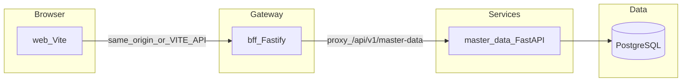

# Visitpad Master — Full Implementation Plan

**Version:** 2.1 (Master Data–hosted; step-by-step execution)  
**Status:** Draft for execution  
**Scope:** Global clinical / visit template reference data (admin UI + APIs), aligned with HIMS monorepo rules (spec-first, `tenant_id`, no cross-module imports).  
**Inputs:** Chat payloads (sample JSON), UI reference screenshots (Visitpad templates — all primary tabs, sub-tabs, toolbars, tables), [docs/architecture/lld/master-data/03-visitpad-master.md](../../architecture/lld/master-data/03-visitpad-master.md), [docs/architecture/lld/repo-structure/01-monorepo-setup.md](../../architecture/lld/repo-structure/01-monorepo-setup.md), and [docs/architecture/lld/frontend/01-frontend-structure.md](../../architecture/lld/frontend/01-frontend-structure.md). **End-to-end verification (sections 1→end):** [visitpad-master-e2e-verification.md](./visitpad-master-e2e-verification.md).

---

## Table of contents

0. [Where this work lives + step-by-step checklist](#0-where-this-work-lives--step-by-step-checklist)  
1. [Executive summary](#1-executive-summary)  
2. [Locked defaults (start here)](#2-locked-defaults-start-here)  
3. [Product scope — tabs and entities](#3-product-scope--tabs-and-entities)  
4. [Reference design — screenshot inventory](#4-reference-design--screenshot-inventory-full-visitpad-templates)  
5. [`is_active` / Enable — coverage matrix](#5-is_active--enable--coverage-matrix-payloads--screenshots)  
6. [Screenshot checklist (acceptance mapping)](#6-screenshot-checklist-acceptance-mapping)  
7. [Payload ↔ UI field map](#7-payload--ui-field-map-gaps-to-close-in-spec)  
8. [Schema source of truth](#8-schema-source-of-truth-openapi--db--zod)  
9. [Robust cross-cutting requirements](#9-robust-cross-cutting-requirements)  
10. [Architecture decisions](#10-architecture-decisions-must-resolve-before-coding)  
11. [Backend plan](#11-backend-plan-spec-to-schema-to-handlers)  
12. [Frontend plan](#12-frontend-plan-mirror-master-data-quality-bar)  
13. [Testing and quality](#13-testing-and-quality--robust-strategy)  
14. [Risks and dependencies](#14-risks-and-dependencies)  
15. [Milestones, waves, and exit criteria](#15-milestones-waves-and-exit-criteria)  
16. [Kickoff checklist](#16-kickoff-checklist-first-two-weeks)  
17. [Appendix A — Draft field catalog](#appendix-a--draft-field-catalog-from-your-sample-api-responses)  
18. [Appendix B — OpenAPI component split](#appendix-b--how-openapi-componentsschemas-will-be-split-when-authored)  
19. [Appendix C — REST path inventory](#appendix-c--rest-path-inventory-template)  
20. [Appendix D — Enum and normalization checklist](#appendix-d--enum-and-normalization-checklist-lock-in-openapi)

---

## 0. Where this work lives + step-by-step checklist

**Correct execution model (do not split a second Python service unless an ADR says otherwise):**

| Layer | Location |
|-------|----------|
| **Normative API** | Extend [`specs/openapi/master-data.v1.yaml`](../../specs/openapi/master-data.v1.yaml) — paths under `/api/v1/master-data/visitpad/...`, OpenAPI tags such as `Visitpad — Units`. |
| **Backend handlers, DB, Alembic** | [`modules/master-data/`](../../modules/master-data/) only. |
| **Architecture LLD** | [`docs/architecture/lld/master-data/03-visitpad-master.md`](../../architecture/lld/master-data/03-visitpad-master.md) (+ updates to `01-schema-design.md`, `02-api-contracts.md`). |
| **Frontend** | [`services/web/src/features/visitpad/`](../../services/web/src/features/visitpad/) — reuse components/hooks patterns from [`services/web/src/features/master-data/`](../../services/web/src/features/master-data/). |
| **BFF** | **No new upstream.** Existing proxy to Master Data (`/api/v1/master-data`) already covers Visitpad routes. |

**Step-by-step order (check off as you go):**

| Step | Owner | Deliverable |
|------|--------|----------------|
| **S1** | Docs | LLD `03-visitpad-master.md` linked from `01` / `02` (done when this plan version lands). |
| **S2** | Spec | Add Visitpad `components/schemas/*` to `master-data.v1.yaml` (all entities from Appendix A + list wrappers + `ErrorResponse` reuse). |
| **S3** | Spec | Add **first slice** paths: `visitpad/units`, `visitpad/unit-conversions` (CRUD + list query params). |
| **S4** | DB | Alembic migration: tables `units`, `unit_conversions` in **`public`** + indexes + `tenant_id`. |
| **S5** | API | Pydantic schemas, repositories, **per-section** `visitpad_*_service.py` + `visitpad_*.py` routers ([§11.5](#115-python-layout--one-domain-per-file-mandatory)); mount from `app/api/v1/router.py`. |
| **S6** | Test | `pytest` integration tests for units + conversions (tenant isolation, 409 on duplicate code). |
| **S7** | Web | TanStack routes under `/visitpad`, shell + Units + Conversions tabs calling BFF → master-data. |
| **S8** | Spec+API | Repeat **S2–S6** per entity wave (rx-columns, allergens, …) per §11.3 / §11.4 below. |
| **S9** | Web | Remaining tabs + Playwright matrix (§13). |
| **S10** | Hardening | Cerbos policies + contract tests in CI when ready. |

---

## 1. Executive summary

**Visitpad Master** is a **product surface** (Visitpad templates admin UI) backed by the **Master Data** service: platform-wide catalogs (units, vitals, medicines, etc.). It is **not** a separate deployable module in `modules/*` unless an ADR explicitly splits it. Delivery must be **spec-first** inside **`master-data.v1.yaml`**, **tenant-safe** (`tenant_id` on every table — use a **platform tenant** for “global” rows), **test-backed**, and **UI-consistent** with existing Master Data web patterns (TanStack Query, `{ id, input }` PATCH mutations, `mutationErrorMessage`, inline toggles where applicable).

**Why phased:** Eleven resource shapes, rich forms (vitals, medicines), and Cerbos touchpoints. A **vertical slice first** (Units + Conversions) de-risks plumbing inside `modules/master-data`; **OpenAPI schemas for all entities** can land early while **HTTP paths** stay incremental.

---

## 2. Locked defaults (start here)

Use these **until an ADR overrides** them:

| Decision | Default |
|----------|---------|
| **Service** | **[modules/master-data](../../modules/master-data)** only — extend routers, repos, services, Alembic. |
| **Stack** | Existing **Python + FastAPI + uv** (`nx run master-data:serve`, port **8010**). |
| **API base path** | **`/api/v1/master-data`** — Visitpad routes are **`/api/v1/master-data/visitpad/...`** (see [03-visitpad-master.md](../../architecture/lld/master-data/03-visitpad-master.md)). |
| **OpenAPI file** | **`specs/openapi/master-data.v1.yaml`** — add components + paths; do **not** add `visitpad.v1.yaml`. |
| **PostgreSQL schema** | **`public`** for Visitpad catalog tables (same DB as Master Data; table names are domain-specific, e.g. `vitals`, `medicines`). |
| **Global data** | Rows use fixed **platform `tenant_id`** (env / settings) — no nullable `tenant_id`. |
| **Web base route** | **`/visitpad`** under [`services/web`](../../services/web) (`features/visitpad` + routes). |
| **Sidebar** | Top-level **Visitpad** (or nested under Master Data per UX); gate with `hasModuleAccess` slug aligned to Cerbos. |
| **Unit conversions** | **No `is_active` in v1** (sample JSON had none; reference UI had no Enabled column). Optional later. |

---

## 3. Product scope — tabs and entities


Single admin area **“Visitpad templates”** with:

| Primary tab | Sub-tabs / notes | Core entities (from JSON) |
|-------------|------------------|----------------------------|
| **Units** | Units / Conversions | `unit`, `unit_conversion` |
| **Vitals** | — | `vital` (rich fields: ranges, pairing, LOINC/SNOMED) |
| **Chief complaints** | — | `chief_complaint` |
| **Diagnosis** | — | `diagnosis` (ICD-10, flags) |
| **Allergies** | Allergens / Reactions | `allergen`, `allergy_reaction` |
| **Rx columns** | Sidebar by `section` (medication_type, frequency, unit, …) | `rx_column` |
| **Medicines** | — | `medicine` |
| **Chronic illness** | — | `chronic_illness` |
| **Procedures** | — | `procedure` |

Each area: **list + search + filters + columns control (optional phase 2) + CRUD + inline enable (`is_active`)** per policy below, **Bulk CSV** (phase 2 unless required day one).

---

## 4. Reference design — screenshot inventory (full Visitpad templates)

Design references from prior review (all part of one **“Visitpad templates”** admin surface). Implementation must satisfy each row in **§6** (screenshot checklist) for acceptance.

- **Shell:** Title “Visitpad templates”; primary horizontal tabs for **Units, Vitals, Chief complaints, Diagnosis, Allergies, Rx columns, Medicines, Chronic illness, Procedures**; optional **tab counts** (e.g. `Vitals (8/15)`); top-right **Bulk CSV** + context **Add** button (`+ Add unit`, `+ Add vital`, …).
- **Units:** Sub-tabs **Units | Conversions**; Units table: Code, Label, Dimension, Canonical, Order, **Enabled** toggle; filters: search, **All dimensions**; **Columns** (phase 2).
- **Conversions:** Sub-tab under Units; **formula helper** `value_to = value_from × factor + offset`; table From, To, Factor, Offset, Actions; **no Enabled** in ref (see [§5](#5-is_active--enable--coverage-matrix-payloads--screenshots)).
- **Vitals:** Search; **All categories**; columns include Short, Category badge, Type, Unit, LOINC, SNOMED, Normal (adult), Critical, Paired, Order, **Active** toggle.
- **Chief complaints:** Search; **All systems**; **All triage priority**; badges; SNOMED; Synonyms; **Paed**; **Enabled** toggles.
- **Diagnosis:** Search ICD/descriptor/alias; **All categories**; ICD version; category/chapter badges.
- **Allergies:** Sub-tabs **Allergens | Reactions**; Allergens: type/severity badges, SNOMED, **Enabled**; Reactions: Name, Code, **Enabled**, edit.
- **Rx columns:** **Left sidebar** (or pills) by **section** (Medication type, Frequency, Unit, Diet type, Method strength, Route, Time of administration); table Name, Code, **Enabled**; Add label follows section (e.g. **+ Add Medication Type**).
- **Medicines:** Multi-dropdown filters (dosage, schedule, status); columns Name, Generic, Form/strength, Class, Schedule, **Active** toggles.
- **Chronic illness:** Search; **All categories**; ICD, display name, category badge, SNOMED, **Enabled**.
- **Procedures:** Search CPT/display; filters category / billing / modality; CPT, display (title + subtitle), category, modality, billing, SNOMED, duration, **Consent** indicator, **Enabled**.
- **Footer:** SNOMED CT legal / attribution line (static copy in layout).

---

## 5. `is_active` / Enable — coverage matrix (payloads + screenshots)

**Product rule:** Every **primary catalog row** that appears in a list with an **Enabled / Active** switch in the reference UI should support **`is_active`** on the API and **inline PATCH** in the web app (same robust pattern as Master Data: single `useUpdate*` mutation `{ id, input }`, optimistic optional, `toast` on error).

| Entity | In your JSON sample | Reference UI | Plan |
|--------|---------------------|--------------|------|
| **Unit** | `is_active` present | Enabled toggle on Units table | Require in OpenAPI + DB + Zod + table `TableActiveToggle` |
| **Unit conversion** | **`is_active` not in sample** | Conversions screen shows **From / To / Factor / Offset / Actions** (edit/delete); **no Enabled column** in ref | **Default:** treat as **no toggle in v1** (no `is_active` until PM asks). **Optional parity:** add `is_active` + toggle if product wants soft-disable without delete |
| **Vital** | `is_active` present | Active column toggles | Full support + validate ranges vs active |
| **Chief complaint** | `is_active` present | Enabled toggles | Full support |
| **Diagnosis** | `is_active` present | (implied same pattern as other masters) | Full support |
| **Allergen** | `is_active` present | Enabled toggles | Full support |
| **Allergy reaction** | `is_active` present | Enabled toggles | Full support |
| **Rx column** | `is_active` present | Enabled toggles | Full support |
| **Medicine** | `is_active` present | Active column toggles | Full support |
| **Chronic illness** | `is_active` present | Enabled toggles | Full support |
| **Procedure** | `is_active` present | Enabled toggles | Full support |

**Backend consistency:** Even when UI has no toggle, prefer **`display_order`** (and optional **`is_deleted`**) on every table if lists must be sortable / soft-deleted — align with `master-data` conventions.

**Frontend consistency:** Reuse **`TableActiveToggle`** + Pulse `Switch` (`data-state` styling) for every row that exposes `is_active`; **unit conversions** use actions-only row until `is_active` exists.

---

## 6. Screenshot checklist (acceptance mapping)

Cross-check when implementing each tab.

| Tab | Toolbar | Table / special UI | Notes |
|-----|-----------|-------------------|--------|
| **Units** | Search (code, label, UCUM…); **All dimensions** filter | Code, Label, Dimension, **Canonical**, **Order**, **Enabled** toggle, actions | `is_canonical`, `display_order`, `ucum_code` |
| **Conversions** | Search (unit code / label) | **From → To**, Factor, Offset; **helper text** for linear formula `value_to = value_from × factor + offset` | Validate factor/offset; unique (from,to) per tenant |
| **Vitals** | Search; **All categories** | Display name, Short, **Category** badge, Type, Unit, LOINC, SNOMED, **Normal (adult)**, **Critical**, **Paired**, Order, **Active** | Map `reference_json` / `normal_range_adult` to display string; `pair_code`, `critical_*` |
| **Chief complaints** | Search name/synonym; **All systems**; **All triage priority** | Display name, Body system badge, Triage badge, SNOMED, Synonyms, **Paed**, **Enabled** | `synonyms[]`, `is_paediatric_relevant` |
| **Diagnosis** | Search ICD/descriptor/alias; **All categories** | ICD code, Official descriptor, Display/alias, ICD version, Chapter/category badge | `is_chronic_flag`, `is_notifiable` in forms |
| **Allergies → Allergens** | Search; **All types** | Display name, Type badge, Drug class, SNOMED, **Default severity** badge, **Enabled** | |
| **Allergies → Reactions** | Search name/code | Name, Code, **Enabled**, edit | |
| **Rx columns** | Search name/code; **section** from sidebar | Name, Code, **Enabled** (per section) | `section` enum locked OpenAPI ↔ Zod |
| **Medicines** | Search; **All dosage** / **All schedules** / **All status** (or equivalent) | Name, Generic, Form/strength, Class, Schedule, **Active** | Large form; schedule + controlled flags |
| **Chronic illness** | Search ICD/name/category; **All categories** | ICD, Display name, Category, SNOMED, **Enabled** | |
| **Procedures** | Search CPT/display; **All categories** / **billing** / **modality** | CPT, Display (title + subtitle), Category, Modality, Billing, SNOMED, Duration, **Consent**, **Enabled** | `requires_consent`, `duration_minutes` |

**Global chrome (screenshots):** **Bulk CSV** + primary **“+ Add …”** label per context; **Columns** dropdown (phase 2); **tab counts** e.g. `Vitals (8/15)` = derive from list `total` + optional `active_count` query or client filter.

---

## 7. Payload ↔ UI field map (gaps to close in spec)

| JSON field | UI / validation note |
|------------|----------------------|
| **Vital** `loinc_code`, `snomed_observable_code` | Nullable in sample; table columns still show — empty state “—” |
| **Vital** `allowed_units`, `normal_range_paediatric` | Empty `{}` / `[]` in sample; define schema + form subsection |
| **Vital** `reference_kind` + `reference_json` | Must document allowed `reference_kind` values and JSON shapes per kind |
| **Diagnosis** `snomed_code` null | OK; display “—” |
| **Unit conversion** no `display_order` | Add if list ordering required; else sort by from/to |
| **Medicine** arrays (`brand_names`, `route_of_admin`, etc.) | Zod `.array()` max items; PATCH merge strategy (replace vs append) in OpenAPI |
| **Procedure** `type_modality` `""` | Normalize to `null` on write |

---

## 8. Schema source of truth (OpenAPI → DB → Zod)

Until Visitpad paths and `components/schemas` exist in **`specs/openapi/master-data.v1.yaml`**, this document **does not replace** OpenAPI. It records **how** we derive schemas and **Appendix A** lists the **draft field catalog** taken from **your sample JSON responses** in chat (plus repo rules).

### Source-of-truth order (downstream copies upstream)

1. **`specs/openapi/master-data.v1.yaml`** — **canonical** for HTTP: Visitpad tags, `components/schemas/*` for visitpad entities, request bodies, list responses, query params, enums, examples. **Spec first** per `.cursorrules`.
2. **Database migrations** (`modules/master-data/alembic`) — columns/types/nullable/unique/indexes **match** OpenAPI + `tenant_id` on every table in **`public`**.
3. **Backend DTOs** — Pydantic models in `modules/master-data/app/schemas/` **aligned** to OpenAPI (same names and nullability).
4. **`services/web/src/features/visitpad/types.ts`** — hand-written or **generated** from OpenAPI; must not drift.
5. **`services/web/src/features/visitpad/validation.ts` (Zod)** — **create** / **update** shapes for forms; subset or superset of PATCH allowed fields **documented**; enums duplicated from OpenAPI enum lists (or codegen).

**What we “take” today:** **Only** the JSON keys and example values you pasted + the rules in **§5** (`is_active` matrix), **§6** (screenshot checklist), and **§7** (payload ↔ UI gaps). Anything **not** in your samples (e.g. `tenant_id`, `is_deleted`, `updated_by`) is **added by platform convention** and must appear in OpenAPI when the file is authored.

**What is still undefined until OpenAPI is written:** exact **string formats** (regex for `code`), **enum closed lists** (e.g. `dimension`, `section`, `schedule`), **max lengths**, and **PATCH** “partial object” vs full replace. Those are **decisions** to lock in YAML, not guesses in this plan.

---

## 9. Robust cross-cutting requirements

Non-negotiables for a **production-grade** Visitpad implementation:

1. **Spec-first:** No handler without a matching OpenAPI path + schema; PR review blocks drift between YAML and code.
2. **Tenant isolation:** Every query/mutation includes `tenant_id` (platform tenant for global templates); integration tests assert cross-tenant reads fail.
3. **List contracts:** All list endpoints return `{ data, total }`, support `limit`/`offset`, and document **`search`** + entity-specific filters (avoid client-only search for large catalogs long-term).
4. **PATCH semantics:** Partial update; toggling `is_active` alone must be valid; **idempotent** where practical (same PATCH twice = stable success).
5. **Errors:** Structured error body (align with `master-data` / Fastify patterns); frontend uses **`mutationErrorMessage`** + `toast.error` on every `mutateAsync`.
6. **Concurrency:** Optimistic UI optional; pessimistic disable on row during pending mutation for toggles (same pattern as Master Data tables).
7. **Normalization:** Empty string → `null` for optional strings where agreed ([§7](#7-payload--ui-field-map-gaps-to-close-in-spec)); JSON columns validated server-side.
8. **Observability:** Request logging with `request_id`; log validation failures at `warn` without PII; metrics on 4xx/5xx per route in later hardening.
9. **Versioning:** Breaking HTTP changes ship under **`/api/v2/master-data`** with a new OpenAPI file (per [02-api-contracts.md](../../architecture/lld/master-data/02-api-contracts.md)); prefer additive columns and backward-compatible paths on `v1`.

---

## 10. Architecture decisions (must resolve before coding)

### 10.1 Service boundary (locked)

- **Decision:** Visitpad Master is implemented **inside** [modules/master-data](../../modules/master-data): same process, same OpenAPI document, same BFF route prefix **`/api/v1/master-data`**.
- **Rationale:** One operational footprint, one migration chain, aligns with [03-visitpad-master.md](../../architecture/lld/master-data/03-visitpad-master.md). Product “Visitpad” is a **route + tag + table set** concern, not a new microservice.

**Runtime data flow (target):**



Visitpad HTTP paths are a **suffix** on the same proxy (e.g. `/api/v1/master-data/visitpad/units`).

### 10.2 Global vs tenant

- **Default:** Rows use a fixed **platform `tenant_id`** (config/env) — satisfies Citus rule without mixing hospital-specific rows in the global catalog.
- **Avoid** nullable `tenant_id` unless database principles explicitly allow.

Document the platform UUID in Master Data `Settings` / `.env.example` and in a short ADR if not already platform-wide.

### 10.3 Auth and Cerbos

- **Same as Master Data today:** gateway / optional JWT patterns documented in [02-api-contracts.md](../../architecture/lld/master-data/02-api-contracts.md).
- **Cerbos:** Add policies for Visitpad resources when routes go to production (resource names TBD in policy PR).

### 10.4 BFF

- **No change required** for a second upstream. If the web app already targets the BFF for `/api/v1/master-data`, Visitpad calls use the **same** origin and prefix.

---

## 11. Backend plan (spec to schema to handlers)

All work below is under **`modules/master-data/`** and **`specs/openapi/master-data.v1.yaml`**.

### 11.1 OpenAPI (blocking)

For **each** entity, define in YAML:

- `GET` list: pagination (`limit`, `offset`), **optional `search`**, filters (e.g. `section` for rx_column, `dimension` for units, `category` for vitals).
- `GET` by id  
- `POST` create  
- `PATCH` partial update (align with existing web pattern `{ id, input }` at HTTP level: path id + JSON body).  
- `DELETE`: **soft-delete** vs hard delete — match `master-data` (`is_deleted` + list filter) **or** document “no delete, only `is_active`” per entity.

**Cross-reference gaps in sample JSON:**

| Area | Gap / risk | OpenAPI / schema note |
|------|------------|------------------------|
| **Unit conversion** | No `is_active` in sample | See **§5**: default **no toggle** unless product adds `is_active`; still document **unique (from,to)** and numeric validation |
| **Vitals** | `reference_json`, `normal_range_*`, `allowed_units` | Document JSON shapes; validate with JSON Schema or Pydantic `model_validator` |
| **Chief complaint** | `synonyms[]` | Array in create/update; max length |
| **Medicines** | Many nullable fields, arrays | Large PATCH schema; consider nested DTOs or “partial update” whitelist |
| **Diagnosis** | `display_order` in sample | Consistent ordering field on all list endpoints |
| **Procedures** | `type_modality` empty string | Normalize `null` vs `""` |

### 11.2 Database (Master Data service)

- Visitpad tables in **`public`**, **every table `tenant_id`** (per ADR).
- SQLAlchemy models + Alembic in **`modules/master-data`** (same patterns as `modules`, `permissions`, …).
- Indexes: `(tenant_id, code)` for units, partial unique active rows; `(tenant_id, from_unit_code, to_unit_code)` for conversions; `(tenant_id, section, code)` for rx_column when added; search via `ILIKE` on exposed columns.

### 11.3 OpenAPI delivery waves (robust sequencing)

| Wave | OpenAPI (`master-data.v1.yaml`) | Handlers / DB (`modules/master-data`) |
|------|---------|----------------|
| **W-A** | Add Visitpad **`components/schemas`** for **all** entities (Appendix A + `tenant_id` + reuse `ErrorResponse` / list wrappers) + **examples** | None required |
| **W-B** | Paths under **`/visitpad/units`** and **`/visitpad/unit-conversions`** | Alembic tables in `public` + CRUD for those tables |
| **W-C** | Paths for **rx-columns**, **allergens**, **allergy-reactions** | Implement in that order |
| **W-D** | Paths for **chief-complaints**, **chronic-illnesses**, **diagnoses** | Implement |
| **W-E** | Paths for **vitals** | Implement (hardest validation) |
| **W-F** | Paths for **medicines** | Implement |
| **W-G** | Paths for **procedures** | Implement |

This resolves the prior tension between “full schemas in M1” and “implement units first”: **schemas early (W-A), paths incremental (W-B onward).**

### 11.4 Implementation order (vertical slices after W-B)

1. **Units + conversions** (smallest, establishes patterns).  
2. **Rx columns** (filters by `section`).  
3. **Allergens + reactions** (two resources, simple).  
4. **Chief complaints, chronic illness, diagnosis** (similar list + badges).  
5. **Vitals** (most complex forms).  
6. **Medicines** (largest payload).  
7. **Procedures**.

Each slice: **OpenAPI → migration → repository → use-case → route → smoke test**.

### 11.5 Python layout — one domain per file (mandatory)

**Do not** put all Visitpad use-cases in a single `visitpad_service.py` or mount every path from one `visitpad.py` router. Follow the same pattern as **`module_service.py` + `modules.py`**, **`permission_service.py` + `permissions.py`**, etc.: **thin HTTP file** + **service module of plain functions** + **repository class per aggregate** (split repos when two tables share one “tab group”, e.g. units vs conversions).

| # | Product section | Service module (`app/services/`) | HTTP routes (`app/api/v1/`) | Repository modules (`app/repositories/`) |
|---|-------------------|----------------------------------|----------------------------|-----------------------------------------------|
| 1 | Units + Conversions | `visitpad_units_service.py` | `visitpad_units.py` exports **`units_router`** + **`conversions_router`** (two `APIRouter`s, two path prefixes) | `visitpad_unit_repository.py`, `visitpad_unit_conversion_repository.py` |
| 2 | Vitals | `visitpad_vitals_service.py` | `visitpad_vitals.py` → `router` | `visitpad_vital_repository.py` |
| 3 | Chief complaints | `visitpad_chief_complaints_service.py` | `visitpad_chief_complaints.py` | `visitpad_chief_complaint_repository.py` |
| 4 | Diagnosis | `visitpad_diagnoses_service.py` | `visitpad_diagnoses.py` | `visitpad_diagnosis_repository.py` |
| 5 | Allergies (Allergens + Reactions) | `visitpad_allergies_service.py` | `visitpad_allergies.py` → **`allergens_router`** + **`reactions_router`** | `visitpad_allergen_repository.py`, `visitpad_allergy_reaction_repository.py` |
| 6 | Rx columns | `visitpad_rx_columns_service.py` | `visitpad_rx_columns.py` | `visitpad_rx_column_repository.py` |
| 7 | Medicines | `visitpad_medicines_service.py` | `visitpad_medicines.py` | `visitpad_medicine_repository.py` |
| 8 | Chronic illness | `visitpad_chronic_illnesses_service.py` | `visitpad_chronic_illnesses.py` | `visitpad_chronic_illness_repository.py` |
| 9 | Procedures | `visitpad_procedures_service.py` | `visitpad_procedures.py` | `visitpad_procedure_repository.py` |

**Rules**

- **Handlers:** only routing, `Depends`, `response_model`, `commit`; call **service functions** (no SQL in route files).
- **Errors:** domain exceptions live next to the service that raises them (or small `visitpad_errors.py` if shared).
- **`deps.py`:** add one `get_*_repository` factory per repository type (mirror `get_module_repository`).
- **`register_exception_handlers`:** register Visitpad-specific exceptions next to existing handlers when those services exist.
- **Tests:** `tests/test_api/test_visitpad_units.py`, … one file per route module (or per pair) so failures localize.

**Anti-patterns (reject in PR review)**

- One megaclass or one 1000+ line `visitpad_service.py` for every entity.
- One `visitpad.py` router registering all `/visitpad/*` paths.
- Repositories that query unrelated tables without a clear boundary.

**Migrating from a monolith:** If an older branch has a single `visitpad_service.py` / `visitpad.py`, move **use-cases** row-by-row into the matching `visitpad_*_service.py` file from the table above and **routes** into the matching `visitpad_*.py`; delete the monolith in the same PR once parity is reached.

---

## 12. Frontend plan (mirror Master Data quality bar)

### 12.1 Routing and shell

- Base route: **`/visitpad`** (aligns with [§2 Locked defaults](#2-locked-defaults-start-here); change only via ADR).
- **Layout shell** (like `MasterDataPageShell`):
  - Breadcrumb: `Dashboard > Visitpad templates`
  - **Primary tabs** for the 9 sections (counts optional: `Vitals (8/15)` from API `total` + `active` if you add aggregate endpoint or derive client-side).
  - **Secondary** tabs where needed: Units / Conversions; Allergens / Reactions.
  - **Rx columns:** left sub-nav or horizontal pills for `section` enum — match screenshot.

### 12.2 Feature module layout

```
services/web/src/features/visitpad/
  api/
    query-keys.ts
    units.ts              # list + CRUD hooks (units + conversions OR split conversions.ts)
    vitals.ts
    chief-complaints.ts
    diagnoses.ts
    allergens.ts          # + allergy-reactions.ts if you prefer two files
    rx-columns.ts
    medicines.ts
    chronic-illnesses.ts
    procedures.ts
    index.ts              # re-exports
  types.ts
  validation/
    units.ts
    vitals.ts
    ...                   # one validation module per section (not one giant validation.ts)
  components/
    visitpad-page-shell.tsx
    ...
```

- Reuse patterns from **`features/master-data`**: `DataTable`, `EntityFormDialog`, `TableActiveToggle`, `mutationErrorMessage`, persisted UI prefs if needed.
- **Same rule as backend:** avoid a single `visitpad-api.ts` or monolithic `validation.ts` for all entities — **one file (or pair) per Visitpad section** so refactors and debugging stay localized.

### 12.3 Sidebar

- New collapsible section **“Visitpad”** (or under **Master Data** if product prefers — screenshots suggest **top-level “Visitpad templates”**).
- Links: either **one link** to shell with tab state in URL (`?tab=vitals`) or **deep links** per tab — **URL-synced tabs** recommended for shareability.

### 12.4 Forms and validation (Zod + RHF)

Per entity:

- **Create** / **Update** schemas aligned with OpenAPI (required fields, enums, max lengths).
- **Vitals:** optional nested object for ranges; validate numeric min/max consistency (`critical_low` ≤ `critical_high`, reference range inside sensible bounds).
- **Medicines:** validate `strength_value` + `strength_unit`; schedule enum (`otc`, `h`, …).
- **Unit conversion:** validate `from_unit_code` ≠ `to_unit_code`; factor/offset numeric rules.

### 12.5 Columns and Bulk CSV (phased)

- **Columns:** TanStack Table column visibility + `localStorage` (or ui-prefs store) — Phase 2 acceptable.
- **Bulk CSV:** upload endpoint in OpenAPI + virus-scan policy later; Phase 2 unless mandatory.

---

## 13. Testing and quality — robust strategy

### 13.1 Goals

- **No regressions** on CRUD + **`is_active` PATCH** + search/filter contracts.
- **Single source of truth:** OpenAPI drives types (generated client optional) + example payloads in spec.

### 13.2 Layers (recommended)

| Layer | Tool | Scope |
|-------|------|--------|
| **A. HTTP contract** | Schemathesis / Dredd / `openapi-examples` CI step | Every `2xx` response validates against OpenAPI components; fuzz query params |
| **B. Unit — backend** | `pytest` per use-case | Repos: filters, pagination, uniqueness (`code`, `(from_unit,to_unit)`), tenant isolation |
| **C. Unit — validation** | `Vitest` | **Every** Zod schema in `features/visitpad/validation.ts`: required fields, enums, vitals range consistency, medicine schedule, conversion `from ≠ to` |
| **D. Component / integration** | `Vitest` + RTL (optional) | Shell tab switching, dialog open/close with reset to `EMPTY_*` constants |
| **E. E2E** | **Playwright** | Matrix below — run against **`web` + `bff` + `master-data`** in CI or nightly |

### 13.3 Playwright matrix (minimum robust set)

Use **`data-testid`** on shell tabs, sub-tabs, primary **Add** buttons, and first row toggle.

| Area | Tests (each: list loads, create optional stub, **toggle is_active** if applicable, API 200) |
|------|--------------------------------|
| Units | List; dimension filter; **toggle unit**; optional create |
| Conversions | List; **no toggle** — edit dialog or delete smoke |
| Vitals | List; category filter; **toggle** |
| Chief complaints | Search; **toggle** |
| Diagnosis | Category filter; **toggle** |
| Allergens / Reactions | Sub-tab switch; **toggle** each |
| Rx columns | Switch **section** in sidebar; list; **toggle** |
| Medicines | Filter smoke; **toggle** |
| Chronic illness | **toggle** |
| Procedures | Filter smoke; **toggle** |

**Negative paths (sample):** PATCH with invalid body → UI `toast.error`; duplicate code → 409 message surfaced.

### 13.4 Non-functional

- **Accessibility:** every `Switch` has `aria-label` (pattern from `TableActiveToggle`).
- **Performance:** list endpoints paginated; default `limit` capped (e.g. 50–200); document max for medicines wide rows.
- **Security:** Cerbos denies cross-tenant reads/writes; integration test with two tokens if available.

### 13.5 Definition of Done (per entity)

- OpenAPI paths + schemas merged  
- Migration + repo + handlers  
- Web: list + dialog CRUD + **`is_active` toggle** when that entity is in the **§5** matrix as “full support” + `mutationErrorMessage` on all `mutateAsync`  
- Tests: **B + C** for that entity; add **E** row when API stable  

---

### 13.6 Additional quality inputs (easy to miss)

- **`display_order` everywhere** lists need consistent ordering in UI and API (`ORDER BY display_order, code`).
- **Tab counts:** either `GET .../stats` per tab or compute from list response `{ data, total }` + client-side active count for subtitle `Vitals (8/15)`.
- **Soft delete vs deactivate:** Prefer **`is_active`** for user-facing “off”; reserve **`is_deleted`** for admin purge if matching `master-data`.
- **Idempotency:** PATCH for toggles should tolerate duplicate state (no-op 200 or 204).
- **Audit:** `created_at` / `updated_at` already in payloads — ensure `updated_by` if platform standard requires it.
- **Internationalization:** display labels may need i18n keys later; keep API values stable (codes, enums in English snake_case).

---

## 14. Risks and dependencies

- **No Visitpad routes yet** — UI cannot ship against real data until **`master-data.v1.yaml`** and **`modules/master-data`** implement the first slice (Units + Conversions); BFF already proxies Master Data.
- **Parallelism:** Local smoke tests need **`master-data`** (port **8010**) in the dev stack; `pnpm dev:web-stack` already includes it — no second service port for Visitpad.
- **SNOMED / ICD legal copy** — footer text from screenshots; add to static copy in layout footer.

---

## 15. Milestones, waves, and exit criteria

| Milestone | Maps to | Deliverable | Exit criteria (examples) |
|-----------|---------|-------------|---------------------------|
| **M0** | Governance | ADR or README: platform `tenant_id`, path prefix `/api/v1/master-data/visitpad`, Cerbos resource naming | Documented in repo |
| **M1** | **W-A** | Extend **`specs/openapi/master-data.v1.yaml`**: Visitpad `components/schemas` from Appendix A + list wrappers + **examples** | Spectral / review: no orphan `$ref` |
| **M2** | **W-B** | Same file: paths **`/visitpad/units`** + **`/visitpad/unit-conversions`**; Alembic tables in `public`; handlers in **`modules/master-data`** | Contract + pytest green |
| **M3** | Slice UI | `features/visitpad` + shell + sidebar + **Units + Conversions** pages (search, CRUD, unit toggle; conversion **no** toggle per §5) | Playwright: Units list + toggle; Conversions list |
| **M4** | **W-C–D** | Remaining “simple” APIs + UI tabs in [§11.4](#114-implementation-order-vertical-slices-after-w-b) order | DoD in §13.5 per entity |
| **M5** | **W-E–G** | Vitals, medicines, procedures + UI | Vitest for vitals Zod; medicine PATCH smoke |
| **M6** | Polish | Columns picker + Bulk CSV **if** in scope | Product sign-off |
| **M7** | Hardening | §13 contract + full Playwright matrix + CI gate | Green on main |

---

## 16. Kickoff checklist (first two weeks)

1. Land **M0** notes (platform `tenant_id`, path prefix) — defaults in [§2](#2-locked-defaults-start-here).  
2. Extend **`master-data.v1.yaml`** with Visitpad **W-A** schemas (M1); OpenAPI tags per entity group.  
3. Add **`MASTER_DATA_` / settings** keys for platform tenant if not already shared.  
4. Run **`nx run master-data:db-migrate`** after adding Alembic revisions for Visitpad tables in `public`.  
5. Implement **W-B** handlers (M2) before building more UI than M3; use **`pnpm dev:web-stack`** so BFF + master-data + web are running.

---

## Appendix A — Draft field catalog (from your sample API responses)

Types below are **informal** (OpenAPI will use `string` + `format: uuid`, `number` + `format: double`, etc.). **`?`** = nullable in sample or empty.

### A.1 `unit` (response sample)

| Field | Draft type | Sample notes |
|-------|------------|--------------|
| `id` | uuid | |
| `code` | string | unique per tenant in practice |
| `display_label` | string | |
| `dimension` | string | → likely **enum** in OpenAPI |
| `ucum_code` | string? | null in sample |
| `is_canonical` | boolean | |
| `display_order` | integer | |
| `is_active` | boolean | |
| `created_at` | string (date-time) | |
| `updated_at` | string (date-time) | |
| *platform* | `tenant_id` | **add** — not in sample |

### A.2 `unit_conversion` (response sample)

| Field | Draft type | Sample notes |
|-------|------------|--------------|
| `id` | uuid | |
| `from_unit_code` | string | FK-style ref to `unit.code` |
| `to_unit_code` | string | |
| `factor` | number | |
| `offset_value` | number | |
| `created_at` | string (date-time) | |
| `updated_at` | string (date-time) | |
| `is_active` | boolean | **not in sample** — **§5**: omit in v1 unless product adds |
| `display_order` | integer | **not in sample** — optional for sort |

### A.3 `vital` (response sample)

| Field | Draft type | Sample notes |
|-------|------------|--------------|
| `id` | uuid | |
| `code` | string | |
| `name` | string | |
| `short_name` | string | |
| `category` | string | → **enum** |
| `data_type` | string | e.g. `numeric` |
| `unit` | string | display |
| `default_unit_code` | string | |
| `allowed_units` | array | empty `[]` in sample |
| `critical_low`, `critical_high` | number? | |
| `reference_kind` | string | |
| `reference_json` | object | structure depends on `reference_kind` |
| `normal_range_adult` | object | `{ min, max }` in sample |
| `normal_range_paediatric` | object | empty `{}` in sample |
| `input_method` | string | e.g. `manual` |
| `is_paired` | boolean | |
| `pair_code` | string? | |
| `display_order` | integer | |
| `is_active` | boolean | |
| `loinc_code` | string? | null in sample |
| `snomed_observable_code` | string? | null in sample |
| `created_at`, `updated_at` | string (date-time) | |

### A.4 `chief_complaint` (response sample)

| Field | Draft type | Sample notes |
|-------|------------|--------------|
| `id` | uuid | |
| `display_name` | string | |
| `body_system` | string | → **enum** |
| `triage_priority` | string | → **enum** |
| `synonyms` | array of string | |
| `is_paediatric_relevant` | boolean | |
| `display_order` | integer | |
| `is_active` | boolean | |
| `snomed_code` | string | |
| `created_at`, `updated_at` | string (date-time) | |

### A.5 `diagnosis` (response sample)

| Field | Draft type | Sample notes |
|-------|------------|--------------|
| `id` | uuid | |
| `icd10_code` | string | |
| `icd_version` | string | e.g. `ICD-10` |
| `official_descriptor` | string | |
| `display_name` | string | |
| `category` | string | |
| `is_chronic_flag` | boolean | |
| `is_notifiable` | boolean | |
| `is_active` | boolean | |
| `display_order` | integer | |
| `snomed_code` | string? | null in sample |
| `created_at`, `updated_at` | string (date-time) | |

### A.6 `allergen` (response sample)

| Field | Draft type | Sample notes |
|-------|------------|--------------|
| `id` | uuid | |
| `display_name` | string | |
| `allergen_type` | string | → **enum** (`drug`, …) |
| `drug_class` | string? | |
| `reaction_severity_default` | string | → **enum** |
| `display_order` | integer | |
| `is_active` | boolean | |
| `snomed_code` | string? | null in sample |
| `created_at`, `updated_at` | string (date-time) | |

### A.7 `allergy_reaction` (response sample)

| Field | Draft type | Sample notes |
|-------|------------|--------------|
| `id` | uuid | |
| `display_name` | string | |
| `code` | string | |
| `is_active` | boolean | |
| `display_order` | integer | |
| `created_at`, `updated_at` | string (date-time) | |

### A.8 `rx_column` (response sample)

| Field | Draft type | Sample notes |
|-------|------------|--------------|
| `id` | uuid | |
| `section` | string | → **enum** (medication_type, frequency, unit, …) |
| `display_name` | string | |
| `code` | string | unique per `(tenant_id, section)` |
| `extra_unit` | string | empty string in sample → normalize to `null` or keep |
| `display_order` | integer | |
| `is_active` | boolean | |
| `created_at`, `updated_at` | string (date-time) | |

### A.9 `medicine` (response sample — full list from your payload)

| Field | Draft type | Sample notes |
|-------|------------|--------------|
| `id` | uuid | |
| `display_name` | string | |
| `generic_name` | string | |
| `short_name` | string? | |
| `brand_names` | array of string | |
| `drug_class`, `drug_subclass` | string | subclass may be `""` |
| `dosage_form` | string | |
| `route_of_admin` | array of string | |
| `strength_value` | number? | |
| `strength_unit` | string? | |
| `strength_display` | string | |
| `concentration_value`, `concentration_unit` | number? / string? | |
| `volume_per_unit` | number? | |
| `sku_code`, `barcode` | string? | |
| `pack_size`, `pack_unit` | number? / string? | |
| `manufacturer` | string? | |
| `storage_condition` | string? | |
| `expiry_tracking` | boolean | |
| `is_dispensable` | boolean | |
| `schedule` | string | → **enum** |
| `is_controlled_substance`, `is_narcotic` | boolean | |
| `requires_prescription`, `is_restricted_antibiotic` | boolean | |
| `allergen_classes`, `contraindications`, `search_tags` | array | may be `[]` |
| `atc_code`, `rxnorm_code` | string? | |
| `snomed_substance_code`, `snomed_product_code` | string? | |
| `pregnancy_category`, `lactation_safety`, `pediatric_use` | string? | |
| `max_dose_per_day_value`, `max_dose_per_day_unit` | number? / string? | |
| `black_box_warning` | boolean | |
| `black_box_warning_text` | string? | |
| `default_dose_value`, `default_dose_unit`, `default_frequency` | various? | |
| `default_duration_days` | integer? | |
| `default_route`, `default_instructions` | string? | |
| `typical_quantity` | number? | |
| `notes` | string? | |
| `is_active` | boolean | |
| `display_order` | integer | |
| `created_at`, `updated_at` | string (date-time) | |

### A.10 `chronic_illness` (response sample)

| Field | Draft type | Sample notes |
|-------|------------|--------------|
| `id` | uuid | |
| `display_name` | string | |
| `icd10_code` | string | |
| `category` | string | |
| `is_active` | boolean | |
| `display_order` | integer | |
| `snomed_code` | string | |
| `created_at`, `updated_at` | string (date-time) | |

### A.11 `procedure` (response sample)

| Field | Draft type | Sample notes |
|-------|------------|--------------|
| `id` | uuid | |
| `cpt_code` | string | |
| `official_descriptor` | string | |
| `display_name` | string | |
| `category` | string | → **enum** |
| `billing_category` | string | → **enum** |
| `duration_minutes` | integer | |
| `requires_consent` | boolean | |
| `type_modality` | string | empty `""` in sample |
| `display_order` | integer | |
| `is_active` | boolean | |
| `snomed_code` | string? | null in sample |
| `created_at`, `updated_at` | string (date-time) | |

## Appendix B — How OpenAPI `components/schemas` will be split (when authored)

For each entity, define at minimum:

- `*Row` or `*` — full resource (GET by id, POST response, PATCH response).
- `*Create` — POST body (omit read-only fields).
- `*Update` — PATCH body (all optional except validation rules).
- `*ListResponse` — `{ data: *[], total: integer }` (match `master-data` style).

List `GET` query params: `limit`, `offset`, `search`, plus entity filters (`section`, `dimension`, `category`, …).

**Note:** Appendices **A** and **B** are the **authoritative draft field catalog** until Visitpad schemas are merged into **`master-data.v1.yaml`**. Read them after [§8](#8-schema-source-of-truth-openapi--db--zod) when authoring OpenAPI.

---

## Appendix C — REST path inventory (template)

Path prefix: **`/api/v1/master-data/visitpad`** (Master Data service). Replace `{id}` with UUID. List query params at minimum: `limit`, `offset`, `search` (where applicable).

| Entity | List | Get | Create | Update (PATCH) | Delete |
|--------|------|-----|--------|------------------|--------|
| Unit | `GET .../visitpad/units` | `GET .../visitpad/units/{id}` | `POST .../visitpad/units` | `PATCH .../visitpad/units/{id}` | `DELETE .../visitpad/units/{id}` |
| Unit conversion | `GET .../visitpad/unit-conversions` | `GET .../visitpad/unit-conversions/{id}` | `POST .../visitpad/unit-conversions` | `PATCH .../visitpad/unit-conversions/{id}` | `DELETE .../visitpad/unit-conversions/{id}` |
| Vital | `GET .../visitpad/vitals` | … | … | … | … |
| Chief complaint | `GET .../visitpad/chief-complaints` | … | … | … | … |
| Diagnosis | `GET .../visitpad/diagnoses` | … | … | … | … |
| Allergen | `GET .../visitpad/allergens` | … | … | … | … |
| Allergy reaction | `GET .../visitpad/allergy-reactions` | … | … | … | … |
| Rx column | `GET .../visitpad/rx-columns?section=` | … | … | … | … |
| Medicine | `GET .../visitpad/medicines` | … | … | … | … |
| Chronic illness | `GET .../visitpad/chronic-illnesses` | … | … | … | … |
| Procedure | `GET .../visitpad/procedures` | … | … | … | … |

Exact path segments **must match `master-data.v1.yaml`** once authored; this table is a **naming template** for review.

---

## Appendix D — Enum and normalization checklist (lock in OpenAPI)

| Domain field | Action |
|--------------|--------|
| `unit.dimension` | Closed enum in YAML + same enum in Zod |
| `vital.category`, `vital.data_type`, `vital.reference_kind`, `vital.input_method` | Closed enums; document `reference_json` per `reference_kind` |
| `chief_complaint.body_system`, `triage_priority` | Closed enums |
| `diagnosis.category` (and ICD version if not free text) | Enum or pattern |
| `allergen.allergen_type`, `reaction_severity_default` | Closed enums |
| `rx_column.section` | Closed enum — **must** match sidebar keys |
| `medicine.schedule` | Closed enum (`otc`, `h`, …) |
| `procedure.category`, `billing_category` | Closed enums |
| Empty strings on optional text | Normalize to `null` on write (medicine subclass, procedure `type_modality`, rx `extra_unit`) |
| Arrays | Max length + max string length per element in OpenAPI |

---

*Prepared for HIMS Platform monorepo. **Version 2.1** corrects ownership: Visitpad Master is implemented in **`modules/master-data`** + **`master-data.v1.yaml`**, frontend in **`services/web/src/features/visitpad`**, with LLD **[03-visitpad-master.md](../../architecture/lld/master-data/03-visitpad-master.md)** and step checklist **§0**. Revise after product sign-off on global tenant model.*
