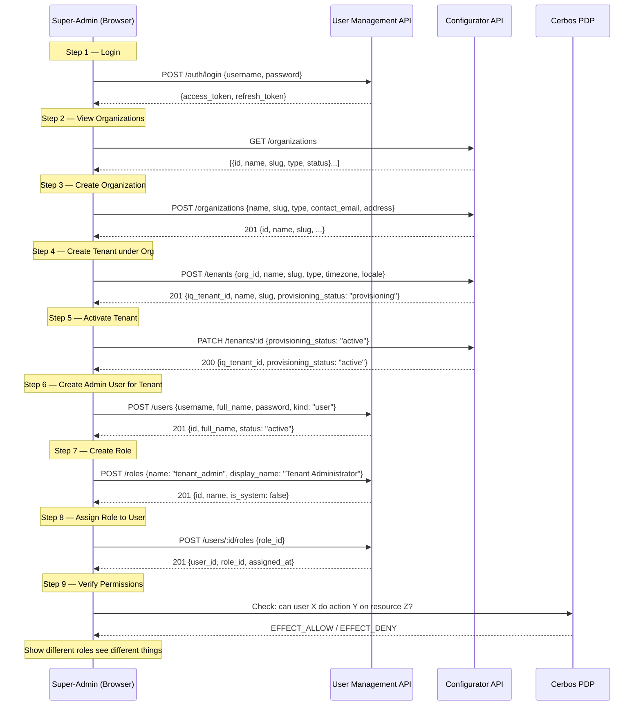

# Sprint Demo: Super-admin tenant provisioning journey

**Type:** Enhancement  
**Sprint:** Current  
**Owner:** Ayush  

## Goal

Demonstrate the core provisioning journey end-to-end in the sprint demo: a super-admin logs in, creates a new hospital organization and tenant, provisions an admin user with roles, and shows the permission model in action.

---

## Demo Flow (Sequence Diagram)



---

## API Coverage

### Already Implemented (spec + code exists)

| # | Endpoint | Module | Status |
|---|----------|--------|--------|
| 1 | `POST /auth/login` | User Management | Spec done, handler scaffolded |
| 2 | `GET /organizations` | Configurator | Spec done, handler done, repo done |
| 3 | `GET /tenants` | Configurator | Spec done, handler done, repo done |
| 4 | `POST /users` | User Management | Spec done, handler scaffolded |
| 5 | `POST /roles` | User Management | Spec done, handler scaffolded |
| 6 | `POST /users/:id/roles` | User Management | Spec done, handler scaffolded |

### Needs Building (spec + implementation)

| # | Endpoint | Module | Priority | Notes |
|---|----------|--------|----------|-------|
| A | `POST /organizations` | Configurator | **P0** | Create org — needed for Step 3 |
| B | `GET /organizations/:id` | Configurator | **P0** | Single org detail |
| C | `PATCH /organizations/:id` | Configurator | P1 | Update org fields |
| D | `POST /tenants` | Configurator | **P0** | Create tenant — needed for Step 4 |
| E | `GET /tenants/:id` | Configurator | **P0** | Single tenant detail |
| F | `PATCH /tenants/:id` | Configurator | **P0** | Update status — needed for Step 5 |

### Deliberately Deferred (Sprint 2+)

| Feature | Reason |
|---------|--------|
| Module enablement (`tenant_modules` table) | Lead directive: tables step-by-step |
| Feature flag overrides | Requires Master Data projection sync |
| Module configuration (config schemas) | Requires projection tables |
| Integration profiles (ABDM, analyzers) | Not needed for provisioning demo |

---

## Detailed API Contracts (New Endpoints)

### POST /api/configurator/v1/organizations

```json
// Request
{
  "name": "City Hospital",
  "slug": "city-hospital",
  "type": "standalone_hospital",
  "contact_email": "admin@cityhospital.in",
  "contact_phone": "+91-9876543210",
  "address": "123 Health Ave, New Delhi"
}

// Response 201
{
  "data": {
    "id": "uuid",
    "name": "City Hospital",
    "slug": "city-hospital",
    "type": "standalone_hospital",
    "status": "active",
    "contact_email": "admin@cityhospital.in",
    "contact_phone": "+91-9876543210",
    "address": "123 Health Ave, New Delhi",
    "created_at": "2026-05-04T10:00:00Z",
    "updated_at": "2026-05-04T10:00:00Z"
  }
}
```

### POST /api/configurator/v1/tenants

```json
// Request
{
  "org_id": "uuid (from org created above)",
  "name": "City Hospital Main",
  "slug": "city-hospital-main",
  "type": "full_platform",
  "data_isolation_level": "shared",
  "cerbos_scope_key": "city-hospital-main",
  "timezone": "Asia/Kolkata",
  "locale": "en-IN"
}

// Response 201
{
  "data": {
    "iq_tenant_id": "uuid",
    "org_id": "uuid",
    "name": "City Hospital Main",
    "slug": "city-hospital-main",
    "type": "full_platform",
    "provisioning_status": "provisioning",
    "data_isolation_level": "shared",
    "cerbos_scope_key": "city-hospital-main",
    "timezone": "Asia/Kolkata",
    "locale": "en-IN",
    "created_at": "2026-05-04T10:00:00Z",
    "updated_at": "2026-05-04T10:00:00Z"
  }
}
```

### PATCH /api/configurator/v1/tenants/:id

```json
// Request (partial update)
{
  "provisioning_status": "active"
}

// Response 200
{ "data": { /* full tenant object with updated fields */ } }
```

### GET /api/configurator/v1/organizations/:id

```json
// Response 200
{ "data": { /* full Organization object */ } }

// Response 404
{ "error": "not_found", "message": "Organization not found" }
```

### GET /api/configurator/v1/tenants/:id

```json
// Response 200
{ "data": { /* full Tenant object */ } }

// Response 404
{ "error": "not_found", "message": "Tenant not found" }
```

---

## Task Breakdown

### Backend (must-have for demo)

- [ ] **Configurator: Add CRUD endpoints to OpenAPI spec** — POST /organizations, GET /organizations/:id, POST /tenants, GET /tenants/:id, PATCH /organizations/:id, PATCH /tenants/:id
- [ ] **Configurator: Implement create organization use-case + handler**
- [ ] **Configurator: Implement get-by-id for org and tenant**
- [ ] **Configurator: Implement create tenant use-case + handler** (validates org_id exists, slug unique, sets provisioning_status=provisioning)
- [ ] **Configurator: Implement patch tenant handler** (status transitions, field updates)
- [ ] **User Management: Implement login handler** (authenticateLocal use-case → JWT pair)
- [ ] **User Management: Implement createUser handler** (hash password, insert user + credentials)
- [ ] **User Management: Implement createRole + assignRole handlers**
- [ ] **Auth: Seed a super-admin user** for demo login (migration or seed script)

### Backend (stretch)

- [ ] Cerbos policy files for tenant_admin vs doctor vs nurse (show permission differences)
- [ ] `GET /users/:id/permissions` — returns effective permissions for a user (calls Cerbos)

### Frontend (stretch goal)

- [ ] Super-admin layout + sidebar navigation
- [ ] Organizations list page (DataTable)
- [ ] Create Organization dialog/page
- [ ] Tenants list page with org filter
- [ ] Create Tenant wizard (2-step: org details → tenant details)
- [ ] Tenant detail page (overview tab)
- [ ] Users list within tenant context
- [ ] Create User + Assign Role flow

---

## Demo Script (Talking Points)

1. **"Platform operator logs in"** — show JWT-based auth, token handler pattern
2. **"Creates a new hospital"** — org + tenant separation, multi-tenancy
3. **"Provisions admin user"** — username-primary identity model (not email-first)
4. **"Configures roles"** — custom roles per tenant, not hardcoded
5. **"Shows permission flexibility"** — same API, different responses based on role (Cerbos)
6. **"Architecture wins"** — modular, each module owns its schema, no cross-module coupling

---

## Reference

- Configurator LLD: `docs/architecture/lld/configurator/01-schema-design.md`
- User Management LLD: `docs/architecture/lld/user-management/01-schema-design.md`
- OpenAPI specs: `specs/openapi/configurator.v1.yaml`, `specs/openapi/user-management.v1.yaml`
- IQSandbox reference (UI flow only): super-admin module CreateTenantWizard (3-step wizard with org details, plan & modules, admin user provisioning)
