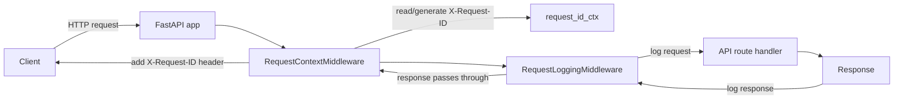

# Request Logging And Request ID Explanation

This document explains the logging/request-id code in the `master-data` FastAPI
service. It is written for someone new to FastAPI and Python.

Files covered:

- `app/core/request_context.py`
- `app/core/logging.py`
- `app/middleware/request_context.py`
- `app/middleware/request_logging.py`
- `app/main.py` middleware flow

## Big Picture

When an HTTP request enters the service, we want:

1. Every request to have an `X-Request-ID`.
2. If the caller already sent `X-Request-ID`, reuse it.
3. If not sent, generate a new UUID.
4. Put that request id into the response header.
5. Make every log line include the same request id.
6. Log the incoming request URL, headers, and body.
7. Log the outgoing response status, headers, body, and duration.

The flow is:



## Why This Much Code For Logging?

Simple logging is easy:

```python
logger.info("request received")
```

But request/response logging in an ASGI/FastAPI app needs extra care because:

- Requests are async. Multiple requests run at the same time.
- We must keep the correct `request_id` per request, without mixing requests.
- Request bodies are streams. If middleware reads the body, the route handler
  may not be able to read it later unless we replay it.
- Response bodies are also streamed in chunks. Middleware must capture chunks
  while still sending them to the client.
- Headers can contain secrets like `Authorization` and `Cookie`, so they must
  be redacted.
- Bodies can be huge or binary, so we truncate and avoid decoding binary data.
- Some routes like `/docs` and `/openapi.json` should not produce noisy logs.
- Uvicorn, FastAPI, tests, and our own code all use Python logging differently.
  We need one place where every `LogRecord` gets `request_id`.

So the code is not just "print request and response". It is handling async
streaming, safety, redaction, truncation, and correlation.

## Important FastAPI / ASGI Concepts

FastAPI runs on ASGI. ASGI apps receive three things:

```python
async def app(scope, receive, send):
    ...
```

- `scope`: metadata about the connection/request, like path, method, headers.
- `receive`: async function used to read request body chunks.
- `send`: async function used to send response messages back to the client.

Middleware wraps the app:

```python
await self.app(scope, receive, send)
```

If middleware wants to inspect or change the request, it works with `scope` and
`receive`.

If middleware wants to inspect or change the response, it wraps `send`.

## Middleware Order In `app/main.py`

Relevant code:

```python
app.add_middleware(BearerAuthContextMiddleware)
app.add_middleware(RequestLoggingMiddleware)
app.add_middleware(RequestContextMiddleware)
```

Important FastAPI detail:

- The last middleware added runs first on the way in.
- The first middleware added runs last on the way in.

So the runtime order is:

```text
RequestContextMiddleware
  RequestLoggingMiddleware
    BearerAuthContextMiddleware
      API route
```

This is intentional.

`RequestContextMiddleware` must run first because it creates/binds the
`request_id`. Then `RequestLoggingMiddleware` can log request and response lines
that already contain the same `request_id`.

## `app/core/request_context.py`

This file stores the current request id in a Python `ContextVar`.

A `ContextVar` is like "request-local storage" for async Python. Each request
gets its own value, even when many requests run concurrently.

### Lines 1-5

```python
"""Request-scoped correlation id via ContextVar (bound by RequestContextMiddleware)."""

from __future__ import annotations

from contextvars import ContextVar, Token
```

- The docstring explains the purpose of the file.
- `from __future__ import annotations` makes type annotations cheaper and more
  flexible.
- `ContextVar` stores a value per async context.
- `Token` is returned when setting a value. We use it later to reset the old
  value safely.

### Line 7

```python
REQUEST_ID_HEADER = "x-request-id"
```

This constant stores the header name. Lowercase is used because HTTP header
names are case-insensitive.

### Line 9

```python
request_id_ctx: ContextVar[str | None] = ContextVar("request_id", default=None)
```

This creates the actual context variable.

- The value is either `str` or `None`.
- Default is `None`, meaning "no request id is currently bound".
- During a request, middleware sets this to the request id.

### Lines 12-14

```python
def get_request_id() -> str | None:
    """Return the current HTTP request id, if inside a request handled by middleware."""
    return request_id_ctx.get()
```

This function reads the current request id.

Any code can call `get_request_id()`:

- logging setup
- request logging middleware
- service code
- future HTTP client code

If called outside a request, it returns `None`.

### Lines 17-19

```python
def set_request_id(value: str) -> Token[str | None]:
    """Bind ``value`` for the current async context; returns token for ``reset_request_id``."""
    return request_id_ctx.set(value)
```

This stores the request id for the current async request.

It returns a token. The token remembers the previous state.

### Lines 22-24

```python
def reset_request_id(token: Token[str | None]) -> None:
    """Restore previous ContextVar state after the request completes."""
    request_id_ctx.reset(token)
```

This restores the old context state after the request is finished.

This is important because servers reuse worker threads/event loops. Without
resetting, a future request could accidentally see the previous request id.

## `app/middleware/request_context.py`

This middleware handles `X-Request-ID`.

It:

- reads incoming `X-Request-ID`
- validates it
- generates a UUID if missing/invalid
- stores it in `request.state.request_id`
- stores it in the `ContextVar`
- adds it back to the response headers

### Lines 1-5

```python
"""Runs on every HTTP request: ``request.state.request_id`` and ``X-Request-ID`` header.

Reads inbound ``X-Request-ID`` when present and valid; otherwise generates a UUID,
and echoes it on the response so callers can correlate requests across services.
"""
```

This explains what the middleware does.

`request.state` is FastAPI/Starlette's per-request storage. Route handlers can
access it with:

```python
request.state.request_id
```

### Lines 7-14

```python
from __future__ import annotations

import uuid
from collections.abc import Iterable

from starlette.types import ASGIApp, Message, Receive, Scope, Send

from app.core.request_context import reset_request_id, set_request_id
```

- `uuid` creates a new unique request id if missing.
- `Iterable` is used for typing header lists.
- `ASGIApp`, `Message`, `Receive`, `Scope`, `Send` are Starlette ASGI types.
- `set_request_id` and `reset_request_id` bind/reset the `ContextVar`.

### Lines 16-18

```python
_REQUEST_ID_HEADER_LOWER = b"x-request-id"
_MAX_REQUEST_ID_LEN = 256
```

ASGI headers are stored as bytes:

```python
[(b"host", b"localhost:8010"), (b"x-request-id", b"abc")]
```

So the header constant is bytes.

The max length prevents someone from sending a very large header value and
polluting logs.

### Lines 21-23

```python
def _parse_headers(headers: Iterable[tuple[bytes, bytes]]) -> dict[bytes, bytes]:
    """Lowercase header names for lookup."""
    return {name.lower(): value for name, value in headers}
```

This converts a list of ASGI headers into a dictionary.

Example:

```python
[(b"X-Request-ID", b"abc")]
```

becomes:

```python
{b"x-request-id": b"abc"}
```

This makes lookup easy and case-insensitive.

### Lines 26-36

```python
def _read_incoming_request_id(scope: Scope) -> str | None:
    raw = scope.get("headers") or []
    parsed = _parse_headers(raw)
    value = parsed.get(_REQUEST_ID_HEADER_LOWER)
    if value is None:
        return None
    try:
        text = value.decode("utf-8").strip()
    except UnicodeDecodeError:
        return None
    return text if text else None
```

This reads `X-Request-ID` from the request.

Step by step:

1. `scope.get("headers")` gets raw ASGI headers.
2. `_parse_headers(raw)` lowercases header names.
3. `parsed.get(b"x-request-id")` finds the request id header.
4. If missing, return `None`.
5. Decode bytes to string using UTF-8.
6. `strip()` removes surrounding whitespace.
7. If decoding fails, return `None`.
8. If the final string is empty, return `None`.

### Lines 39-46

```python
def _is_valid_request_id(value: str | None) -> bool:
    if value is None or len(value) > _MAX_REQUEST_ID_LEN:
        return False
    # printable ASCII only (no newlines/control chars)
    for ch in value:
        if ord(ch) < 32 or ord(ch) > 126:
            return False
    return True
```

This validates the request id.

It rejects:

- `None`
- values longer than 256 characters
- control characters like newline
- non-ASCII characters

Why? Because request id goes into response headers and logs. Newlines/control
characters can break logs or create header injection issues.

### Lines 49-53

```python
class RequestContextMiddleware:
    """Pure ASGI middleware for request id propagation."""

    def __init__(self, app: ASGIApp) -> None:
        self.app = app
```

This defines the middleware class.

FastAPI passes the next app/middleware into `__init__`. We store it as
`self.app` so we can call it later.

### Lines 55-58

```python
async def __call__(self, scope: Scope, receive: Receive, send: Send) -> None:
    if scope["type"] != "http":
        await self.app(scope, receive, send)
        return
```

ASGI can handle more than HTTP, for example websocket or lifespan events.

This middleware only works on HTTP requests. For anything else, it passes
through unchanged.

### Lines 60-63

```python
incoming = _read_incoming_request_id(scope)
request_id = (
    incoming if _is_valid_request_id(incoming) else str(uuid.uuid4())
)
```

This is the core rule:

- If incoming `X-Request-ID` is valid, reuse it.
- Otherwise generate a new UUID.

Example generated id:

```text
8694e9fd-f0f8-4170-8f27-f4739c15950c
```

### Lines 65-66

```python
scope.setdefault("state", {})
scope["state"]["request_id"] = request_id
```

This puts the id into request state.

Inside a FastAPI endpoint you can read:

```python
request.state.request_id
```

### Line 68

```python
token = set_request_id(request_id)
```

This puts the id into the `ContextVar`.

Now any logger record created during this request can get the same id.

### Lines 70-75

```python
async def send_with_request_id(message: Message) -> None:
    if message["type"] == "http.response.start":
        headers = list(message.get("headers", []))
        headers.append((b"x-request-id", request_id.encode("utf-8")))
        message["headers"] = headers
    await send(message)
```

This wraps the ASGI `send` function.

When FastAPI starts sending a response, ASGI sends a message like:

```python
{"type": "http.response.start", "status": 200, "headers": [...]}
```

The middleware intercepts that message and appends:

```python
(b"x-request-id", request_id.encode("utf-8"))
```

Then it calls the original `send(message)` so the response continues to the
client.

### Lines 77-80

```python
try:
    await self.app(scope, receive, send_with_request_id)
finally:
    reset_request_id(token)
```

This calls the next middleware/app.

Notice we pass `send_with_request_id`, not the original `send`. That is how this
middleware modifies the response headers.

`finally` runs whether the request succeeds or fails. It resets the `ContextVar`
so the next request does not inherit this request id.

## `app/core/logging.py`

This file configures Python logging so every log record has `request_id`.

### Lines 1-6

```python
"""Logging configuration: every record carries the current ``request_id``.

A ``LogRecord`` factory stamps ``record.request_id`` from
``request_id_ctx`` at creation time, so all handlers (our own, uvicorn's,
pytest's ``caplog``) see the field. Outside a request the value is ``"-"``.
"""
```

This explains the strategy.

Python logging creates a `LogRecord` object every time you call:

```python
logger.info("hello")
```

We customize that record creation so each record gets:

```python
record.request_id = current_request_id
```

### Lines 8-14

```python
from __future__ import annotations

import logging
import sys

from app.core.config import get_settings
from app.core.request_context import get_request_id
```

- `logging` is Python's standard logging library.
- `sys.stdout` is where logs are printed.
- `get_settings()` gives log level like `INFO` or `DEBUG`.
- `get_request_id()` reads the current request id from the `ContextVar`.

### Lines 16-17

```python
_LOG_FORMAT = "%(asctime)s %(levelname)s [%(request_id)s] %(name)s: %(message)s"
_DATE_FORMAT = "%Y-%m-%dT%H:%M:%S%z"
```

The log output format.

Example:

```text
2026-05-07T18:15:29+0530 INFO [8694e9fd...] app.requests: --> POST /modules
```

Meaning:

- `%(asctime)s`: timestamp
- `%(levelname)s`: INFO, DEBUG, ERROR, etc.
- `[%(request_id)s]`: the request id
- `%(name)s`: logger name
- `%(message)s`: actual message

### Lines 19-20

```python
_OUR_HANDLER_ATTR = "_master_data_logging_handler"
_FACTORY_INSTALLED = False
```

`_OUR_HANDLER_ATTR` marks the handler we create, so repeated calls to
`configure_logging()` do not add duplicate handlers.

`_FACTORY_INSTALLED` prevents wrapping the logging factory multiple times.

### Lines 23-37: `_install_record_factory`

```python
def _install_record_factory() -> None:
    """Wrap the active LogRecord factory once so every record gets ``request_id``."""
    global _FACTORY_INSTALLED
    if _FACTORY_INSTALLED:
        return
    base_factory = logging.getLogRecordFactory()
```

This starts a helper function.

Python logging has a factory function that creates `LogRecord` objects.

We first get the existing factory:

```python
base_factory = logging.getLogRecordFactory()
```

Then we define our wrapper:

```python
def factory(*args: object, **kwargs: object) -> logging.LogRecord:
    record = base_factory(*args, **kwargs)
    rid = get_request_id()
    record.request_id = rid if rid is not None else "-"
    return record
```

Step by step:

1. Call the original factory to create a normal `LogRecord`.
2. Read the current request id from the `ContextVar`.
3. Put it onto the record as `record.request_id`.
4. Use `"-"` when there is no active request.
5. Return the modified record.

Finally:

```python
logging.setLogRecordFactory(factory)
_FACTORY_INSTALLED = True
```

This tells Python logging: "from now on, use our factory".

This is why even logs from `module_service.py`, `uvicorn.access`, or other
loggers show the request id.

### Lines 40-66: `configure_logging`

```python
def configure_logging() -> None:
    settings = get_settings()
    raw_level = settings.log_level
    level = raw_level.upper() if isinstance(raw_level, str) else raw_level
```

This reads the configured log level.

Example:

- env `MASTER_DATA_LOG_LEVEL=INFO`
- `settings.log_level == "INFO"`
- `level == "INFO"`

```python
_install_record_factory()
```

This ensures every log record gets `request_id`.

```python
formatter = logging.Formatter(_LOG_FORMAT, datefmt=_DATE_FORMAT)
root = logging.getLogger()
root.setLevel(level)
```

- Creates a formatter using `_LOG_FORMAT`.
- Gets the root logger.
- Sets the root log level.

```python
own = next(
    (h for h in root.handlers if getattr(h, _OUR_HANDLER_ATTR, False)),
    None,
)
```

This searches existing root handlers for our own handler.

Why? In development reloads/tests, `configure_logging()` can run more than once.
If we add a new handler every time, each log line appears multiple times.

```python
if own is None:
    own = logging.StreamHandler(stream=sys.stdout)
    setattr(own, _OUR_HANDLER_ATTR, True)
    root.addHandler(own)
```

If our handler does not exist, create one that prints to stdout.

```python
own.setLevel(level)
own.setFormatter(formatter)
```

Set the handler level and format.

```python
for name in ("uvicorn", "uvicorn.error", "uvicorn.access", "fastapi", "sqlalchemy.engine"):
    lg = logging.getLogger(name)
    lg.handlers = []
    lg.propagate = True
```

This makes common library loggers send logs to the root logger.

`propagate = True` means:

```text
uvicorn.access logger -> root logger -> our handler/formatter
```

That is why `uvicorn.access` logs also show `[request_id]`.

### Lines 69-78: `RequestIdFilter`

```python
class RequestIdFilter(logging.Filter):
    """Stamp ``record.request_id`` on records created before ``configure_logging``."""

    def filter(self, record: logging.LogRecord) -> bool:
        if not hasattr(record, "request_id"):
            rid = get_request_id()
            record.request_id = rid if rid is not None else "-"
        return True
```

This is a fallback filter.

Currently the main solution is the `LogRecord` factory. The filter exists for
backward compatibility or any future code that wants to manually attach a
logging filter.

It returns `True`, meaning "keep this log record".

## `app/middleware/request_logging.py`

This middleware logs the actual request and response.

It is longer because it deals with:

- request body streaming
- response body streaming
- redaction
- truncation
- binary content
- skip paths
- exception logging

### Lines 1-13

The docstring describes what the middleware logs:

- request method/path/query/client
- request headers
- request body
- response status
- response duration
- response headers
- response body

It also says this middleware should sit inside `RequestContextMiddleware`, so
every log line already has `request_id`.

### Lines 15-24

```python
from __future__ import annotations

import json
import logging
import time
from collections.abc import Iterable

from starlette.types import ASGIApp, Message, Receive, Scope, Send

from app.core.config import get_settings
```

- `json` formats headers cleanly in terminal logs.
- `logging` writes logs.
- `time.perf_counter()` measures request duration.
- ASGI types describe `scope`, `receive`, `send`, and messages.
- `get_settings()` reads logging configuration.

### Line 26

```python
logger = logging.getLogger("app.requests")
```

This creates a named logger.

Your terminal shows:

```text
app.requests: --> POST /api/v1/master-data/modules ...
```

because the logger name is `app.requests`.

### Lines 28-38

```python
_REDACTED_HEADERS = frozenset(
    {
        "authorization",
        "proxy-authorization",
        "cookie",
        "set-cookie",
        "x-api-key",
        "x-auth-token",
    }
)
_REDACTED_VALUE = "[REDACTED]"
```

These are headers we do not print.

For example:

```text
Authorization: Bearer secret-token
```

becomes:

```text
"authorization": "[REDACTED]"
```

### Lines 41-53: `_decode_headers`

```python
def _decode_headers(headers: Iterable[tuple[bytes, bytes]]) -> dict[str, str]:
    out: dict[str, str] = {}
    for name, value in headers:
        try:
            n = name.decode("latin-1").lower()
            v = value.decode("latin-1")
        except UnicodeDecodeError:
            continue
        if n in _REDACTED_HEADERS:
            v = _REDACTED_VALUE
        out[n] = f"{out[n]}, {v}" if n in out else v
    return out
```

ASGI headers are bytes, so this converts them into strings.

It:

1. Loops over each `(name, value)` header pair.
2. Decodes name and value using `latin-1`.
3. Lowercases header names.
4. Skips invalid headers if decode fails.
5. Replaces secret headers with `[REDACTED]`.
6. If the same header appears multiple times, joins values with comma.
7. Returns a normal dictionary.

### Lines 56-60: `_is_text_like`

```python
def _is_text_like(content_type: str | None) -> bool:
    if not content_type:
        return False
    ct = content_type.lower()
    return any(token in ct for token in ("json", "text", "xml", "form-urlencoded", "yaml"))
```

This decides whether a body is safe to decode as text.

Examples considered text:

- `application/json`
- `text/plain`
- `application/xml`
- `application/x-www-form-urlencoded`
- `application/yaml`

Examples not considered text:

- image files
- PDFs
- unknown binary streams

### Lines 63-74: `_format_body`

```python
def _format_body(body: bytes, content_type: str | None, max_bytes: int) -> str:
    if not body:
        return ""
    if not _is_text_like(content_type):
        return f"<binary {len(body)} bytes>"
    truncated = len(body) > max_bytes
    snippet = body[:max_bytes]
    try:
        text = snippet.decode("utf-8", errors="replace")
    except Exception:
        return f"<undecodable {len(body)} bytes>"
    return f"{text} ...[truncated {len(body)} bytes]" if truncated else text
```

This prepares a request or response body for logging.

Step by step:

1. Empty body returns empty string.
2. Non-text content returns `<binary N bytes>`.
3. If text body is larger than `max_bytes`, take only first `max_bytes`.
4. Decode bytes to UTF-8 text.
5. `errors="replace"` means invalid bytes become replacement characters instead
   of crashing.
6. Add a truncation marker if needed.

### Lines 77-88

```python
def _normalize_skip_paths(raw: str) -> tuple[str, ...]:
    return tuple(p.strip() for p in raw.split(",") if p.strip())
```

Converts env string like:

```text
/docs,/redoc,/openapi.json
```

into:

```python
("/docs", "/redoc", "/openapi.json")
```

```python
def _format_headers(headers: dict[str, str]) -> str:
    if not headers:
        return "{}"
    return json.dumps(dict(sorted(headers.items())), ensure_ascii=False)
```

This formats headers for terminal logs.

Sorting makes logs stable and easier to read.

```python
def _format_body_inline(body_text: str) -> str:
    return body_text if body_text else "(empty)"
```

This prints `(empty)` when there is no body.

### Lines 91-92: `_should_skip`

```python
def _should_skip(path: str, skip_paths: tuple[str, ...]) -> bool:
    return any(path == p or path.startswith(p + "/") for p in skip_paths)
```

This checks if a path should skip request logging.

If skip path is `/docs`, then these are skipped:

- `/docs`
- `/docs/...`

But `/docs2` is not skipped.

### Lines 95-118: `_drain_request_body`

```python
async def _drain_request_body(
    receive: Receive, max_bytes: int
) -> tuple[bytes, bool, list[Message]]:
```

This is one of the most important functions.

In ASGI, the request body is read from `receive()`. It can arrive in chunks.

If middleware reads the body and does not replay it, the route handler will see
an empty body. That is why this function returns both:

- captured body bytes for logging
- all raw ASGI messages, so we can replay them later

Inside the loop:

```python
msg = await receive()
messages.append(msg)
```

Read one ASGI message and save it.

```python
if msg["type"] != "http.request":
    break
```

If it is not a request-body message, stop.

```python
chunk = msg.get("body", b"")
```

Get this body chunk.

```python
remaining = max_bytes - len(captured)
```

Only keep up to `max_bytes`.

```python
if not msg.get("more_body", False):
    break
```

If ASGI says there is no more body, stop.

Finally:

```python
return bytes(captured), truncated, messages
```

Returns:

- body prefix
- whether truncation happened
- original messages for replay

### Lines 121-130: `_make_replay_receive`

```python
def _make_replay_receive(messages: list[Message]) -> Receive:
    iterator = iter(messages)

    async def replay() -> Message:
        try:
            return next(iterator)
        except StopIteration:
            return {"type": "http.disconnect"}

    return replay
```

This creates a replacement `receive()` function.

Why needed?

Because the middleware already consumed the body from the real `receive()`.
FastAPI route handlers still need to read that body to parse JSON/Pydantic
models.

So we replay the saved messages back to FastAPI.

Without this function, POST/PUT request bodies would break.

### Lines 133-142: class init

```python
class RequestLoggingMiddleware:
    """Pure ASGI middleware: log incoming request and outgoing response with bodies."""

    def __init__(self, app: ASGIApp) -> None:
        self.app = app
        settings = get_settings()
        self._log_request_body = settings.log_request_body
        self._log_response_body = settings.log_response_body
        self._max_body_bytes = max(0, int(settings.log_max_body_bytes))
        self._skip_paths = _normalize_skip_paths(settings.log_skip_paths)
```

FastAPI creates middleware once at startup.

Here we:

- store the next app in `self.app`
- read settings
- decide whether to log request body
- decide whether to log response body
- set max body size
- parse skip paths

### Lines 144-152: start of request handling

```python
async def __call__(self, scope: Scope, receive: Receive, send: Send) -> None:
    if scope["type"] != "http":
        await self.app(scope, receive, send)
        return

    path = scope.get("path", "")
    if _should_skip(path, self._skip_paths):
        await self.app(scope, receive, send)
        return
```

This is the ASGI middleware entry point.

It ignores non-HTTP events.

Then it checks skip paths. If the path should be skipped, it passes through
without request/response logging.

### Lines 154-160: request metadata

```python
method = scope.get("method", "")
query = scope.get("query_string", b"").decode("latin-1")
client = scope.get("client")
client_str = f"{client[0]}:{client[1]}" if client else "-"

request_headers = _decode_headers(scope.get("headers") or [])
content_type = request_headers.get("content-type")
```

This extracts request details:

- HTTP method
- query string
- client IP/port
- headers
- content type

### Lines 162-169: request body capture

```python
request_body_text = ""
replay_receive = receive
if self._log_request_body and self._max_body_bytes > 0:
    captured, truncated, messages = await _drain_request_body(receive, self._max_body_bytes)
    replay_receive = _make_replay_receive(messages)
    request_body_text = _format_body(captured, content_type, self._max_body_bytes)
    if truncated and not request_body_text.endswith("bytes]"):
        request_body_text += " ...[truncated]"
```

If request body logging is enabled:

1. Drain the body from `receive`.
2. Save the original messages.
3. Create `replay_receive` so FastAPI can read the body again.
4. Format the captured bytes as readable text.
5. Add truncation marker if needed.

### Lines 171-187: request log line

```python
logger.info(
    "--> %s %s%s client=%s headers=%s body=%s",
    method,
    path,
    f"?{query}" if query else "",
    client_str,
    _format_headers(request_headers),
    _format_body_inline(request_body_text),
    extra={...},
)
```

This prints the incoming request line.

Example:

```text
INFO [8694...] app.requests: --> POST /api/v1/master-data/modules client=127.0.0.1:37342 headers={...} body={...}
```

The `extra={...}` part attaches structured fields to the log record. Plain
terminal logs show the formatted message. A future JSON log shipper could read
the extra fields directly.

### Lines 189-193: response capture state

```python
response_status = 0
response_headers_raw: list[tuple[bytes, bytes]] = []
response_body = bytearray()
response_truncated = False
capture_response = self._log_response_body and self._max_body_bytes > 0
```

These variables collect response information as the response is sent.

`bytearray()` is used because response chunks may arrive one by one.

### Lines 195-210: `send_wrapper`

```python
async def send_wrapper(message: Message) -> None:
    nonlocal response_status, response_headers_raw, response_truncated
```

This wraps ASGI `send`.

`nonlocal` means this inner function can update variables from the outer
function.

```python
if message["type"] == "http.response.start":
    response_status = int(message.get("status", 0))
    response_headers_raw = list(message.get("headers", []))
```

When the response starts, capture status and headers.

```python
elif message["type"] == "http.response.body" and capture_response:
    chunk = message.get("body", b"")
```

When response body chunks are sent, capture up to max bytes.

```python
await send(message)
```

This is critical. Even though we inspect the response, we still pass the message
to the real client.

Without this line, the client would never receive the response.

### Lines 212-221: run downstream app and handle errors

```python
started = time.perf_counter()
try:
    await self.app(scope, replay_receive, send_wrapper)
except Exception:
    duration_ms = round((time.perf_counter() - started) * 1000, 2)
    logger.exception(
        "<!! %s %s failed after %.2fms", method, path, duration_ms,
        extra={"method": method, "path": path, "duration_ms": duration_ms},
    )
    raise
```

This starts the timer, calls the next middleware/app, and logs exceptions.

Important:

- Uses `replay_receive`, not the original `receive`, if body was drained.
- Uses `send_wrapper`, not original `send`, so response can be captured.
- `logger.exception(...)` logs stack trace.
- `raise` re-raises the exception so FastAPI error handling still works.

### Lines 223-233: response formatting

```python
duration_ms = round((time.perf_counter() - started) * 1000, 2)
response_headers = _decode_headers(response_headers_raw)
response_body_text = ""
if capture_response:
    response_body_text = _format_body(
        bytes(response_body),
        response_headers.get("content-type"),
        self._max_body_bytes,
    )
    if response_truncated and not response_body_text.endswith("bytes]"):
        response_body_text += " ...[truncated]"
```

After the app finishes:

1. Calculate request duration.
2. Decode response headers.
3. Convert captured response body to text/binary marker.
4. Add truncation marker if needed.

### Lines 235-251: response log line

```python
logger.info(
    "<-- %d %s %s %.2fms headers=%s body=%s",
    response_status,
    method,
    path,
    duration_ms,
    _format_headers(response_headers),
    _format_body_inline(response_body_text),
    extra={...},
)
```

This prints the outgoing response log.

Example:

```text
INFO [8694...] app.requests: <-- 201 POST /api/v1/master-data/modules 316.84ms headers={...} body={...}
```

Again, `extra={...}` gives structured fields for future JSON logging.

## End-To-End Runtime Flow

For this request:

```http
POST /api/v1/master-data/modules
X-Request-ID: abc-123
Content-Type: application/json

{"name": "ips", "slug": "ips"}
```

The runtime flow is:

1. Uvicorn receives the HTTP request.
2. FastAPI calls the outer middleware: `RequestContextMiddleware`.
3. `RequestContextMiddleware` reads `X-Request-ID`.
4. It validates `abc-123`.
5. It stores `abc-123` in:
   - `scope["state"]["request_id"]`
   - `request_id_ctx` ContextVar
6. It wraps `send` so the response gets `x-request-id: abc-123`.
7. It calls the next middleware: `RequestLoggingMiddleware`.
8. `RequestLoggingMiddleware` reads method/path/query/client/headers.
9. It drains the request body for logging.
10. It creates `replay_receive` so FastAPI can read the body again.
11. It logs:

```text
--> POST /api/v1/master-data/modules client=... headers=... body=...
```

12. It wraps `send` to capture response status/headers/body.
13. It calls the route handler.
14. Route handler creates the module and returns response.
15. `send_wrapper` captures response status, headers, and body chunks.
16. Response is still sent to the client.
17. Middleware calculates duration.
18. It logs:

```text
<-- 201 POST /api/v1/master-data/modules 316.84ms headers=... body=...
```

19. Control returns to `RequestContextMiddleware`.
20. `RequestContextMiddleware` adds the response header:

```http
x-request-id: abc-123
```

21. `RequestContextMiddleware` resets the ContextVar.

## Why `print()` Is Not Good Here

`print()` only writes plain text to stdout.

It does not automatically include:

- log level
- timestamp
- module name
- request id
- structured fields
- stack traces
- filtering by log level

With logger:

```python
logger.info("create_module: parent_id=%s slug=%s", parent_id, payload.slug)
```

you get:

```text
2026-05-07T18:15:29+0530 INFO [8694...] app.services.module_service: create_module: parent_id=None slug=ips
```

That log line is much more useful because it has the same request id as the
request/response logs.

## Settings That Control Logging

These live in `app/core/config.py`.

```python
MASTER_DATA_LOG_LEVEL=INFO
MASTER_DATA_LOG_REQUEST_BODY=true
MASTER_DATA_LOG_RESPONSE_BODY=true
MASTER_DATA_LOG_MAX_BODY_BYTES=4096
MASTER_DATA_LOG_SKIP_PATHS=/docs,/redoc,/openapi.json,/favicon.ico
```

Meaning:

- `MASTER_DATA_LOG_LEVEL`: `DEBUG`, `INFO`, `WARNING`, `ERROR`
- `MASTER_DATA_LOG_REQUEST_BODY`: whether request body is logged
- `MASTER_DATA_LOG_RESPONSE_BODY`: whether response body is logged
- `MASTER_DATA_LOG_MAX_BODY_BYTES`: maximum body bytes logged
- `MASTER_DATA_LOG_SKIP_PATHS`: comma-separated paths to skip

## Things To Be Careful About

### 1. Request/response body logging can expose sensitive data

Headers are redacted, but body fields are not currently redacted.

If APIs start receiving passwords, tokens, patient data, or PHI, consider:

- disabling body logs in production
- adding body-field redaction
- logging only metadata

### 2. Large bodies can produce huge logs

`MASTER_DATA_LOG_MAX_BODY_BYTES` protects us by truncating.

### 3. Streaming responses

For streaming responses, this middleware captures the first bytes only and still
passes chunks to the client.

### 4. Middleware order matters

If `RequestLoggingMiddleware` runs before `RequestContextMiddleware`, the logs
will not have the correct request id.

## Quick Mental Model

Think of middleware as nested wrappers:

```python
RequestContextMiddleware(
    RequestLoggingMiddleware(
        BearerAuthContextMiddleware(
            FastAPI routes
        )
    )
)
```

Request path:

```text
Client -> RequestContext -> RequestLogging -> Route
```

Response path:

```text
Route -> RequestLogging -> RequestContext -> Client
```

That is why:

- request id is created first
- request is logged second
- route runs third
- response is logged fourth
- response header gets request id before going to client

