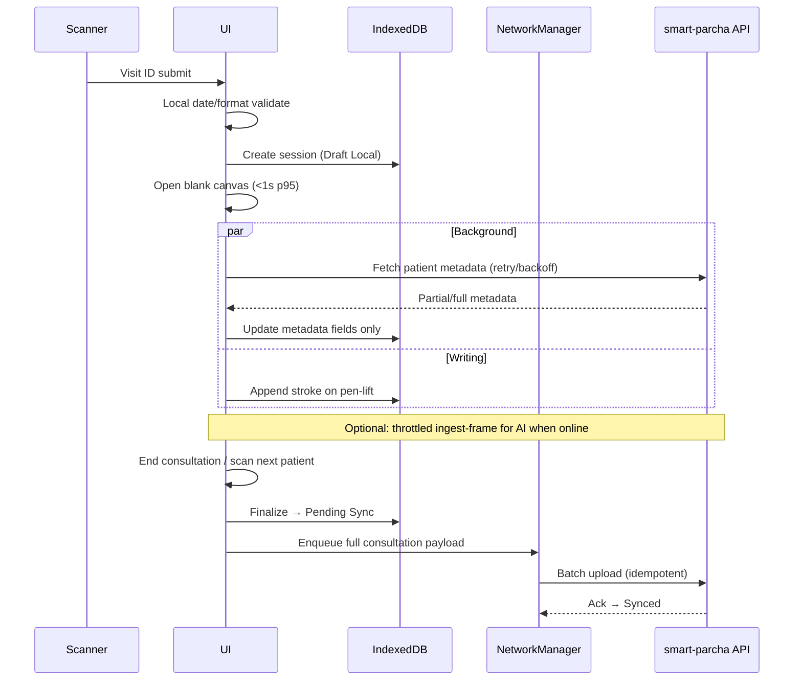

# HIMS Offline-First — Final Approach (Review Draft)

**Status:** For architecture / product review  
**Date:** 2026-06-02  
**Scope:** Smart Parcha (Doctor) as Phase 1; hospital-wide multi-role as Phase 2+  
**Inputs reviewed:** `offlineapprach.md`, `storyoffline1.md`–`storyoffline6.md`, reference capture (`smartparchcurl.json`), monorepo `create-rx` / `registration` / `opd` code paths

### Planned delivery sequence (confirmed)

| Step | What | Where |
|------|------|--------|
| **A — Before offline** | Smart Parcha UI + APIs delivered **in this monorepo** (same app as Create RX / Visit Pad) | `services/web` + backend module per `specs/openapi` |
| **B — Offline epic** | IndexedDB, pen-lift autosave, sync queue (Stories 1–6) | Built on top of Step A in the same codebase |

`smartparchcurl.json` is **reference only**: it documents today’s **legacy middleware service** (`hims-backend-ser`) behaviour (10s full PNG `PATCH`). That service is **not** the target implementation. Offline work assumes Smart Parcha already lives in the monorepo with APIs defined spec-first.

---

## 1. Executive summary

The **user stories (1–6)** define the correct **doctor-critical path**: open canvas instantly on Visit ID, persist locally on pen-lift, sync only after end-of-consultation, with batched background drain. That is the right product contract for a bug-free, low-bandwidth experience.

Your **`offlineapprach.md`** adds important **enterprise patterns** (batch reconnect sync, priorities, temp Visit IDs, local gateway) that must be applied **selectively**:

| Layer | Recommendation |
|-------|----------------|
| **Phase 1 (now)** | Browser PWA pattern: IndexedDB + sync queue + network manager in Smart Parcha UI; align APIs with delta ingest; no hospital gateway yet |
| **Phase 2** | Front desk / nurse offline queues reusing the same client sync library |
| **Phase 3** | Optional on-prem **Local Sync Gateway** for LAN fan-out between desks (your §12–14), not required for Smart Parcha MVP |

**Biggest gap to avoid in monorepo build:** legacy reference sends **~400KB+ PATCH every ~10s** with full base64 canvas pages. The monorepo implementation must **not** copy that pattern. Stories require **pen-lift local save** and **end-of-consultation server sync** when the offline epic starts.

---

## 2. System context (current, reference, and planned)

### 2.1 Reference only — legacy middleware service (`smartparchcurl.json`)

Captured from UAT against a **separate** service (`hims-backend-ser` via API gateway). Use this **only** to understand what **not** to rebuild.

| Item | Legacy reference value |
|------|-------------------------|
| UI route (UAT) | `/hims/create-rx-v2/{visitId}` |
| Save API | `PATCH …/middleware/hims-backend-ser/smart-parcha/{visitId}` |
| Body | `doctorId`, `patientId`, `visitId`, `status`, `parchaContent[]` |
| Page content | `data:image/png;base64,…` (full raster per page) |
| Payload size | **~444 KB** per request (example capture) |
| Cadence | **~every 10s** while writing |
| Secondary | `ingest-frame` (AI pipeline) |

**Do not carry forward:** timer-based full PNG `PATCH` as primary save, no local queue, no pen-lift durability.

### 2.2 Monorepo today — Create RX / Visit Pad (`services/web/src/features/create-rx`)

Baseline consultation UI already in the monorepo (Visit Pad, not Smart Parcha canvas):

| Behavior | Online-only? |
|----------|----------------|
| Open visit | **Yes** — `fetchOpdPrescriptionSession` + `fetchCreateRxVisitContext` before UI (`page.tsx`) |
| Save | Manual — `PUT …/visits/{id}/prescription` |
| End | `POST …/prescription/end` then navigate away |
| IndexedDB / sync queue | **None** |
| Smart Parcha tab | **Not built yet** — coming in same monorepo before offline |

Visit Pad load path is **server-gated** today; Smart Parcha will use the **Story 1** instant-open path when implemented.

### 2.3 Monorepo next — Smart Parcha (before offline epic)

**Planned in this monorepo** (same `services/web` app, shared Create RX shell) **before** offline Stories 1–6:

| Area | Target placement (convention) |
|------|-------------------------------|
| Frontend | `services/web/src/features/smart-parcha/` (tabs alongside Visit Pad in Create RX) |
| Routes | e.g. extend `create-rx` routes or `create-rx-v2` path alias → same route tree |
| API contract | `specs/openapi/smart-parcha.v1.yaml` (or OPD extension) **before** handlers |
| Backend | `modules/opd` and/or dedicated module service per platform module shape |
| Integration | Same `visit_id` / Visit ID as registration + OPD; Cerbos on sync |

**Online-first MVP in monorepo** should already: open canvas on scan, background patient fetch, spec-compliant APIs — **without** copying legacy 10s PNG PATCH. Offline layer (IndexedDB, queue) is **Step B** on this foundation.

### 2.4 Monorepo — Registration / Visit ID

| Topic | Current state | Story assumption |
|-------|---------------|------------------|
| `visit_id` in DB | UUID (`registration.visit`) | Stories use **OP2605310000002** barcode format |
| Slip `visitNumber` | `VIS-{shortId}` from registration id | Stories use **OP + YYMMDD + sequence** |
| Idempotency | `Idempotency-Key` on registration POST | Aligns with Story 5 |
| Smart Parcha on slip | `smartParchaEnabled`, barcode placeholder in templates | Barcode must encode **same** Visit ID doctor scans |

**Action:** Product must confirm **one canonical Visit ID** printed on parcha and stored in monorepo registration/OPD/Smart Parcha APIs (either generate `OP…` at registration time or map UUID ↔ display Visit ID consistently).

### 2.5 Other roles (monorepo)

| Role | Module | Offline today |
|------|--------|----------------|
| Front desk | `features/frontdesk` | Online registration + billing ingest |
| Nurse | `features/nurse` | Loads OPD session from server first |
| Doctor Visit Pad | `create-rx` | Online-first |
| Lab / Pharmacy | Not in Phase 0 scope | N/A |

Your approach doc lists these roles; **only Doctor Smart Parcha** has detailed stories. Other roles need **separate story packs** before sharing one gateway design.

---

## 3. What is strong in `offlineapprach.md` (keep)

1. **Offline-first principle** — UI → local DB first; never UI → wait on API → save.
2. **Batched queue on reconnect** — take N items, pause 1–2s, never `Promise.all(entire queue)`.
3. **Priority tiers** — registration/visit > vitals > canvas/AI > analytics.
4. **Retry backoff** — protects API gateway, DB, Redis under reconnect storms.
5. **Hybrid / server-authoritative Visit ID** for **multi-desk offline registration** (Phase 2).
6. **Local gateway** as optional enterprise topology — valid for Phase 3, not MVP blocker.

---

## 4. Gaps and conflicts (must resolve in review)

### 4.1 Conflicts between approach doc and Stories 1–6

| Topic | `offlineapprach.md` | Stories 1–6 | Resolution |
|-------|---------------------|-------------|------------|
| When server sees canvas | Implied continuous / batch sync | **Only after end-of-consultation** (Story 5) | **Stories win** for consultation payload; optional **thin online ingest** for AI preview only (see §6.3) |
| Autosave trigger | Not specified | **Pen-lift** + safety nets (Story 4) | Replace 10s full PATCH |
| Visit ID offline creation | Temp ID + mapping table | Barcode already has **official** Visit ID; local validation only | Temp IDs **only for front-desk offline registration** epic, not Smart Parcha scan |
| Local multi-machine sync | Gateway / WebSocket LAN | Not in doctor stories | Phase 3; doctor MVP uses **server queue + barcode** |
| Conflict rule | “Latest version wins” | **Last-write-win by client timestamp** + idempotency key (Story 5) | Implement exactly; document server clock vs `deviceTimeAtOpen` flag |
| FHIR / ABDM | Not mentioned | Sync always; **FHIR/ABDM held** until patient resolved (Story 6) | Add to backend acceptance criteria |
| PHI at rest | Local DB per machine | Encrypt with **session-derived key** (Story 3) | Required for MVP |
| AI prescription offline | Not detailed | Online-only generation; offline → server after sync | Keep |

### 4.2 Gaps in Stories (add to backlog)

| Gap | Recommendation |
|-----|----------------|
| **Online AI while writing** | Story 4 says autosave independent of AI cadence; define **optional** low-rate ingest (vector deltas or downscaled frames), capped bandwidth, failure must not affect canvas |
| **`ingest-frame` contract** | OpenAPI in monorepo (`specs/openapi`): idempotency, sequence number, max frame size, 429/backoff |
| **Visit ID ↔ UUID mapping** | Registration/OPD must expose/display the same ID as barcode |
| **Visit Pad + Smart Parcha** | If both enabled: vitals in Visit Pad vs canvas — single consultation record on server, merge rules |
| **Auth offline** | Session refresh grace period; `offline_access` in token; block new login without network, allow continue encrypted local work |
| **Logout with pending sync** | Story 3 open question — **block logout** with explicit “N consultations pending” unless force |
| **Empty consultation** | Story 6 open question — **allow end** but do not enqueue sync if zero strokes and no metadata |
| **Stuck queue head** | Story 5 open question — **retry oldest with cap**, then **skip-after-K-failures** with admin alert, continue newer items |
| **Service Worker** | Optional Phase 1b for asset cache; **not** for PHI sync |
| **Observability** | Metrics listed in Story 5 — implement without PHI in logs |
| **Open Questions in stories** | Close before dev sign-off (table above) |

### 4.3 Gaps in approach doc (add)

| Gap | Add |
|-----|-----|
| Smart Parcha **stroke model** | Vector strokes + revision/version per pen-lift, not PNG blob |
| **P95 bandwidth budget** | See §7 |
| **Module ownership** | Spec in `specs/openapi`; handlers in monorepo module (OPD vs dedicated smart-parcha module) |
| **Cerbos** | Offline = UX only; server enforces on sync |
| **No cross-schema FK** | Sync uses Visit ID + tenant; no local FK to other modules’ tables |
| **2-day cleanup** | Stories use pressure-based eviction of **Synced** rows; align retention policy |

### 4.4 Security note

`smartparchcurl.json` is a **reference capture** and may contain **live Bearer tokens**. Rotate if exposed; use redacted fixtures in repo; do not treat curl host paths as monorepo API URLs.

---

## 5. Target architecture (Phase 1 — Smart Parcha)

### 5.1 Logical components (browser)

```
┌─────────────────────────────────────────────────────────────┐
│ Smart Parcha UI (services/web — same Create RX app as Visit Pad) │
├─────────────────────────────────────────────────────────────┤
│ VisitIdValidator │ Canvas │ PatientFetchWorker │ SaveBadge   │
├─────────────────────────────────────────────────────────────┤
│ ConsultationStore (IndexedDB, encrypted PHI)                 │
│   • consultations by visitId                                 │
│   • stroke_chunks (incremental)                              │
│   • patient_metadata_cache (session scoped)                  │
├─────────────────────────────────────────────────────────────┤
│ SyncQueue (IndexedDB)                                        │
│   • priority, idempotencyKey, payloadRef, status, retries    │
├─────────────────────────────────────────────────────────────┤
│ NetworkManager                                               │
│   • online / degraded / offline                              │
│   • drains queue: batch 5 canvas-related, 1–2s gap           │
│   • pauses AI ingest when offline or queue depth > threshold │
└─────────────────────────────────────────────────────────────┘
          │ HTTPS (when online)
          ▼
┌─────────────────────────────────────────────────────────────┐
│ API Gateway → monorepo smart-parcha / OPD handlers           │
└─────────────────────────────────────────────────────────────┘
```

### 5.2 Data flow (aligned with stories)



### 5.3 Local consultation record (canonical)

Matches Story 3, extended for implementation:

```typescript
interface LocalConsultation {
  visitId: string;                    // barcode key
  localSessionId: string;             // uuid at create
  idempotencyKey: string;             // stable for sync (Story 5)
  deviceId: string;
  deviceTimeAtOpen: string;           // ISO
  consultationStartedAt: string;
  syncStatus: 'draft_local' | 'pending_sync' | 'sync_in_progress' | 'synced' | 'sync_failed';
  lastLocalWriteAt: string;           // LWW (Story 5)
  patient?: { uhid; name; age; gender; vitals };
  strokes: StrokeChunk[];             // incremental
  aiPrescription?: unknown;           // only if generated online
  schemaVersion: number;
}
```

**Not stored locally (Story 3):** medical history, previous prescriptions (re-fetch on recovery).

---

## 6. API and bandwidth strategy (fixes 10s PATCH problem)

### 6.1 Stop doing (legacy reference — do not implement in monorepo)

- `PATCH` **full** `parchaContent` PNG array every 10 seconds as primary durability.
- Treating network save as autosave acknowledgment.

### 6.2 Do instead

| Operation | When | Payload | Purpose |
|-----------|------|---------|---------|
| **Local commit** | Pen-lift, blur, hide, end | Stroke delta (~bytes–KB) | Story 4 durability |
| **Optional `ingest-frame`** | Online only; throttle e.g. 2–5s + coalesce; skip if offline | Small frame or vector batch | AI preview only; failures ignored by UI |
| **`PUT/PATCH` consultation** | **End of consultation** only (Story 5) | Full stroke set + metadata + idempotency key | Authoritative sync |
| **Idempotent retry** | Queue drain | Same idempotency key | No duplicate consultations |

### 6.3 Recommended monorepo API surface (spec-first)

Publish in `specs/openapi` (e.g. `smart-parcha.v1.yaml` or extend `opd.v1.yaml`); implement in monorepo backend module **before** offline queue work:

1. `POST /visits/{visitId}/strokes` — append-only chunks `{ sequence, strokes, clientTimestamp }`
2. `POST /visits/{visitId}/ingest-frame` — optional AI `{ sequence, frameRef | vectorBlob, contentHash }`
3. `PUT /visits/{visitId}/consultation` — end-of-consultation finalize (idempotent)
4. Headers: `Idempotency-Key`, `X-Client-Sequence`, `X-Device-Id`

**Server:** dedupe by `(tenant, visitId, idempotencyKey)` and `(tenant, visitId, sequence)` for strokes/frames.

### 6.4 P95 bandwidth targets (proposed NFRs)

| Metric | Target | Rationale |
|--------|--------|-----------|
| Canvas open (scan → writable) | **< 1s p95** | Story 1 |
| Bytes per pen-lift (local only) | **< 16 KB p95** | Incremental vectors |
| Bytes per minute while writing (online AI path) | **< 200 KB p95** | vs ~2.4 MB/min at 444KB/10s today |
| End-of-consultation upload | **< 2 MB p95** per visit | Full sync once; batch queue |
| Concurrent queue drain | **≤ 5** consultation uploads / 2s pause | Your batch table |
| Reconnect storm | **≤ 30 uploads / minute / device** | Cap with backoff |

---

## 7. Sync queue rules (merged from approach + Story 5)

### 7.1 Priorities

| Priority | Entity | Batch size | Delay after batch |
|----------|--------|------------|-------------------|
| P0 | Ended Smart Parcha consultation | 2 | 2s |
| P1 | OPD prescription / vitals (Visit Pad) | 10 | 1s |
| P2 | Registration / visit create | 10 | 1s |
| P3 | AI ingest frames (optional) | 5 | 2s |
| P4 | Analytics / logs | 20 | 2s |

### 7.2 Retry policy

| Attempt | Delay |
|---------|-------|
| 1 | 5s |
| 2 | 30s |
| 3 | 2m |
| 4+ | 10m (cap); alert if > 24h |

### 7.3 Ordering

- **Default:** oldest-first by enqueue time (Story 5).
- **Stuck head:** after **K** failures (suggest K=10), mark `sync_failed_permanent`, surface admin alert, **continue queue** (resolve Story 5 open question).

### 7.4 Clock skew

- Send `deviceTimeAtOpen`; server flags if `|skew| > threshold` but **does not reject** (Story 5).

### 7.5 Downstream (Story 6)

- Consultation **always stored** on successful sync.
- **FHIR / ABDM / SMS / WhatsApp** only when required patient fields resolved server-side.

---

## 8. Role-based phased plan

### Phase 1 — Doctor Smart Parcha (Stories 1–6) ✅ MVP

**Deliverables:**

- [ ] Visit ID local validator (OP format + today’s date)
- [ ] Instant canvas; background patient fetch with partial UI
- [ ] IndexedDB + encryption + pen-lift autosave + recovery
- [ ] End/consultation switcher per Story 6 decision table
- [ ] Pending sync queue + batch drain
- [ ] Replace 10s PNG PATCH with model in §6
- [ ] OpenAPI spec + monorepo backend handlers (Step A)
- [ ] Telemetry without PHI

**Out of scope Phase 1:** LAN gateway, front-desk temp Visit IDs, lab/pharmacy offline.

### Phase 2 — Front desk + Nurse

| Role | Offline use case | ID strategy |
|------|------------------|-------------|
| Front desk | Register patient + create visit when link down | **Temp visit ID** (your §8) + server mapping on sync |
| Nurse | Vitals pre-consult | Queue vitals PATCHes; depend on visit exists or temp mapping |

Reuse **same** `SyncQueue` library; different payload types and priorities (§7.1).

### Phase 3 — Hospital local gateway (optional)

Implement your §12–14 when:

- Multiple desks must see new patients **without internet**, and
- P2 LAN latency requirements exceed polling the cloud.

Gateway responsibilities: aggregate queues, fan-out visit created events, single cloud uplink.

---

## 9. Multi-device and Visit ID strategy (clarified)

### Smart Parcha (Phase 1)

- Visit ID on barcode is **pre-issued at registration** (must be today-valid OP format).
- Doctor device **does not mint** official Visit IDs.
- Duplicate scan / re-open: Story 6 table (resume same local record).
- Two devices, same Visit ID: independent local sessions; **LWW on sync** (Story 5).

### Front desk offline (Phase 2 only)

- Use **TMP-{deviceId}-{timestamp}-{random}** until server assigns `OP…` (your §8).
- Maintain `tempVisitId → serverVisitId` mapping table on device and server.
- Print **updated** barcode after sync OR use slip reprint workflow (product decision).

**Do not mix** Phase 2 temp IDs into Smart Parcha scanner validation without reprint — doctor would scan unknown IDs.

---

## 10. Coexistence with Visit Pad (monorepo create-rx)

| Concern | Rule |
|---------|------|
| Patient identity | Same `visit_id` / Visit ID |
| Vitals | Visit Pad → OPD prescription API; Smart Parcha displays fetched vitals (Story 2) |
| Clinical truth | Canvas strokes (Smart Parcha) + structured form (Visit Pad) — server merge policy: **separate domains**, no cross-overwrite (Story 2) |
| End consultation | Product must define whether End Visit ends **both** or only Smart Parcha — recommend **single End** triggers both finalize hooks |

---

## 11. Developer implementation plan

### Phase A — Smart Parcha in monorepo (before offline)

**Prerequisite for offline epic.** Delivers online-capable Smart Parcha in the same app as Visit Pad.

1. Add `specs/openapi/smart-parcha.v1.yaml` (or OPD extension).
2. Backend handlers in monorepo (`modules/opd` or dedicated module).
3. Frontend `services/web/src/features/smart-parcha/` + Create RX tab integration.
4. Instant canvas on scan + background patient fetch (Stories 1–2 behaviour, online APIs).
5. **Explicitly avoid** legacy 10s full-PNG PATCH; use stroke-friendly APIs from §6.3 even before IndexedDB.

### Sprint 0 — Offline decisions (1 week, after Phase A started)

1. Canonical Visit ID format and registration barcode generation.
2. Close Story 5/6 open questions (§4.2 table).
3. Lock OpenAPI for §6.3 (should match Phase A endpoints).

### Sprint 1 — Offline local path (Stories 1, 3, 4)

- Extend `features/smart-parcha/` with offline layer
- `VisitIdValidator`, session create, instant canvas
- IndexedDB schema + session encryption
- Pen-lift persistence + save badge
- Crash recovery

**Exit:** Canvas usable offline with zero server calls; p95 open < 1s.

### Sprint 2 — Background fetch (Story 2)

- Patient fetch worker + partial UI + cache in consultation record
- Stale-while-revalidate from IDB

**Exit:** Writing never blocked by fetch; metadata domain isolated.

### Sprint 3 — Sync (Stories 5, 6)

- End consultation + duplicate scan table
- Sync queue + network manager + idempotent API
- Remove/replace 10s full PATCH

**Exit:** Offline end → auto sync on reconnect; queue metrics live.

### Sprint 4 — AI path + hardening

- Throttled `ingest-frame` (online only)
- Load test: reconnect 100 pending consults, verify batching
- PHI penetration check on IDB

### Sprint 5 — Phase 2 prep (optional)

- Extract `@hims/offline-sync` package for frontdesk/nurse.

---

## 12. Test plan (acceptance beyond stories)

| Area | Test |
|------|------|
| Performance | p95 canvas open < 1s on reference device |
| Bandwidth | 30 min writing session < 200 KB/min online AI; 0 server bytes offline except optional heartbeat |
| Durability | Kill tab mid-stroke vs after pen-lift |
| Reconnect | 50 ended consultations drain without 5xx storm |
| Idempotency | Retry same idempotency key → single server record |
| LWW | Two devices sync same Visit ID → latest `lastLocalWriteAt` wins |
| Security | No PHI in console/logs; IDB encrypted; logout blocks decrypt |
| FHIR hold | Sync without patient → stored; FHIR not fired until resolved |
| Wrong-day scan | Rejects; open consultation untouched |
| Queue head | Permanent failure does not block entire queue |

---

## 13. Review checklist (sign-off)

- [ ] Visit ID on printed parcha matches scanner validation and server keys
- [ ] Agree: end-of-consultation sync only for authoritative record (AI ingest optional/throttled)
- [ ] Agree: pen-lift local autosave replaces 10s PNG PATCH
- [ ] Temp Visit ID strategy scoped to Phase 2 front desk only
- [ ] FHIR/ABDM hold rule accepted by platform team
- [ ] Phase A: Smart Parcha merged in monorepo (UI + API) before offline sprint starts
- [ ] OpenAPI published before handler implementation (spec-first)
- [ ] Observability dashboards defined (no PHI)
- [ ] Legacy middleware decommission / parity checklist (reference curl not replicated)

---

## 14. Summary verdict

| Artifact | Verdict |
|----------|---------|
| **Stories 1–6** | **Primary spec** for Smart Parcha — complete, testable, internally consistent |
| **`offlineapprach.md`** | **Enterprise companion** — keep batching, priorities, gateway, temp IDs for later phases; do not override doctor canvas/sync semantics |
| **Legacy reference (curl)** | **Anti-pattern** — 10s full PNG PATCH; do not port to monorepo |
| **Monorepo plan** | **Phase A:** Smart Parcha in same repo as Create RX → **Phase B:** offline (Stories 1–6) on that foundation |

**Recommended next step:** Sign §13 → **Phase A** (monorepo Smart Parcha, spec-first APIs) → Sprint 0 → offline Sprints 1–4.

---

*Reference curl (`smartparchcurl.json`) documents legacy middleware behaviour only. Monorepo OpenAPI and module handlers are the source of truth for implementation.*
